# 无障碍体验的设计原则

> 原文：<https://medium.com/swlh/design-principles-for-accessible-experiences-a0063a126934>

提供良好用户体验的设计原则

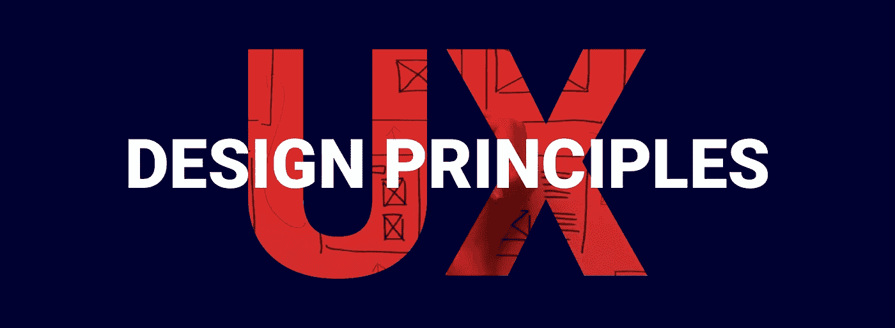

设计原则是一个高层次的指导方针和设计考虑，如果遵循它，可以帮助确保您创建的产品是高标准的。因为它们是解决设计问题的起点。

这些原则不仅适用于软件设计师，也适用于建筑、人体工程学甚至艺术等学科，理解它们并将其作为检查设计的参考点是一个好主意，因为如果你使用它们，你的设计或软件成功的可能性就会增加。

根据《设计的普遍原则》一书的作者威廉·利德威尔、克里蒂娜·霍尔登和吉尔·巴特勒的说法，设计原则旨在帮助设计师找到增强可用性、影响感知、增加吸引力、教导用户以及在项目期间做出合理设计决策的方法。仔细选择和应用适当的原则会增加设计成功的可能性。

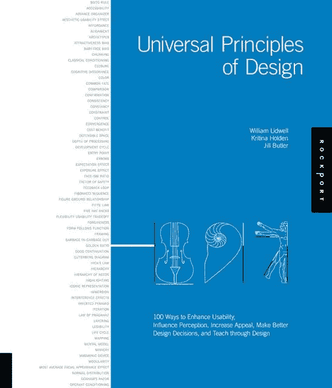

# **1:可感知的**

信息和用户界面组件必须以用户可以理解的方式呈现给用户。这意味着用户必须能够感知所呈现的信息(它不可能对所有的感官都是不可见的)

为了让你的界面易于理解，你需要帮助用户回答以下三个问题:

*   它是做什么的？
*   我要做什么呢？
*   我首先要做什么？

下面这个例子代表了一个很好的可感知的设计:因为我们知道我们需要做什么，以及在开始我们的体验时首先要做什么；)

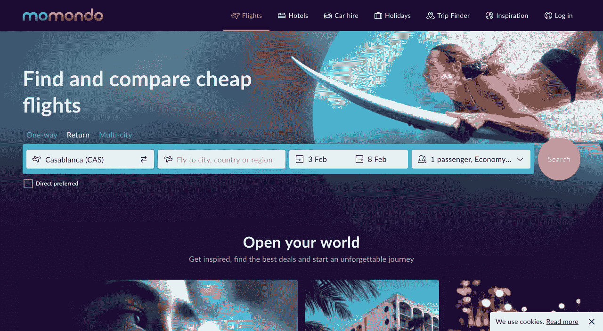

[https://www.momondo.fr/](https://www.momondo.fr/)

# 2:可预测

> “如果你能准确预测互动中会发生什么，那是因为你采取的行动是可以理解的，清晰的，符合逻辑的，让你感到自信。”
> 小罗伯特·霍克曼

可预测性是指满足或符合用户的期望，无论是初次体验还是重复体验，都依赖于成功符合客户的心理模型。

为了让你的产品具有可预测性，你应该告诉人们:

*   需要多长时间？
*   你需要做什么？
*   你会得到什么？
*   接下来发生了什么？

对于客户来说，可预测性有三大好处:

*   控制感
*   信任和安全
*   可靠性

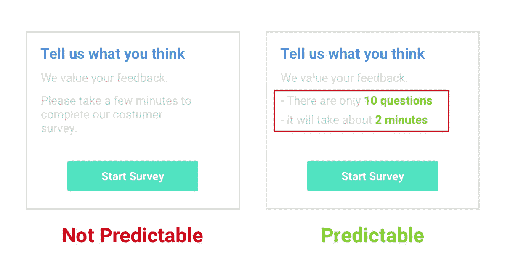

Example 1

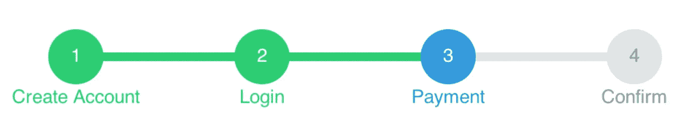

Example 2

# 3:启示

启示描述了通过对象或环境的属性使物理上可能的所有动作。一个瓶盖提供扭转。铰链门可以推拉。楼梯提供上升或下降的通道。

唐·诺曼在他的名为《日常事物的设计》的书中引入了“感知启示”这个术语，用来指用户感知到的可能的行为，与那些实际上可能的行为截然不同。

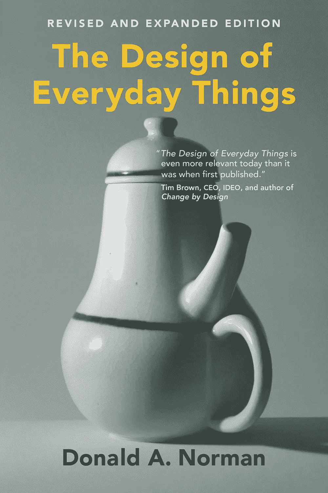

The Design of Everyday Things

设计中必须考虑实际的和感知的启示。

如果对象负担不起期望的动作，则不能执行期望的动作，并且如果用户没有意识到它们是可能的，则所提供的动作可能不会被执行。

Affordance Example : Car Handles

# 4:反馈

反馈是对用户最重要的沟通，反馈用于吸引和解释，并能提高用户满意度。反馈可以将令人困惑的体验转变为愉快的体验，让你了解系统是如何工作的。

该产品应确保:

*   用户可以随时了解正在发生的事情。
*   有关于他们行动的结果和产品当前状态的连续信息。
*   对于产品的状态，即处理、加载、搜索、上传等，用户头脑中没有混淆。、或一些其他状态变化。
*   在一个动作被执行后，很容易确定新的状态。

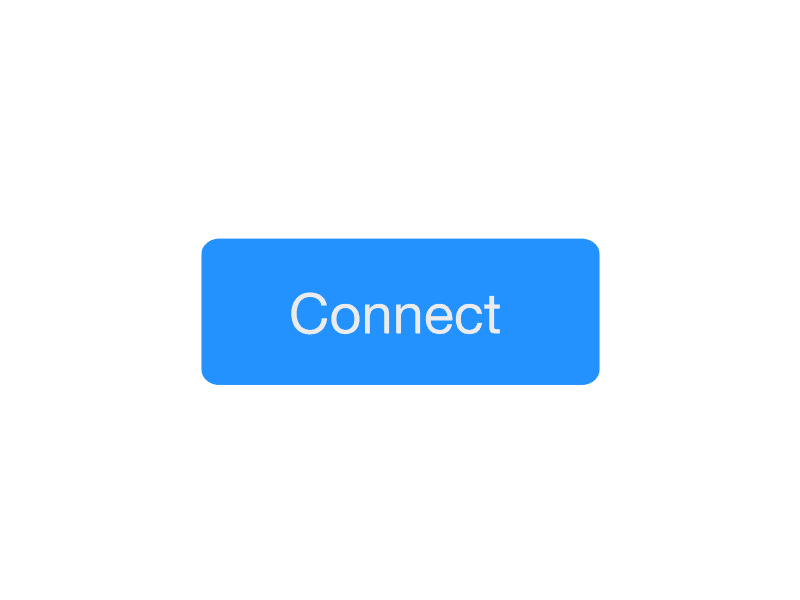

[https://dribbble.com/nimrodado](https://dribbble.com/nimrodado)

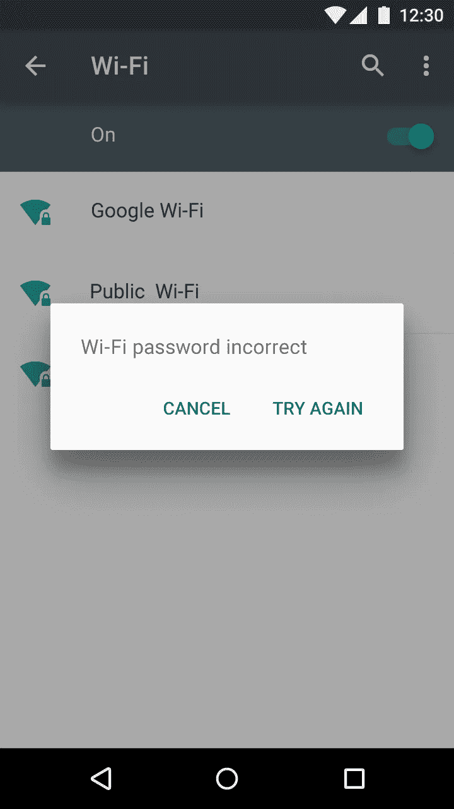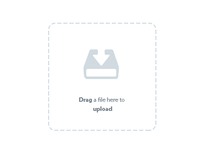

# 5:制约因素

约束限制了每一种可能发生的交互，减少了出错的机会，还可以将用户的注意力集中到需要的任务上。

与约束相反的是当每个选项都提供给用户时，用户很难决定下一步做什么。是*选择*的原则。选项越多，选择其中任何一个都越困难。

> “约束是简单的精神援助，通过限制我们的选择来保持我们在正确的轨道上”*约瑟夫·哈利南*

为了提供良好的用户体验，我们应该恰当地使用约束。

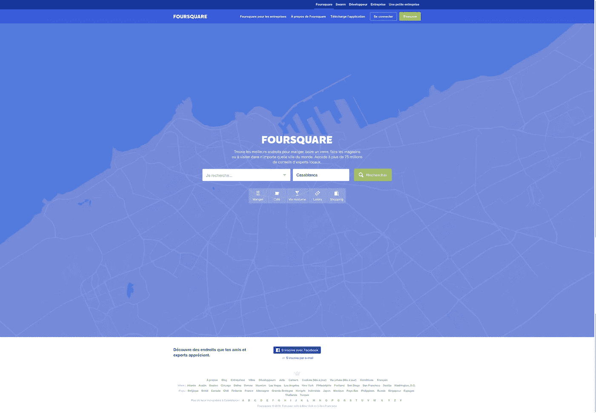

[https://fr.foursquare.com/](https://fr.foursquare.com/)

Foursquare 通过使用设计约束来关注用户的任务。

# 6:希克斯定律

希克定律(或希克-海曼定律)是以英国和美国心理学家威廉·埃德蒙·希克和雷·海曼的团队命名的。1952 年，这两个人开始研究刺激数量和个体对任何给定刺激的反应时间之间的关系。如你所料，可供选择的刺激越多，用户决定与哪一个互动的时间就越长。被选择轰炸的用户必须花时间解释和决定，给他们他们不想要的工作。(【https://www.interaction-design.org/】T4)

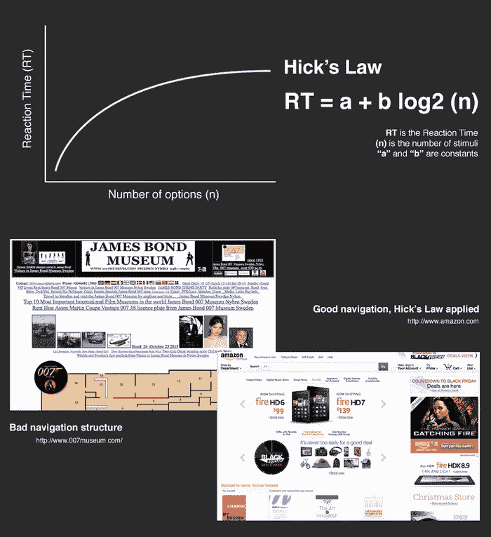

[https://www.interaction-design.org](https://www.interaction-design.org)

希克斯法律让用户更容易做出选择。

*不使用希克斯定律的例子:很多星座很难做出选择。*

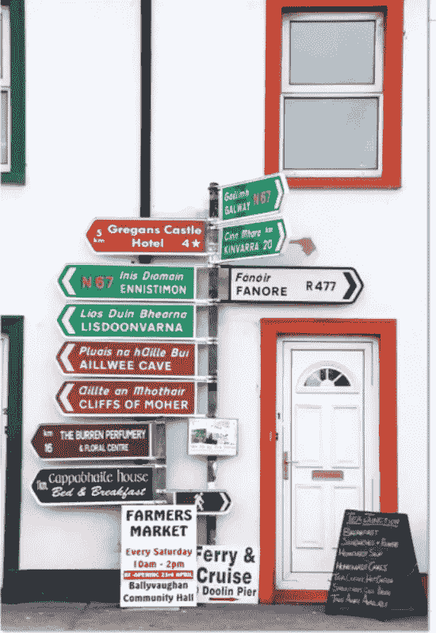

# 结论

设计原则帮助团队做决策。一些简单的原则或建设性的问题将引导你的团队做出适当的决定。