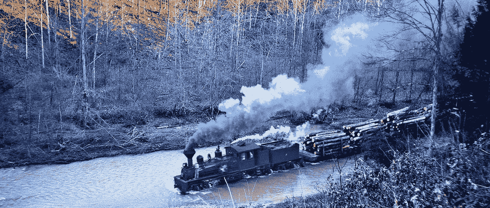
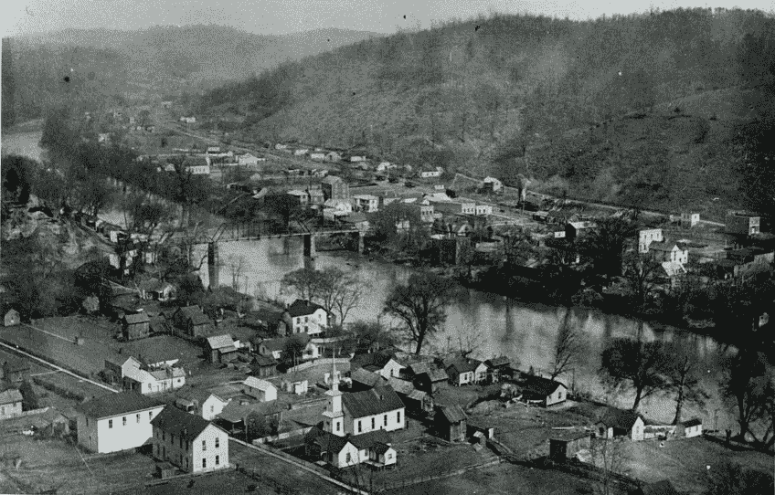
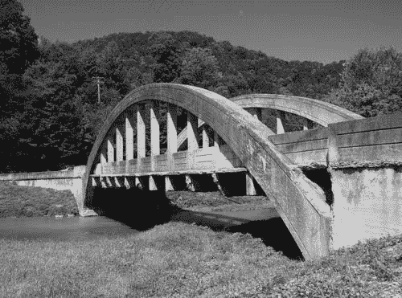
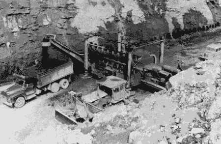
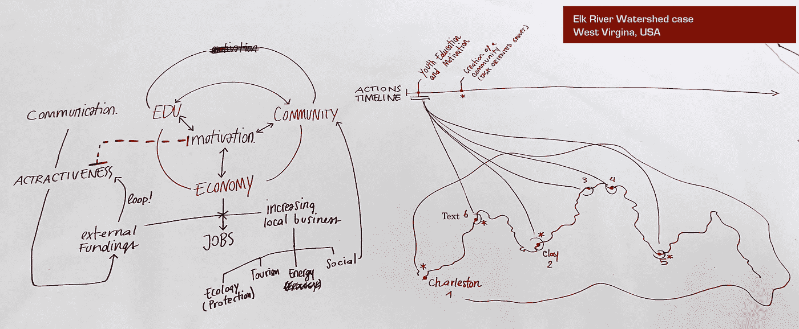

# 设计？系统！

> 原文：<https://medium.com/swlh/design-systems-8ff4629cb18a>

## **设计思维**和系统设计工作室和场景

[内森·费尔德](https://camd.northeastern.edu/artdesign/people/nathan-felde/),[设计系统](https://www.coursicle.com/neu/courses/ARTG/5610/)的著名教授，近 30 年来每年都在波斯顿东北大学 [CADM](https://camd.northeastern.edu/) (艺术、媒体和设计学院)就这一主题授课。并且**每年他都会提出一个新的具有挑战性的场景**，在那里应用**设计思维和设计系统**实践。

今年，本课程考虑了美国中西部一个特定地区的使用案例场景(**西弗吉尼亚州的埃尔克河流域**)，该地区经济发展缓慢，其特点是在西部大开发时期有移民经过，然后是煤矿业。

在这个故事中，我将重点放在设计思考过程的一个初步阶段，名为**侦察**。

## 侦察是先于研究的一个阶段，比研究更肤浅。在深入案例细节和解决方案的详细设计之前，您应该首先从不同的角度对该领域进行探索。

费尔德确定了三个核心镜头*进行探索:*

*   *生态:自然资源和可用资产的状态，因为它们是由环境提供的，因此构成了工作的空间和环境。*
*   ***物流**:意在作为“基础设施”概念的延伸版本。然而，基础设施只提醒桥梁和静态方面，而物流则更全面，包括任何由人类活动激活的工件和流程。事实上，它的古义是“在开战前发现任何需要知道的东西”。*
*   *源于“welkin”的新词，即天堂或天空。它代表了人类的共同天性，人类共享同一片天空和星空。因此，wel 亲属关系可以解释为物流和生态之间的关系。这是整个研究中最有趣的部分。*

**

****走向侦察的步骤*** 是:*

*   ***框架**(时间、空间、地点、事件、度量)*
*   ***系统清单**(关系和映射)*
*   ***数据收集**(收集和清理)*
*   ***汇编**(图表、绘图和地图)*

**

*在设计思维中，你从**虚构的设计**(提出假设选项)开始，然后你移动到实际的基于事实的规范。*

*因此，第一步是以开放的心态探索你拥有的可能性。*

## *1.可能性*

*基于最初的侦察，你开始一个虚构的设计步骤，它不是基于对现场和数据的详细了解。更多的是对新选择和机会的直觉、幻想和开放。请注意，这与数据驱动设计正好相反！*

*在埃尔克流域案例中，以下是一些“可能性”的例子:*

*   *水力发电厂:建造大坝和发电厂。这对经济和生态都有影响。*
*   *保护濒危物种(河蚌)。*
*   *微型发电厂的分布式电网，带有能量交换设施。*
*   *通过建立大学校园促进人口多样性和提高教育水平。*
*   *支持和推动旅游业和自然资源保护。*
*   *基于棚内邮政河运的运输模式再造。*
*   *基于沿河和森林的雕塑花园或类似艺术设施的土地估价。*
*   *增加社区本身的社区场所。*
*   *建立一个工业考古遗址。*
*   *实施一种新的加密货币，为河流流域内的经济交易提供资金(“Elkoins”)。*
*   *什么都不做。同样，决定(同意和建立共识)什么都不做也是一个精心设计的决定！*

## *2.关系*

*这一阶段旨在建立上述不同可能性之间的联系和动力。典型的工具是地图、图表、讨论和口头描述。*

*作为 Elk river 案例的一个例子，这里有一组可能的组合表示，它们利用了概念图、时间线和地理草图。在一张图片中，我们捕捉到了三维空间:*

1.  *概念和优先事项*
2.  *时间*
3.  *空间。*

**

## *3.可能性*

*最后，通过更加面向工程的方法，人们可以实现更加精确的计划和项目，不是基于幻想，而是基于事实知识。这已经是研究和设计的趋势，因此..*

*已经是新故事了！*

**

## *这篇文章发表在[《创业](https://medium.com/swlh)》上，这是 Medium 最大的创业刊物，有 289，682+人关注。*

## *订阅接收[我们的头条新闻](http://growthsupply.com/the-startup-newsletter/)。*

**