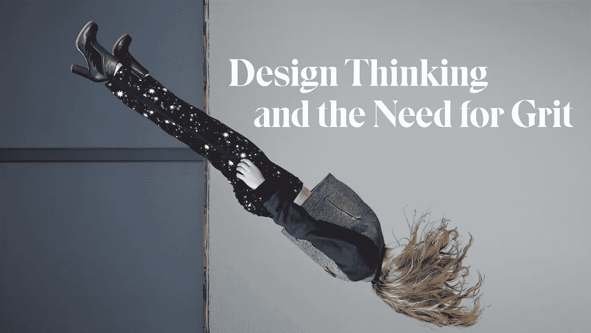

# 设计思维和对勇气的需求

> 原文：<https://medium.com/swlh/design-thinking-and-the-need-for-grit-3c1a15bd8760>

设计已经成为概念，因为它不再仅仅被视为赋予产品生命的一种形式，一种视觉或一个物体。设计已经稳步扩展到企业战略领域；组织越来越多地应用设计方法来发展他们的竞争优势。

这种对设计日益增长的兴趣可能与社会文化环境在消费者决策中日益重要的作用有关。换句话说，随着文化和生活方式的快速转变，组织需要调整业务以保持相关性。

设计方法由消费者洞察驱动；他们关心什么，对什么感兴趣。设计实践关注消费者的共鸣，强调实验和合作。设计可以通过提供框架来解决下一步做什么以及如何以消费者为中心来做的关键问题，从而改变公司的战略方式。

设计流程始于理解挑战，与消费者沟通，然后定义结果。接下来是构思或头脑风暴过程，这导致了测试想法可行性的原型阶段。这种实验性的迭代允许设计者将原始的概念发展成可行的、可行的和理想的最终设计。

设计本身已经改变了形态；不再是为人设计*，而是用*人设计*，指向由*人设计*的状态。*

IDEO 的执行设计总监简·富尔顿·苏瑞谈论了一个叫做“激励循环”的概念。人们的行为激发了设计师的灵感，一旦人们意识到他们可以一起为生活带来一些东西，他们就会更加关注设计，与设计师有更多的联系。这就导致了相互尊重。

# **砂砾**

毅力是毅力和对长期目标的热情的一种非认知技能，是由毅力科学的主要研究者安吉拉·杜克沃斯发现的。按照她的说法，“当你考虑具有同等才能的人时，越勇敢的人做得越好”。毅力似乎是比智商或天赋更好的成功和幸福的指标。

勇气是面对失败时的韧性，是对长期目标的坚定承诺。芬兰人把毅力和决心叫做“ *sisu* ”，不放弃的心态；勇气是当你把热情和激情结合在一起的时候。

*但是设计方法和勇气有什么关系呢？*

杜克沃斯确定了坚韧不拔的人大量具有的以下四个特征。我的目标是将这些特征与应用设计方法的组织和个人联系起来。我的目标是在设计过程中强调勇气的存在，让人们意识到变得更加勇敢的潜力和紧迫性。在我看来，坚韧不拔对于成功的设计项目至关重要。勇气和设计有很多共同点，因为它们都建立在相似的基础上:

## *利息*

应用设计思维不是一份工作，而是一种生活方式。设计方法将会超出你的工作时间，因为它是一种整体的思维方式，可以应用于设计一项服务，一个完整的业务，甚至只是发展你的烹饪技能。一个伟大的设计师的关键特征之一是以人为本的方式探索新奇想法的好奇心。专注于设计的组织深深地致力于相关性和以人为本。

## *练习*

实践是成功的关键因素，也是勇气的关键因素。设计师应该以合作的方式重视实践和探索。实践和反馈是构思和原型制作的支柱。*安德斯·埃里克森*，专注于巅峰表现科学的著名心理学家，详细阐述道:“任何时候你都可以把你的表现集中在提高某一方面，这是提高表现最有效的方法”。

刻意练习包括离开你的舒适区，从事超出你目前能力的活动。埃里克森认为，重要的不仅仅是练习的持续时间(反对 10000 小时规则)，还有练习的意愿和动力。换句话说，你可以练习 10，000 个小时，但你仍然不能保证掌握这项技能，因为真正重要的是练习的质量。

## *目的*

设计师从人们的行为中获得灵感，并致力于与他们一起设计。这种关系又在演变；主要目标不再是深入了解人们。相反，设计师希望帮助人们发现关于他们自己的事情。这是从由人设计*到由*人设计*的转变。今天设计的主要目的是让人们能够自己应用设计原则。最终(在我看来)，设计的目的是在全球范围内推动积极的变化，提高生活质量。*

## *希望*

在找到相关解决方案之前，不断尝试和失败的心态不仅能培养对失败的适应力，还能培养毅力。希望是一种信念，认为你可以做些事情来找到解决问题的方法，希望应该出现在整个设计过程中。希望需要积极、实际的参与，这是由面向未来和乐观的态度推动的。

# **设计思维是经久不衰的激情**

我从没见过一个设计师想创作出平庸的作品。设计思维不适合半途而废的人，因为它需要系统的关注和以开放的心态重复的能力。这是一个全脑思考的过程，需要以解决方案为中心的态度。短期的热情不会引导你完成系统的设计过程，也不会激发你的想象力。*吉姆·C·柯林斯*说过“好是伟大的敌人”，这是一个非常适用于设计态度的原则；如果你志存高远，好是做不到的。

# **设计方法和适应性**

设计也是关于适应。适应消费者的需求以找到相关的解决方案，调整原型以达到最佳效果，调整心态以建立共鸣。正如*埃里克森*在他的新书《巅峰》中指出的，适应性是驱动成功的一项强大技能。他认为认知和心理适应与专家的表现直接相关。其他人可能认为现实中成功人士的运气或天赋是认知和心理上适应特定场景的简单能力。实践设计是进行认知适应的一个很好的方式，因为聚合和发散思维的迭代需要一个适应性思维。

# **将心态设计为“成长心态”**

杜克沃斯指出，成长心态培养毅力。成长思维是由斯坦福大学的卡罗尔·德韦克提出的一个想法。就是相信自己的学习能力不是固定的，可以培养。德韦克博士已经表明，当孩子们了解他们的大脑对挑战的适应性时，他们更有可能在失败时坚持下去，因为他们不认为失败是一种永久的状况。当设计师设计原型时，他们会考虑失败的可能性。而且，就像孩子一样，他们不相信失败是一种永久的状态，而是一个进一步发展和原型化想法的机会。迭代有助于发展成长思维。设计思维不是以问题为中心，而是以解决方案和行动为导向。

# **沙砾会传染**

没有什么比被坚韧不拔的人包围并分享激情和毅力更令人兴奋的了，即使这是一个不同的主题。在我看来，坚韧不拔的人能够塑造和创造长期的变化、新奇和发展。多沙的环境刺激增长，提高生产力。坚韧不拔也是一种责任；我们有责任让砂砾具有感染力，并帮助后代运用这一技能。正如埃里克森所说，人类最高尚的能力是有意识地提高自己，这使我们成为人类，或者如他所说的“修行人”。

未来面临的问题是:我们如何在工作和个人生活中成为“锻炼者”,以发展改变生活的技能？

*让我知道你的想法，如果你喜欢，请点击💚而* [*下面跟着*](/@liliermezei) *。我将战略设计和商业心理学相结合，为变革和创新而设计。可以在我的* [*网站*](https://ermezei.com) *，*[*LinkedIn*](https://fi.linkedin.com/in/liliermezei)*，或者*[*Twitter*](https://twitter.com/liliermezei)*与我联系。*