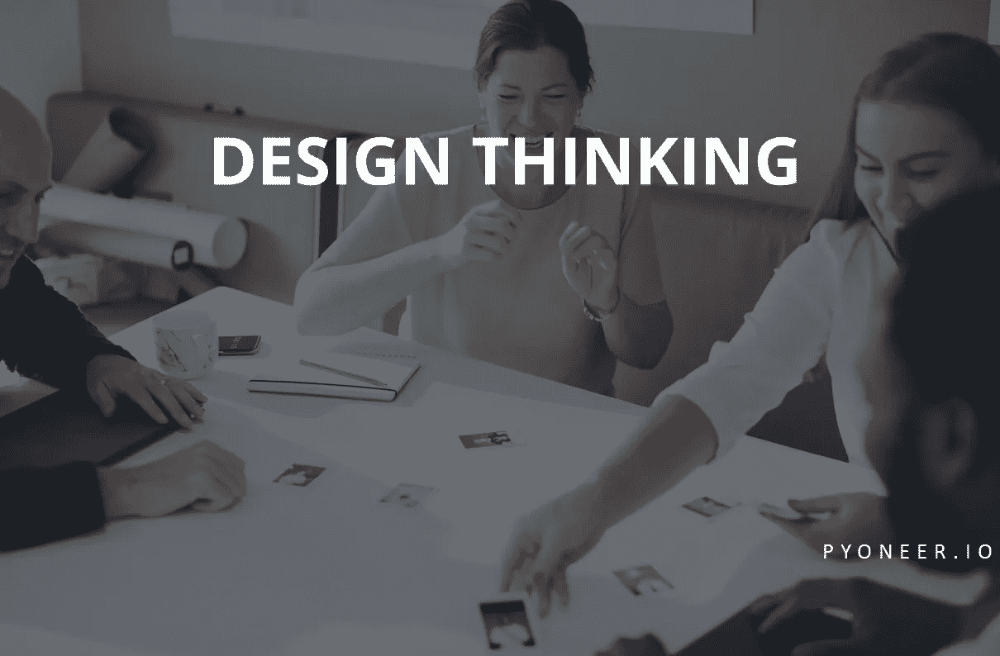
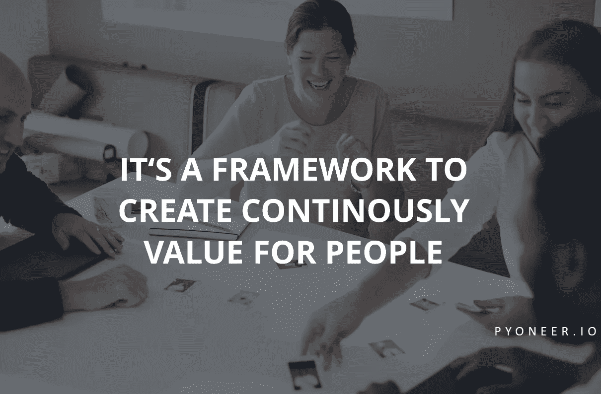
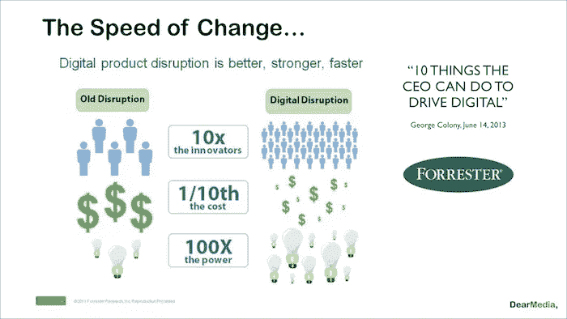
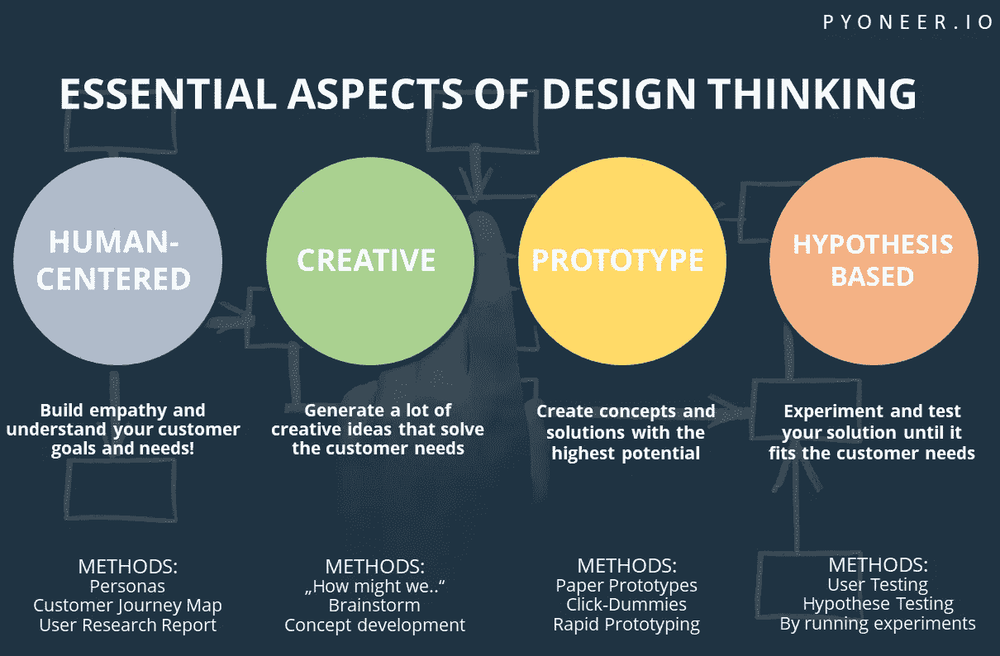
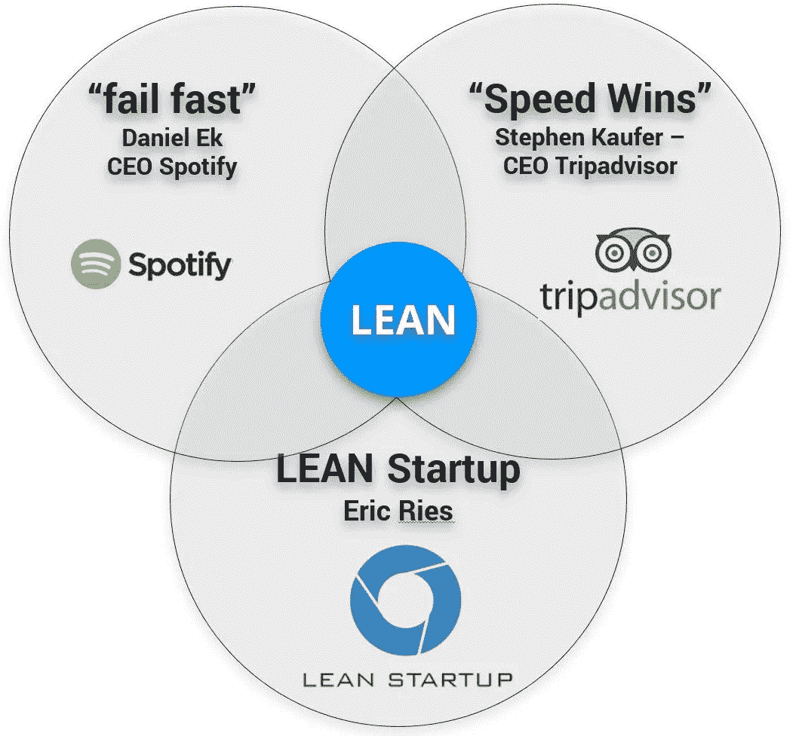

# 设计思维即服务——创新手册

> 原文：<https://medium.com/swlh/design-thinking-as-a-service-a-manual-to-innovation-6536be1e889d>

为什么我们现在要传递设计思维！

如果有一本创造创新产品、体验或服务的手册，你会怎么想？我说的不是渐进式的改进，比如屏幕上更多的像素或汽车引擎更大的马力……
我说的是颠覆性的创新，在改善人们生活的同时改变用户的行为！如果你现在有所怀疑，不用担心！总的来说，创新与人类息息相关。**日复一日，人类为人类创造着东西！**

我想分享我的经历，从我接触设计**思维**的那一刻，到我注意到一个特定人群的深层问题的那一刻。就在那时，我想出了一个解决这个问题的好办法，最终我们成长为一个 rockstar 联合创始团队，现在开始运营一个精益创业公司。

很兴奋能和大家分享这个方法和经验。在工作和生活中的每一天，我都在实践、热爱、使用、教授和学习设计思维。我希望激励其他人在日常工作中应用它，因为我保证它会引导你解决问题。

# 设计思维——一种解决问题的方法

开发成功的创新商业模式、产品和服务已成为当今商业领域最重要的成功率因素之一。

毕马威的[“2016 年全球首席执行官展望”](http://(https://home.kpmg.com/content/dam/kpmg/pdf/2016/06/2016-global-ceo-outlook.pdf))调查发现，全球领先公司的 82%的首席执行官担心他们公司目前的产品或服务在 3 年内是否与客户相关。

尤其是在颠覆性技术不断涌现、市场供过于求、产品生命周期不断缩短以及客户期望不断提高的时代。其中一个主要原因是数字化和巨大的变化速度。

[变化速度](http://www.digitaltransformationbook.com/the-speed-of-change-4-waves-of-digital-acceleration/)

设计思维是实现创新的方法之一！大多数成功的创业公司都成功地应用了它，并利用这个框架不断开发他们的产品和服务(像 [AirBnb](http://thisisdesignthinking.net/2015/05/airbnb-design-thinking-example/) 和 [Dropbox](https://techcrunch.com/2011/10/19/dropbox-minimal-viable-product/) )。它远远超出了一个物体的简单“外观&感觉”:它实际上是一种最先进的解决问题的方法论！

> “设计思维是一种以人为中心的模式，鼓励创造力和创新，以创造一种产品或服务，为您的目标客户或用户解决复杂的问题。它可以帮助你创新一个新产品，为一个复杂的问题设计一个简单的解决方案，或者让整个团队都参与到设计创意中来，这样他们就会觉得自己也参与其中，并相信这个过程。”
> *大卫·凯利——IDEO 创始人*

现代企业、全球化和跨行业方面的挑战迫切需要新的问题解决框架，能够产生非凡的解决方案。设计思维提供了一个双赢的策略:“以人为中心的设计是从内到外的——而不是从外到内的”。

数字化业务转型需要创新的、开箱即用的思维。设计思维是一种自然的契合，因为许多企业寻求转型，在某些情况下，将自己重塑为数字企业。它由 IDEO 公司开发，在斯坦福大学设计学院和波茨坦的 HPI 设计思维学院教授，这两所学校都是由 SAP 的联合创始人 Hasso Plattner 创立的。

如果你谷歌一下设计思维过程，你会发现不同的变化，从 4 到 6 个过程阶段。但是它们都有相同的原则，大规模协作和频繁迭代，以及这四个基本方面:

1.感同身受
2。定义
3。想法
4。原型
5。试验

我将在接下来的文章中详细介绍设计思维过程，这就是为什么我现在要跳过它。

# 精益创业——创新的效率模型

术语**“精益创业”**是在 IT 行业为软件创业公司开发的，并在 2011 年由 Eric Ries 所著的《精益创业》一书中变得非常流行。**“精益”原则是丰田在 70 年代初制定的，旨在优化生产流程和**减少流程中的任何浪费**。精益启动流程声称，最有效的创新是用户有实际需求的创新。或者换句话说:**最大的浪费是创造一种没人需要的产品或服务**。这一概念与任何旨在创造创新的战略或方法高度相关。**

**设计思维和精益创业是不一样的，但是比较它们，你会发现它们有一个共同点。**一切以客户为中心。**这两种方法都试图识别客户需求，以创建合适的解决方案。精益创业的方法更进了一步:在产品开发过程的早期尝试测试核心业务假设，有时甚至在任何产品被制造出来之前。跟踪您的假设，并从您在与客户测试期间收集的见解中学习。**

**继续这个**构建-测量-学习**循环，以迭代的方式取得进展，同时更接近您的客户想要的解决方案。**

****

# **[Pyoneer 作为一家精益创业公司的起步](http://pyoneer.io)**

**当我们的团队承认成立了一家公司时，很明显我们要做的每件事都需要完美的执行。我们知道这将是一段艰难的时间和漫长的道路。有很多关于失败的创业公司的统计，这个数字大约是 90%。要取得成功，仅有好的产品创意或优秀的销售人员是不够的。**我们需要正确产品的完美平衡，同时为市场提供卓越服务，并由一个出色的组织管理一切。****

**从我们完成创始团队的那一刻起，我们就知道我们有一个解决大型目标群体实际问题的方案。因为我们的目标是提供一个设计思维解决方案，所以我们决定通过使用这种创新方法来构建一切。*我们的目标是从第一天起就完美执行*！我们创建目标群体，分析他们的行为，通过采访了解他们的工作和问题。在精益创业中，一切都是关于验证你的假设和假说，所以如果我们的解决方案要解决我们用户组的问题，这些步骤是获得信心所必需的。因此，我们创建了实体模型和数字原型，以收集我们的解决方案对他们是否足够和可行的反馈。**

**事实证明，我们的大多数假设都是正确的，所以我们决定实现我们的概念，并成立了我们的初创公司 Pyoneer。这是一个软件即服务应用程序，用于记录、可视化和管理所有基于设计思维和精益启动方法的创新活动。借助 Pyoneer，我们希望为每个流程阶段提供正确的工具集，并指导用户完成项目。我们还希望让每个人都能够访问收集到的信息和结果，并对其完全透明，以帮助全球各地的团队在一个地方传达整体情况。**

**我们目前正在进行大量开发，并将在接下来的几周在**发布我们的第一个功能，我们对用户的反馈非常兴奋。我们正在寻求这种反馈，因为这是变得更好和确切了解我们的客户需要什么的必要条件。****

**我们相信，如果我们继续倾听、思考、创造、验证、学习，并始终保持开放和透明，我们最终将获得**适量的客户价值**，并创造出人们喜爱的解决方案。**

**正如你所看到的，我们从精益创业文化开始，我们将继续这样做，因为我们相信这将引导我们走向成功！我希望我能启发一些读者，并很高兴听到你的意见。如果你对我们的道路感兴趣，请继续关注，我们将很快回来！**

> **Pyoneers 将为那些希望提供解决实际问题的产品的创新者打造一个 SaaS 解决方案。您可以在 pyoneer.io 上注册，让 insider 先看看产品和我们即将发布的更新。**

# **感谢阅读！如果你喜欢，给它一个❤奖🐠**

****

## **这个故事发表在 [The Startup](https://medium.com/swlh) 上，这是 Medium 最大的企业家出版物，拥有 271，106+人。**

## **在此订阅接收[我们的头条新闻](http://growthsupply.com/the-startup-newsletter/)。**

****