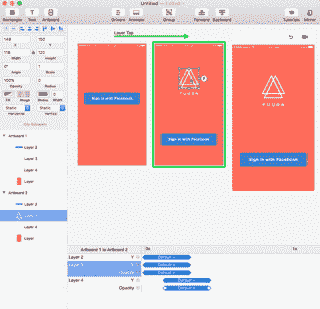
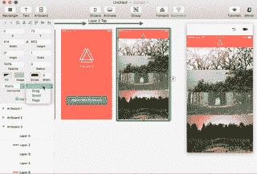

# 原则上的原型设计者指南

> 原文：<https://medium.com/swlh/designers-guide-to-prototyping-in-principle-4664e9930bef>

## 用这 12 张 gif 从零开始学习 Mac 的原理

当 Principle 第一次出现时，我花了几个星期第一次尝试它，尽管我听到了很多关于它的好评。主要是因为这对设计师来说总是一个循环，新的原型工具出现>设计师对它感到兴奋>使用一段时间，循环重复。但是当我真的开始使用它的时候，我被震撼了。

Prototyping a parallax scroll (click to download .PRD file)

## 为什么要用原理？

到目前为止，我的用于元素级原型制作的 goto 工具是像素化的，但是 Principle 将我的原型制作时间减少了十分之一。在 Pixate 中我需要 45 分钟才能完成的事情，Principle 在 5 分钟内就能完成。原型运动越容易，你就越有可能尝试它。你越早开始在工作流程中尝试动作，它就越有意义。

## 下载和设置

Principle for Mac 可以在他们的网站上试用 14 天，这段时间足够帮助你决定它是否适合你。这是$̶9̶9̶(更新:129 美元)的许可证，一年的更新。

*注意:原则目前只在 Mac 上可用。它允许你制作 Android、iOS 和 Web 原型甚至简单的 gif 动画，但你只能在你的电脑或 iPhone 上预览它们。*

如果你是一个素描用户，你会立即注意到相似性原则。有画板、层列表和层属性窗格。

## 画板

原则上，每个画板都是一个屏幕或一个动画状态。您可以从下拉列表中的预设设备尺寸之一创建画板。

Creating artboards

## 导入资产

您可以直接将元素从 Finder 拖放到画板中。将@2x 添加到文件名中，以一半的大小导入。

或者，您也可以从草图中复制和粘贴元素。只需选择要导入的图层， *cmd+C* cmd+V。请记住，您在 Sketch 中一起选择的图层原则上将作为单一图层导入。所以原则上，把你想单独制作动画的层作为一个单独的层。

Dragging elements from Finder

Copy pasting elements from Sketch

## 简单过渡

导入资产后，就该创建第一个原型了。您可以选择任何元素向其添加操作。目前，Principle 支持点击、长按、滚动开始、滚动释放、滚动结束、拖动开始、拖动结束、向下触摸、向上触摸、内部悬停、外部悬停和自动。原则上，当你创造更多的时候，你会开始使用它。

复制当前画板，并在它们之间添加动作。Principle 通过层名称查看两个画板中的相似之处，然后自动添加从层的第一个状态到下一个状态的运动或动画。

Simple artboard transitions

Adding more artboard transitions

## 使用延迟和曲线优化动画

“动画”面板显示画板之间每个动作的变化。在这里，您可以更改动画持续时间、缓和曲线以及两个画板之间的移动延迟。

Adding transition delays

Editing easing curves

## 添加滚动/翻页/拖动

要创建滚动组，只需选择层并从下拉列表中选择滚动。对于分页和拖动组也是如此。滚动和分页的区别在于，滚动创建一个可以滚动内容的窗口，而分页用于将内容对齐窗口。拖动类似于滚动，但允许您自由移动对象。您可以尝试每一种方法来了解不同之处。

Adding scrolling

Adding paging

Adding dragging

## 由滚动/拖动/翻页驱动的动画

为了创建不依赖于动作(点击、长按等)而是依赖于滚动/拖动/翻页的动画，我们需要使用驱动程序。“驱动因素”面板显示了您可以为画板中发生的每个动作创建的时间线。要创建动画，请从图层列表中选择一个图层，单击“驱动程序”面板中的克拉，然后选择一个应随时间变化的属性。

水平时间轴基于滚动/拖动/翻页的移动以及 Y 位移的后续变化。向前和向后移动时间轴，并再次点按克拉以创建另一个关键帧。当滚动/拖动/翻页动作发生时，Principle 现在应该自动在关键帧之间制作动画。

Driver animations

## 导出和查看原型

要查看你在手机上创建的东西，你需要做的只是下载并打开 Principle Mirror 应用程序，然后将你的 iPhone 连接到 Mac 上。对于演示或上传到 Dribbble，您也可以录制原型并将其保存为 mov 或 gif。您需要将预览窗口保持在画板的 100%，否则质量可能会受到影响。

Exporting prototypes

## (奖励)输出质量不差的 gif

GIF 导出器还是有点不靠谱，结果导出的 GIF 质量低，尺寸大。您也可以在 Photoshop 中打开 mov，并使用它的“存储为 Web 格式”功能来控制 gif 的大小和样式。虽然这有点耗时，但这是完全控制大小和构图的最佳方式。

可以下载做出来的样机自己试用一下！我还包括了。供参考的草图文件。

[下载草图文件](https://drive.google.com/file/d/0B5ap4kxtYAajTE9nY2RyX2ZQN3M/view?usp=sharing)

[下载原理样机](https://drive.google.com/file/d/0B5ap4kxtYAajQjdwUmdlOWVIN3c/view?usp=sharing)

# 免费赠品

另一个很好的学习方法是拿一个 PRD 文件，然后解构它，看看它是如何工作的！这里有一些我制作的免费产品:

[Download](https://gum.co/pAalQ)

[https://gum.co/DdYgx](https://gum.co/DdYgx)

[Download](https://gum.co/BddMu)

> [查看更多关于 dribbble**⟶**](http://dribbble.com/abhinavc)

Currently available for $49 only

# 有兴趣了解更多吗？

嗨，我是阿比纳夫·奇卡拉。感谢阅读这篇文章，在 [Twitter](http://twitter.com/abnux) 上问好。

我在 motion 上的课程现在有了早期测试版[**这里**](http://bit.ly/2mid7zN) **。**