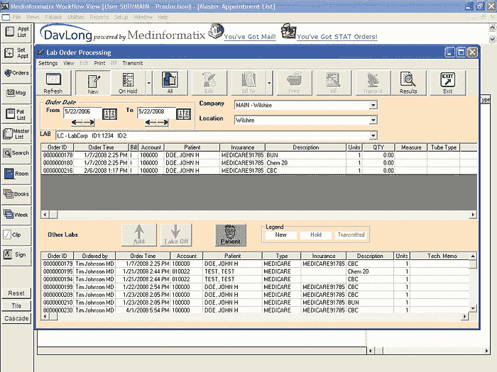
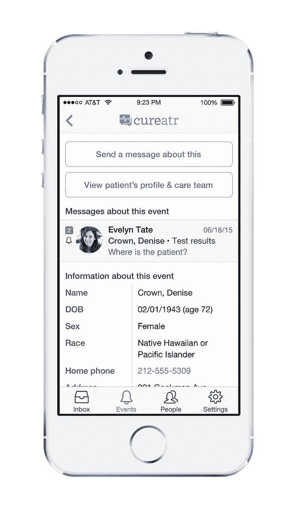
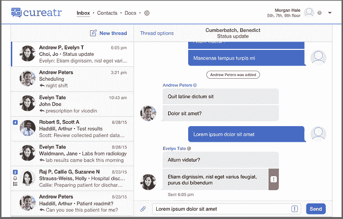

# 设计师——医疗保健需要您，stat！

> 原文：<https://medium.com/swlh/designers-healthcare-needs-you-stat-cdeb1ca7f9b9>

# 一声呐喊。

通往我们生活的科技未来世界的道路上，到处都是被更新、更有效的手段所取代的技术尸体。传真机、传呼机和越来越多的地面电话不再大量使用。然而，尽管大多数美国公众都是这样，但在医疗保健领域，他们仍然比比皆是。

是的，我们赖以让自己和爱人生存和健康的系统仍然严重依赖于现代世界已经从过去的技术。如今，医院和诊所中使用的许多计算机仍然以低分辨率运行在 Windows XP 上。更糟糕的是，自 1995 年以来，许多医疗保健 ui 似乎没有(实际上可能没有)更新，也没有从过去 20 年中开发的可用性最佳实践中受益。

Status quo for healthcare UI. One of countless [examples](https://www.google.com/search?q=emr&tbm=isch) to be found online.

当你考虑到绝大多数只是瘦客户机，充当数据输入和检索的信息亭时，很容易理解为什么这些机构不把他们的计算机升级到更现代的东西。因此，可用软件工具的进度跟不上硬件升级的进度。但幸运的是，移动已经展示了改变这种状况的能力。

# 手机改变了一切

移动，尤其是当与自带设备(BYOD)相结合时，是医疗软件中更好的 UX 的特洛伊木马。医疗保健专业人员随身携带的电脑往往比坐在办公桌前的电脑功能更强大。当您考虑移动带来的所有优势时，包括位置感知、摄影、视频、语音、消息传递、通知等，您会很快意识到，它将像改变其他行业一样，彻底改变医疗保健。

对许多人来说，要实现这一目标需要改变心态。我工作的公司 [Cureatr](http://www.jobscore.com/jobs2/cureatr/product-designer/c0KGzMt6Cr5AP0eMg-44q7) 开发工具，帮助医疗保健专业人员更有效地沟通患者护理信息。我们的主要功能之一是一个类似于 Facebook Messenger 或 Whatsapp 的信使。医生让我解释产品的时候，他好像很困惑。“我为什么不像今天这样通过陆地线路给他们打电话或者发一页纸呢？”当我问他是否给他的爱人发短信时，他说他经常发。

“那你为什么不打电话给他们呢？”我问。

你可以看到灯泡亮着。这是对医疗保健软件的一种新的思考方式，尽管这是一项他已经在日常生活中受益的技术。随着时间的推移，像这样的例子会越来越多。

# 设计可以提供帮助的地方

医疗保健，不亚于照顾人类和我们所有组成部分的系统，是广泛的，设计师可以在许多方面提供帮助。一个名为处方设计的组织已经确定了设计师可以在医疗保健中有所作为的 12 个领域。其他人已经着手定义设计医疗保健界面的[最佳实践](http://inspiredehrs.org)。正如医疗技术复兴已经处于早期一样，设计复兴也是如此。

作为一个为医疗保健设计的人，我的背景不是健康，而是消费应用。当加入任何新行业时，都有一大堆新术语和首字母缩略词需要学习——EMR、SNF、ADT、ACO、HIE、HIPAA——这乍一看令人望而生畏。但除了最初的困难，我相信消费者应用的设计者是最适合带来改变的人。任何为数百万观众设计过软件的人都从经验中知道如何制作一个能被广大观众使用和访问的界面。当你为各种类型的用户建立界面时,“用户友好”就有了新的含义。这些都是医疗保健急需的技能。

Cureatr web messenger

成功的设计需要理解你的工作如何适应生态系统的需求。这意味着与了解他们的工作场所和他们面临的限制的医疗保健专业人员合作，然后在这些限制内工作。当我们决定构建我们的 messenger 的 web 版本时，我们知道它必须像我们的移动应用程序一样具有现代感，并且我们知道我们必须构建它来支持 1024x768 分辨率的 Internet Explorer 8。这些挑战不适合胆小的人，但如果做得正确，会有巨大的回报。设计 FarmVille，它不是。

> “……医学研究所发布了一份报告，称**的浪费**占了**医疗保健支出**的 30 %,即每年约 7500 亿美元，这比我们国家整个 K-12 教育的预算还多。”
> ——[阿图尔·加万德](http://www.newyorker.com/magazine/2015/05/11/overkill-atul-gawande)

有很大的问题需要解决。糟糕的 UX，像其他低效率一样，会导致更高的成本和更低的医疗质量。这需要高超的技巧——过于微妙的警告或过于持久的警告都可能危及生命。但是，当你想到你或你所爱的人可能最终需要在一个仍然依赖传真机的系统中接受护理时，你会意识到我们作为设计师必须提供帮助的巨大特权。手机的出现创造了一个变革的机会，这在 5 年前甚至还不存在。这是一个处于技术&设计复兴边缘的行业，需要最优秀的人才来引领它。

[**快来加入我们的**](http://www.jobscore.com/jobs2/cureatr/product-designer/c0KGzMt6Cr5AP0eMg-44q7) **。**

## 汉斯·范·德·布鲁根是一位居住在纽约市的设计师。他之前曾在 LinkedIn 和 Atlassian 工作。目前，他为一家移动医疗创业公司 [Cureatr](http://www.jobscore.com/jobs2/cureatr/product-designer/c0KGzMt6Cr5AP0eMg-44q7) 负责设计。

## [在 Twitter 上关注汉斯](https://twitter.com/verbiate)

*发表于* **创业、旅游癖和生活黑客**

-