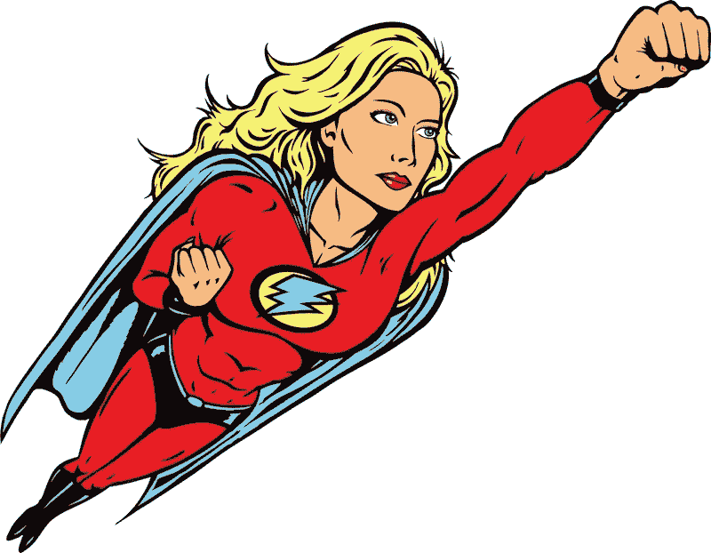

# 技术领域的设计师——谁做什么？

> 原文：<https://medium.com/swlh/designers-in-tech-who-does-what-fdfe3e95a6cf>

## 科技行业中的设计师角色。

你有没有对科技行业的所有设计师头衔感到困惑？我有过，而且我仍然时常感到惊讶。不久前，我收到一封关于自由职业请求的电子邮件，他们正在寻找一名制作艺术家。我以前从未听说过这个头衔，但我看过资格证书，上面有一些词，如 ***【创造最终艺术】*** ***UI 屏幕，实体模型*****草图****视觉设计**，对我来说，这听起来像是一个 UI 设计师。

我开始思考设计标题，有多少，有多混乱。因此，我写了这篇文章，列出了不同的角色，并对正在发生的事情做了一些澄清。我把角色分成三个部分:体验设计师、外观设计师和一体化设计师。

A sketch and flow of an app done by the experience designer

# 体验设计师

本节中的角色是关于数字产品的体验。

## UX 设计师

UX 或用户体验设计师是一个流行的角色，每个人都想要一个 UX。UX 设计师决定数字产品应该包含什么以及应该如何表现。例如，工作包括用户研究、测试功能和特性、创建线框和流程、构建原型和进行用户测试。

UX 可分为两个部分**研究**和**设计。**首先是了解用户和市场，发现问题和潜在的解决方案。设计部分是关于设计线框和原型，以测试研究中发现的潜在解决方案。

## 交互设计师(IxD)

这个角色类似于 UX 设计师，但交互设计师可以更具体地描述人和计算机之间的交互。他们可以更关注交互元素。

## 交互式设计师

类似于互动和 UX 设计师。

## IX 设计师

类似于互动和 UX 设计师。

## 服务设计师

服务设计师是一个能看到整个体验的人，而不仅仅是数字产品。他们希望通过观察顾客的需求以及他们与公司的关系，建立良好的[顾客体验(CX)](https://www.sas.com/en_us/insights/marketing/customer-experience-management.html) 。

Finding the right colours and shapes is done by the look and feel designer

# 外观设计者

下面列出了数字产品外观中的角色。

## 用户界面设计器

UI 设计师(用户界面设计师)设定应用程序、网站或其他数字产品的最终设计。这都是关于像素的完美，选择颜色和排版，设计图标和在布局中建立平衡。

## 视觉设计师

类似于 UI 设计师，但它也可以包括营销和品牌材料的设计，如横幅和标志。在某些情况下，使用照片并创建视觉/品牌指南。

## 数字平面设计师

类似于视觉设计师。

## 数字设计师

类似于视觉设计师。

## 广告(艺术总监)

决定产品的外观和感觉。给设计师的指导方针，翻译成实物模型。这个角色也可以用上面的设计师来代表。

## 美术设计员

根据不同的领域，该角色的任务可能会有所不同。平面设计师是专业的排版，构图，图像，品牌，做标志和包装设计。制作插图、宣传材料和印刷品——但这种方式正在消亡，对吗？

A all-in-one designer can do a bit of everything

# 一体化设计师

## 产品设计师

当涉及到产品的设计时，这个角色几乎是所有事情的一部分，并且会因公司而异。但通常它是关于 UX，品牌，营销和与业务需求相一致。有些情况下 UI 设计和前端开发。

## 运动(图形)设计师

动作设计师是一个拥有广泛技能的人。这个人创造平面设计，插图，动画，三维艺术和电影。

## 全栈设计器

正如标题所说，fullstack 就是一切；UX，用户界面和前端开发。

## 网页设计师

这个角色类似于 Fullstack 设计者，但只关注 web。

## 设计师

这个模糊的定义为增加所有需要的技能提供了可能性。这可能是涵盖本文中所有角色的资格，一个超级设计师。

# 结论

这个列表列出了 16 个不同的设计标题，其中很多都是相似的。有很多角色，会出现误解。我认为，在很多情况下，公司并不真正知道他们在寻找什么，而是在定义头衔时追随一种趋势。

我已经不看标题了，我在看描述。所以不要太在意头衔，更多的是要求和资格。

我可能在这篇文章中漏掉了一些角色，如果是这样的话，请写下评论，我会添加进去的！

## 设计师们，你们怎么称呼自己，为什么？你喜欢扮演哪些角色？

## 感谢阅读！

**记得👏如果你喜欢这篇文章。**

**在** [**上找我【dribbble】**](https://dribbble.com/majabergendahl)**[**insta gram**](https://www.instagram.com/ux_maja/)**&**[**推特**](https://twitter.com/majabergendahl?lang=en)**

****

## **这个故事发表在 [The Startup](https://medium.com/swlh) 上，这里有 263，100 多人聚集在一起阅读 Medium 关于创业的主要故事。**

## **订阅接收[我们的头条新闻](http://growthsupply.com/the-startup-newsletter/)。**

****