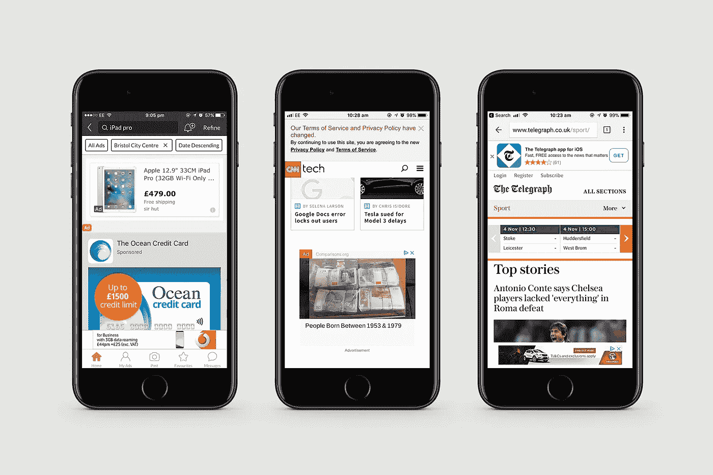
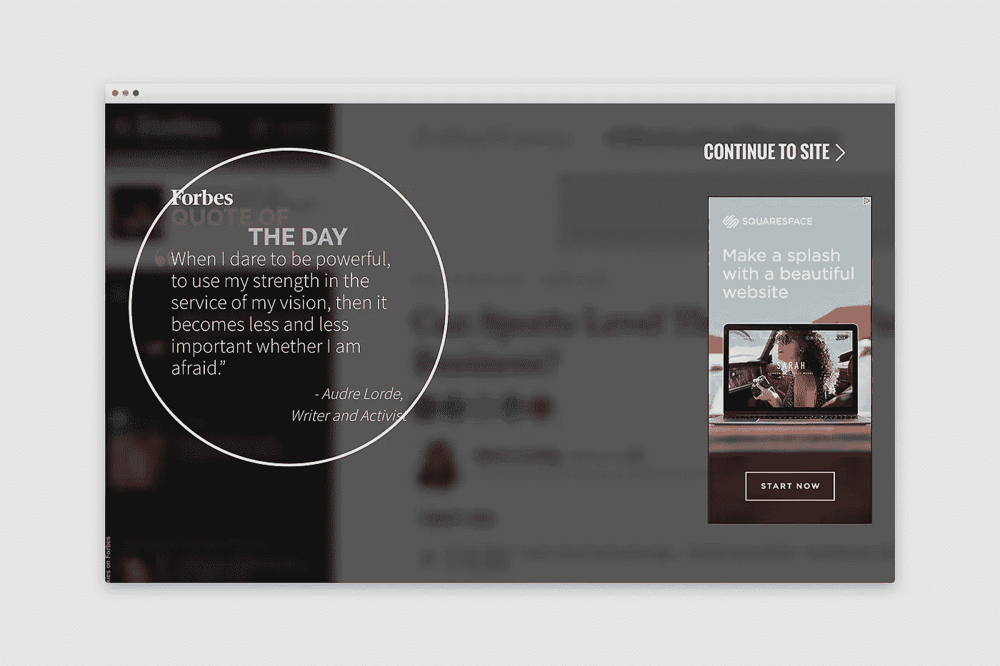

# 设计师联合起来；我们必须修复互联网

> 原文：<https://medium.com/swlh/designers-unite-the-internet-we-must-fix-e8683a421504>

糟糕的用户体验在今天的互联网上太普遍了。还是回归基本，以人为本吧。

这些天互联网比以往任何时候都让我沮丧。

我们看到越来越多以用户为中心、移动优先的体验，但我们也看到许多网站似乎在向相反的方向发展。

围绕 cookies 和数据保护(GDPR)的新规则和法规往往会给各地公司的设计部门带来冲击波，但在这种情况下，法律团队不需要影响设计团队。

设计师应该永远以设计和用户体验为导向(UX)。可悲的是，事实并非总是如此，就我最近在互联网上的活动来看，情况已经很清楚了。

以下是我的一些抱怨，作为设计师，我们在设计用户体验时可以避免并且应该意识到的:

# 让我看看内容

广告被打包到 Gumtree、CNN Tech 和 Telegraph 的界面中。看看下面的图片。这些是来自我的 iPhone 的真实截图——所有这些都以这样或那样的方式模糊了内容。

当你只想浏览内容时，没有什么比被广告淹没更令人不快的了。

# 让我选择什么时候播放

脸书最近一直在尝试自动播放视频内容，如果你问我，我会觉得这很烦人。无论你是在公交车上，在商店里，还是在某个安静的地方，当你滚动浏览你的订阅源时，你最不想看到的就是从你的扬声器里发出的 LADBible 的最新病毒视频。

是的，这些设置可以在某些应用程序中关闭，但为什么要取消某人对自己内容消费的控制呢？这给体验带来了负面影响，让我不太愿意使用这些应用。

一个精心设计的行动号召(CTA)邀请我去玩会更合适。

# 等等，我又报名参加什么了？

老实说，在我看到他们做什么之前，我已经数不清有多少网站敦促我注册他们的时事通讯或产品提醒。

这就相当于在大街上被一个要求你签名的活动家猛扑过去。求你了。别说了。让我在闲暇时探索，如果我足够喜欢你的内容，我会注册接收更多的内容。

是的，一个突出的注册税务师可以报名，但不要强迫我。

# 不要阻止我的内容

很明显，许多营销人员是根据他们通过内容获得的线索数量来判断的，所以很自然，他们会尽一切可能去获得这些线索。不幸的是，这导致了大量的封闭内容。

内容可能是好的，但在我交出我的细节来看之前，我肯定应该对此作出判断。

另一件让我头疼的事情是，在给我我访问过的内容之前，把报价和广告强加给我，比如在福布斯上，如下图所示:

如今，人们比以往任何时候都更加不耐烦，所以我们尽快满足他们的需求至关重要。不要让他们失望，否则他们会在你的页面加载之前就去别的地方了。

# 我知道我需要接受饼干；需要占半屏才能告诉我吗？

欧盟 cookie 法让一些人对如何在他们的网站上传达合规性感到恐慌，这导致了网络上许多繁琐和丑陋的弹出窗口和消息。

一个小的，谨慎的信息就可以了。在 2017 年，这真的不应该影响你在线内容的消费。不要让人们更加努力地与你交往。

# 我们怎样才能避开这些糟糕的经历呢？

广告拦截器:一段时间以来，它们一直是我的在线设置中很有价值的一部分，而且有很多，但现在很多网站都越来越了解它们，主要是那些依赖广告收入的网站。在继续满足之前，你并不经常必须关掉它们，但不幸的是，除了忍受它或离开那里，我们还无能为力。

RSS 提要:从设计者的角度来看，当我浏览内容时，这些提要会提供更好的体验，因为它们把内容放在最前面和中心。

Safari 的阅读器视图:如果你是 Mac 用户，这是天赐之物。在 OS X 高地，必须手动启用阅读器模式(“显示”>“显示阅读器”或按下 Shift-Command-R)。本质上，它通过去除广告、动画和不想要的视频来剥离体验，以便您可以专注于您在那里看到的内容。

CookiesOK:如果你使用 Chrome，这个扩展可以让你在登陆任何一个给定的网站时省去手动接受 cookies 的麻烦。当然，这样做并不需要太多的时间，但是这对于几乎所有用户来说都是一个小问题。

# 结论

这些天我们仍然在谈论糟糕的用户体验，这太疯狂了——互联网已经存在了足够长的时间，我们可以把它做好——但是我们现在就在这里。

当我寻找新的平板电脑、阅读新闻或寻找工作时，我不认为我是唯一一个想要美好、愉快体验的人。

可靠性和信任对我来说是非常重要的因素，我认为当涉及到为人们设计积极的体验时，它们绝对重要。

如果我们要保护和发展一个品牌的声誉和存在，我们必须始终努力在在线内容中找到必要和有益之间的平衡。

一旦一个忙碌的、不耐烦的互联网用户感到沮丧，他们就会去别的地方，而且通常不会再回去了。我们需要把它做好。我们客户的未来取决于此。

## 这个故事发表在 [The Startup](https://medium.com/swlh) 上，这里有 263，100 多人聚集在一起阅读 Medium 关于创业的主要故事。

## 订阅接收[我们的头条](http://growthsupply.com/the-startup-newsletter/)。

