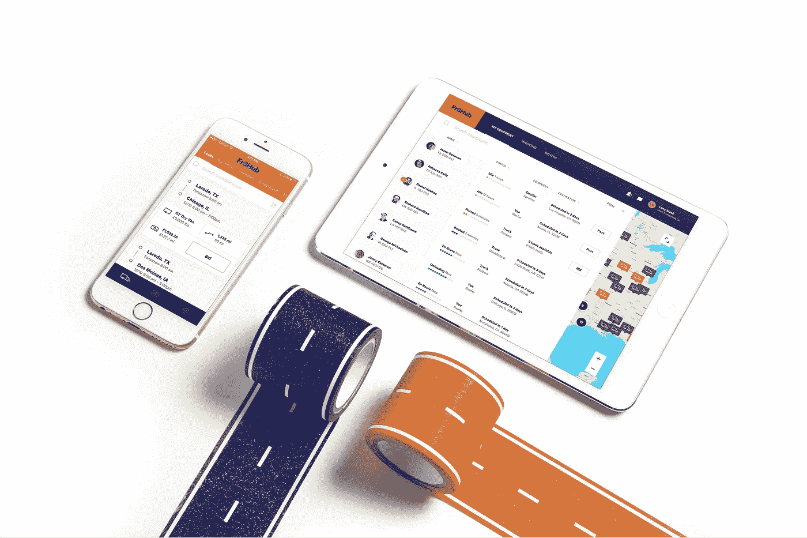
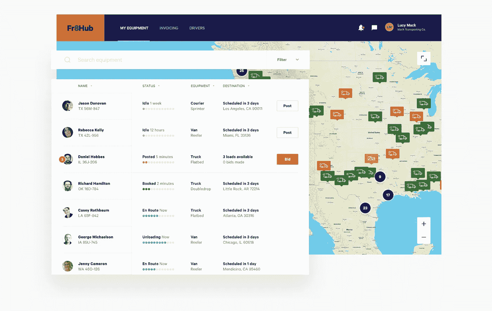
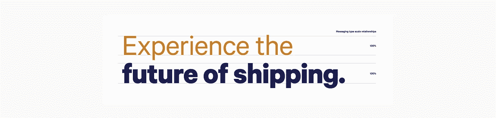
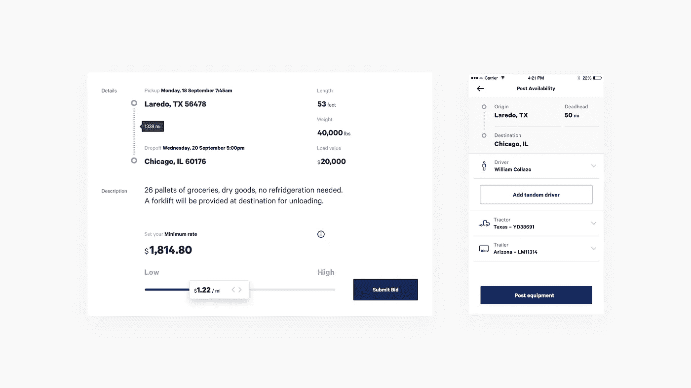
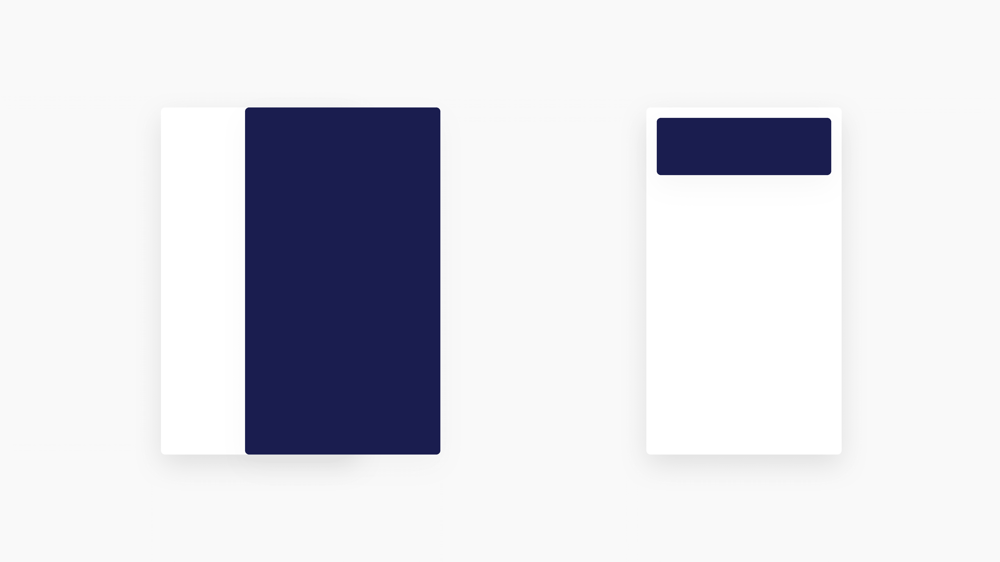

# 为卡车司机设计更好的平台——这是 Fr8Hub

> 原文：<https://medium.com/swlh/designing-a-better-platform-for-truck-drivers-this-is-fr8hub-b8abbacdcff6>

看看我和我的工作室是如何进行产品设计的，从令人满意的用户体验开始，努力实现公司品牌形象的准确延伸。

Fr8Hub 是一个市场，它将托运人与承运人更有效地联系在一起，比现有的方法(如经纪人和装载板)成本更低。对于那些没有沉浸在卡车运输行话中的人来说，装载板本质上是“卡车运输的 Craigslist ”,公司在那里张贴他们需要移动的货物，卡车司机以他们可以拖运所述货物的价格做出回应。这是一种混乱的、老派的方式，它有利于装载板平台，这些平台只需为双方提供服务，就能从交易中获得可观的分成。

输入 Fr8Hub。在这里，一个集中的数字平台提供了必要的工具，使托运人能够轻松地邮寄他们需要运输的货物，并使司机能够找到要运输的货物。虽然表面上看起来像是我刚刚描述的负载板，但 Fr8Hub 为**提供了两个关键优势**:

1.  Fr8Hub 的费用较低(约为 20%,而经纪人的费用为 25 %- 35 %)
2.  Fr8Hub 的技术。平台是一个端到端的运输管理解决方案。

[降雨](https://rainfall.co/)被要求设计平台的用户体验，以鼓励重复使用，并专门迎合那些不是狂热技术爱好者的个人。这意味着逐一解决复杂的流程，以消除不必要的障碍，并让用户在每次交易过程中保持参与，其中的主要部分(运输)需要几天时间。

更为复杂的是，从最初的邮寄到最终的交付，托运人和承运人都使用桌面和移动工具来促进文件的传输以及通信和托运状态更新，因此单一体验跨设备存在。

就像卡车司机一样，我们需要*出现。*下面是我们*交付*的方式。

# **fr8 hub 平台设计简介**

Fr8Hub 必须迎合两类用户，每一类都有独特的需求和技术诀窍。这两个原型是托运人和承运人。

**发货人**是需要运输货物的公司。

他们的货物可能是一托盘的瓶装水、冷冻食品或汽车引擎。无论如何，这些货物需要毫不迟延地到达它们各自的目的地。托运人对数字工具并不陌生，但习惯于通过如前所述将单个货物张贴到装载板上，或通过支付由经纪人的高实得价格决定的虚高运费来找到司机。

由于交易费用较低，Fr8Hub 为托运人提供了更低费率的机会，以及直接访问可立即获得的可信和经验证的司机社区的机会。

**承运人**，或业主经营者，是驾驶拖拉机运送货物的男男女女。

他们习惯于在网上浏览负载板，但往往被迫依赖于低技术。与经纪人交谈，寻找工作，特别是将他们带到理想目的地的货物，或帮助他们达到每月收入目标。

承运商是 Fr8Hub 的主要客户，因为移动工具极大地提高了他们在旅途中高效寻找新工作的能力，以及管理与当前运输相关的物流的能力。没有传统经纪人的存在或干预，他们可以专注于他们所关心的事情:安全有效地完成每一项工作，同时养活家人。

# **降雨量如何接近产品设计**

rain 设计了直观的体验，简化了托运人和承运人的交互，并迎合了他们的个人需求和行为。

通过开发一个高效和有吸引力的交互模型，更多的负载被发布，更多的司机获得更好的工资，更多的用户回到市场，选择 Fr8Hub 进行越来越多的负载。

鉴于 Fr8Hub 的主要竞争对手都有大量资金和一流的技术平台支持，通过设计竞争是一项重要的有意策略。Fr8Hub 有技术，但没有庞大的营销预算，随后需要基于其平台的简单性和实用性来推销自己。

考虑到这一点，我们将品牌的视觉效果剥离到了最低限度，并依靠三样东西来承载体验:

1.  **一张地图**
2.  **清理** **排版**
3.  **体贴的** **动作设计**

# **1。地图是产品体验的核心**

从货物被批准的那一刻起，它的当前位置和向预定目的地的进展是至关重要的。我们将地图放在体验的中心，并围绕它构建所有的界面元素和交互。从一个位置，承运人可以查看他们的整个车队，托运人可以实时更新所有正在进行的装载。

虽然这似乎是显而易见的，但真正的突破是使用单一地图，根据用户上下文调整其内容和周围信息。这种方法创建了一个连续的交互线程，避免了页面刷新，成功地维护了用户导向。

*查看贯穿四个关键任务的地图:*

## 管理所有活动负载和驱动程序

较大的承运商可能有数百辆卡车在美国、墨西哥和加拿大各地积极运输货物，因此我们设计了核心体验，以便从这种使用情形扩展到另一个极端——由一名司机管理自己货物的运输。

在任何时候，关于每个驾驶员的位置以及他们的状态的信息都用一个大头针指示，并且额外的数据显示在左侧的列表中。这两个要素可以按重要性顺序切换，从这一点可以启动关键操作，如为每个驾驶员预订未来的负载。

## **将设备发布到 Fr8Hub 市场**

运营商和司机通过在市场上注册他们的设备而加入进来。当承运人通过指定他们期望的起点和潜在的目的地，指示合格的司机(可能是他们自己)，并添加认证的牵引车和拖车来开始这一过程时，地图负责。航线偏好可以随时调整，这使得承运商能够适应市场需求。

## **将驱动器与可用负载配对**

一旦承运商和司机在平台上注册了他们的设备，他们将看到所有符合他们偏好的可用货物，并可以选择对有吸引力的货物进行投标。在表明他们可以运载货物的每英里最低价格后，司机的出价被发送给托运人批准，匹配就完成了。在整个过程中，该地图提供了额外的背景，根据货物的始发地、目的地和预期持续时间为用户定位。

## **挑着担子**

在将托运人与承运人联系起来之后，Fr8Hub 的平台会管理所有必要的通信和文档协调，以便正确提货、运输和交付，包括提单和保险信息。在整个工作过程中，各方都可以通过即时消息联系，如果沿途有任何问题，司机可以更新托运人。

该地图为托运人提供了对所有开放作业的实时位置信息的访问，并作为司机信息、装载详情和实时通信的入口点。

# 2.印刷术激活了信息层级

Fr8Hub 的[品牌字体是 Calibre](http://work.rainfall.co/fr8hub-identity) ，这是一张通过多重重量和干净、人性化的几何图形而在易读性方面表现出色的脸。这种形式上的多样性是设计师的梦想，因为它允许我们在大量内容的情况下创造高水平的对比。

对于 Fr8Hub 的产品，除了各种尺寸之外，我们还考虑每种重量的表示，以将用户的注意力引向每个流程中最重要的任务。围绕这些主要信息，我们还显示了完成核心任务所需的大量数据，目的是不中断用户的预期旅程。

## 一组简单的类型规则

Fr8Hub 的营销信息遵循大胆+常规的组合，通过它们的并列创造出自然的对话。我们将该方案引入到产品中，将每个数据点减少到只有两行，一行粗体，一行常规，以使信息简洁、可操作、易读。当需要度量单位之类的限定符时，我们积极地在每行使用多种重量和尺寸来进一步增强可读性。

如此处所示，多条信息可以在有限的空间内呈现，而不会牺牲清晰度。这延续了 Fr8Hub 的透明和诚实的品牌承诺，超越了指导原则，贯穿到产品各种屏幕的物理设计中。

# **3。深思熟虑的运动设计激发参与度**

忽略声音设计和触觉，产品的体验是三个元素的结合:交互模型、视觉设计和动作设计。这些元素决定了产品的*感*，更重要的是，它们是品牌标识的延伸，比传统视觉标识越来越*重要*。

糟糕的产品设计和执行会影响品牌形象，降低用户对产品质量和可信度的认知。再加上脸书和 Instagram 等制作精良的平台在大多数消费设备上无处不在，人们对卓越的期望很高，甚至对年轻的初创公司也是如此。

所有这些都是说 Fr8Hub 对质量的感知需要卓越，而运动设计是将出色的用户体验与视觉设计结合起来的粘合剂，以实现这一点。

## 运动设计——灵感来自交通工具和展示的物品

1.  **灵感源自运输**
    视图之间的左右移动连接体验
2.  **项目显示**
    顺序加载加快了用户对信息的消费

The two key elements of Fr8Hub’s motion design

“滑动”和“出现”是 Fr8Hub 的两个关键动画策略，因为我们避免了许多面向消费者的产品中使用的更多“泡沫”或“弹性”方法。

不管用户与 Fr8Hub 交互的设备上下文是什么，这两个支柱都使体验一致且熟悉。

具体来说，在手机上，运动被纳入手势交互框架，垂直运动有助于完成任务，水平运动表明过渡到不同的任务。

Fr8Hub 的品牌个性通过一致、友好的执行而占上风，其设计具有恰到好处的弹性，以建立平易近人的个性，同时保持从其广泛的用户中发展信任所需的复杂性。这种动画方法将 Fr8Hub 的对话角色从营销材料和排版扩展到产品体验，在产品体验中，品牌的身份必须平衡专业性与和蔼可亲的客户服务。

Bidding on a load via Fr8Hub’s mobile application

Fr8Hub 的产品框架结合了地图、体贴的排版和保留但有意的运动，推动了一种在日益嘈杂的类别中站立起来的体验。潜在用户很容易被迫给 Fr8Hub 一个机会，当前用户也很乐意使用该平台。

这种渴望在很大程度上是因为该平台是品牌的自然延伸，体现了该公司的信念，即托运人和承运人的配对应该比其他方法简单得多。

# **当前里程数**

Fr8Hub 在其早期阶段受到了强烈的关注，因为在每次成功装载后，越来越多的托运人和承运人返回到该平台，并且较大的国家托运人已经签署了运输经常性装载的协议。

持续的迭代和测试使产品成为使用的乐趣，并促进用户体验对平台成功的重要性。

马克创立了[降雨](https://rainfall.co/)，这是一个位于西雅图和纽约的品牌体验设计工作室，专门从事图形、应用程序和网站设计。我们总是渴望新客户。你也可以[在 Instagram](https://www.instagram.com/rainfalldotco/) 上关注 can 的作品。或者[直接伸手](https://twitter.com/marcbanderson)讨论产品设计和品牌。

## 这篇文章发表在 [The Startup](https://medium.com/swlh) 上，这是 Medium 最大的创业刊物，拥有 289，682+人关注。

## 在这里订阅接收[我们的头条新闻](http://growthsupply.com/the-startup-newsletter/)。

