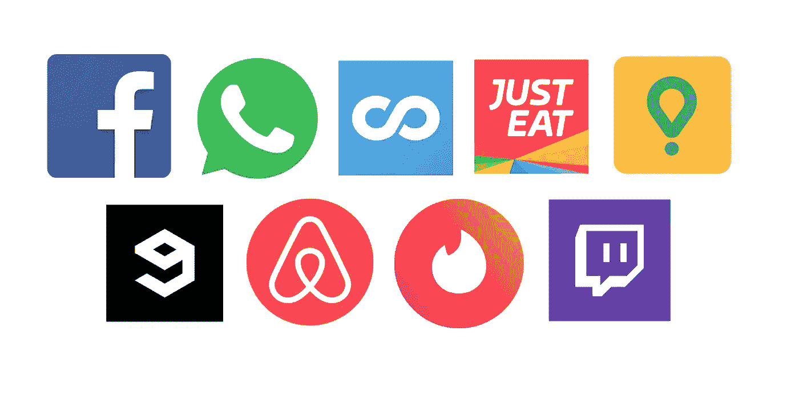
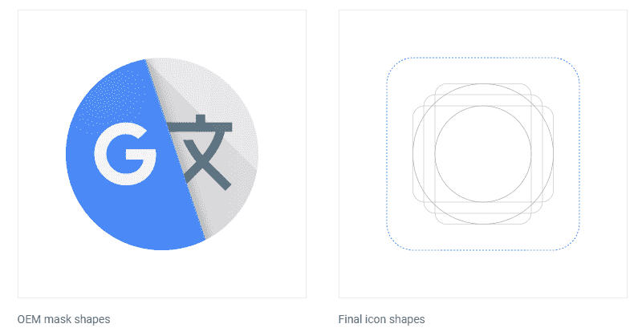
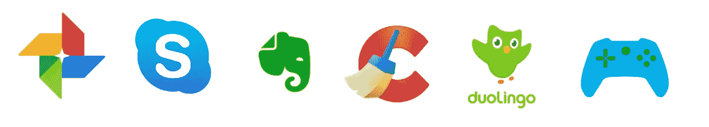
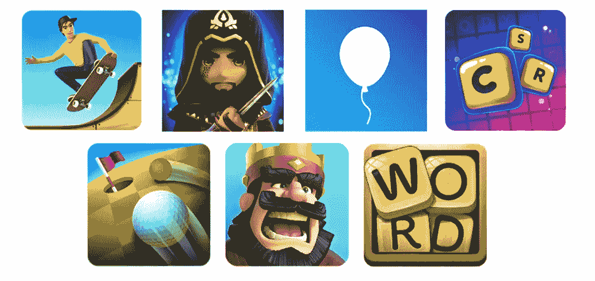
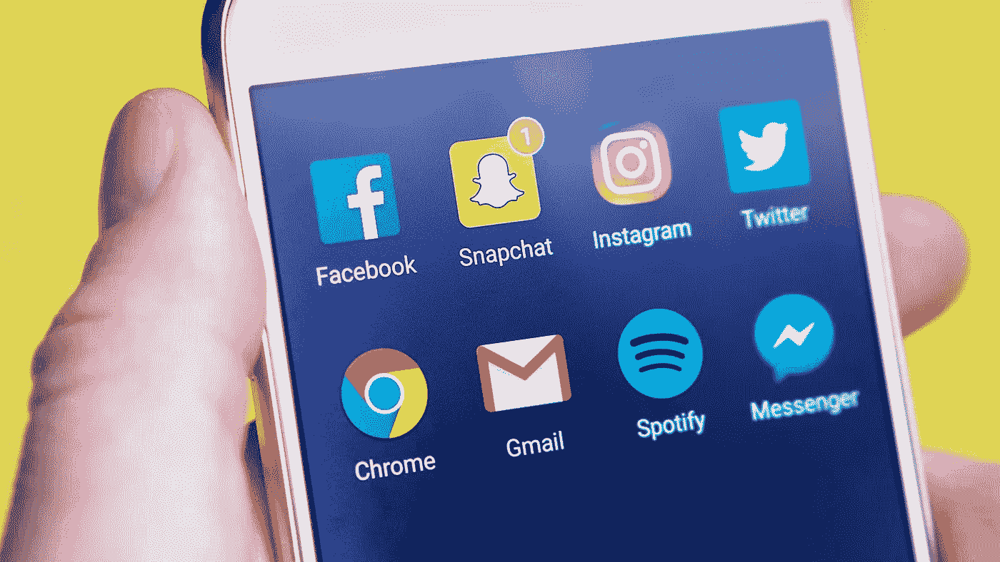

# 为移动应用程序设计伟大的图标

> 原文：<https://medium.com/swlh/designing-great-icons-for-mobile-apps-a515f254eb31>

## 进行正确设计的分析、指南和示例。

启动一个应用程序时，你将不得不面对的最重要的**营销决策**之一是图标的**设计。它的重要性来自于这样一个事实，即图标将影响用户对**的第一印象**，并且它将是在浏览市场时**抓住他们注意力**的方式。尤其是如果你正在启动一个基于应用的创业公司，你的成功将直接关系到你在应用市场的知名度。**

本文将重点介绍 Android 和 iOS 应用程序的设计。我将总结一些设计中最重要的方面，如外形和颜色的选择。此外，本文将列出一些免费资源的来源和遵循的准则。

 [## UX/用户界面应用设计入门

### 无经验或非设计师进入移动应用世界的第一步

medium.com](/drill/getting-started-with-ux-ui-apps-design-356fb94de7cc) 

# 1.颜色很重要

图标的主色是最困难的选择之一。尝试 **A/B 测试**来检查你的设计效果总是一个好的选择。这不仅适用于配色方案，也适用于整个设计。你可以在这里阅读更多关于 A/B 测试应用图标的真实案例:他们测量了从最好的图标到最差的图标几乎 50%的性能差异。

一个很好的指导方针是在图标中使用你的应用程序配色方案。最好使用**品牌颜色中的一种作为主要颜色**，例如在**背景**中。Nick Saporito 为我们提供了一个在他的图标设计中使用品牌色彩的好例子。让我们看看这种常见做法的其他一些例子:

Some famous app icons from the Play Store. The images belong to their respective owners.

我们可以从上面显示的图标中学习一些颜色课程。正如我们所看到的，他们都使用他们的主**品牌颜色作为图标的背景**。其中一半为背景使用了某种**颜色渐变或阴影，最明显的例子是 *Tinder* 和 *Glovo* 。这使得图标看起来不那么简单，也许更有趣。**

除了那种主色， *Just Eat* 和 *Glovo* 在图标中加入了他们公司的其他颜色。但是，请注意，**文本和徽标通常是白色的**并且居中。基本上，使用一般的背景颜色和一些白色的图标或文字，我们正在寻找**的对比和清洁**。

## 如何选择主色调？

这不仅是一个图标设计的选择，也是一个品牌和总体营销的决定。通常你会选择你公司的**公司颜色**作为你图标中的主要颜色，这种颜色需要与你的总体**营销策略和定位**相匹配。互联网上有大量关于应用程序颜色的信息，你可以阅读[Adoriasoft](/@Adoriasoft/mobile-app-design-14-trendy-color-schemes-2669b5bb77d3)[材料设计](https://medium.com/u/5039ddc7ffc6#keyline-shapes)文件中。

Adaptive masked icon with the recommended shapes, from Material Design.

此外，Android 8.0 引入了 [**自适应图标**](https://developer.android.com/guide/practices/ui_guidelines/icon_design_adaptive) ，可以像之前图片中看到的那样为不同的设备进行遮罩。正因为如此，设计一个通用的方形图标并不是一个坏主意，它可以在以后被屏蔽。这与苹果公司推荐给他们的应用商店的东西非常相似。

最佳实践是寻找更符合你的应用目的的**形状。例如，矩形适合 Gmail 图标的信封设计，圆形可能类似于相机应用程序的物镜。一个好主意是探索什么形状正在使用其他类似的应用程序。**

记住**推荐的形状**只是帮助设计师的工具，而**不是一成不变的**。您可以自由地**探索您喜欢的任何定制形状**，有时在您的图标中有现成的元素是很好的。连谷歌都做！

Free-shaped icon examples from the Play Store

> 提示:如果你有疑问，一般的方形或圆角方形总是更标准的选择。

## 形状:外卖清单

同样，如果你很匆忙，你会发现下面的列表很方便:

*   遵循来自谷歌和苹果的**官方指南，**并从人机界面指南和材料设计中检查他们的资源。
*   设计一个**基本方形图标通常是第一选择**。你可以稍后**掩盖它**以适应不同市场的你的设计。
*   原始的**形状可以帮助你理解你的应用程序的目的**。 *Google Play* 的三角形就是一个很好的例子。
*   您可以随时尝试**定制形状**和添加开箱即用的元素。CCleaner 图标或谷歌地图都是很好的例子。
*   同样， **A/B 测试**将有助于检查哪种形状是你的最佳选择。

# 3.文本、表单和图像

你图标的核心。虽然形状和颜色是你设计的基础，但是你的图标需要一些其他的东西来变得独特和可识别。如果我们回到本文的第一张图片，我们可以注意到每个图标都使用简单的标志形式或文本来标识他们的应用程序。通常是公司的 logo 或者至少是简化版。

使用文本作为图标**的核心可能是个坏主意，因为可伸缩性问题**:当你的图标以较小的尺寸显示时，文本可能不可读。然而，使用**单个字母或另一种形式**通常可以避免这个问题。复杂的表单和绘图也会出现同样的可伸缩性问题，这也是大多数图标设计简洁的原因。

如果表单与特定的徽标或公司形象无关，它们应该**类似于应用程序的目的。**例如，相机图标通常以我们在 Instagram 图标中看到的任何类似相机的形式为特征。Notes 应用程序通常会引用一些笔记本、笔或粘性标签。语言应用程序可能会使用旗帜、地图和字母。数学应用程序将显示数字和数学符号。诸如此类。

## 表单和文本:领料单

*   如果可能的话，避免在你的图标中使用文本。当**缩放图标时会有问题。**
*   在你的设计中以简单易识别的形式或标志为目标。
*   你的图标中的形式、字母或图像应该**类似于应用程序的目的**，如果不直接是你公司的品牌。
*   玩纹理和深度，但不要创建一个非常复杂的图像。简单的渐变和阴影就可以了。

## 压倒性的例外:游戏图标

我们在这里读到的几乎所有东西对于游戏图标来说都是不正确的。至少，不完全正确。如果你看一看 App Store 或 Google Play 中下载量最大的游戏，你会发现**复杂的图标**，上面有许多颜色、字符和其他从游戏中提取的元素。

这背后是有原因的。游戏旨在变得有趣，它们的图标反映了优雅或简单的缺乏，同时押注于更具侵略性和更直接的注意力召唤。

游戏图标使用**非常具有描述性的图像**，显示游戏中的**关键元素**和**角色**的**特写**图。

Game icons from the Play Store.

从前面的图像中，只有一个图标遵循典型的设计模式。那是因为 *Rise Up* 是一款极简风格设计的游戏。然而，所有其他人都使用**引人注目的纹理和颜色**。

# 结论

设计正确的图标不是一件容易的事情。正如在许多其他情况下，最好的成功不是失败。

你的图标的三个主要组成部分将是**配色方案**，图标**形状**和形状内的**核心内容**。如果你想从某个东西开始，你应该使用一个基本的**彩色背景**加上一些渐变或阴影，然后放置一个**居中的形式**来清楚地显示你的应用的**目的。玩外部形状会让你有机会变得与众不同。**

然而，如果你正在为一个游戏设计一个图标，忘记简单。采用更明显的设计，利用游戏元素来吸引观众。尝试一些有趣的，有吸引力的东西，玩深度和纹理。

 [## 在一小时内学习 Adobe XD 的基础知识

### 理解体验设计来执行你自己的设计项目

medium.com](/drill/learning-the-basics-of-adobe-xd-in-one-hour-3537f3ac02a3)  [## UX 研究:为你的设计项目建立目标用户模型

### 了解角色以及如何创建角色

medium.com](/drill/ux-research-modeling-target-users-for-your-design-project-d69e91db5d32) 

## 这篇文章发表在 [The Startup](https://medium.com/swlh) 上，这是 Medium 最大的创业刊物，拥有+397，714 名读者。

## 在此订阅接收[我们的头条新闻](http://growthsupply.com/the-startup-newsletter/)。

