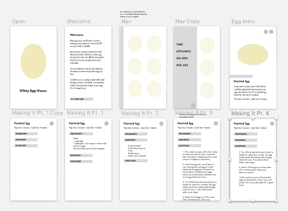

# 设计我的第一个应用

> 原文：<https://medium.com/swlh/designing-my-first-app-54c56afd00cf>

## 我是一名视觉设计师，一头扎进产品设计。

我最近从南卡罗来纳州搬到旧金山，沉浸在产品设计中。相当大的变动，尤其是对于刚从大学毕业的人来说，但我意识到旧金山是技术和设计的核心，这是我想去的地方。

> “我不是为了让东西‘漂亮’而设计，我设计是因为我喜欢解决问题……”

我对应用/移动设计感兴趣的原因是，我想通过创造一种产品来影响人们的生活，让他们更无缝地与技术共存。更少为了找到问题的答案而在电话上忙乱，更多无缝体验让您轻松获得所需并继续前进。我设计不是为了让东西“漂亮”，我设计是因为我喜欢解决问题，组织信息，让事情简单到人们容易理解。

**设计应用**

***构思&研究:***

学习应用程序设计的最好方法似乎是尝试并实际设计一个应用程序。所以，我一头扎进了产品设计。我花了一些时间思考需要解决的问题，或者我希望已经存在的应用程序。我的目标是快速进入设计过程，并在过程中学习产品设计师使用的工具。

因此，我想出了一个鸡蛋食谱应用程序的想法。很明显，改变生活的东西。然而，我发现在大学里，我希望这样的事情存在，因为我没有一个基础的伟大资源。鸡蛋是便宜、健康、用途广泛的食物。许多博客或视频变得相当复杂，搜索每个单独的食谱或观看视频中的冗长解释需要时间。因此，我想创建一个应用程序，去掉绒毛，给你鸡蛋制作的基本要素。

我的目标受众是烹饪新手。一般来说，这些都是大学年龄的年轻人，他们对烹饪不感兴趣，而是想知道如何开始烹饪的基本知识。

我开始对常见的鸡蛋类型、食谱和食谱中的模式进行了大量研究。我发现有六种基本的鸡蛋类型(煮、炒、煎、烤、煮和煎蛋)。巩固了我所有的研究后，是时候开始构思草图了。

***写生与头脑风暴:***

我知道我想结合每个鸡蛋的插图。这增加了许多食谱往往缺乏的有趣元素，它以平易近人、简单和有趣的东西吸引目标受众。我也有关于应用程序应该如何组织的想法，可能是根据设备、时间，甚至是鸡蛋的年龄。

我的第一个草图是从组织、入职、应用导航和每个食谱的登陆页面开始的。我还考虑了图标、字体和应用程序的视觉基调

***第一批判:***

我制作了我的第一套线框，并和我的产品设计导师一起回顾了我所创造的东西。我记下了我需要做的更改:为应用程序中的每个流创建更广泛的设计，创建更合适的大小，以及记录在其他应用程序中运行良好的现有常见模式。

我回去，研究和绘制了一些，并创造了一个更好的流程。我还添加了我的第一组插图。我注意到了一些想法，让视觉效果与每个步骤顶部都有标签的食谱文件夹相呼应。“导航”被放置在底部，用于通过过滤器进行排序。

First iteration of egg illustrations.

***第二批判:***

我已经取得了很大的进步，但是我的设计仍然没有达到它需要的地方。它缺少了应用程序设计中需要的一些标准元素，我用所有独立的选项卡使设计变得复杂。因此，我重新审视了一切:层次结构、组织、排版、调色板、对比度，甚至什么内容需要包含，什么内容需要删除。

First approach included muted colors and complicated navigation.

我把插图改成了更有趣的美学风格，并创造了一个更有活力的调色板，注意对比。我还减少了流程中的步骤，并调整了排版，以便在烹饪距离上阅读更好。父页面对所有 6 种类型一目了然。你只需点击你想要的，并立即被带到食谱登陆页面。该页面包括快速总结和可用的制作方法选项，具体取决于设备。点击你的选项，只需滑动鼠标就能看到食谱的每一步。

***外卖:***

通过这个过程，我学到了大量关于应用程序设计的知识。我认识到，为了成长和创造一个更好的解决方案，你必须愿意抛弃那些不起作用的东西。最重要的是，我认识到这是一个我真正热爱的过程。我还有很多东西要学，但我觉得我已经从旅程的起点走了很长一段路。

*特别感谢我的设计导师唐尼·丁奇，他让我参加了他自己的“设计训练营”。

自从设计了这个应用程序，我继续前进，差不多完成了第二个应用程序。这是一个名为 Airborne 的健康应用程序，其目的是提醒用户因接触附近传播的空气传播疾病而导致的潜在健康风险。该应用程序使用位置跟踪和推送通知来实时提醒用户，如果他们有高感染风险。

在我的网站上寻找空降，[lizhewell.com](http://www.lizhewell.com/design-1)，当你在那里的时候看看我的其他作品。我目前正在与一些了不起的人进行面试，所以如果你想聊天，请随时联系我！

请随时到 aehewell@gmail.com 找我。

*发表于* **创业、旅游癖和生活黑客**

-