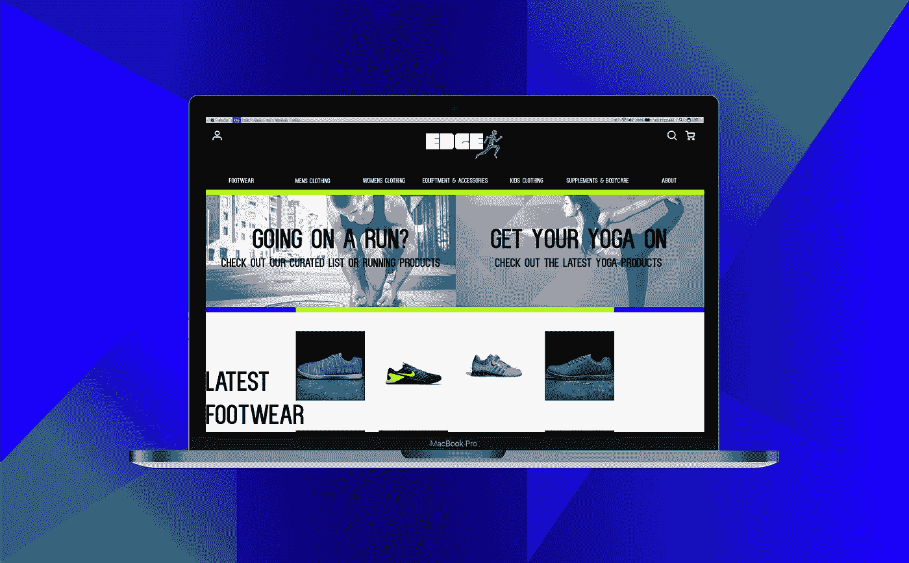
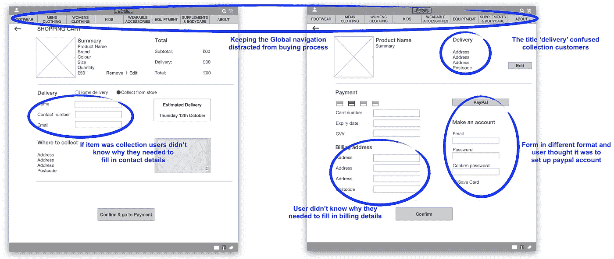

# 设计我的第一个电子商务网站，UX 案例研究

> 原文：<https://medium.com/swlh/designing-my-first-e-commerce-website-ux-case-study-9c1cd1a9a95>

## 概念项目-使用 UX 设计原则来平衡商业目标和用户需求。

## 方法

用户访谈、上下文查询、卡片分类、亲和力映射、设计实验室、用户流、体验映射、纸上原型、线框、可用性测试

## 工具

全方位视觉

# **发现**

## 概观

因此，在我参加 GA UX 课程的第二周，零售客户**Edge sports Goods(ESG)**给了我们一个设计桌面优化电子商务网站的任务。它概述了公司的情况，以及如何从实体店中转化出公司的价值观。

该简介包括一个 MSCW 特征的优先次序，这将影响最终的线框。

MSCW features from Edge sportings’ brief.

总结 ESG 理念并计划在最终解决方案中反映出来非常重要。

Edge brand ideals

## 竞争对手分析-网站功能比较

一开始，我比较了直接和间接体育用品零售商的网站，以获得电子商务网站的灵感。

我想比较每个网站上的功能，并确定 ESG 的机会，这包括每个项目页面上给出的专业知识。我还看了网站的布局，以及全球导航如何引导用户的体验。

Website Feature comparison

## 人物角色和用户访谈

简报中有一个主要人物。我对相似的角色进行了进一步的用户研究，以综合研究结果，了解 ESG 用户的需求和不满。

Robert Persona

User interviews

通过人物角色和用户访谈，我发现了几个趋势。

**用户想要什么**

*   “真实生活”体验
*   策划产品
*   轻松快速交货
*   其他买家评论
*   相关项目
*   专业知识和意见
*   知道事情何时结束。

**什么让用户沮丧**

*   缺少交付选项
*   缺乏专家的专业知识。

## 背景调查——来自竞争对手商店访问的见解

在我去实体店的时候，我发现了翻译每种产品的专业知识并直接向顾客展示畅销商品(鞋类)的重要性。在与工作人员交谈后，他们告诉我，鞋类是迄今为止最畅销的，因此这一类别在商店中有如此明显的展示零售空间。顾客走进商店时，首先看到的是鞋子。

我能不能通过电子商务设计将这种展示转化为我的角色罗伯特欣赏的“真实世界体验”？

# 规定

基于角色和用户的发现，我定义了一种情况来指出一个问题，然后我可以通过最终的设计来解决这个问题。

> 情境-罗伯特是一位在伦敦市中心工作的忙碌男性，他喜欢健身，并将在周六参加马拉松比赛。
> 
> 问题- Robert 正在寻找精心挑选的跑步产品，并希望获得无缝服务，为他提供适合他的交付选项。

## 站点地图和信息架构

为了帮助我的用户 Robert 解决他的问题，我必须开发电子商务网站的站点地图和全球导航。

为什么这么问？通过卡片分类过程定义信息架构和网站地图，Robert 可以尽可能直观地浏览网站。

## 卡片分类

我将样本产品库存项目(在简介中给出)交给 4 个不同的用户，并要求他们对产品进行分类，并根据他们的感觉给它们贴上标签。

通过这种开放排序方法创建的所有类别，我通过相似性映射将它们放入趋势中，以产生我的站点地图的主要类别。

然后，我招募了另外两个用户，将库存物品放入我定义的类别中，看看用户是否会自然地将物品归入这些类别。幸运的是他们做到了！

这是我在卡片分类过程中创建的分类的基础上开发的网站地图。

# 发展

## 通过设计工作室构思

开展小组设计工作室有助于定义主页和项目页面的功能和设计。我们解决了满足用户期望和 ESG 简要要求的特性。

Ideas generation- Quickfire round

在我最初的草图中，我能够包含满足 ESG 要求的特性。然而，最重要的是，我确保包含了能够满足用户在研究阶段发现的期望的特性。

## 用户旅程

基于这个人物角色，我开发了一个用户之旅，然后告知用户流程和进一步的屏幕设计。

> 罗伯特是一个跑步爱好者，他计划周六早上首先跑半程马拉松。他想买一些跑步产品，并想确保所有的用品都已准备好，可以从商店取用。

## 体验映射

我创建了一个体验地图，应用了用户的旅程，并对用户在完成目标的每个阶段将要完成的任务进行了归类。目标是，从网站上购买产品，从商店收集。

下面是当前用户使用现有电子商务网站的体验图，然后是 ESG 电子商务的体验应该是什么。我的目的是通过让 3 个用户对结账功能的排序来改进结账流程。

checkout process order as determined by users.

**从网站上购买产品，然后到商店领取。**

## 用户流量

在设计网站的纸质原型之前，先创建一个用户流。

为什么？这使我能够专注于需要生成什么样的屏幕，以及以什么样的顺序来让用户达到他们从网站购买产品并从商店收集的目标。

## 纸上原型——开始迭代

画出屏幕草图，然后与用户一起测试，这让我能够识别出需要改变或添加的功能。

我要求用户执行一项特定的任务，即找到要购买的相关产品，并从商店中收集。正如用户流中所定义的，我期望用户首先点击 running 特性来启动流。

User testing comments

User testing comments

## 迭代摘要

在最初的设计中，我希望展示一个互动的“真实世界”鞋类展示，以反映现实生活，但用户认为这只是一张图片，并没有意识到鞋子可以点击。在下一次迭代中，我需要用文本定义每双鞋，以显示它是可点击的。

**支付页面** —用户没有意识到，即使他们要从商店领取一件商品，出于支付安全的原因，零售商在法律上仍然需要账单信息。我需要在后面的迭代中解释这一点。

**预计交付—** 用户喜欢在选择家庭或商店收集选项时看到预计交付的变化。

**路标和文案**——在我的下一次迭代中，我需要通过文案来解释功能，并包括弹出摘要页面，以便用户能够更好地理解和浏览流程。

## 线框和可用性测试

生产第二代版本的纸质原型为数字线框图提供了信息。我用一个场景再次测试了这些。

Treating my user with Roy during usability testing

> 最终用户测试场景 1
> 
> 你有一场半程马拉松比赛，因为你想买很多不同的跑步产品(从手表到衣服和运动鞋)，你想快速查看有哪些跑步商品。你将如何着手做这件事？
> 
> 当你购物时，你想从附近的商店取回你的物品。

Usability testing iteration findings

Usability testing iteration findings

## 迭代摘要

在第一次可用性测试中，发现的主要问题(除了路标和文案)是让用户在主页上选择精选的跑步产品功能

首先，为用户设置的场景不够简洁或具体，不足以让用户接受我预期的流程。为用户设置了一个更新的场景，以指导他们在下一代线框图的屏幕中完成他们的旅程。

Moving the first call to action of my flow on the home screen.

其次，在最终的中等保真度线框之前，测试了主屏幕的几次迭代。运行产品功能的布局和文案影响了用户完成场景目标的能力。

Users first read in a horizontal movement, usually across the upper part of the content area. This initial element forms the F’s top bar)

直到第五代设计，我还没有考虑到阅读网页内容的常见 F 模式。用户没有完成我的场景，因为我没有把开始行动的号召放在设计中最容易接近的地方。我移动了这个特性，直到用户开始完成我所期望的流程。

# 传递

# [点击此处查看中端音响原型](https://invis.io/5QDWCN5BG#/257670661_Homepage)

## 解决方案概述

创建的解决方案将允许我们的主要用户 Robert 轻松找到精选的跑步相关产品，查看每个产品的专家描述，添加到他的购物篮中，然后无缝地查看交付选项、价格和预计交付日期。

回到简介和角色，我成功地做到了以下几点:

> 通过专家视频、描述和策划的产品功能建立了知识渊博的品牌。
> 
> 通过信息丰富的结账流程，为用户提供清晰的交付选项和交付时间。
> 
> 通过“真实世界”鞋类展示功能和相关产品，引导用户购买受欢迎的产品。

Screen flow with interaction points

# [点击此处查看中端音响原型](https://invis.io/5QDWCN5BG#/257670661_Homepage)

# 后续步骤

正如所有的网页设计用户都有新的需求和偏好需要满足一样， **Edge 体育用品**电子商务的故事并没有到此结束。

## 未来发展

*   开发高保真原型机的视觉设计
*   设计一个移动响应版本的网站，因为现在 51%的在线销售都是通过移动设备完成的。
*   为每件商品开发一个快速购买功能，让更果断的用户能更快地购买。
*   针对简报中给出的第二个人物角色，写下我在设计中包含的批量购买功能的案例研究。

A happily kitted out customer using their purchase.

感谢阅读！

## 在 https://www.linkedin.com/in/emma-e-gibson/[找我](https://www.linkedin.com/in/emma-e-gibson/)

## 这篇文章发表在 [The Startup](https://medium.com/swlh) 上，这是 Medium 最大的创业刊物，拥有 277，994+读者。

## 订阅接收[我们的头条新闻](http://growthsupply.com/the-startup-newsletter/)。

