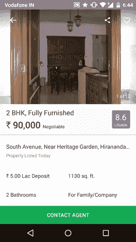
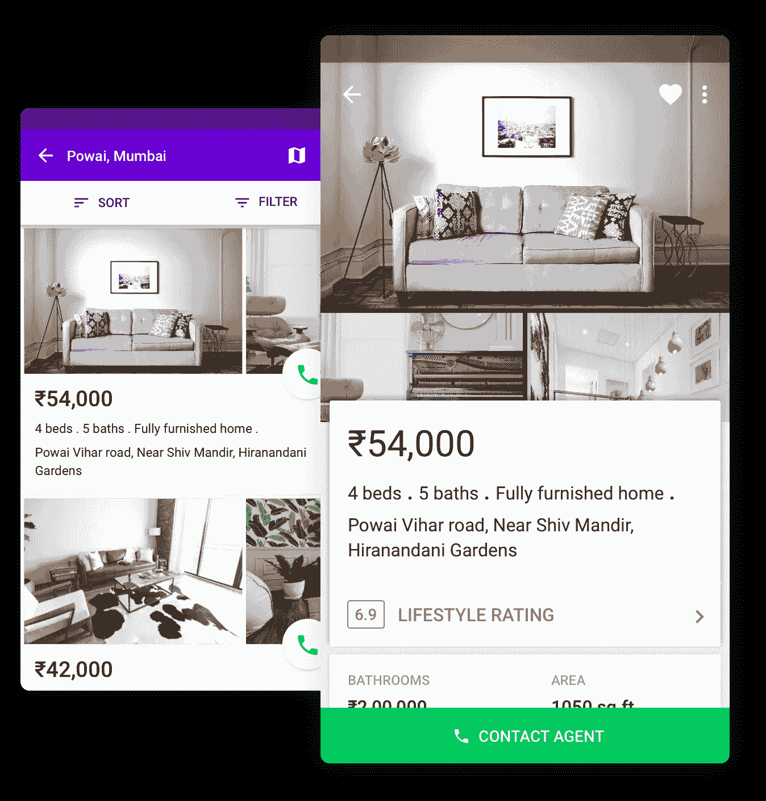
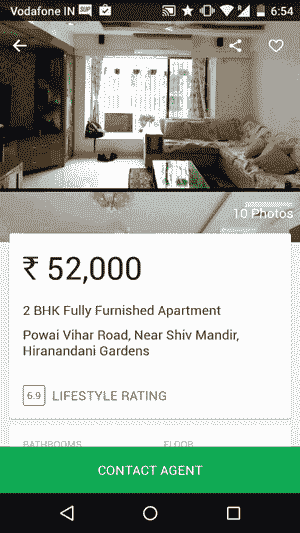
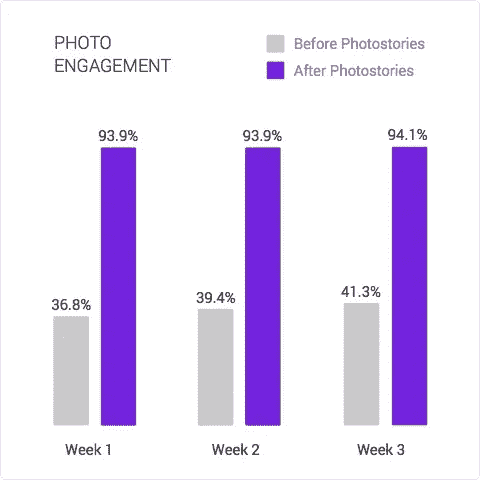
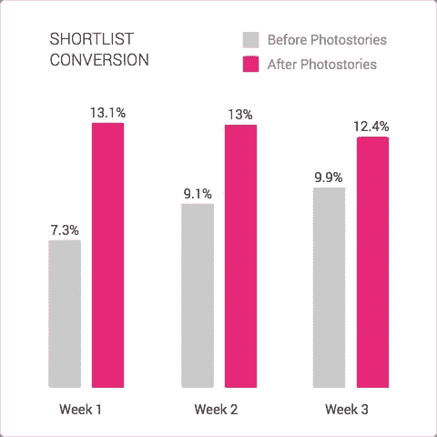
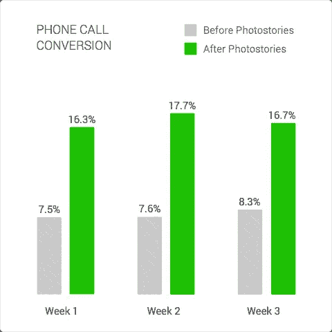
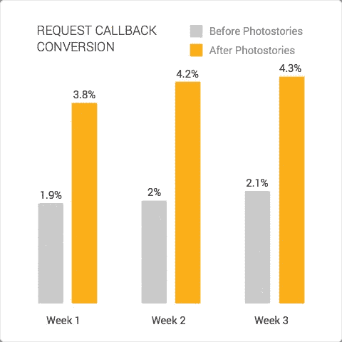

# 设计照相馆

> 原文：<https://medium.com/swlh/designing-photostories-6a4d74f3ef19>

## ***&房屋网新应用*** 上的互动

# 背景

那是 2015 年 3 月，在 Housing.com 的[总部，我们都在埋头专注于我们的“纯移动”方法，以构建我们未来的产品套件。我们在现有应用中偶然发现了非常特殊的使用模式。在智能手机上浏览时，访问该应用的租赁产品的人只关心照片、租金和邻居。](http://housing.com)

我们从用户反馈中发现，人们仅凭照片就能对他们想要居住的房屋做出相当准确的决定。但是我们的照片使用指标显示了一个完全不同的故事。

> **只有不到 40%** 的刊登详情页面用户看过超过 2 张照片！

订婚人数少得可怜。我们尝试添加工具提示来告诉用户关于这个图库的信息。没用。

Our Old Listing Details UX.

很明显，我们必须非常大胆地尝试向用户展示更多的图片。这是因为

1.  Housing 只有由我们的现场代理人拍摄的高质量验证照片。根本没有用户点击照片。
2.  我们的用户访谈和转换模式表明，人们只依靠照片来做出最终决定。

# 输入“照片库”

经过多次迭代，从明显的照片网格到可怕的“点击 15 张照片”CTA，我实现了这个特别聪明的交互。

Our New Listing Details UX with Photostories.

> *检查出一个* [***成帧器原型***](http://share.framerjs.com/su4x88c2d0io/) *通过*[*Kushagra*](https://twitter.com/kushsolitary)*来真正体验一下。*

这种 UX 策略背后的简单理念是让用户可以很容易地做出选择，要么 **A)** 向上滚动并阅读所有细节，要么 **B)** 向下滑动以在一个滚动中浏览我们所有的照片。

这有助于让我们的用户知道，在我们的平台上，每个家庭都有不止一张照片。此外，用户可以在阅读公寓和观看照片之间轻松自如地来回切换。

> 我们称它为“照片故事”，因为它通过照片和文字说明讲述了一个家的故事。

几个月内，我们完善并在我们的应用上推出了这种互动。

# 数据

我们在几周内查看了我们的分析，以检查我们新功能的性能。这些数字令人震惊！

***注*** *:以下是我们推出 Photostory 前后的列表详情页面的周环比表现。这有助于确认这些结果的一致性。此外，发布不是 A/B 测试的一部分，因为它是在我们的租赁产品的不同月份记录的。*

# **照片订婚**

> 我们首先测量了在 3 周内查看超过 1 张照片的列表详细视图的流量百分比。

**我们在图片工作室的参与度提高了两倍多。此外，接近 94%进入细节视图的用户使用了照片库，因此他们不需要工具提示就能理解！#赢了**

# **候选名单转换**

> 接下来，我们比较点击候选名单“心脏”按钮的流量百分比。用户通常会列出他们计划比较或稍后致电的候选房屋。因此，这是我们业务的一个非常重要的指标。

这张图表清楚地表明，进入候选名单并对照片表现出兴趣的人平均增加了 4%。

*专业提示*:如果你仔细观察，在这两种策略中，候选列表按钮没有任何变化。顶栏上的小“心形”按钮的位置、大小和启示完全相同！

# 电话通话转换

最后，我们比较了每个 lead 生成平台所度量的指标；**通过电话最终转化为潜在客户的流量百分比**。

这是最精彩的部分。**我们将转化为领先的流量翻了一番！**

**奖励:**让我们也来比较一下我们在住房方面的另一种形式的销售线索转化，这种转化不需要打电话。本质上，我们的用户可以通过简单的形式提交他们的联系方式来请求回电。

我们也将这一指标增加了一倍。:)

## 底线

这个实验教会了我很多东西。

1.  永远不要低估让事情显而易见的力量。
2.  图像创造了一个你永远无法用数据、数字或文字创造的故事。
3.  委婉地向用户展示你拥有的各种选项。让它们简单易用。
4.  仔细衡量你的关键指标。
5.  再多的工具提示也不能解决你的 UX 问题。

## 关于我

我是 Housing.com 公司应用程序的首席设计师。喜欢做副业。你可以在推特上找到我。

> 如果你从这篇文章中学到了什么，或者想就此展开对话，请留下你的回复或建议。

*发表于* **创业、旅游癖和生活黑客**

-