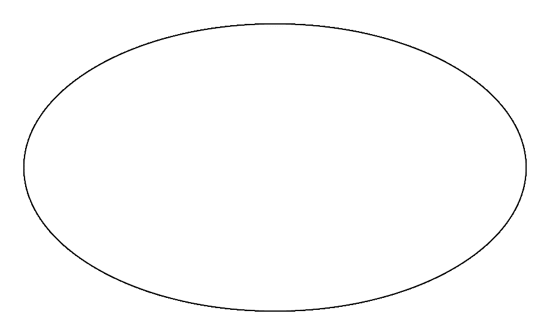
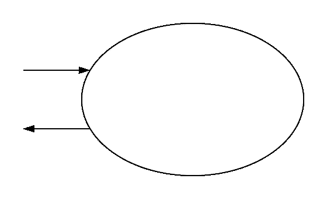
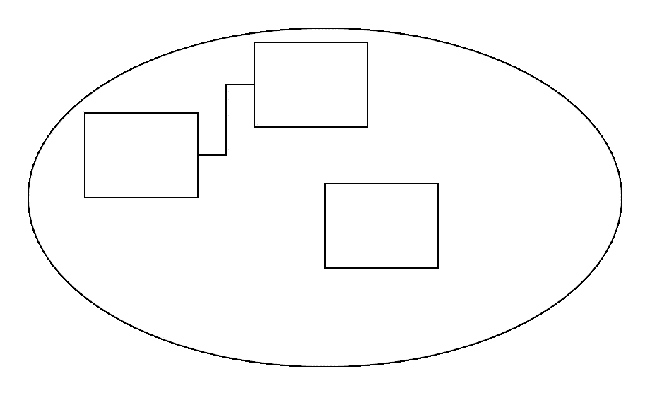
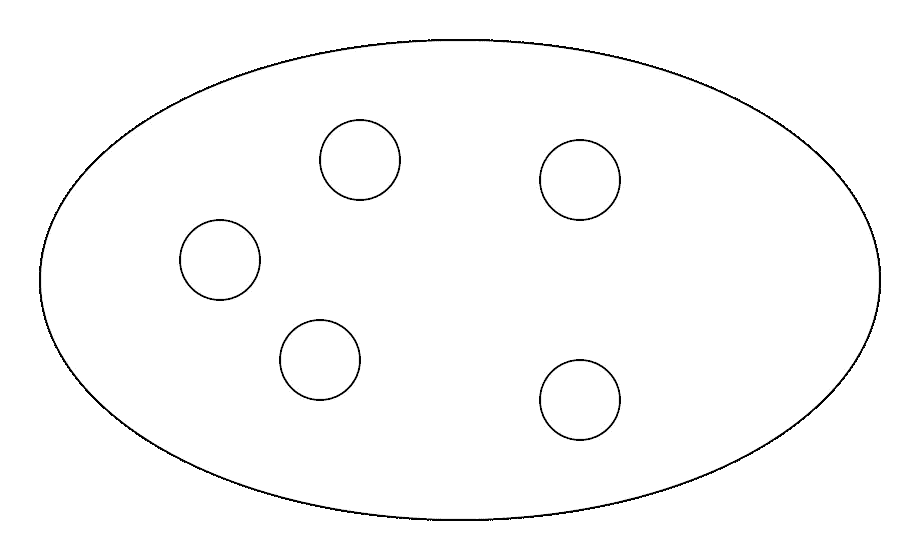
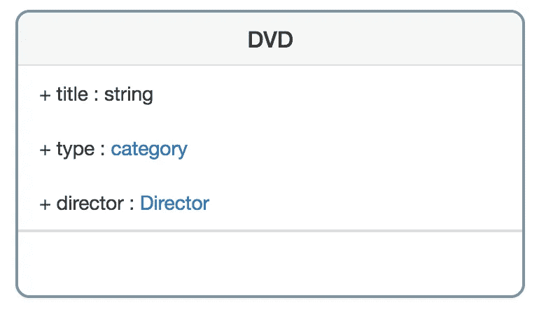
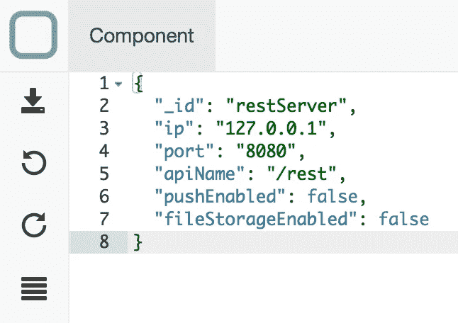
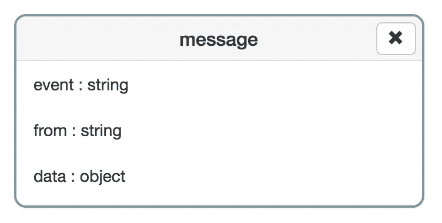

# 设计系统

> 原文：<https://medium.com/swlh/designing-systems-ce28ee31c0cd>

Picture by [Sergey Zolkin](https://unsplash.com/@szolkin)

在[我的前一篇文章](/front-end-hacking/thinking-in-systems-with-javascript-4ac9ac27d0dc)中，我解释说，作为一名开发人员，你不创建应用程序，但事实上 [**系统**](https://en.wikipedia.org/wiki/System) ，对其环境(浏览器、服务器……)做出反应的生物实体。在这篇文章中，我将描述一个你可以用来创建系统的过程。这个过程的灵感来源于我在大学学到的[*Donella h . Meadows*](https://en.wikipedia.org/wiki/Donella_Meadows)**[*B-Method*](https://en.wikipedia.org/wiki/B-Method)*和 [*领域驱动设计*](https://en.wikipedia.org/wiki/Domain-driven_design) 。***

**这个过程由 5 个步骤组成:**

1.  **理解问题**
2.  **设计您的系统**
3.  **同意这个设计**
4.  **完善您的设计**
5.  **生成您的系统**

# **1.理解问题**

## **永远记住你是人**

**为了创造系统，你首先需要意识到你是作为一个人类来感知事物和理解世界的。这意味着当我们思考一个特定的问题时，我们用自己对世界的心理表征来解决它。我们思考的时候从来不客观。我们受限于我们的文化、生活经验、母语……我们可能会错过有用的信息，因为我们无法从自己的角度看待它们。因此，你解决问题的方式越多样，你得到的解决方案就越好。因此，尽你所能创建最多样化的团队，并邀请他们参加会议，开始设计系统。**

## **包容一切**

**首先**不要被打断**倾听那些询问功能/解决问题的人。**然后就上下文提出问题**。获取尽可能多的信息，让所有团队成员都参与进来。这很重要。在会议期间，每个人都需要感到被倾听，以便能够毫无困难地分享他们自己对背景的理解。**

## **有共同语言**

**项目中的主要问题总是交流，所以**确保每个人都说同一种语言，用户语言，而不是技术语言**。为此，在纸上记下你用来定义上下文的所有单词，并写出它们的定义。这样每个人都会知道你在说什么。**

# **2.设计您的系统**

## ****拿纸和笔****

**因为如果你不能设计它，你就不能向别人解释它。**

## **创建边框**

****

**Border of a system**

****画一个代表系统边界的大圆**。**然后写下从你所列的清单中摘出的所有单词**。**

****在圆圈内写出你认为是系统一部分的概念**。把你认为不属于这个系统的概念写在圈外面。**

**这个界限取决于你对系统的理解，并且会随着视角的不同而变化。举个例子:设计 web app 的时候，可以把服务器包含在系统里……也可以不包含。看你把这个边框放在哪里了。**

## **找出引起系统响应的事件**

****

**Messages**

**然后看看你放在系统之外的概念。想想这些概念如何与你的系统互动。**

****为可能发送到系统的每条消息创建进入系统的箭头。并说出对此消息负责的事件。****

****为可能从系统发送的每条消息创建指向系统外部的箭头。并说出对此消息负责的事件。****

## **设计模型**

****

**The model**

**现在看看你输入系统的所有单词。**在每个单词**周围创建一个正方形。然后**在你认为相关的每个方块之间画一条线**。不要在链接上添加信息，只画一条线。这个想法是对概念和它们的关系有一个全局的概述。**

## **找到核心组件**

****

**Core components**

****说出启动系统所需的组件，并画出代表它们的小圆圈**。我们将称它们为*核心组件*。**

# **3.同意这个设计**

**现在我们对系统有了一个完整的概述。我们知道:**

*   **系统的边界是什么，**
*   **引发系统响应的事件是什么，**
*   **系统的模型是什么**
*   **系统的核心组件是什么。**

****确保每个人都同意设计并理解系统是如何组成的**。**

# **4.完善您的设计**

## **描述模型**

**既然大家都同意这个设计，你就可以更精确地描述这个模型了。为此，你需要问:**

*   **模型的**属性**是什么？**
*   **模特的**行为**有哪些？**
*   ****链接**有哪些**类型。它们是收藏，继承，…****
*   **模型发送的**事件**有哪些？**

**我鼓励你使用 UML 来定义模型。但是**保持简单**就像我们之前做的那样。始终使用每个人都能理解的设计。**

****

**A model in [System Designer](https://designfirst.io/systemdesigner/)**

## **找出核心组件的初始状态**

**求系统核心部件的初始值是多少。您需要回答的问题很简单:核心组件需要处于哪种状态才能启动系统？**

**我鼓励你在一个 [JSON](http://json.org) 对象中描述这些值。这是人类可读的格式，你可以很容易地更新。**

****

**A core component in [System Designer](https://designfirst.io/systemdesigner/)**

## **定义消息**

**定义发送到系统并由系统返回的消息的类型。**

**也使用 [UML](http://uml.org) 来定义消息的结构。**

****

**Message definition in [System Designer](https://designfirst.io/systemdesigner/)**

# **5.生成您的系统**

**现在你已经定义了模型并找到了核心组件的初始状态，**从模型**生成系统。不要开始编码，否则你的代码将总是与你的模型不同步。然后**实现你系统的行为**。**

**有许多工具可以用来生成模型，找到一个满足你的需要。如果你专注于 JavaScript，你可以试试 [**系统设计器**](https://designfirst.io/systemdesigner/) ，这是我为了设计和创建系统而创建的 web IDE。它是[开源](https://github.com/design-first/system-designer)免费的。**

**[System Designer](https://designfirst.io/systemdesigner/) in action**

# **结论**

**设计一个系统是一项复杂的任务，需要每个人的努力。**技术技能不是设计系统所必需的，但人的技能是必须的**。**

**这是我创建系统时使用的过程的一个快速概述。我没有进入具体的细节，我只是描述了这个过程的主要步骤，以便你可以适应你的工作。**

**在我的下一篇文章中，我将更深入地介绍模型设计过程，并解释如何让模型与你的运行系统同步。**

****

## **这个故事发表在 [The Startup](https://medium.com/swlh) 上，这是 Medium 最大的企业家出版物，拥有 287，184+人。**

## **在这里订阅接收[我们的头条新闻](http://growthsupply.com/the-startup-newsletter/)。**

****