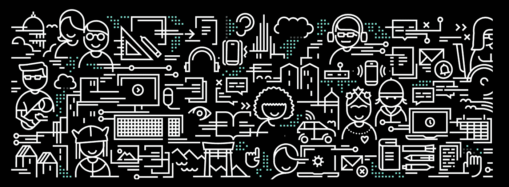
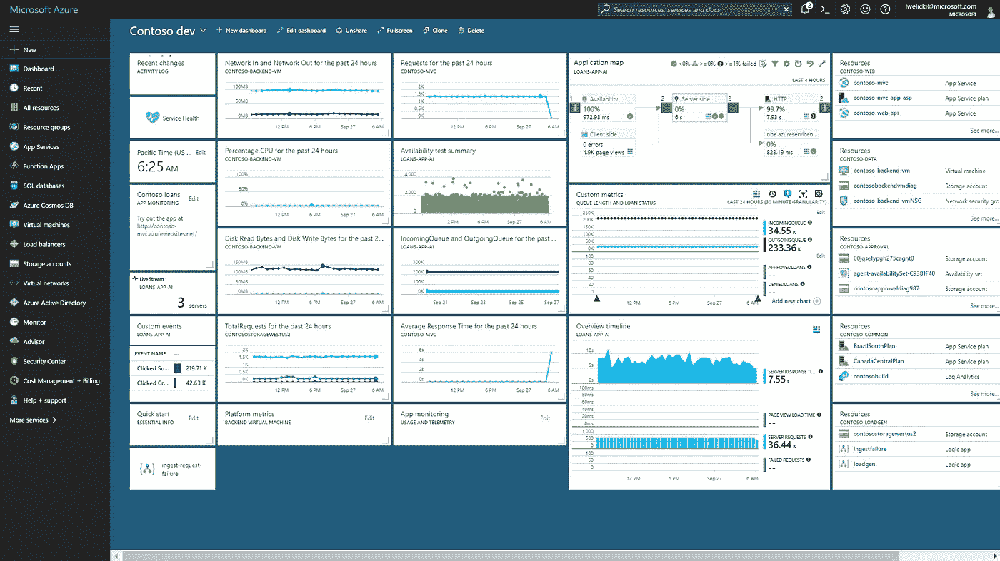
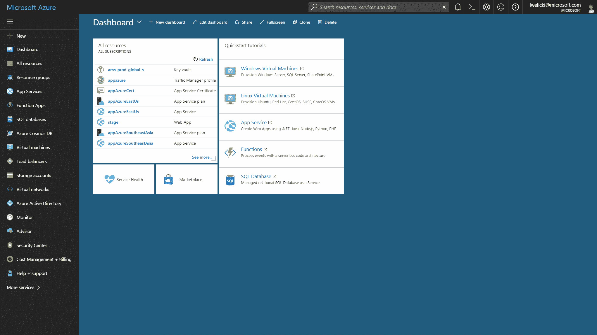
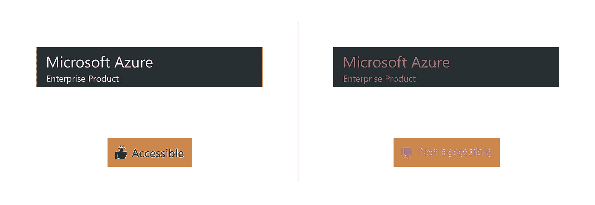
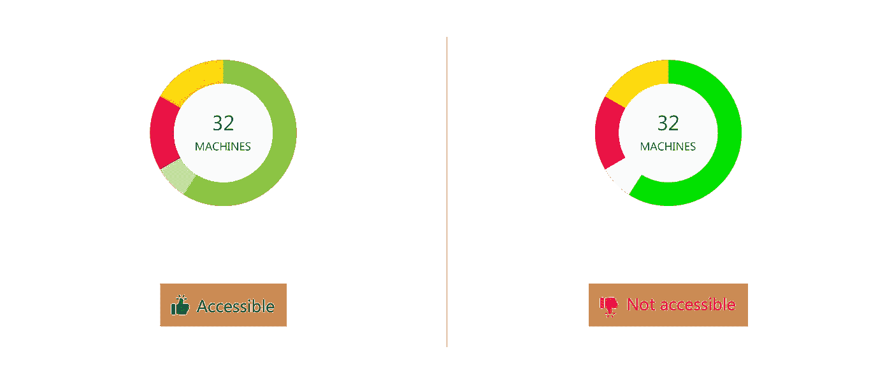
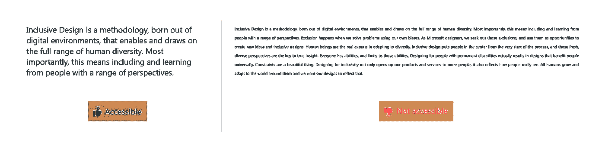
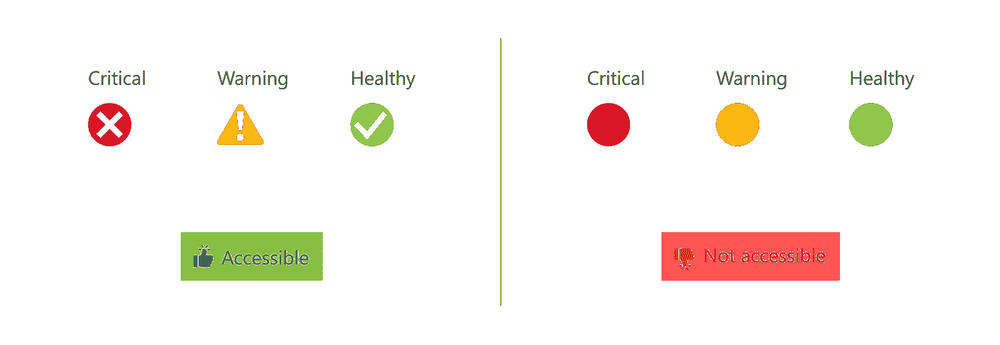
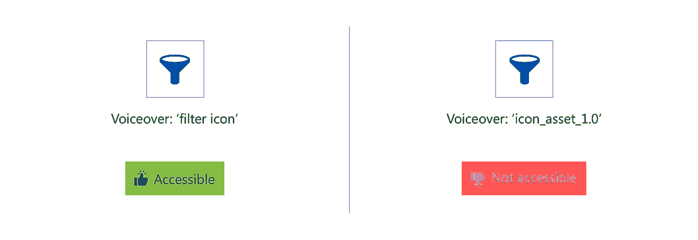
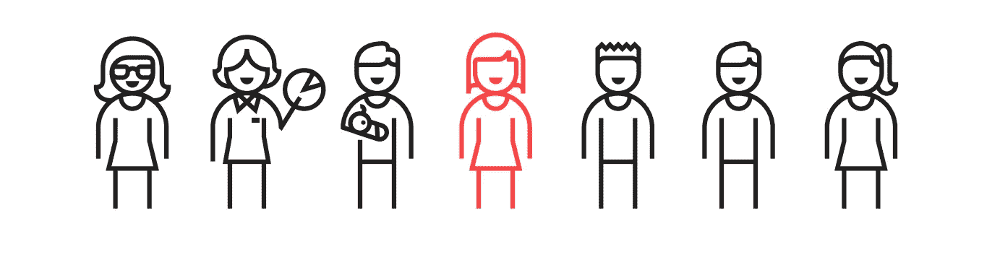

# 在拥有 8 亿多消费者的微软产品中设计可访问性

> 原文：<https://medium.com/swlh/designing-with-accessibility-in-a-microsoft-product-having-800m-consumers-ccc173a9a668>

## 让网页设计更容易理解的四个基本步骤

[https://www.microsoft.com/design/inclusive/](https://www.microsoft.com/design/inclusive/)

## 一些背景—

作为微软的一名 UX 设计师，我有机会参与 Azure——世界上最大的云计算服务之一。该平台通过微软管理的数据中心的全球网络来帮助构建、测试、部署和管理应用和服务，我和我的团队负责在这个庞然大物中构建监控服务。

规划出包含可访问性指南的结构需要一些研究、头脑风暴和一个由热情的项目经理、开发人员和设计师(我)组成的团队。已经可以访问微软的集成可访问性平台使我们在几天内启动项目变得更加容易。

[A glimpse of the Azure portal](https://azure.microsoft.com/en-in/updates/brand-new-look-for-azure-storage-overview-blade-in-the-portal/)

## 到底什么是可访问性，为什么我们要认真对待它？

可访问性是构建可以被广泛人群使用的应用程序，包括那些有视觉、运动、听觉、语言或认知障碍的人。这包括目标用户，以及人口统计之外的用户——残疾用户、残障用户、来自不同文化和国家的用户等。

[Editing background modes in Azure](https://azure.microsoft.com/en-in/updates/brand-new-look-for-azure-storage-overview-blade-in-the-portal/)

Azure 是一个监控仪表板，被全球范围内的消费者广泛使用。这些用户属于不同的年龄组，有不同的使用案例，不同的技术熟练程度，在平台上花费的时间非常不同。切换主题、个性化仪表板和创建定制界面等各种功能已经是门户的一部分，我们的工作是通过整合可访问性来增强监控服务中的这种体验。

下面是一些我们遵循的简单步骤，让微软 Azure 对我们的用户来说更加友好和自然。这些原则只关注网页的可访问性:

# **1。适量的对比**

前景和背景之间的颜色对比会对网站的易读性产生巨大的影响。这适用于从正文到视觉效果的所有内容和信息。为了满足 W3C 的最低 AA 等级，背景与文本的对比度至少应为 4.5:1。因此，在设计导航条、标题或行动号召等元素时，有必要确保颜色对比度。

此外，过饱和或高对比度的颜色会让人不舒服和分心，尤其是对自闭症患者来说。另一方面，前景色和背景色之间的对比度很差，这使得视力低下、使用低端显示器或处于阳光直射下的用户更难看清。为了确保流畅的体验，需要在组合时保持颜色的自然平衡。

**这个怎么测试？**🤔*确保您的设计和颜色在不同的“高对比度”模式下都能正常工作。这避免了文本在某些对比模式背景下变得不可见。有几个在线对比度检查工具可以用来计算屏幕中文本和实体视觉效果的分数。* [*WebAIM 颜色对比检查器*](https://webaim.org/resources/contrastchecker/) *，* [*级别权限*](https://www.levelaccess.com/compliance-resource/color-contrast-checker/) *，* [*对比检查器*](https://contrastchecker.com/)

# **2。清晰的字体大小**

屏幕上的字体应该非常容易阅读。虽然草书和装饰性字体的确不太易读，但比起字体家族，字体在字体可读性方面起着重要作用。

微软建议用户界面使用 Segoe UI 字体，最小字体大小为 12px，间距至少为 8 像素。小的、斜体的和全大写的文本对用户来说也是困难的，因此应该避免。总的来说，更大的文本、更短的行长度、更高的行高和更大的字母间距可以帮助所有用户获得更好的阅读体验。此外，今天的浏览器可以在任何尺寸的任何设备上使用，从小手表到巨大的 4K 屏幕。因此，这些尺寸必须和设计本身一样灵敏。

***这个怎么考？*** *🤔**首先，建议台式机和笔记本电脑在 1366×768 尺寸上设计。对于所有人来说，窄宽度的文本部分更容易阅读，尤其是那些有阅读或视觉障碍的人。WCAG (Web 内容可访问性指南)建议将一行文本的字符数保持在 80 个字符以下。尽可能避免使用两端对齐的文本，允许用户在不水平滚动的情况下将你的网站放大 200%。*

# 3.不要只依赖颜色

Azure 严重依赖于各种数据和可视化，由具有更复杂信息的元素组成，如图表、分布和图形。当仅使用颜色来区分数据段时，这可能是一项令人疲惫不堪的任务。应该使用各种视觉方面来传达信息，如形状、标签和大小，以使其更有意义。另一个结合可访问性的简单方法是添加带有各自图例的图案填充或实心区域，以使差异更加明显。这有助于视力低下和色盲的人理解内容，而不仅仅依赖于颜色。

这里，不仅仅使用颜色，还使用了两种不同的指示器——形状(圆圈/三角形)和图标(十字、勾号、感叹号)来区分状态。

***这个怎么考？【T2****🤔
一个很好的练习是用灰度查看设计，看看是否所有的元素都能被轻松解读。对于数字测试，可以使用不同的应用程序，如***和*[*SimDaltonism*](https://michelf.ca/projects/mac/sim-daltonism/)*实时显示普通色觉障碍者看到的内容。**

# ***4。键盘导航和语音***

*大量有视觉障碍的用户使用 voiceover 软件浏览网页。这些工具将文本转换成语音，这样人们就可以听到网站上的文字。语音助手基本上读取整个界面，并允许他们在用户单击 Alt+Tab 时与站点进行交互。因此，键盘可访问性是可访问性最重要的方面之一。*

*在为 Azure 设计时，tab 键顺序遵循页面内的直观流程是至关重要的:从左到右，从上到下——页眉、内容和可视化，然后是页脚。当用户解析信息时，*

*其次，图像和图标提供了替代文本。文字保持直接和清晰，准确描述图标/图像所代表的内容。*

**

*当用户点击一个图标时，它会清楚地提到这是一个图标以及这个图标的作用，而不是一个普通的上下文。*

*最后，ARIA 标签(可访问的富互联网应用程序)应该指出网站上的地标，如导航、表单或部分。这使得屏幕阅读器可以更容易地解析信息，还可以定义无关信息是否应该对屏幕阅读器隐藏。*

****这个怎么考？【T2****🤔
设计完成后，尝试使用屏幕阅读器软件解析不同的信息块。*[*JAWS*](https://www.freedomscientific.com/Products/Blindness/JAWS)*is*[*chrome vox*](https://chrome.google.com/webstore/detail/chromevox/kgejglhpjiefppelpmljglcjbhoiplfn?hl=en)*是众多针对视障用户的屏幕阅读器中的一部分。仅使用键盘浏览您的设计，并评估可访问性。简而言之，你的用户仅仅通过使用替代文本就能更好地可视化整个界面的图像，你的设计就离可访问性越近。**

**

*[https://www.microsoft.com/design/inclusive/](https://www.microsoft.com/design/inclusive/)*

*嗯，大概就是这样。创建一个可访问的网站并不像看起来那么困难和昂贵。请记住，可访问性应该在设计阶段就解决，而不是在过程中作为一个附加物来对待。*

*这里有微软的资源来帮助设计更具包容性的产品和体验:[微软包容性设计](https://www.microsoft.com/design/inclusive/)*

*希望这对你有帮助。😁
在这里可以看到我以前写的关于 UX 设计的文章—
[设计更好形式背后的 UX](https://uxdesign.cc/the-ux-behind-designing-better-forms-d6ebe7a817d2)
[设计着陆页背后的 UX](https://uxplanet.org/the-ux-behind-designing-landing-pages-that-convert-b302ef745c74)*

**

## *这篇文章发表在 [The Startup](https://medium.com/swlh) 上，这是 Medium 最大的创业刊物，拥有+391，714 名读者。*

## *在这里订阅接收[我们的头条新闻](http://growthsupply.com/the-startup-newsletter/)。*

**