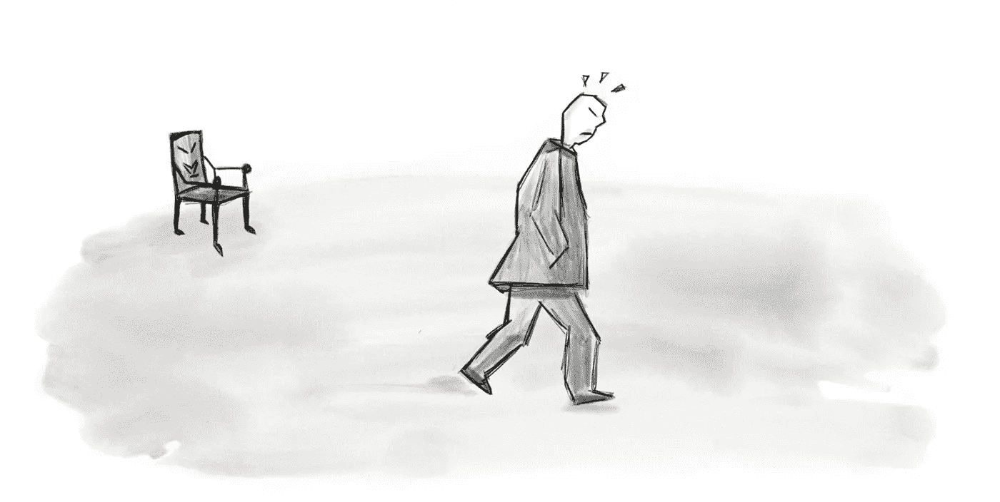
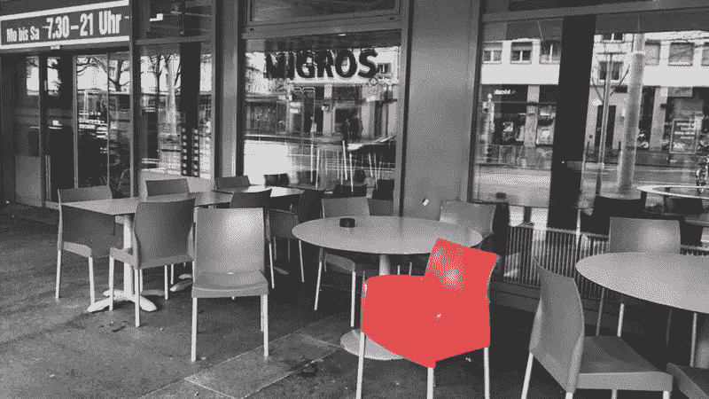

# 有目的的设计

> 原文：<https://medium.com/swlh/designing-with-purpose-cb71e028d8ec>

*为什么设计不总是令人满意*

The wrath of the ugly chair

几年来，我一直愉快地设计和推广 pixels。美好时光！我看到新趋势在相对较短的时间内来来去去。时间不断地淘汰坏的，同时保留好的。

练习 UI/UX 已经有一段时间了，我慢慢地对这个过程和决策变得更有信心了。然而，最近我遇到了一些与我所了解的相反的设计。事实上，这让我质疑我对好的设计到底意味着什么的理解。

*让我和你们分享一个简短的爱恨情仇的故事。*

每天早上，我都会带着一杯咖啡离开公寓——一杯新鲜出炉的美味拿铁，让我度过一天。

在我上班的路上，我路过米格罗。附近有一家小超市，有一个室外座位区。Migros 有一点一直让我感到惊讶:**它的椅子之大！**

他们的设计每次都让我感到困惑。

Migros’ red chair

可能世界上没有什么甜言蜜语能让我想把那把椅子放在我的公寓里。

这让我想知道…

> 有人怎么能设计出看起来和坐起来都不舒服的东西呢？

我想不出答案，但突然，我内心的批评家开始对自己感觉好一点了。“我永远不会设计这么糟糕的东西，”我想。

过了一段时间，我渐渐不再注意椅子了……直到一个周六的凌晨，椅子又突然出现在我的周围。

我惊讶地发现椅子没有被锁起来。对于不是瑞士人的读者来说，这真的很不寻常。人们把所有东西都锁在这里。

这时候我突然想到:

除非有人想用糟糕的家具设计品味给朋友留下深刻印象，否则随身携带这些椅子是毫无意义的。

这让我对周六早晨的顿悟有了更深的了解:

> 如果这把椅子的设计是故意难看的呢？

…首先，丑陋是什么意思？是个人喜好问题还是普遍问题？也许两者都是。我想得越多，就越意识到椅子的设计可能比我最初想象的要复杂。

我们先来谈谈红色。我个人不喜欢这种色调的红色。可能是因为我是色盲，看世界和大多数人不一样。感觉很强，很有攻击性。

然而，色彩理论和研究表明，事实并非如此。事实证明，红色看起来比实际更近，很容易吸引人们的注意力。众所周知，它还能提高你身体的新陈代谢，从而增加食欲(惊喜，惊喜)。事实上，餐馆早就知道在设计中使用红色的重要性。难怪大多数快餐连锁店广泛使用它。

外形呢？

有人可能会认为舒适是优秀家具设计的关键原则之一。但是有一个可能是错的。简而言之，好的设计是关于目的的。一家餐馆可能有不同的需求，而不仅仅是舒适和外观。

事实上，餐馆和咖啡店(尽管我很喜欢它们)发现不太舒服的椅子实际上会增加营业额。所以，是的，有设计师在那里，他们的工作是创造家具，只是恰到好处的舒适…

这让我想知道…这怎么可能呢？但更重要的是:**这样的设计好吗？**

德国博朗公司前首席设计师迪特·拉姆斯建立了优秀设计的 10 个基本原则。其中一个走了

> 好的设计是诚实的。

这个设计诚实吗？如果我们考虑椅子，首先什么是诚实的设计？也许就像很多事情一样，诚实取决于上下文。

他接着说…

> 好的设计是审美的。

我们可能都同意那些椅子不太美观。但他们似乎有明确的目的。所以，也许我最初的判断太快了。我根据椅子的外观和感觉来判断它，结果陷入了肤浅的陷阱。

在评判人们的工作时，我们通常很快，不是吗？我们判断结果，而不是过程。我们在不理解一个设计实际上想要达到什么目的的情况下做出判断。

毕竟，这张椅子会吸引注意力，让你更饿，让你吃得更快，这样你就可以再次起身去找一个更舒服的地方。

## 利用一点额外的时间

这个不起眼的经历教会了我，我需要给自己一点额外的时间。只是考虑一个设计多一点时间，往往会产生令人惊讶的见解。突然，我开始明白为什么某样东西被设计成这样的可能原因。通常，这些原因是无数次讨论和漫长过程的反映。平衡用户需求和公司需求的过程。

今天我对这把椅子感觉如何？

现在，我花了更多的时间，允许自己质疑和理解这个设计的目的，我能够获得新的见解。我开始以自己独特的方式来欣赏这把椅子，因为我发现它的设计可能比我最初设想的更为深思熟虑。

下一次我要评判一个设计时，我会深吸一口气，走到米格罗餐厅，坐在那张红椅子上，喝杯拿铁。

有类似的观察。让我们继续谈话。你可以在[推特](https://twitter.com/azumbrunnen_)上关注我。