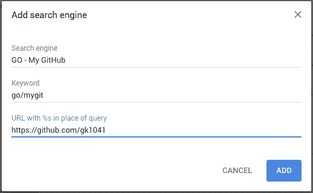
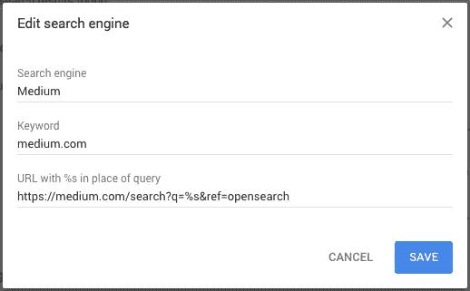

# 开发人员生产力提示:转到链接

> 原文：<https://medium.com/swlh/developer-productivity-hacks-go-links-798967064d39>

Photo by [Jon Tyson](https://unsplash.com/photos/82ZEOTntP8g?utm_source=unsplash&utm_medium=referral&utm_content=creditCopyText) on [Unsplash](https://unsplash.com/search/photos/go-arrow?utm_source=unsplash&utm_medium=referral&utm_content=creditCopyText)

这是一个关于如何以生产力的名义创建你自己的个人搜索引擎的教程！转到链接有点像书签，但你可以把它们输入地址栏。例如，如果我想导航到我的 GitHub 帐户，而不是点击我的书签或键入完整的地址，我只需键入 **go/git** 回车，就可以到达我的网站。你也可以使用它们来自动搜索其他景点，例如查找你打开的 GitHub pull 请求。

我曾在一些大公司工作过，这些公司在内部网中内置了一些 GO 链接，允许你在内部共享 GO 链接，我发现这非常有用，所以我开始寻找一种在家做这件事的方法。有很多方法可以做到这一点，Chrome 中甚至有一个 [Go Links 扩展](https://chrome.google.com/webstore/detail/go-links/ocieemgoaehjaodeclflofglaadepiic)，它很容易使用，但我更喜欢下面描述的方法，因为你可以定制它作为一个专门的搜索引擎。

# 在 Chrome 中创建一个 GO 链接

这种方式利用了 Chrome 的搜索引擎设置。本质上，你所做的是制造一个只有一个结果的搜索引擎…你想要的网址！

## 步伐

*   点击这里进入 Chrome 的搜索引擎设置页面Chrome://设置/搜索引擎
    *或* 右键点击地址栏，选择**编辑搜索引擎……**
*   向下滚动到“其他搜索引擎”并点击**添加**

Chrome Search Engine Settings Page

*   然后填写字段
    -**-**搜索引擎可以是任何东西，但我建议为你所有的 GO 链接使用相同的前缀(如“ **GO -** ”)，这样它们就被分组在一起，这样如果你需要编辑一个
    - **关键词**就是你在地址栏中键入的内容， 它可以是任何东西，但我建议以“ **go/** ”或某种您不想在 google 上搜索的前缀开头
    - **用%s 代替查询的 URL**是您想要结束的地址，正如标签上所说，您可以使用“%s”作为查询参数，我将在这些步骤之后展示这个示例

Sample GO Link using Chrome Search Engine

*   点击**添加**，在地址栏输入你的关键词试试看。

# 再多一点…

那么关于“ *…%s 代替查询*”部分。你可能已经注意到浏览了 Chrome 搜索引擎设置页面，那里有一些熟悉的网站，比如 Medium.com。您可以通过点击搜索引擎右侧的*垂直点* >编辑来打开其他搜索引擎。您会注意到他们如何使用" %s "作为查询参数。

Chrome Search Engine for Medium.com

那么…你如何使用它？很简单，在你的地址栏中输入“中”然后点击空格，你应该会看到地址栏的变化，然后输入要搜索的内容，比如“ *hackernoon* ”，点击**输入**。

Using Medium.com Search Engine

我推荐在你的 GO 链接中使用这个很酷的特性，这也是我喜欢用这种方式创建 GO 链接而不是使用之前提到的扩展的原因之一。我使用它的几种方式是为了查找:

*   通过 PR 号或吉拉机票号在 GitHub 上拉请求
*   吉拉的车票号码

# 总结一下

这可能只会节省几秒钟(就像许多工作流黑客一样)，但最重要的是，它可能会节省一些脑力或理智，因为当你打开吉拉时，不必记住某些东西的 URL 或去哪里找到你的问题单。很简单。值了。

## 这篇文章发表在[《创业](https://medium.com/swlh)》上，这是 Medium 最大的创业刊物，有 287，184+人关注。

## 在这里订阅接收[我们的头条新闻](http://growthsupply.com/the-startup-newsletter/)。

