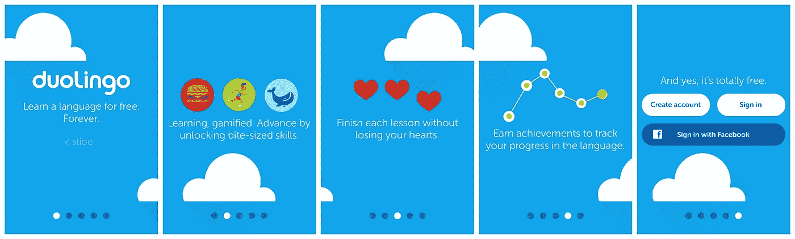
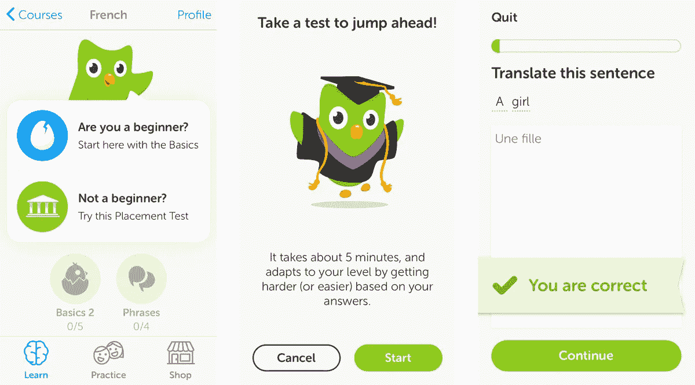
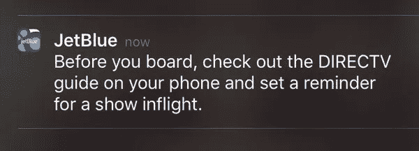
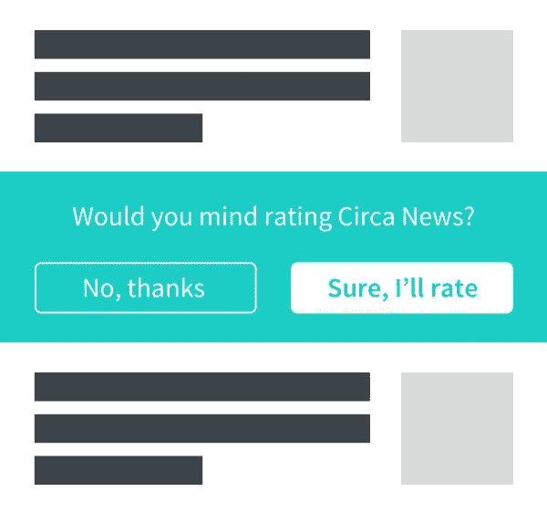
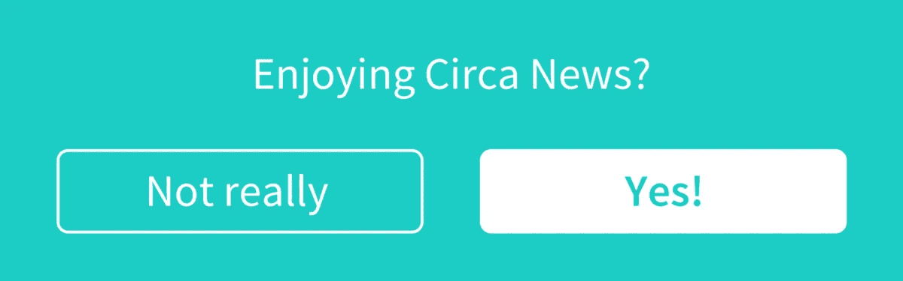

# 前所未有的移动应用参与的开发者秘密

> 原文：<https://medium.com/swlh/developer-secrets-to-unprecedented-mobile-app-engagement-64f63ababc5>

Originally published on [http://www.appsterhq.com](http://www.appsterhq.com/?utm_source=CP&utm_medium=Medium)/

实现了你的用户获取目标？恭喜你。

现在是时候跨越你的下一个障碍了——通过参与来建立和保留你的用户群。

驱动参与是一项具有挑战性的任务，需要大量投资，但好处是显而易见的:获得一个新客户的成本[比留住现有用户的成本](https://hbr.org/2014/10/the-value-of-keeping-the-right-customers)高 5 到 25 倍。

参与用户也更有可能向他们的社交圈介绍你的应用，提供反馈，展示品牌忠诚度，并进行应用内购买。

下面，我将谈到使应用程序吸引人的因素和四个策略，以及我们在 Appster 与[合作的一些顶级初创公司的移动参与示例。](https://www.appsterhq.com/)

# 是什么让一个应用吸引人？

使应用程序吸引人的因素会因其目的和应用程序体验而异，这些因素通常可以分为两类:信息性或体验性(逃避)。

前者的一个例子是 Instagram 或 Gmail——个人可以在那里收集信息——而后者是游戏或提供娱乐的类似应用。

为测试品牌应用对消费者的影响而进行的一项研究表明，信息应用更有可能吸引用户。

要成功吸引用户，需要具备以下因素:易用性、回报和功能性。

Matt Goldhill，Mobile 5 shares 前创意策略师:

> *“尽可能让它简单、有吸引力、有回报。通过专注于这一点，无论如何都将变得引人入胜。”*

应用程序实现的目的也是一个关键因素。尤其是在一个每天都有大量应用程序发布的时代，让我们受到太多选择的轰炸。

Fetch 前媒体产品主管戴夫·桑德勒解释道:

> *“有那么多 app 不需要在那里。一个应用程序是关于功能和实用性的，有人希望快速完成一个特定的动作，所以要确保核心功能是最重要的。”*

很难定义是什么让一个娱乐或游戏应用吸引人，因为没有一个固定的因素或属性列表。

换句话说，就相当于说人们可以精确地找出让口袋妖怪流行的确切因素，并为另一个游戏应用程序复制这一策略。

但是也许有一种秘方存在。已经开发出成功游戏应用的公司都认为这可以归结为对质量的关注，以及持续的测试和迭代。

Dots 联合创始人兼首席执行官 Paul Murphy 表示:

> “我想我们的团队会说要关注整个用户体验——每个像素、按钮、交互都是取悦玩家/用户的机会。”

他补充说，这是一个将直觉和数据结合起来的过程:“一旦我们意识到我们有了一些东西，我们就无休止地测量和测试，直到感觉刚刚好。"

# 应用开发者如何构建引人入胜的体验；

在这篇文章中，我将重点介绍四种策略，你可以实施这些策略来提高信息应用的参与度:

# 1.创建有效的入职流程

有三个因素定义了有效的入职流程。它应该:

*   清楚地传达你的价值
*   实现快速简便的注册或登记
*   清晰简洁地呈现信息

我将使用 Duolingo 的入职流程来说明这些因素。

首先通过四张入职幻灯片向用户介绍该应用程序。

在这里，Duolingo 设法以简洁的方式传达其价值——用户知道他们将“通过游戏学习”,并在他们通过各个关卡时跟踪他们的学习过程。

简单的设计、欢快的图形和明亮的颜色传达出 Duolingo 提供了一种有趣而轻松的体验。

不是让用户立即注册，而是要求用户在完成一些课程后才创建个人资料。注册过程也保持简短——用户只需输入用户名、密码和电子邮件地址。

虽然向用户询问信息有助于创造定制化的体验，但应用程序通常会因为要求过多的信息而在早期就有压倒用户的风险。

Duolingo 通过向用户提供四种选择来解决这个问题。设定目标后，他们有两个选择:从基础开始，或者参加分级测试。

在这里，Duolingo 取得了正确的平衡——这些步骤的特点是选项有限，易于完成，但使 Duolingo 能够收集足够的信息，为他们的用户提供个性化的体验。

# 2.优化您的推送通知策略

推送通知通常是移动应用程序中一个有争议的功能——如果使用不当，这些通知通常会导致用户因失望而删除应用程序。

然而，他们也是参与和[用户保持的关键](https://www.appsterhq.com/blog/how-to-boost-app-user-retention-rates/)。[根据 Localytics](http://info.localytics.com/blog/mobile-in-2016-why-you-need-push-in-app-messaging-to-combat-churn) 的数据，应用内消息能够将用户留存率提高 3.5 倍。

此外，已启用推送通知的用户平均每月启动应用程序 14.7 次。与没有启用此类通知的用户相比，参与度增加了 171%(这些用户每月启动应用程序 5.4 次)。

关键在于实施适时的、根据用户需求定制的推送策略。它会考虑你的用户是谁，他们在哪里，他们在做什么，以及在特定时间点应用程序与你的用户有什么相关性。

捷蓝的推送策略就是一个很好的例子。在航班预定起飞前 24 小时，乘客会收到通知，要求办理登机手续。

就在登机前 16 分钟，航空公司会发送一个关于机上娱乐的通知，让乘客可以提前查看有什么节目。

这两个都是简短而及时的提醒，向捷蓝航空的客户传达了以下信息:这是一个以乘客需求为导向的品牌，致力于提供卓越的体验。

# 3.与用户进行双向交流

虽然推送通知和应用内消息是与用户沟通的有效方式，但促进双向互动需要超越这些渠道来了解他们的具体需求。

从查看你的应用程序获得的评论和评级开始，因为这些是反馈的来源，让你评估品牌忠诚度的水平。

通过用户卸载时激活的电子邮件或应用内调查，寻求不满意用户的反馈，是确定具体改进领域的好方法。

当谈到获得反馈或评论时，有两条规则适用:避免弹出请求(这是最容易惹恼用户的方式)，并就获得他们的评级或反馈征求用户的许可。

我想强调一下新闻和娱乐服务公司 Circa 实施的策略。首先，这款应用利用了一个综合评级，它被放在新闻报道列表中。这样，用户可以选择滚动过去，而不是让他们的应用程序体验被弹出窗口打断。

其次，Circa 通过提出一个简单的问题来寻求用户的许可:“享受 Circa 新闻吗？”回答“是”的用户被要求对应用程序进行评级，而回答“否”的用户则有机会提供反馈。

及时提出你的问题很重要，这样你就可以针对正确的用户进行反馈。在 Circa News 的案例中，这些问题只提供给在三天时间内启动该应用 10 次的个人，以确保从参与用户那里收集到反馈。

最后，不要忘记告诉用户你在倾听他们的意见，并努力改进以回应他们的反馈。

当客户意识到他们的反馈被认真对待时，他们更有可能提供反馈，并与你的品牌建立更紧密的联系。

这也有助于保持尽可能私人的交流。例如，如果你正在推出新的应用功能，发布一个社交媒体帖子，让你的用户知道他们的评论帮助带来了这些变化。

# 4.利用分析推动关键增长行动

希望提高参与度？你需要清楚地了解你的用户——这就是分析发挥作用的地方。

在 Optimizely 的一篇文章中，移动合作伙伴关系前负责人 Nelson Wang 指出，应用分析通常有三个层次的复杂性:

## 一级:

第一级指标，如页面浏览量、MAUs(月活跃用户数)和 DAUs(日活跃用户数)提供了应用在参与度、留存率和货币化方面的表现概览。

## 第二级:

随着您的公司和用户群的增长，您将需要采用更复杂的分析级别来全面了解您的应用性能。

在这一点上，你可能会遇到的行为问题包括:“用户之间最常见的行为是什么？他们没有采取什么行动？他们在哪里下车，他们如何在应用上消磨时间？”

一旦您收集了一系列问题的数据，您就可以根据关键行为或人口统计数据创建用户档案。这样做将有助于你识别和理解不同类型的用户如何体验你的应用。

## 第三级:

第三级是你寻找导致长期记忆的关键行为。也被广泛定义为“啊哈！“瞬间”，指的是将发现你的应用有价值的用户与没有发现价值的用户区分开来的行为。

举几个著名的例子:脸书·查马斯·帕里哈皮蒂亚公司的前增长负责人说[让用户在 10 天内联系到 7 个朋友是“唯一的焦点”](https://genius.com/Chamath-palihapitiya-how-we-put-facebook-on-the-path-to-1-billion-users-annotated)，而在 Slack，关键的增长行动是团队之间交换 2000 条消息。

在 Zynga，用户忠诚度的最佳指标是用户在注册游戏后第二天启动应用的时间。

一旦你确定了高价值的行为，努力实现产品变化和策略，围绕这些行为奖励现有用户。这可能包括提供优惠券和折扣，以及解锁对独家功能和内容的访问。

# 总而言之:

*   应用程序体验分为两类:信息型或体验型。功能性和易用性是信息应用吸引人的因素。对于体验式应用来说，什么是吸引人的应用体验更难定义，因为不同的应用有不同的因素。

推动移动应用参与的策略:

*   一个有效的入职流程应该清楚地传达你的价值，允许快速、简单的注册，并以简洁的方式呈现信息。
*   为了**优化你的推送通知策略**，确保它是及时的，并且是根据你的用户需求定制的。
*   使**与用户的沟通成为一个双向的过程**。以一种深思熟虑的、非侵入性的方式寻求用户的评论和评级，并向用户传达你正在关注他们的反馈。
*   **利用分析推动关键增长行动**。第三层(也是最复杂的一层)是你寻找高价值的行为来推动参与和长期保持。围绕这些行动实施奖励用户的策略和产品变化。

*最初发表于*[*www.appsterhq.com*](https://www.appsterhq.com/blog/mobile-app-engagement/)*。*

//

## 感谢阅读！

# 如果你喜欢这篇文章，请随意点击下面的按钮👏去帮助别人找到它！

# 对应用程序有想法吗？[我们来聊聊](http://www.appsterhq.com/?utm_source=CP&utm_medium=Medium)。

在过去的几年里，我们已经帮助建立了超过 12 个数百万美元的创业公司。[查看我们如何帮助您](http://www.appsterhq.com/?utm_source=CP&utm_medium=Medium)。

