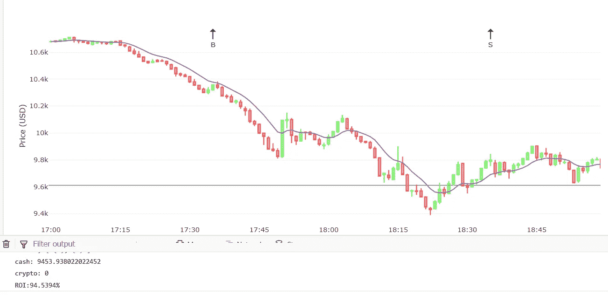
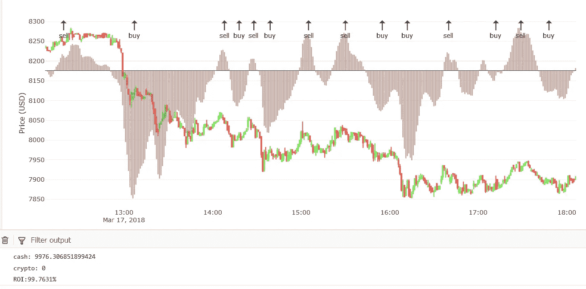
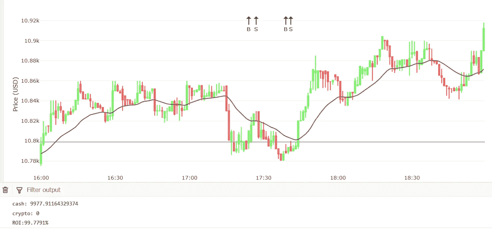
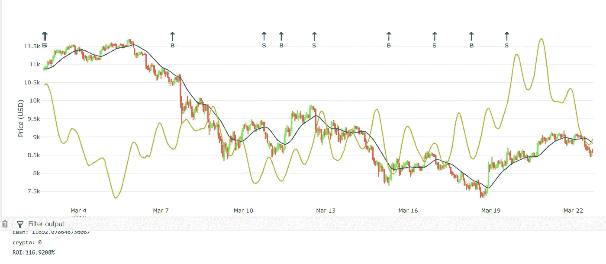
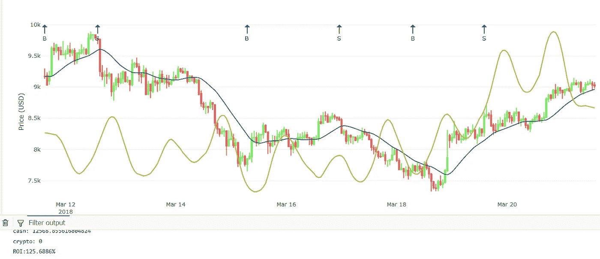
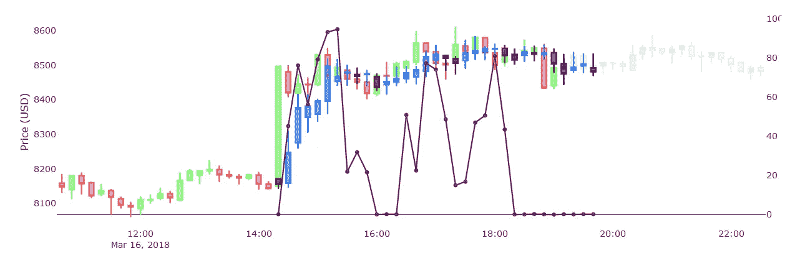
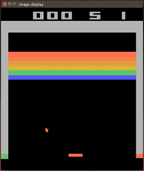

# 开发比特币算法交易策略

> 原文：<https://medium.com/swlh/developing-bitcoin-algorithmic-trading-strategies-bfdde5d5f6e0>

开发算法交易模型和策略不是简单的任务。更糟糕的是，目前的加密状态是高度不稳定和快速变化的。由于美国证券交易委员会和各国政府针对加密交易所的规定，该市场已成为战区。尽管所有的负面消息，许多交易者在日内交易加密资产上大赚了一笔。

在我们之前的文章中，我写了我们在做短期预测方面的进展。在这篇文章中，我把它带到了一个新的高度。我将举例说明我们如何将预测融入成功的交易策略。

# 手工建模

开发算法模型/策略通常从查看原始数据开始，但更重要的是分析几个指标，如 SMA、MACD、EMA 和 RSI。整个过程的重点是试图找到一些对人眼来说非常明显的模式，而且这些模式在整个历史中不断重复出现，并有望在未来继续出现。

## 理论上

大多数策略都是以盈利为基础的，所以人们想方设法发现一个低谷，这样他们就可以触发一个“买入”信号，然后让系统等到出现一个高峰时再触发一个“卖出”信号。这是一项有风险的业务，因为没有任何保证，也就是说:一个系统无法准确地判断(给定历史事件)市场价格是否处于低谷，它只能做出计算后的猜测。这就是问题的关键，我们试着做一个计算好的猜测，这是在一个低谷或高峰触发一个交易信号(买入或卖出)的可能性。

## 实际上

现实比理论复杂得多。一个系统可能显示它在一个谷底，但是几分钟后价格会跌得更低。

如果您曾经为大型软件项目编写过代码，那么您会知道错误/失败率随着每一行新代码的增加而成比例增长。这意味着你写的代码越多，你诱发的错误/bug/错误就越多——人无完人，再聪明的程序员也是如此。当我们写代码时，我们通常在头脑中有一个明确的目标，因此我们知道应该给一些明确定义的输入输出什么。但是尝试用(加密)资产(例如比特币)的输入日期来做这件事，你会很快意识到这不是一件小事。输入永远不会是相同的，我们不能简单地依赖一堆“如果这样—做那样”的代码。然而，这是计算机唯一能理解的语言，它是我们工作中最可靠的工具。

为了使我们的工作更容易，我们必须引入数学和统计学来帮助我们。如前所述，这是通过创建指标来实现的，如 SMA 和 MACD。指标是一种功能，它获取原始数据，对其进行转换，并从中发现新的东西。指标让我们更容易分析原始市场数据，它们让我们发现/看到我们不会看到的模式。如果你懂一点交易，你就会知道 MACD，多头和空头均线图有多有用。

由于指标仅仅基于历史数据，它们不太擅长做出预测，但也不是完全无用。为了说明这一点，请看下图:

Manual model (1)

在上图中，我们将比特币的价格绘制成烛台状。然后我根据开盘价和收盘价创建了一个指标(EMA)。下一步是使用代码，也就是“如果这样—做那样”的语句，提出一个有正投资回报(包括交易费用)的基本策略。还记得我之前讲的高峰和低谷的故事吗？我们在这里看到了它的作用。我的算法使用均线指标产生首次买入信号(图中用 B 表示)，在这种情况下，它是为了预测一个低谷，因为雨后通常是阳光。然而，在这之后，没有阳光，只有更多的雨(价格持续下跌)。然后在某个局部峰值产生卖出信号。

在这张图表上，我们可以清楚地看到一个简单的算法是如何做出决策的。可悲的是，它的决策并不是最优的，原因很明显，因为在每一步，算法只能看过去——它不能预测未来以做出“最佳”决策。另一个令人难过的部分是，这样一个简单的算法有硬编码的参数，比如指标的参数(比如均线大小)。对我们人类来说，我们可能会看着这些生成的信号说“多么愚蠢的决定”——我们根本无法争辩，机器只能做出我们编程让它做的决定。如果参数是次优的，结果也是次优的。

在图像的下部，我显示了生成信号的投资回报率，略高于 94%，这意味着该系统亏损了约 6%——原因是:它买入的价格高于卖出的价格，更糟糕的是，它为每笔交易支付了 0.1%的费用。

下面是另一个场景。这次我们使用三个指标，但只显示了一个。棕色条代表 MACD 指标，它是由两个不同的均线指标组成的:

Manual model (2)

使用 MACD 作为交易策略的基本思想是，再次检测波峰和波谷。当你观察买入/卖出信号出现的地方，也就是 MACD 的某个峰/谷时，这一点就变得很明显了。这种策略似乎比前一种效果更好，因为投资回报率超过 99%(即仍然亏损约 1%)——但我们可能不会像那样比较两者，因为前一个例子只有两个交易信号，而这个例子有更多。

这是第三个也是最后一个例子。下面是基于均线信号的图表(和第一个例子一样)。但这次我选择了不同的地区和更多的数据。

Manual model (3)

上面的投资回报率超过 99%，就像我们的 MACD 的情况一样。仔细观察这些信号是非常有趣的，它进行了两次卖空交易，间隔只有几分钟。在这种情况下，我试图通过利用高波动性，让系统在很短的时间内获利。

## 验证策略

这三个例子是基于非常少的数据。图表上显示的一切都是用来生成交易信号和计算投资回报率的。在实践中，我们必须对几天、几周、几个月甚至几年的数据运行我们的算法，以验证其成功率。不幸的是，在我们的测试中，这些策略很少被证明是成功的。事实上，如果没有交易费，以上所有这些都可以产生超过 100%的投资回报率，因为这就是交易所如何防止我们一夜之间成为百万富翁的。

# 深层数据

U 唱原始市场数据(如价格&成交量)，结合几个指标很少会产生有利可图的交易策略。除非你的算法非常复杂和设计良好——如果是这样，重新检查一切，因为你可能有一个 bug 或未解释的场景。

经过很长时间和无数次的尝试，我终于想出了一些有利可图的交易算法。这些都是通过利用一些默认指标实现的，在应用之前，我必须对这些指标进行多方面的调整。但更重要的是，我使用的数据类型使这些方法成功。他们不再仅仅基于价格和/或数量，而是考虑其他因素，如情绪(来自我们的情绪分析)。

Manual model (4)

在上面的图表中，你可以看到其中一个策略在起作用。密切注意它产生买入/卖出信号的地方——它们似乎比前三个例子更好，但远非完美。更重要的一点是投资回报率，它是正数(116%)，可以归结为平均每天增加 1%。

下面是另一个图表，使用完全相同的策略，但在不同的日期/时间。同样，结果是惊人的，投资回报率为 125%，日增长率约为 3%。

Manual model (5)

直到今天，我还在继续测试、验证和优化这个策略——这似乎是我迄今为止能想到的最好的策略。请注意，与我们之前的例子相比，买入和卖出信号相差有多远。在这里，他们相隔几个小时甚至几天，而以前只有几分钟或几个小时。在我卖肾全押之前，我需要确定它真的会起作用。希望在几周内，我会把它插上，写一个新的帖子来展示我的结果。

# 人工智能

一个人可以开发他/她想开发的任意多的模型，或者至少是他/她有勇气开发的任意多的模型。这不是一个简单的开发过程。当同时调整许多参数和尝试不同的值时，很难测试和验证新的假设。但是如果我们可以用人工智能来帮助我们提出更好的模型和策略呢？

这个研究领域甚至比创建手动模型更复杂，但它已经是未来——如果你不跟上它，你就落后了。在某个时候，如果不是现在，人工智能将比人类做出更好的交易决策(长期和短期)。如果你是一名人工智能研究人员/开发人员，你应该知道让一个系统想出一个交易策略有多复杂。它已经足够复杂，可以训练它执行简单的任务，比如识别图片中的物体。

## 混合建模

直到几周前，我还在使用人工设计的策略，利用我们的预测生成交易信号。当时的结果相当“好”,但它们没有包含交易费用——所以它们实际上不再“那么好”了。

Old predictions (1)

其中一个策略是查看最高和最低预测点，并在相应的时间间隔内生成卖出/买入信号。仔细想想，这绝对不会是一个最优策略。你也可以开始随机买卖，这样运气会更好。但我还不会把这个想法扔进垃圾桶。在我之前的文章中，我已经说明了我们最近对预测的改进。因此，在一些新数据上重新运行这个老策略绝对值得一试。

我想到的是，这些策略是短期的，也就是说，它们利用任何预测来做出决定。由于我们对未来的预测通常不超过 3 到 15 分钟，他们需要产生足够大的利润来支付交易费用，从而产生积极的投资回报。

我加入了一个特别的东西:**预测下一个买入/卖出信号**。我想教我们的系统预测有价值的买卖信号，就像我们让它预测未来价格一样。要做到这一点，我首先要训练系统好的买入和好的卖出头寸是什么样的。我检查了所有的数据，并使用了一个前瞻性的概念:给定一个头寸“t”，如果在不久的将来价格会下跌很多，那么“t”应该表示“卖出”信号，但如果价格会上涨，那么“t”应该表示“买入”。不久的将来由接下来的大约 10 个时间间隔来定义。每隔一个“t”表示一个“什么也不做”的信号。下面的图表显示了我努力的结果:

Hybrid model (1)

在上图中，我们看到了蓝色/黑色烛台图上的价格预测。紫线是我刚才解释的信号预测“事情”的结果。我已经教过系统，一个“卖出”信号等于 100 的值；买入等于 50，不做等于 0。最后，系统没有完全尊重我的价值观，所以它生成的值要么接近于零，大约 50，要么接近于 100。但是它确实有一些有趣的结果。如果你仔细观察，它确实显示了一些有趣的“买入”信号(=值 50)，然后你必须猜测“卖出”信号对应于某个“买入”信号的近期区间。最终这可能证明是一个有用的交易策略，但这真的很难解释和理解。我需要做更多的研究和开发来改进它。

## q 学习

这是一种强化学习(RL)的形式，一种训练人工智能做某些事情的技术。RL 是教机器如何下棋、下围棋甚至太空入侵者的诀窍。

RL trained-A.I. playing ‘Breakout’

如果我们可以教一台机器如何玩吃豆人，那么我们还不如教它生成买/卖信号。这正是我所做的。背后的逻辑是，当系统做出好的决策时，给系统一个奖励(比如拍拍背)，如果没有，我们就惩罚它。奖励/惩罚用一个数字表示，因此我们训练系统来优化自己，以获得尽可能高的分数。开始时，它进行一系列随机猜测，获得奖励/惩罚，然后根据这些结果学习/重新训练自己。这个过程无限期地继续，直到我们告诉它停止。我们不希望系统在输入数据方面过度拟合，但我们也不希望它是超级随机的——所以我们必须在一定数量的迭代后让它停止。

Q-learning 的实现是通过使用一个开源项目完成的。我只需要根据我的需要调整它。我还意识到 Q 学习系统的主干通常是基于前馈神经网络的，我还没有发现任何使用递归神经网络的解决方案。但这是我实现的。我很快了解到，通过 RL 训练一个系统是一个非常繁琐和漫长的过程，它需要几个小时/几天才能完成，这取决于迭代的次数和其他一些因素。

经过几个小时痛苦的训练后，我确实看到了一些不错的买入/卖出信号，但对我来说，它们更像是随机的，而不是智能的。总的来说，Q-learning 并没有被证明是一种成功的技术，但我会改进它，因为我相信它是一个金块。

感谢阅读，敬请期待下一集！:)
——伊利亚·内沃林

## 这篇文章发表在 [The Startup](https://medium.com/swlh) 上，这是 Medium 最大的创业刊物，拥有 310，538+人关注。

## 在这里订阅接收[我们的头条新闻](http://growthsupply.com/the-startup-newsletter/)。

