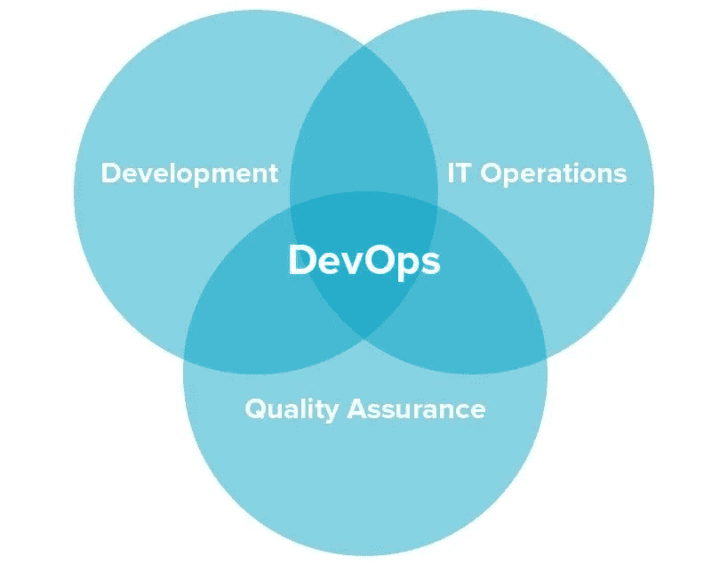
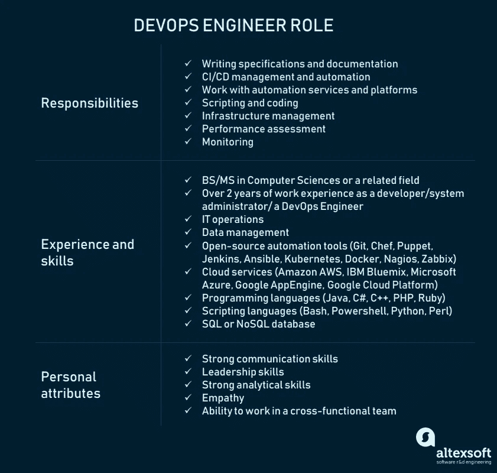
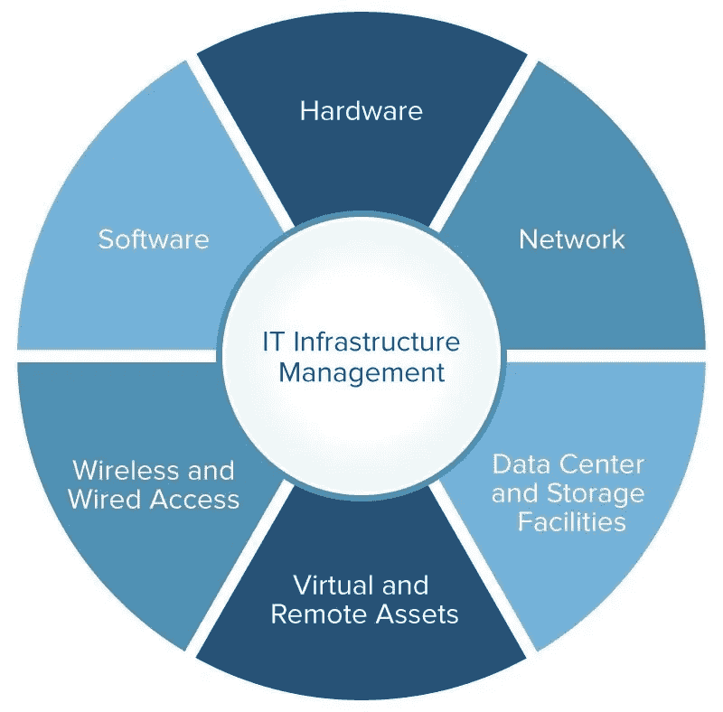

# DevOps:原则、实践和 DevOps 工程师角色

> 原文：<https://medium.com/swlh/devops-principles-practices-and-devops-engineer-role-439a8c022385>

很长一段时间，开发和运营都是孤立的模块。开发人员编写代码；系统管理员负责其部署和集成。由于这两个筒仓之间的沟通有限，专家们在一个项目中大多是单独工作的。当瀑布开发占主导地位时，这没什么。但是自从敏捷和连续工作流占领了软件开发的世界，这种模式就过时了。每两周甚至每天发生的短时间冲刺和频繁发布需要新的方法和新的团队角色。

今天，DevOps 是讨论最多的软件开发方法之一。它应用于脸书、网飞、亚马逊、Etsy 和许多其他行业领先的公司。因此，如果你为了更好的性能、商业成功和竞争力而考虑采用 DevOps，你要迈出第一步，雇佣一名 DevOps 工程师。但是首先，让我们看看 DevOps 是什么，以及它如何帮助改进产品交付。

# DevOps 是什么？

DevOps 代表开发和运营。这是一种旨在将开发、质量保证和操作(部署和集成)合并到一个单一的、连续的过程集合中的实践。这种方法是敏捷和持续交付方法的自然延伸。

*What DevOps looks like*

但是 DevOps 不仅仅是一组动作。它更多的是一种文化，甚至是一种哲学，促进跨职能团队的沟通。DevOps 的主要好处之一是它不需要实质性的技术改变，而是面向改变团队的工作方式。团队合作是 DevOps 文化的一个重要部分:一个过程的整个成功取决于它，并且有 DevOps 团队使用的原则和实践。

# DevOps 原则

简而言之，DevOps 的主要原则是自动化、持续交付和对反馈的快速反应。您可以在 **CAMS** 缩写中找到对 DevOps 支柱的更详细解释:

以人类交流、技术流程和工具为代表的文化

流程的自动化

关键绩效指标的测量

分享反馈、最佳实践和知识

坚持这些原则是通过许多 DevOps 实践来实现的，包括持续交付、频繁部署、QA 自动化、尽早验证想法以及团队内协作。

# DevOps 模型和实践

DevOps 需要一个交付周期，包括计划、开发、测试、部署、发布和团队不同成员之间积极合作的监控。

*A DevOps lifecycle
Source:* [*Atlassian*](https://www.atlassian.com/devops)

为了进一步细分流程，让我们来看看构成开发运维的核心实践:

## 敏捷规划

与传统的项目管理方法相比，敏捷计划以短迭代(例如 sprints)的方式组织工作，以增加发布的数量。这意味着团队只有概述的高级目标，同时提前为两个迭代制定详细的计划。一旦想法在早期产品增量上得到测试，这就允许了灵活性和支点。查看[我们的敏捷信息图表](https://www.altexsoft.com/infographics/agile-project-management-methods/?utm_source=MediumCom&utm_medium=referral)，了解更多关于不同应用方法的信息。

 [## 敏捷项目管理方法

### 我们在白皮书中广泛涵盖了敏捷开发的途径和方法。如果你不知道基本的，请随意…

www.altexsoft.com](https://www.altexsoft.com/infographics/agile-project-management-methods/?utm_source=MediumCom&utm_medium=referral) 

## 连续交付和自动化

[连续交付](https://www.altexsoft.com/blog/business/continuous-delivery-and-integration-rapid-updates-by-automating-quality-assurance/?utm_source=MediumCom&utm_medium=referral)，在我们的专门文章中详细介绍，是一种将开发、测试和部署操作合并到一个精简流程中的方法，因为它严重依赖于自动化。

**发展。**工程师一天多次提交小块代码，以便于测试。

**连续自动化测试和集成。质量保证团队使用自动化工具，如 Selenium、Ranorex、UFT 等，设置提交的代码测试。如果发现了错误和漏洞，它们会被发送回工程团队。这个阶段还需要版本控制来提前检测集成问题。版本控制系统(VCS)允许开发人员记录文件中的更改，并与团队的其他成员共享，而不管其位置如何。通过自动化测试的代码被集成到服务器上的一个共享存储库中。当单个代码分支和主线代码之间的差异随着时间的推移变得如此巨大，以至于集成需要比实际编码更多的时间时，频繁的代码提交可以防止所谓的“集成地狱”。持续集成最流行的工具是 Jenkins、GitLab CI、Bamboo 和 TeamCity。**

**连续部署。**在这个阶段，代码被部署为在公共服务器上运行。代码必须以不影响现有功能的方式部署，并且可供大量用户使用。频繁的部署允许“快速失败”的方法，这意味着新特性在早期得到测试和验证。有各种自动化工具可以帮助工程师部署产品增量。最受欢迎的是 Chef、Puppet、Azure 资源管理器和 Google Cloud 部署管理器。

**持续监控。**devo PS 生命周期的最后阶段面向整个周期的评估。监控的目标是检测流程中有问题的区域，并分析团队和用户的反馈，以报告现有的不准确之处，并改进产品的功能。

## 作为代码的基础设施

基础设施即代码(IaC)是一种基础设施管理方法，使持续交付和开发运维成为可能。它需要使用脚本来自动设置部署环境(网络、虚拟机等)。)到所需的配置，而不管其初始状态。如果没有 IaC，工程师将不得不单独处理每个目标环境，这将成为一项乏味的任务，因为您可能有许多不同的环境用于开发、测试和生产。将环境配置为代码后，您 1)可以像测试源代码本身一样测试它，2)使用一个表现得像生产环境一样的虚拟机进行早期测试。一旦需要扩展，脚本可以自动将所需的环境数量设置为彼此一致。

## 集装箱化

虚拟机的下一个发展阶段是容器化。虚拟机模拟硬件行为以共享物理机的计算资源，这使得能够在单个物理服务器上运行多个应用程序环境或操作系统(Linux 和 Windows Server ),或者在多个物理机上分发应用程序。另一方面，容器更加轻量级，并且打包了所有运行时组件(文件、库等)。)但它们并不包括整个操作系统，只包括最少的所需资源。容器在 DevOps 中用于跨各种环境即时部署应用程序，并与上述 IaC 方法很好地结合在一起。容器可以在部署前作为一个单元进行测试。目前， [Docker](https://www.docker.com/) 提供了最流行的容器工具集。

## 微服务

微服务架构方法需要将一个应用程序构建为一组独立的服务，这些服务相互通信，但单独配置。以这种方式构建应用程序，您可以隔离任何出现的问题，确保一个服务中的故障不会破坏应用程序的其余功能。凭借高部署率，微服务允许保持整个系统的稳定，同时孤立地解决问题。在我们的文章中了解更多关于[微服务和传统单片架构现代化的信息](https://www.altexsoft.com/blog/engineering/using-microservices-for-legacy-system-modernization/?utm_source=MediumCom&utm_medium=referral)。

## 云基础设施

如今，大多数组织使用混合云，一种公有云和私有云的组合。但向完全公共云(即由 AWS 或微软 Azure 等外部提供商管理)的转变仍在继续。虽然云基础设施不是采用 DevOps 的必要条件，但它为应用程序提供了灵活性、工具集和可伸缩性。随着最近[云上无服务器架构](https://www.altexsoft.com/blog/cloud/pros-and-cons-of-serverless-architecture/?utm_source=MediumCom&utm_medium=referral)的引入，DevOps 驱动的团队可以通过基本消除服务器管理操作来大大减少他们的工作量。

 [## 无服务器架构的优点和缺点

### 如果你选择阅读这篇文章，你可能知道无服务器计算是新的趋势](https://www.altexsoft.com/blog/cloud/pros-and-cons-of-serverless-architecture/?utm_source=MediumCom&utm_medium=referral) 

这些流程的一个重要部分是简化工作流程的自动化工具。下面我们解释为什么和如何做到这一点。

# DevOps 工具

实现 DevOps 的主要原因是通过自动化这些活动来改进交付管道和集成过程。因此，产品上市时间缩短了。为了实现这个自动化的发布管道，团队必须获得特定的工具，而不是从头开始构建它们。

目前，现有的 DevOps 工具几乎覆盖了持续交付的所有阶段，从持续集成环境开始，到容器化和部署结束。虽然今天一些过程仍然是使用定制脚本自动完成的，但是大多数 DevOps 工程师使用各种开源产品。让我们来看看最受欢迎的几款:

Jenkins 是一个工具，既可以用作持续集成的服务器，也可以用作持续交付中心，它带有许多额外的插件来调整持续交付工作流。

Selenium 是一个自动化的浏览器，允许 QA 团队编写脚本和测试 web 产品。它与八种流行的编程语言兼容。在我们的专题文章中了解更多关于[硒](https://www.altexsoft.com/blog/engineering/the-good-and-the-bad-of-selenium-test-automation-tool/?utm_source=MediumCom&utm_medium=referral)的信息。

 [## Selenium 测试自动化工具的优缺点

### 谁不喜欢有深厚背景的命名故事？在 21 世纪初，一家名为水星互动的公司统治了…

www.altexsoft.com](https://www.altexsoft.com/blog/engineering/the-good-and-the-bad-of-selenium-test-automation-tool/?utm_source=MediumCom&utm_medium=referral) 

[Git](https://git-scm.com/) 是一个版本控制系统，有一个源代码管理库，支持在线和离线工作。

Chef 是一个基础设施代码管理工具，既可以在云服务器上运行，也可以在硬件服务器上运行。这一类别中的另一个流行工具是 [Ansible](https://www.ansible.com/) ，它自动化了配置管理、云供应和应用程序部署。

[Docker](https://www.docker.com/) 是一种帮助将代码打包成独立单元(即容器)的工具。

[Nagios](https://www.nagios.org/) 是一个基础设施监控工具，在可视化报告中提供分析。

虽然 DevOps 工程师(我们将在下面更详细地讨论这个角色)必须操作这些工具，但团队的其他成员也在 DevOps 工程师的帮助下使用它们。

# DevOps 工程师:角色和职责

在 Ryn Daniels 和 Jennifer Davis 所著的《有效的 DevOps》*[*一书中，一个特定的 DevOps 人的存在受到质疑:“*让一个人负责 devo PS 的董事或其他职位通常没有多大意义。DevOps 的核心是一场文化运动，它的理念和原则需要在整个组织中使用才能有效**](https://www.safaribooksonline.com/library/view/effective-devops/9781491926291/ch05.html#idm140382641593040)*

*其他一些 DevOps 专家部分不同意这种说法。他们还认为团队是效率的关键。但是在这种解释中，团队——包括开发人员、质量保证负责人、代码发布经理和自动化架构师——在 DevOps 工程师的监督下工作。*

*因此，DevOps 工程师的头衔是有争议的。尽管如此，IT 劳动力市场仍然需要 DevOps 工程师。有些人认为这个人要么是知道如何编码的系统管理员，要么是具有系统管理员技能的开发人员。*

## *DevOps 工程师职责*

*在某种程度上，这两种定义都是公平的。DevOps 工程师的主要职能是引入持续交付和持续集成工作流，这需要理解提到的工具和几种编程语言的知识。根据组织的不同，工作描述也有所不同。小型企业寻找拥有更广泛技能和责任的工程师。例如，工作描述可能需要与开发人员一起构建产品。较大的公司可能会为 DevOps 生命周期的特定阶段寻找一名使用特定自动化工具的工程师。*

**

**DevOps Engineer Role and Requirements**

*DevOps 工程师的基本职责是:*

*   *为服务器端特性编写规范和文档*
*   *持续部署和持续集成的管理(CI/CD)*
*   *CI/CD 脚本编写*
*   *绩效评估和监测*

*此外，DevOps 工程师可以负责 IT 基础架构的维护和管理，包括硬件、软件、网络、存储、虚拟和远程资产，以及对云数据存储的控制。*

**

**Scheme of IT Infrastructure management
Source:* [*Smartsheet*](https://www.smartsheet.com/it-infrastructure-management-services-guide)*

*该专家参与 IT 基础设施建设，与自动化平台合作，并与开发人员、运营经理和系统管理员合作，促进他们所负责的流程。*

## *DevOps 工程师技能集*

*虽然这个职位不要求候选人是系统管理员或开发人员，但这个人必须在这两个领域都有经验。雇用 DevOps 工程师时，请注意以下特征:*

***技术背景。**devo PS 工程师必须拥有计算机科学、工程或其他相关领域的学位。工作经验必须大于 2 年。这包括作为开发人员、系统管理员或 DevOps 驱动的团队成员的工作。这是一项重要的要求，也是对所有 IT 操作的理解。*

***自动化工具体验。**开发运维工程师必须具备测试和部署开源解决方案的知识。如果你使用云服务器，确保你的候选人有使用 GitHub、Chef、Puppet、Jenkins、Ansible、Nagios 和 Docker 等工具的经验。这份工作的候选人还必须有公共云的经验，如亚马逊 AWS，微软 Azure 和谷歌云。*

***编程技巧。**一个工程师不仅要知道现成的工具，还要有涵盖脚本和编码的编程经验。脚本技能通常需要 Bash 或 PowerShell 脚本的知识，而编码技能可能包括 Java、C#、C++、Python、PHP、Ruby 等。，或者至少是这些语言中的一些。*

***数据库系统的知识。**在部署阶段，工程师负责数据处理，这需要具备 SQL 或 NoSQL 数据库模型的经验。*

***沟通和人际交往能力。**虽然一个好的候选人必须精通技术，但 DevOps 专家必须有很强的沟通才能。他/她必须确保团队有效运作，接收和分享反馈以支持持续交付。结果——产品——取决于他/她与所有团队成员有效沟通的能力。*

*当你雇佣一个 DevOps 专家时，你需要定义这个人会给你的团队带来的主要需求和职责。完整的职位发布包括以下几个部分:*

1.  *将候选人的要求建立在你已经在开发中使用的自动化工具和编程语言的基础上。*
2.  *定义他/她必须具备的技术知识和专业经验，以满足这份工作的要求。*
3.  *了解您是否需要 DevOps 专家在周期的特定阶段工作，或者他/她是否应该参与流程的每个阶段，包括产品开发。*
4.  *请记住，DevOps 的文化是关于沟通和协作的，所以要找到一个可以同时成为团队成员和团队领导者的候选人。*

# *DevOps 的好处以及雇用 DevOps 专家的一些想法*

*采用 DevOps 的核心优势涵盖了开发的技术、业务和文化方面:*

***速度和质量。DevOps 通过引入持续交付，鼓励更快的反馈，并允许开发人员在早期阶段修复系统中的错误，从而加快产品发布。实践 DevOps，团队可以专注于产品的质量，并自动化许多过程。***

***商业利益。**借助 DevOps，团队可以更快地响应客户的变更请求，添加新功能和更新现有功能。因此，上市时间和价值交付率提高了。*

***更好的内部培养。** DevOps 原则和实践有助于团队成员之间更好地沟通，并提高工作效率和灵活性。实践 DevOps 的团队被认为更有生产力和交叉技能。DevOps 团队的成员，无论是开发人员还是操作人员，都一致行动。*

*虽然仅仅有一个 DevOps 工程师头衔并不意味着你会立即沉浸在实践中，但这次聘用可能会成为关键的第一步。DevOps 工程师很大程度上被认为是领导者的职位。这个人可能会帮助你建立一个跨职能团队，按照 DevOps 原则工作。*

**最初发表于 AltexSoft Tech 博客**[***DevOps:原则、实践和 devo PS 工程师角色***](https://www.altexsoft.com/blog/engineering/devops-principles-practices-and-devops-engineer-role/?utm_source=MediumCom&utm_medium=referral)**

******

## ***这篇文章发表在 [The Startup](https://medium.com/swlh) 上，这是 Medium 最大的创业刊物，拥有+ 376，592 名读者。***

## ***在这里订阅接收[我们的头条新闻](http://growthsupply.com/the-startup-newsletter/)。***

******