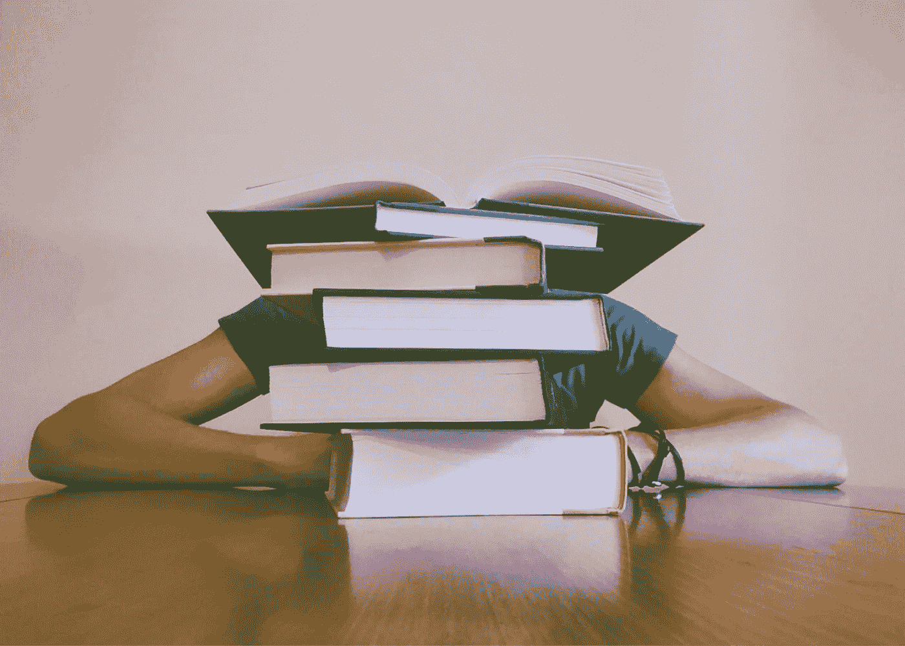

# 将这个简单的东西拨入以获得最大的生产力

> 原文：<https://medium.com/swlh/dial-this-simple-thing-in-for-maximum-productivity-2b60f77e82a0>

我真的很讨厌尽可能地从我的一天中获取更多的能量。

这并不是说我是世界上最有效率的人(我在 YouTube 上浪费的令人遗憾的时间可以证明这一点)，但是作为一个尽管患有严重的多动症，却学会了产生某种程度上稳定的内容流(每年写大约 200 万字的垃圾)的人，我偶然发现了一些管理我的一天、我的时间和我的工作的有用策略。

无论我们谈论的是时间管理应用程序、每日日志，还是定时闹钟——我已经尝试了几乎所有的生产力策略。

最后，虽然我从所有这些事情中发现了一点点好处，但我发现对我的生产力影响最大的是三件事，我把它们归类为战略，而不是战术。

它们是宏观层面的杠杆，如果运用得当，可以最大程度地提高你的生产率。

这三个杠杆都与化学有关。

不，不是 Adderol。(这对我一点帮助都没有。愚蠢的多动症。)

我说的是你身体的化学反应。

你可以利用以下三个最有效的杠杆来开始最大化你的生产力:

1.  ***健康营养***
2.  ***体育锻炼***
3.  ***优质睡眠***

*【如果你有兴趣学习如何将健康饮食和体育锻炼融入到你的生活中，你肯定会想注册我的免费电子邮件课程*[*TheHyperfocusedMind.com*](http://www.thehyperfocusedmind.com)*的五个势力范围。】*

然而，今天，我们将特别讨论睡眠的价值，以及如何建立一个有效的夜间作息规律，最大限度地利用你在枕头上度过的时光。

每个人都是不同的，但一般来说，成年人需要大约 8 小时的睡眠。然而，这是一个范围，重要的是要注意，20 出头的青少年和个人比 70 多岁的人需要更多的睡眠。

这就是年轻的好处，当你最消耗能量的器官仍在以令人精疲力竭的速度生长。

没错，你们这些十几岁的孩子需要更多的睡眠，因为每天都有大量的电路重组发生在你的大脑中。

这一点，加上更高的新陈代谢，意味着 20 岁的人所需的睡眠时间与 50 多岁的人完全不同。

所有这些都是为了说明，对于每个人每晚应该睡多长时间，并没有硬性规定。然而，一个好的经验法则是每天 6-9 小时。

当然，有些人在不到 6 小时的时间里也能正常工作，但是长期睡眠不足会不可避免地导致认知能力下降。

记住这一点很重要，因为许多专家坚持认为每个人都应该在早上 5 点起床，以充分利用一天的时间。

碰巧的是，我*确实在大多数早上 5 点醒来，但是我花了多年的努力才使这成为可能。*

更重要的是，我实际上并没有少睡，我只是睡得更早了。

我这样做是因为我发现我的创造性大脑在清晨工作得最好。(我的逻辑大脑，没有那么多，但这很好，因为上午是我创作的时间，而下午是更多的分析时间。)

*如果你想最大限度地提高生产率，找出你最佳工作时间是至关重要的。*

如果你是一个夜猫子，那么尽你所能，熬夜工作。不要因为专家们建议早起，就陷入早起的常规。

发挥你独特的优势。

简而言之，这是大多数孩子高中生活如此艰辛的原因之一。总的来说，青少年倾向于夜间活动。事实上，我们期望他们早早醒来，在他们的身体只想睡觉的时候进行最艰难的思考，这是美国教育制度的一大缺陷。但那是另一篇文章了。)

修改你的时间表。

通过在不同的时间睡觉和醒来来做实验。看看什么有用，什么没用。

也许你会偶然发现一些你以前从未怀疑过的事情。(也许你真的*做*毕竟喜欢早起！)

好了，一旦你知道了什么时候你的大脑和身体工作得最好，是时候围绕睡眠行为创造一些仪式和惯例了。

为什么？

因为很难一下子就关掉你的大脑。

我们中的大多数人都不能立刻把工作放在一边，然后去睡觉。

有些人可以，但他们几乎不是人。

我们其余的人必须为睡眠的行为准备好我们的身心。

这可以通过各种方式实现，最终通往睡眠涅磐的道路会因每个人独特的想法而不同。

有几件重要的事情需要删除:

## **睡前 30 分钟内不要使用电子产品**

在这一点上，众所周知，你的电脑和电视发出的独特波长的光正在刺激你的大脑，使其难以关闭。

再加上电脑和电视是令人眼花缭乱、像素化娱乐的成熟领域，所以这出现在睡前要避免的事情清单上也就不足为奇了。

不要在电脑上玩了，去看书吧。

最好是放松的。避免任何可能让你熬夜到深夜的东西，比如《哈利·波特 50 度》。(顺便说一下，那里有一本价值 100 万美元的书)

## **睡觉一小时内不吃东西**

我和其他人一样喜欢食物，但是睡觉前你最不需要的就是一堆未消化的披萨。

睡眠是一个恢复过程，而不是消化过程。停止向你的身体发出混合信号。

睡前喝大量的液体也是不可行的，除非你不介意在夜里醒来三次去尿尿。但是，一般来说，当你撒尿的时候，你不是在睡觉。因此，每当你在夜深人静的时候拖着脚走进化妆间，你的睡眠质量就会受到影响。

## **睡前 30 分钟调暗灯光**

情绪照明是一种很好的方式，可以向你的大脑发送潜意识信号，告诉你困倦的时间即将来临。当你开始逐步消除与明亮的灯光相关的外来刺激和由此暴露的所有奇妙的娱乐事物时，你会注意到你的思想的速度和节奏自然地循环下来。

没错，你的大脑就像一台电脑。

根据刺激量的不同，想法以不同的速度在大脑中翻腾。

随着就寝时间的临近，关闭你头脑中闲置的各种程序，你的身体会得到暗示。

## **床(大部分)只是用来睡觉的**

如果你*没有睡觉，就不要躺在床上。*

不要一边吃着一碗通心粉和奶酪，一边爬在被窝里看最新的《权力的游戏》。

你需要训练你的头脑和身体把床和睡眠联系起来，而不是其他。

不要在床上玩跳棋，发出混淆的信号。

跟我重复:*床是用来睡觉的*。

除非它不是…

但那是完全不同的对话。

**保持一致**

这不仅仅是和你醒来的时间保持一致。

如果你想在一天中最大化你的身体能量和精神敏锐度，尽可能获得最大的生产力，你需要把你的**就寝时间**视为一件神圣的事情。

不要在这个问题上妥协。

早上很容易讨厌闹钟，但是嘿，至少它(通常)让你起床了。

上床并没有必然的结果。

这完全取决于你和你在入睡前几个小时所做的准备。

你必须是有意的，始终如一的。形成一种仪式，然后坚持下去。

**该睡觉了！**

如果你坚持上面列出的这些步骤，你会发现一股能量和注意力的源泉，带着你度过每一天。你会发现自己更有效率，更投入，最终更快乐。

你还在等什么？去穿上睡衣准备睡觉吧！

**感谢阅读！如果你喜欢这篇文章，帮我一个忙，拍一下**👏几次吧！

你准备好释放你的全部潜力了吗？

然后是学习五个势力范围的时候了。按照这个免费的电子邮件课程一步一步来，我会教你如何建立更牢固的关系，提高生产力，实现财务自由。

[**点击这里参加免费的五个势力范围电子邮件课程！**](http://www.thehyperfocusedmind.com/)

## 这篇文章发表在 [The Startup](https://medium.com/swlh) 上，这是 Medium 最大的创业刊物，有 297，332+人关注。

## 订阅接收[我们的头条新闻](http://growthsupply.com/the-startup-newsletter/)。

