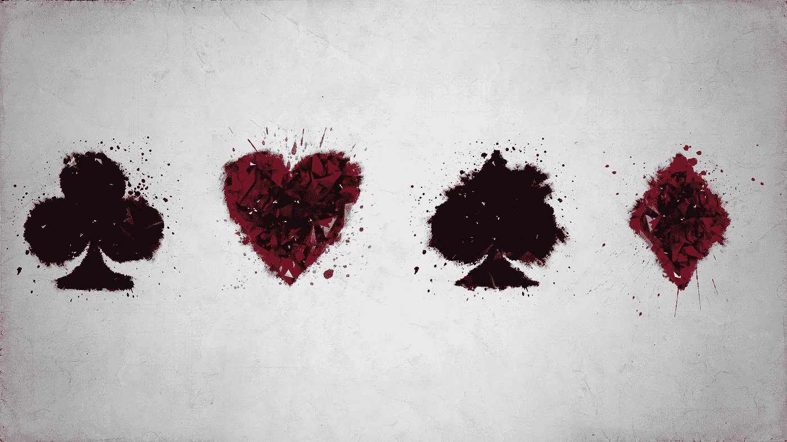
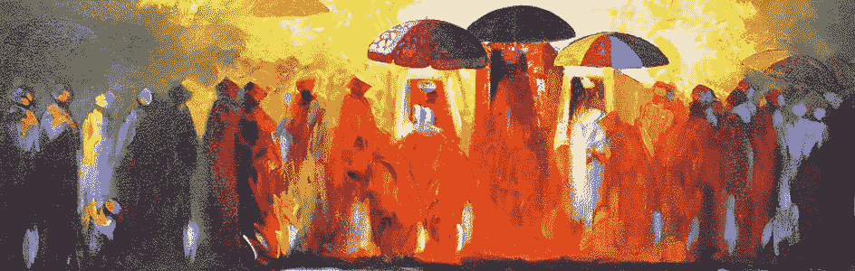

# 方块还是红心？

> 原文：<https://medium.com/swlh/diamonds-or-hearts-62c8763ad471>

## 你穿的衣服，你是谁。

在这一切之下，我们只是一群好奇的没有安全感的孩子；东奔西跑，玩变装，追逐我们的梦想和回忆，直到把自己累垮。当我们想到它的时候，它真的是一件美好的事情。但是一路上，在我们称之为“生活”的旅途中，我们有选择。我们有自由选择我们是谁，我们设计我们的生活是什么，我们将如何花费我们的时间和精力。

那么，你想成为什么样的人..你想象自己是吗？你的生活，你作为一个符号，现在和将来代表着什么？

我们今天和每天所做的选择都有助于我们自身的进化，也有助于我们成为命中注定的人。所以，选择你的西装，你的标志，你的目标，并以你自己真实的方式自豪地穿上它。

钻石

感知罕见，但审美专注的人。消费文化的一部分，也是物品和身份的伟大收藏家。如此赏心悦目，挣扎着自我价值，只被交换的市场估价。

俱乐部

连接者是万物的一部分，也是虚无的一部分，归属感中的身份认同，社会地位，以及作为“圈内”人群的认同。不是潮流引领者，而是潮流坚守者。寻找地方，在地方而不是地方；在人，而不是。

黑桃

冒险者，注意力的中心，解放了我的理性、真理和同理心。高高在上的利己主义、个人骄傲和为了地位的关注。权利至上，夸夸其谈，但缺乏行动和道德。

心

易受伤害和有同理心的人，那些超越自我控制去关心和服务的人。在他们的袖子上戴着他们情感健康和无私的力量。他们是好奇的听众，会问很多问题，是不顾个人利益做正确事情的行动者。它们是基础、灵魂、火焰，是将一切维系在一起的东西。当代的无名英雄。

很明显，我有偏见…你想成为谁？好好出牌，热爱生活。

# 设计生活

你喜欢什么？你好奇什么？你觉得什么奇怪又可爱？对人，对你周围的世界，对你自己？

你认为自己是哪种类型的人？这种类型的人身边都是些什么样的人？没人看的时候他们做什么？除了直觉和好奇心之外，不需要被任何东西询问、要求或引导？

你会向谁寻求建议？谁指导你？谁会一直挑战你，要求多一点？谁会分享几杯酒，随机的夜晚，创造一些有意义的东西？在你的余生中，这个人会是谁？

你会读什么书，听什么音乐，看什么节目，听什么演讲，一遍又一遍地重复？你将围绕什么来构建你的生活？什么是重要的？这将如何改变？

你会在哪里度过你的白天、晚上、周末、时间和注意力？你会把它花在什么地方？给谁？放向？那你会和谁一起过呢？

对于你一生在知识、人际关系和经验方面所取得的成就和积累，你会用它来做什么呢？你将如何偿还它？你以后会留下什么样的印象呢？

这些有什么关系呢？

你什么时候开始？

# 今天的垃圾想法

因为我可以。计划很简单。授权给你所服务的人去做他们最好的工作，成为他们最好的人。为他们服务。

我们喜欢怜悯-关注

当我们醒来并为自己感到难过时…我的假设是，我们喜欢在自己的怜悯和自我厌恶中打滚和受苦，即使只有很短的一段时间，当我们独处时，但肯定其他人比其他人更外在和更经常地表达这一点。我们在阻止自己，让自己经历一些令人愉快的事件、感觉和能量冲击，这些存在是为了让我们时时刻刻保持平衡。打破枷锁，让自己自由，去做点什么。

失败不存在

当我们定义并浪漫化“失败”在获得洞察力和经验方面的价值时，它根本不是失败。这些显然是微观上的失败，但实际上更多的是宏观上的成功。真正的失败，是可怕的，令人害怕的；如果它存在的话。我看到的唯一失败是生活的失败。失败，就是生活。

愿景板很漂亮

愿景板是提醒自己想要消费和收藏的欲望的好方法。追随好奇心是一种很好的生活方式。它们看起来很美，让人沉迷其中，所以我想这还是有一些优点的。如果真的是优先事项，如果你真的在乎，你不需要提醒。活下去。我没有太多时间，但我喜欢好好利用我拥有的时间。

给他们想要的故事

给他们一个他们能找到安全、保障和稳定的故事，他们会欣然接受。他们会接受它，无意识地坐下来适应它，自然地将自己包裹在故事中。

投资于“如何”

专业人士掌握“如何做”，把“做什么”和“为什么”留给灵感之神，不施加压力，而是尊重他们，让他们工作，而她则专注于自己的工作。投资你的事业，投资你自己。祝你好运。

## 这个故事发表在 [The Startup](https://medium.com/swlh) 上，这是 Medium 最大的企业家出版物，拥有 285，454+人。

## 订阅接收[我们的头条新闻](http://growthsupply.com/the-startup-newsletter/)。

