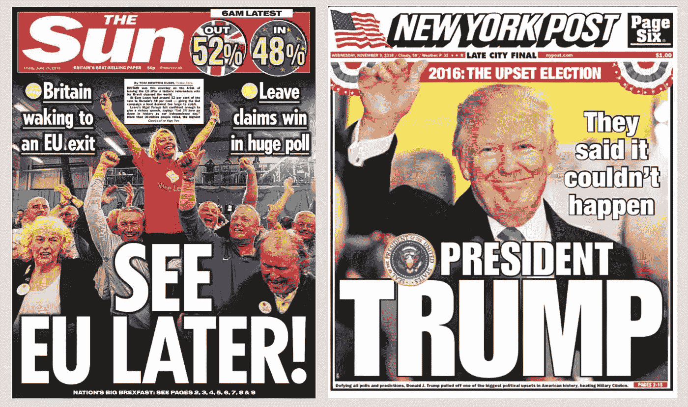
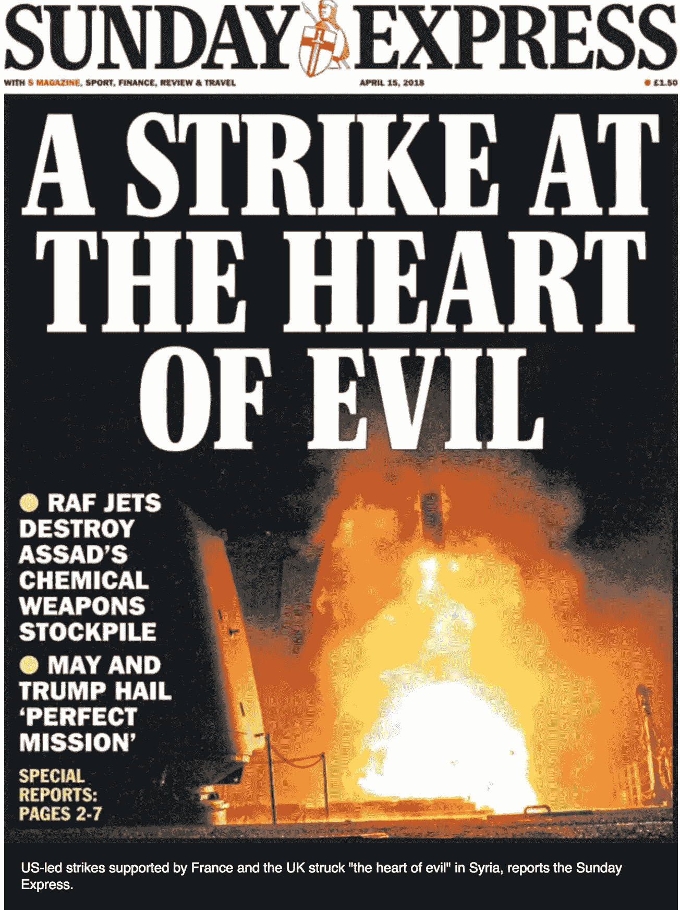
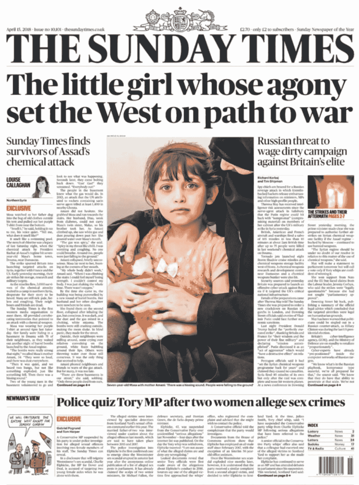

# 一位前银行家的日记:过滤泡沫及其重要性

> 原文：<https://medium.com/swlh/diary-of-an-ex-banker-filter-bubbles-and-why-they-matter-5f1ae2f68e18>

回到 2016 年，随着川普的当选和英国退出欧盟公投结果，我第一次对过滤泡沫感兴趣，它们如何影响我们的生活，以及我们如何刺破它们。这让我走上了设立[六个问题](http://jsixq.com/)的道路。

那时，我住在伦敦市中心，为一家投资银行工作。我清楚地记得英国退出欧盟投票后的第二天早上，我走进办公室，看到我的同事们双眼模糊，难以置信地走来走去。在这个城市的许多酒吧里，很少有其他话题可聊！

# **什么是“过滤泡沫”？**

那么到底什么是“过滤泡沫”。

维基百科对一的定义是:

“… *当网站算法根据用户的信息，如位置、过去的点击行为和搜索历史，有选择地猜测用户希望看到什么信息时，个性化搜索可能导致的一种智力隔离状态。结果，用户与不同意他们观点的信息分离，有效地将他们隔离在他们自己的文化或意识形态泡沫中。*

“过滤泡沫”一词第一次引起我们的注意是在 2011 年左右，当时伊莱·帕里泽出版了一本书**“过滤泡沫:互联网对你隐瞒了什么”**。

帕里泽举了两个朋友的例子，2010 年春天，当深水地平线钻井平台仍在向墨西哥湾漏油时，他让他们用谷歌搜索“BP”。

两位朋友的相似之处在于，她们都是“生活在(美国)东北部的受过教育的左倾白人女性”。然而，一个朋友看到的搜索结果是英国石油公司的投资新闻，却没有提到石油泄漏。相反，另一个朋友看到了新闻，结果的第一页有石油泄漏故事的链接。一个朋友有 1.8 亿条搜索结果，而另一个只有 1.39 亿条。

所以，帕里泽告诉我们，谷歌正在过滤或个性化结果，以反映每个人的兴趣。他认为这造成了一个泡沫，用户很少接触到矛盾的观点，导致用户在智力上被孤立。

当然，过滤和个性化不是秘密。早在 2009 年，谷歌就宣布将根据 57 个信号，如位置和搜索历史，为每个人提供个性化的搜索结果。

关于过滤的程度和影响存在一些争论，但即使是 2015 年脸书资助的一项研究也得出结论:

“*由于算法排名，人们在新闻提要中遇到的交叉内容(跨越意识形态界限的内容)减少了大约 15%*…”

# **过滤气泡并不新鲜**

但是过滤泡沫并不新鲜。

我们总是选择看哪份报纸或者和谁出去玩。

我很高兴地承认，我生长在一个每天都有《T2 每日快报》投递的家庭。为什么？因为这反映了我父亲对世界的看法。现在，很明显，*每日快报*选择 1)它刊登的故事和 2)它如何报道这些故事。通过选择阅读一份特定的报纸，你就选择了你希望透过哪种有色眼镜来看这个世界。

我随便谷歌了一下“狗狗每日快报”，第一条新闻是:

文章开头写道:“*这名 20 多岁的男子——只知道他叫尼古拉——告诉警察，在他的祖国哈萨克斯坦，捕捉并吃掉这些狗是很正常的事情*。”

我已经可以看到我的父亲在早餐桌上摇着头，表情混杂着开心和厌恶。

当然，阅读特定的报纸只是我父亲创造自己的泡沫的一种方式。他热衷于运动，是当地板球俱乐部的活跃成员。他加入主要是为了使用他们的壁球场，在后来的生活中，玩碗。

他一周会去几次俱乐部，打完壁球后会花一两个小时在酒吧和其他会员聊天，分享笑话和故事。现在，虽然他会遇到各种各样的人，但这是另一个泡沫，一个显然已经被过滤的泡沫。

其他成员是谁？他们是如何被过滤的？

- **第一次过滤**:首先，这是一个*当地的*体育俱乐部，所以会员大部分来自当地。由于俱乐部位于萨里郡，我父亲不太可能听到英格兰中部或北部任何人的观点，更不用说苏格兰、威尔士或北爱尔兰了。

- **第二层过滤**:体育俱乐部的会员资格主要会吸引从事体育运动和对体育感兴趣的人。

- **第三层过滤**:有年费，所以你需要一定的收入水平才能成为会员。

- **第四重过滤**:也许最重的过滤是这样一个事实，加入你必须由两个现有成员提名，并由一个成员委员会批准。

不足为奇的是，会员大多是白人中产阶级男性。

# **我们应该担心滤镜气泡吗？**

你阅读的报纸和加入的俱乐部只是互联网出现之前过滤泡沫的两个例子。那么，如果过滤泡沫不是什么新鲜事，我们应该担心吗？

是的。

即使你认为脸书和谷歌等公司制造的过滤泡沫完全是良性的，完全是为了我们的利益而制造的，旨在尝试个性化和改善我们的用户体验，我认为也有一些令人担忧的原因。

再以报纸为例。

如果我想看报纸，我可以去商店选一份。我知道内容的类型和任何政治派别。我知道《卫报》、*、《每日电讯报》*或《T4 每日镜报》和《每日邮报》*很可能会报道不同的故事。它是透明的，这是我的选择。对于脸书和谷歌，他们正在为我做出选择，现在还不完全清楚是基于什么。我也不知道还有什么其他选择。*

*以最近美国、英国和法国对叙利亚的导弹袭击为例。尽管《星期日快报》和《星期日镜报》使用了相同的照片，但从标题上看，他们显然对这个故事有不同的理解。《星期日泰晤士报》似乎从一个非常不同的角度看待这个故事。*

******

*好处是我可以选择买哪份报纸。一个典型的商店可能有六种不同的存货。但是，想象一下报刊亭只卖*每日快报*和*每日邮报*？这相当于脸书只在我的新闻提要中显示某些故事，或者谷歌只给出某些搜索结果。虽然我在逛商店时会意识到缺乏选择，但在社交媒体或搜索引擎上却不是这样。*

*我是一个习惯性的人，很可能我会选择我的常规报纸。如果是我父亲，不管头条新闻是什么，他都会上《星期日快报》。这也是脸书和谷歌在过滤和个性化时所依赖的。他们在观察你的偏好和选择，并从你过去的行为中推断出你喜欢什么。引用同一个脸书资助的调查:*

*用户在新闻订阅源中看到故事的顺序取决于许多因素，包括用户访问脸书的频率，他们与某些朋友的互动程度，以及用户在过去点击新闻订阅源中某些网站链接的频率*

*但是现实世界和通过社交媒体看到的世界之间的重要区别是，有一天我父亲可能会决定他已经受够了《每日快报》,或者可能只是《每日镜报》头版上的一个特定故事吸引了他的注意力，所以他换了一个频道。如果脸书或谷歌过滤掉《每日镜报》，这是不可能的。你不能选择不存在或者你不知道的东西。*

# ***社交媒体和搜索引擎增加了另一层过滤功能***

**

*即使社交媒体和搜索引擎只是在边缘过滤，重要的是它们增加了另一个层次的过滤。*

*它们强化并扩大了我们现有的偏好和偏见。*

*让我们以我父亲坐在当地板球俱乐部的酒吧里为例。正如我们所展示的，他要接触的人是经过严格过滤的。*

*想象一下，社交媒体或搜索引擎被加入其中。这就相当于在酒吧门口有一个门卫。看门人会阻止我父亲几个月没见过的人或见过但对他们的谈话不感兴趣的人进来(如果 ***不喜欢*** 或 ***与其他成员分享*** 他们的故事或笑话)。*

*虽然我的父亲很可能知道门卫的存在，并可以请他离开，但搜索引擎和社交媒体却不是这样。*

# ***结论***

*我们都生活在过滤泡沫中。*

**

*Photo by [Daniel Hansen](https://unsplash.com/photos/VFSy8iXlHP4?utm_source=unsplash&utm_medium=referral&utm_content=creditCopyText) on [Unsplash](https://unsplash.com/search/photos/bubbles?utm_source=unsplash&utm_medium=referral&utm_content=creditCopyText)*

*有些是我们主动选择的，而有些只是我们生活方式的副作用，比如我们居住的地区或工作的地方。*

*过滤泡沫不是什么新鲜事，也不是互联网发明的东西。*

*然而，随着社交媒体和搜索引擎试图帮助我们理解这个世界和我们不断接触到的大量数据，它们增加了更深一层的过滤。*

*问题是，我们可能没有意识到过滤正在发生，不清楚它是如何工作的，我们也不能轻易控制它。*

*如果过滤是 100%,那就很明显了。事实上，它只是在边缘，可能会删除 15%的我们会看到脸书，使其更难检测。这才是真正的危险。你可能相信你正被展示一个平衡的世界观，但事实并非如此。当然，搜索引擎的情况可能会更糟。不可能知道你没有看到什么搜索结果！*

*即使我们持完全积极的观点，这些全球公司总是以我们的最佳利益为中心运营，简单的事实是，我们看到的东西是在未经我们同意或控制的情况下被过滤的。他们是看门人，但他们是看不见的，基本上是不负责任的。*

*如果我们认为谷歌或脸书这样的公司不太好，那么情况可能会糟糕得多。他们有能力过滤、限制和控制我们看到的东西。或者，用“C”字来说，充当审查者。《剑桥分析》让我们看到了我们所有人被社交媒体操纵的可能性。*

*当然，有人可能会说，我们不必使用谷歌或脸书或类似的网站。但我认为这是天真的表现。对于工业化世界的大多数人来说，社交媒体和搜索引擎已经成为了公用事业。它们融入了我们的日常生活，就像让我们的房子接上自来水和电一样重要。我们可以脱离电网生活，但很少有人会选择这样做。*

**原载于*【www.jsixq.com】*

# **感谢阅读！**

# **如果你喜欢这篇博文，请点击下面的按钮👏去帮助别人找到它！**

****

## **这篇文章发表在 [The Startup](https://medium.com/swlh) 上，这是 Medium 最大的创业刊物，有 319，583+人关注。**

## **订阅接收[我们的头条新闻](http://growthsupply.com/the-startup-newsletter/)。**

****