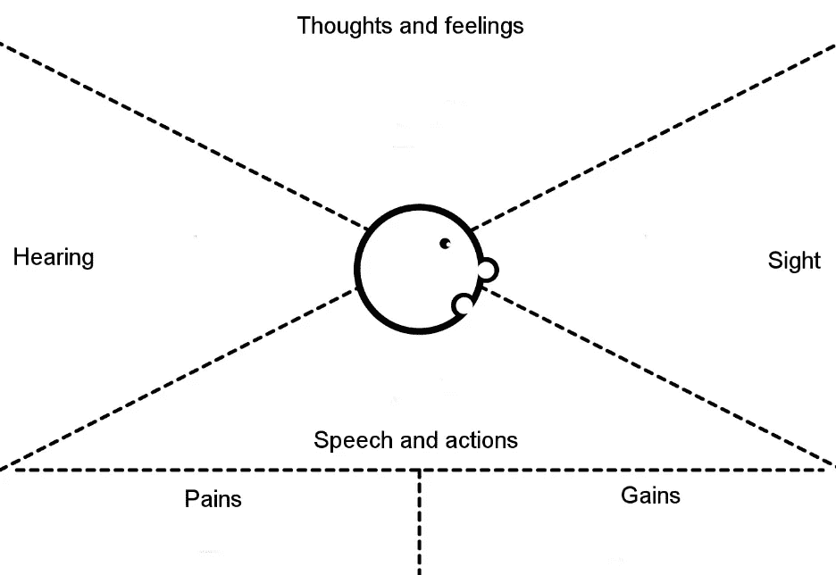
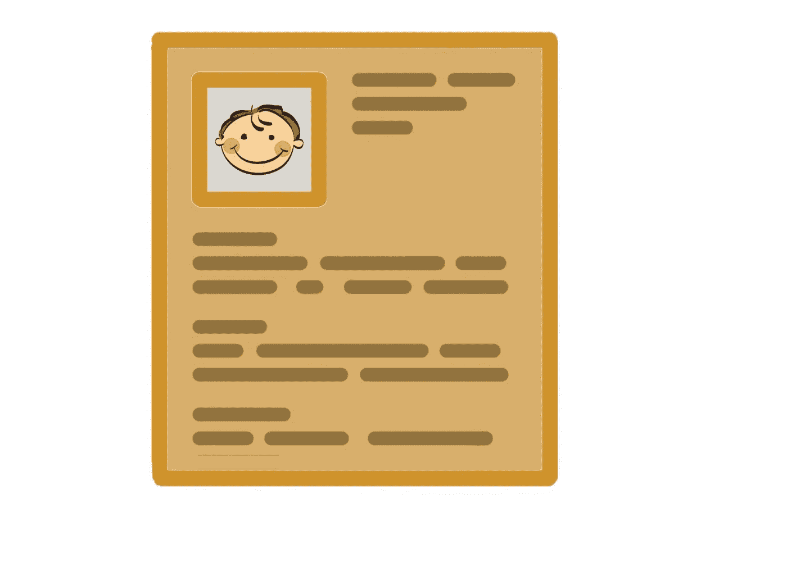
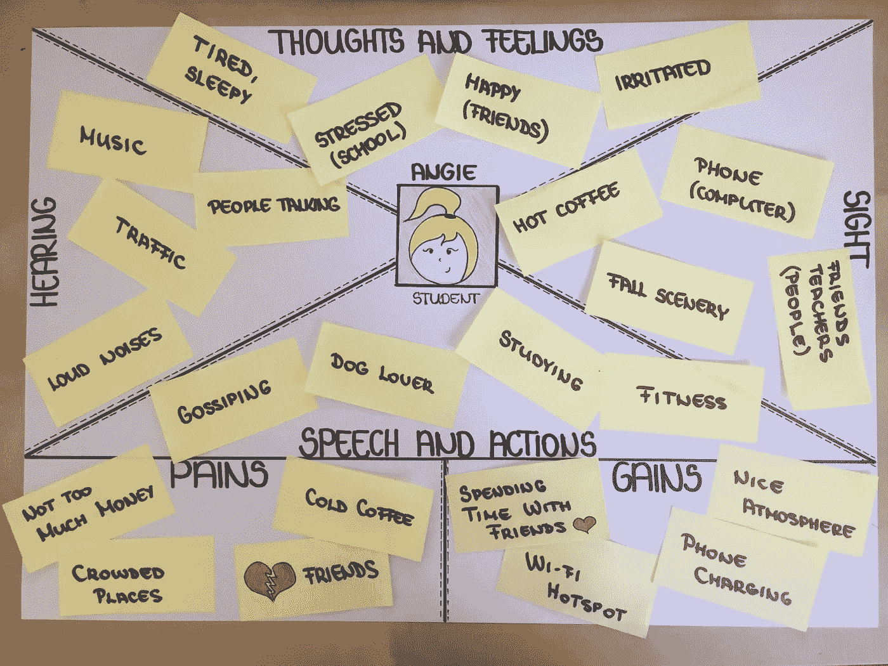

# 你知道安吉能像变魔术一样增加你的收入吗？

> 原文：<https://medium.com/swlh/did-you-know-that-angie-could-increase-your-income-like-magic-66c1795a0a83>

但是谁@#%!安吉呢。！如果你是一名 UX 设计师，我相信你一定很熟悉“ **persona** ”这个词。但是其他人呢？你真的知道为什么*人物角色*是不可或缺的，以及它们能如何帮助你吗？也许这个例子会帮助你理解这个概念以及**如何将它应用到你自己的业务中。**

## 什么是人物角色？我不会说西班牙语。

UX 设计师的工作基本上是从创造人物角色开始的。没有他们，开始任何事情都没有多大用处。

人物角色是一种虚构的顾客类型，他们会使用你的产品，他们用自己的故事和背景代表潜在的消费者。你的角色越可信，你的机会就越大。

我相信你们大多数人都熟悉流行的模拟游戏:**模拟人生**。这款视频游戏的目标是创造虚拟人，把他们放进房子里，帮助他们实现他们的梦想，过他们的生活。

到本文结束时，你会意识到创建 sim 卡与创建人物角色非常相似。在模拟人生中，你必须决定给定模拟人生的性别、生命阶段、外貌和特征。设计一个人物角色与此非常相似。

## 人物角色也会帮助你公司的团队

给定的角色将帮助你**避免团队成员之间的潜在冲突**。作为人类，我们倾向于关注自己的需求，而不是用户的需求。使用这种方法，个人的意见不再重要，重点是人物角色的目标。

在人物角色的设计过程中，整个团队必须合作。保持客观是关键，一个人很难做到这一点。

**注意**:最理性的侧写来自**实地研究**，这些构成了最真实的人物角色。

## 你需要多少个角色？

通常设计 **2 或 3 个人物角色**就够了。一定不能太多，因为如果有**没用的**，还不如根本不创造。为什么你要把钱和时间花在你不打算用的东西上呢？

经常被称为 Visual Basic 之父的艾兰·库伯强调，我们必须关注我们的**主要角色**，这样我们才能最大程度地满足他，让我们的**次要角色**快乐。一方面，我们不应该认为我们必须取悦每个人，因为最终，我们可能不会取悦任何人。

另一方面，你不应该给你的用户定型，**过度简化**也会毁掉整个工作。

# 不同类型的人物角色

根据艾兰·库伯的观点，人物角色可以分为三种类型:

## 营销角色

这是一种唯物主义的方法，创作者专注于回答什么问题，而不是为什么问题。**他们获得人口统计数据、购物偏好、动机、关注点和媒体习惯。**一个典型的例子是:20-30 岁的美国公民，列出他们的相关行为。

这对于确定**客户类型**非常有用，但除此之外就没什么用了。
它不会告诉我们任何关于他们如何使用给定产品的信息，他们会欣赏哪些功能，他们真正想从我们的产品中获得什么。

## 原型人物

如果你很急**并且完全没有钱**花在创造你自己的人物角色上，你可以有原型人物角色，由**二级研究**提供。顾名思义，这些工作就像原型一样。然而这种类型是三种类型中最差的，艾兰·库伯的观点是使用原型人物角色仍然是比根本不创建人物角色更好的选择。****

## **设计人物角色**

**这种类型侧重于回答**为什么**的问题，而不是什么问题。**这些包括他们的目标、行为和痛点。它们通常是由**实地调查**和**真人**的帮助下创作出来的。对于每个给定的角色，这种类型通常有一个单独的故事。有了前面提到的数据，我们可以更精确地塑造人物角色，因为**我们能够获得洞察力，实现用户的目标等。******

## **移情是关键**

**你能回忆起你最喜欢的两个**广告**吗？你知道你为什么能回忆起他们吗？最可能的解释是移情作用。 [**关于共情的医学定义**](http://www.merriam-webster.com/medical/empathy) 是:**

*****理解、意识到、敏感到并替代性地体验过去或现在的另一个人的感情、思想和经验的行为，而没有以客观明确的方式充分交流这些感情、思想和经验*****

****借助同理心，你可以创建设计人物角色。
如何？答案是**共情图**。****

## ****那么…如何使用共情地图呢？****

********

****正如你在图片中看到的，有不同的部分需要填写。为了让这张地图有用，你必须**与角色产生共鸣**并“成为”他一天，**站在他的立场上走几英里**才能真正理解他的处境。****

******命名** 给你的人物角色命名可以帮助你**容易地记住他们**并且将不同的个人资料彼此分开。****

******照片** 附上一张照片(即使只是一张草图或图画)可以帮助你**将人物角色与面孔**联系起来。****

******职业** 给角色一个职业无疑可以提高结局。由于一个人的工作占据了她生活的很大一部分，这同样适用于我们虚构的角色:它可以产生巨大的影响。****

******思想感情** 人物自己的**推测**，那些对他来说真正重要的事情，无论是正面的**还是负面的**，都很重要。记下每一条相关的信息。****

******视线** 人物角色看到的那些东西。这可以是**任何从他的角度来看被认为是重要的事情**，甚至是一个人物的家、邻居、工作环境、家人和朋友，一些美好的甚至是恼人的事情。****

******听觉**
周围的人说什么，他听什么音乐，哪些噪音激怒了他？角色的**朋友、老板和影响他们的人**可能是至关重要的一部分，这取决于角色的柔韧性。****

******言语和行为** 人物角色的行为也很重要，要尽可能详细地列出来，以便日后推测我们的客户在特定情况下会怎么做。这个部分可以包括我们的角色在公共和私人**环境**中的**活动**、**行为。******

******痛苦/挫折**
在这一步中，你列出角色的挫折，以便日后能够解决它们。这可能是一个**小挫折**，甚至是一个**大挑战**，这取决于个人档案。****

******收益/目标**
这是至关重要的一步:你必须定义人物角色的**目标**，**成就**，这些都是你的产品之后要达到的目标。****

********

> *******注意*** *:仅仅创建人物角色是不够的，如果我们创建他们并使用* ***场景*** *的话，这种方法效果最好。*****

## ****我要开一家咖啡馆，我需要人物角色吗？****

****我的朋友问我这个问题，我的回答是:**是的**，你有。让我告诉你应该怎么做。人物角色几乎总是能帮助你，而不仅仅是在开发移动应用程序这样的特殊情况下。****

*****假设你即将在市中心开一家中型咖啡店，氛围温馨，咖啡质量高，价格相对便宜。*****

****首先，你应该和你的团队坐下来进行 [**质量** **头脑风暴会议**](http://www.forbes.com/sites/susanadams/2013/03/05/4-steps-to-successful-brainstorming/) 。如果可能的话，安排更多的会议。****

****在这种特殊情况下，我建议你尽可能多地想象潜在顾客类型(当然，他们会愿意光顾你的咖啡馆)。****

****头脑风暴的主要思想是让你的**思想自由流动**。如果某人没有最好的想法(或者即使是一个愚蠢的想法)也没关系，但是如果人们害怕陈述他们的观点，结果就会被扭曲。****

****一旦没有人有更多的想法要分享，你可以开始**整理现有的想法**。记住，你不能有太多的角色，但是有一个角色就足够了。你必须**根据给定客户类型的重要性将它们组织成一个订单**。****

****例如，你想拥有一个气氛舒适的咖啡馆。这意味着你的主要客户可能不会是富有的商人。即使他们会来，他们也不会在那里聊上几个小时的工作和汽车，他们会边走边喝咖啡。****

## ****那么……谁会是你的主要客户？****

****假设最终你的团队同意拥有 **3 个角色**。您最重要的 3 种客户类型是:****

****1.学生
2。家庭主妇
3。年轻成年人****

****很多小企业主都止步于此。不要那样做！这与拥有**原型人物**或**营销人物**没有太大区别。你需要做的是创建设计人物角色。****

****下一步是准备好你的**同理心地图**、便利贴、**笔**、**咖啡和饼干**:让有趣的部分开始吧。****

****您的第一个角色将属于第一个客户类型。我们现在正在填充共情地图。****

****她是**安琪**，一名高中生**。
*【在此插入您的图像】*******

******通过这一小步，我们完成了上述 6 个步骤中的 3 个。(Angie 也可以是大学生，这取决于你自己的喜好。)******

******下一部分包括更多的**创意**。你必须当一天的 Angie，记下每一条重要的信息。之后，把它们整理好，放到共情图上。******

****她会做很多事情，但是你必须把它们分类。请记住，你不希望列出你的角色所做的每一件事，而只是列出那些可能影响你公司的事情。****

****在图中你可以看到我的**草图**，当然它可能会有所不同，但是你可以从中找到窍门，并创建你自己的具有更详细和更复杂结构的移情图。****

********

****看到了吗？没那么难。****

****下一步是创造你的**家庭主妇**(苏珊)和你的**年轻人**(彼得)。当然，它们会有所不同。****

****一旦你完成了所有的同理心地图，你就可以开始专注于**分类便笺**。你应该分成两组:一组是你能解决的，另一组是你不能解决的。不要把第二组扔掉，他们以后可能会有用。****

****我们可能解决这些问题的笔记也应该按照它的效果或者你解决它们的难易程度来排序。****

****然后你就可以专注于解决它们，从最容易的**到最难的**。****

****例如，Angie 喜欢有一个免费的 Wi-Fi 热点，喜欢和朋友一起听音乐。你可以看到这并不太难满足，但它可以有一个令人难以置信的效果。****

****说到 Wi-Fi，它不会打扰任何人，所以我们必须确保我们将它添加到列表中。在音乐方面，这就更难了，因为有些人可能不喜欢它。**你必须找到中庸之道。******

****另一方面，当安吉讨厌的男人出现时，她很生气。我想我们都同意，我们无法真正解决这个问题(除非你的咖啡馆也是一家咨询公司)。****

****将笔记分类后，仔细检查每一个笔记，看看是否有人有解决方案。如果你有**多解**，我建议把它们都写下来，选择最合适的一个。****

## ****结论****

****客户的**重要性**逐渐增加，许多成功公司的愿景和使命也依赖于此。当然还有其他重要的因素，但是你不能忘记，最终是顾客增加了你的收入。****

****记住…然而，设计一个准确的设计角色**需要一些技巧**，在某些情况下这并不比在你的电脑上创建一个 sim 卡难多少。****

*****你有什么想法或反馈吗？和我们讨论一下。
如果你喜欢这篇文章，如果你在*[*Twitter*](https://twitter.com/meli_berki)*上推荐或分享它，那对我来说就是全世界。*****

********

*****发表于* **创业、旅游癖和生活黑客******

************************

****-****