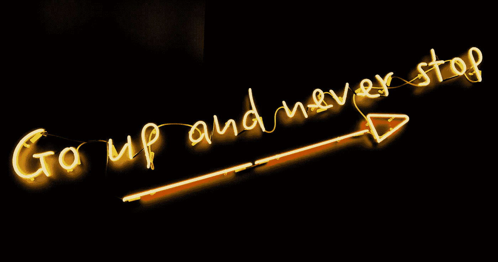
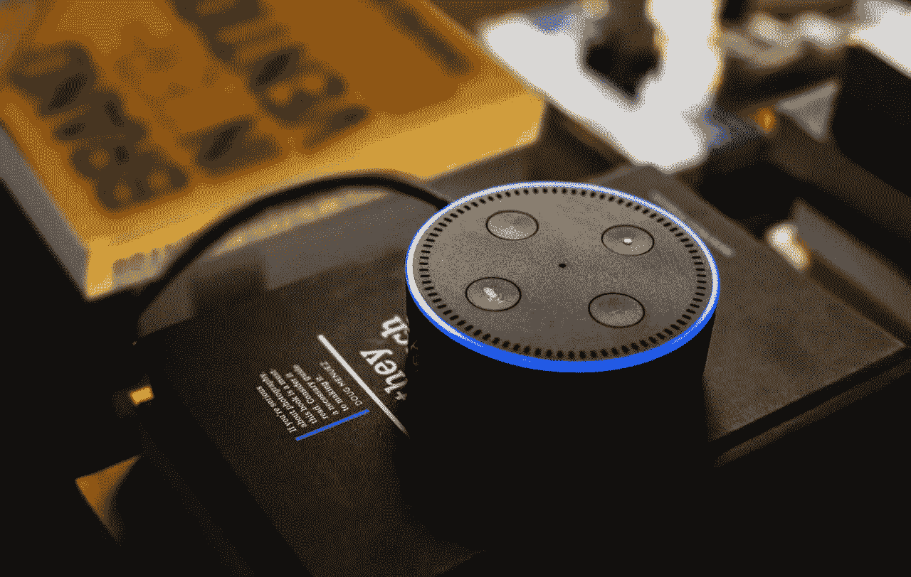

# 你的品牌失效了吗？

> 原文：<https://medium.com/swlh/did-your-brand-stop-working-999d1bf83ee4>

在今天的《周三一分钟》中，我将探讨 ***为什么品牌会退出？*** 和 ***你的品牌为什么停工了？***

让我们问一个可怕但真实的问题:为什么这么多品牌:

*   停止创新？
*   停止骄傲地销售？
*   停止生长？
*   不再忠于他们的目标？

> 在今天的节目中，我给你一个准确的工具来克服和消除这种停止的倾向，它由两个问题组成，后面跟着一个问题，“你得出了什么结论？”

无论我们谈论的是品牌、品牌表现、营销结果、公司文化、变革，还是继续在世界上留下印记，这都是我在今天的节目中所涵盖的内容。

# 那么，你的品牌为什么会失效呢？

是的，我们都有自己的特殊情况和环境原因，为什么我们后退，为什么我们退缩，为什么我们不再是自然的力量。

但这与那些东西无关，因为总会有那些外在因素。但是我们无法控制这些。冲击他们？是的。控制他们？号码

这是关于我们 ***能*** 控制什么，更重要的是， ***为什么*** 我们不再在我们的势力范围内如此相关和不可阻挡(因为 ***我们*** 和我们的决定是我们在世界上采取行动的燃料)。

这个世界需要你所能提供的东西，而 ***停止*** 则与你提供你独自能带来的东西正好相反。

需要的不仅仅是这种每周一次的“瓶中闪电”的灌输？

# 更多品牌爱情

我的 [*“品牌的下一步是什么”*](http://amzn.to/2ydjuM0) 闪电简报被列为 Alexa 关于品牌和重塑的第一技能，周一至周五为企业家、首席执行官、品牌、企业和领导者播放。

你所要做的就是在亚马逊上按下 ***启用*** ，然后你就可以享受到*数千万人可以通过他们的 Echo 设备(或装有亚马逊 Alexa 应用的 iPhones)访问的“品牌下一步”。*

*订阅，每周 5 天在家里或办公室享受这一切。*

**

## *从这篇文章中获得了价值？
然后鼓掌，分享，关注我，订阅我的 [YouTube 频道](https://www.youtube.com/user/headmusik)每周有新视频。需要一个品牌重塑或一个难忘的主题演讲人？在这里联系我[。](http://david@risingabovethenoise.com)*

**

## *这篇文章发表在《初创企业》杂志上，这是 Medium 最大的创业刊物，有 355，974 人关注。*

## *订阅接收[我们的头条](http://growthsupply.com/the-startup-newsletter/)。*

**