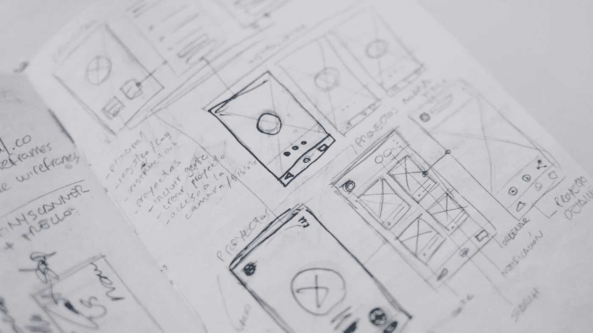
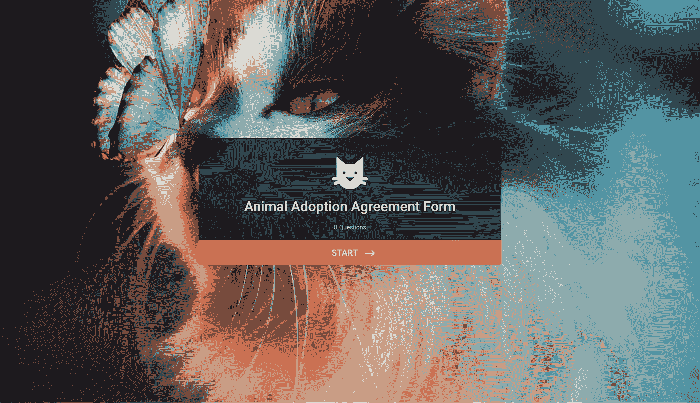
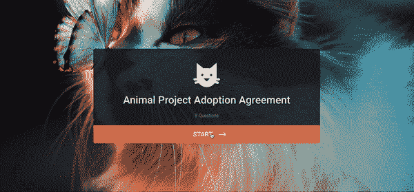
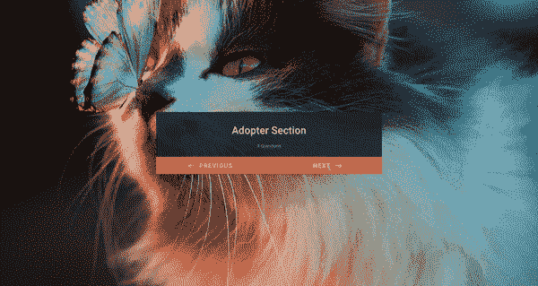
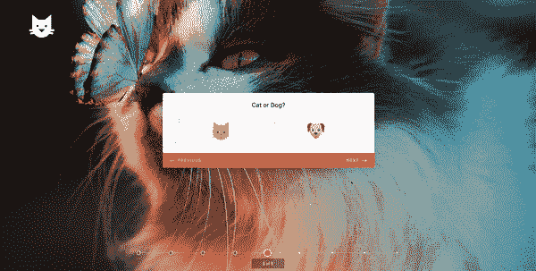

# 深入挖掘:网络表单心理学

> 原文：<https://medium.com/swlh/digging-deeper-the-psychology-of-web-forms-28b84ee1b5d7>

Originally published on [**JOTFORM.COM**](http://jotform.com)

> UX 和心理学。
> 
> 心理学和 UX。

这两者相辅相成。

心理学是理解人的行为和情绪的研究。是什么让它们滴答作响？什么让他们快乐？没有预测这些行为的能力，成功的 UX 就不可能存在。

对于未经训练的人来说，好的设计可能看起来像一系列快乐的意外。

但是每种颜色、形状、线条、字体、文本和图形都有意义。弯曲的形状代表积极的情感信息。“独一无二”的图片吸引眼球。

这些只是一些心理学原则，它们引导我们的注意力和潜意识去寻找设计师想要的位置。他们中的大多数是如此的固定，以至于我们甚至不再注意到他们。

人们很容易忽视这些原则；它们最明显的用途是在光滑的网站或高耸的广告牌上。但是通过将它们应用到你设计的每一个方面，你将获得十倍的收益。

小规模的日常设计也不应该缺少思考。[根据传奇设计师保罗·兰德](/@ZacheryNielson/the-importance-of-having-a-design-philosophy-a6fef5abbfaf)，

> “比起好的设计，公众更熟悉糟糕的设计。实际上，它习惯于选择糟糕的设计，因为这就是它的生活方式。”

[布莱恩·里德同意](https://brianreed.me/):

> “一切都是设计好的。很少有东西设计得好。”

有了心理学原理的基础知识，我们可以开始更有意识地设计，创造真正适合用户的体验。表单只是冰山一角。

让我们开始吧。

# 重要的事情先来

列出所有的设计法则和心理学原则需要一本圣经，而不是一篇博客文章。

但它们都归结为一个响亮的目的:好的 UX 让用户尽可能快、尽可能平稳地到达他们想去的地方。

用其他(更专业的)话说？他们鼓励最小化认知负荷:

> "在认知心理学中，认知负荷指的是用于工作记忆的脑力劳动总量."

高认知负荷的任务有一个陡峭的学习曲线。既费时又复杂。这就是我们放弃去吃早午餐的任务类型。

认知负荷最小的任务是简单、清晰和快速完成的。所以我们倾向于这样做。

仅此而已。这是设计的北极星。

有趣的是，设计简单的东西比设计难的东西要难得多。

正如 C.W. Ceram 所说，

> "天才就是化繁为简的能力."

审视成本与收益的心理可能是一个很好的开始。

# 成本与收益

你会在大热天跑 10 公里吗？没有吗？如果有人给你一万块让你这么做呢？

我们做出的每一个决定都要经过成本效益分析。这是一个权衡任务难度和完成任务的回报的过程。如果成本大于收益，我们倾向于不采取行动，反之亦然。

设计师的工作是确保感知的利益总是超过成本。

现在，你要不要给一个填表的奖励，就看你自己了。通常，确保用户从填表中受益的最好方法是实现他们想要的改变，不断改进你的产品，并让他们参与进来。

最终，对于每个用户来说，成本与收益是主观的，我们能影响他们的也就这么多。但是，我们能做的是 a)尽可能使内容易于理解，b)确保我们对完成表单所需的相关时间和精力保持透明。

# 该怎么办呢？

## 文本块

+1–919–555–2743.19195552743.为什么第一个数字比第二个容易记住？

因为组块。一长串单品让人应接不暇；较短系列的复合材料文章则不然。

组块是一种记忆机制。当我们把信息分成更小的组时，我们更容易处理。这就是为什么我们把银行密码和社会安全号码背得滚瓜烂熟。

你的块应该有多小？研究表明[三是神奇的数字](https://www.nytimes.com/2014/01/05/fashion/Three-Persuasion-The-Power-of-Three.html)，任何高于三的数字都会引发混乱。将文本、数字和章节分成三组或更少，用户会松一口气。

*Chunking the phone number field*

## 明确一点

用户需要他们的护照来填写你的表格吗？但愿不会，他们会花超过 10 分钟来完成吗？让他们在第一页就知道他们在做什么。如果他们中途遇到同样的信息，他们会变得不那么宽容。

复杂的密码要求？格式化规则？同样的事情。不要让你的用户玩猜谜游戏。如果某个字段需要特定类型的输入，请使其可见，或者在必要时与说明配对。

这同样适用于电话号码或信用卡的标点符号或空格等语法规则。

# 希克定律

想想你需要多长时间来选择你梦想中的意大利假期。现在，在欧洲。现在全世界。

正如巴里·施瓦茨[在《选择的悖论》中所写的那样，太多的选择会让人麻痹。希克斯法律同意。它指出，我们的决策时间与我们面临的选择数量成比例增加。我们嗯，啊，惊慌失措。我们甚至可能完全放弃这项任务。](https://www.amazon.co.uk/dp/B000TDGGVU/ref=dp-kindle-redirect?_encoding=UTF8&btkr=1)

应用于设计，希克斯定律是对刻意淘汰的赞美诗。随着设计灵活性的增加，其可用性降低。

李维·杰克逊说得好:

> “当没有什么可以添加的时候，设计就没有完成，而是当没有什么可以删除的时候。”

[说到形态设计](https://www.jotform.com/blog/build-high-converting-online-forms/)，少就是多。

# 该怎么办呢？

## 切割和提炼

那个按钮 100%必要吗？那个链接呢？文案、图像、设计特征中没有明确目的的每一个词都会降低表单的转化率。

如果不是增加了什么，就是拿走了什么。

正如汉斯·霍夫曼所说，

> "简化的能力意味着消除不必要的东西，让必要的东西说话."

如果长列表不可避免，折叠部分以减少内容的外观。将注册和结账等冗长的过程分解成小步骤。按照逻辑顺序对问题进行分组。

画出一条清晰的完成路径，然后尽可能地用提示和线索引导用户——预定义的答案和占位符文本是一个很好的起点。

如果可能的话，试着把范围缩小到每页一件重要的事情。这将认知负荷降至最低，并帮助用户更快地处理信息。在构建 JotForm 卡片时，我们采用了这种方法，使用每页一个问题的布局。

*JotForm Cards allows you to combine related fields and create sections.*

## 节省人们的时间

想想看，两个用户可以玩同一个视频游戏，但是，根据他们采取的行动，最终在完全不同的水平。

同样，两个用户对同一个表单会有截然不同的体验。假设您想要询问客户的家庭地址，但是只询问那些居住在特定邮政编码的客户。或者在满意度水平为 3*或更低的活动中的客人的联系方式。

你不希望用户费力地通过所有这些选项，是吗？

条件逻辑允许你把你的表单拼接成多条路径，或者“分支”。

因此，一个看似简单的表单在后端可能有大量的分支，这些分支只对某些用户可见。

同一题目，明确区分适用于所有人的可选和非可选字段。考虑转移“最好拥有”的问题(例如，“您是从哪里听说我们的？”)到表单完成之后。

# 双重编码理论

想到“沙滩”这个词。你的脑海中会自动浮现出蓝色的海水和白色的沙滩。很聪明，对吧？由于我们对世界的感知，我们创造了视觉，并将它们与特定的词语联系起来。

这就是双重编码理论。它表明，记忆有两个不同但相连的系统，一个用于语言信息(sea)，一个用于非语言信息(blue)。

所以，把单词和图像配对会让单词更容易被回忆起来。这就是为什么儿童书籍有插图，以帮助年轻的大脑学习联想的力量。

# 该怎么办呢？

## 用语言和视觉呈现信息

图标、意象、形状:融入任何与你要传达的内容相一致的东西。

## 让你的表格看起来很舒服

眼睛是心灵的窗户。一个表单需要快速、简单、容易，但也需要美观。

作为人类，我们习惯于认为有吸引力的设计更好，更容易使用——不管事实是否如此。美让我们更有耐心，更忠诚，甚至对设计问题更宽容。

您的调查对象是谁？企业客户？俏皮的创意？为他们设计。

*JotForm Cards with beautiful background and image choice field*

# 天赋进步效应

美国教授 Joseph C. Nunes 和 Xavier Dreze 将天赋进步效应概括为:

> “一种现象，在这种现象中，人们在朝着目标前进的过程中表现出更大的毅力。”

基本上，如果我们已经取得了进展，我们更倾向于完成任务，如果没有取得进展，我们可能会放弃。

商场发放八折优惠券鼓励我们购买。咖啡店给下一杯拿铁的邮票。这一切都是为了给顾客一个良好的开端，不管是人为的还是其他的。

# 该怎么办呢？

## 重构

错开问题，从最容易的开始，最难的到最后。用户将快速浏览初始部分，引发“条纹”效应:即快速进展的满足感，而不愿意打破条纹。

## 使用进度条

用一个进度条可视化用户进度，向他们反映他们正在前进。人们越接近自己的目标，就越有可能推动自己朝着目标前进。

*JotForm Cards’ progress bar motivates users*

## 感谢阅读。如果你喜欢这篇文章，请随意点击那个按钮👏帮助其他人找到它。

*最初发表于*[*【www.jotform.com】*](https://www.jotform.com/blog/psychology-of-web-forms/)*。*