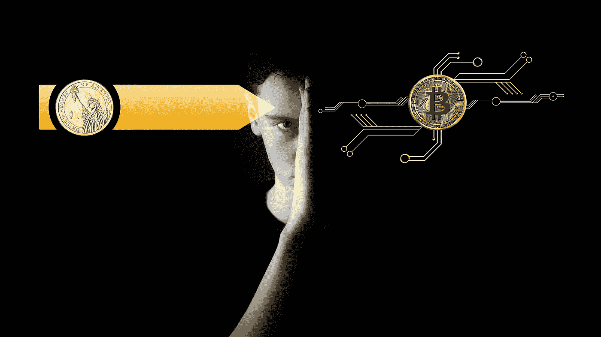

# 数字偏执狂:生存危机的现代形式

> 原文：<https://medium.com/swlh/digital-paranoia-a-case-of-existential-crisis-d2a53ec977c1>

[Source](https://pixabay.com/en/digitization-currency-bitcoin-3614384/)

一般来说，人类的条件是基于情感和道德自然而毫不费力地行动。虽然这种情况明显地将我们与地球上的同居者区分开来，并基于我们称之为“人类”的这一本质赋予我们独特的身份，但我们也可能因为这些情绪而被抑制作为一个社会的成长和进一步进化，这些情绪大多是极端的道德和自豪感，即“我们是最进化的”在起作用，掩盖了我们的坚忍能力。在这种情况下，我想起了尼采的《超人前传》。想想人类，他们有足够的情感去吸收快乐，有足够的道德去生活。我们本质上将会是高功能的生物机器人，能够过着充满效率的生活；我们会有时间和精力从对我们重要的事情中获得快乐。我想知道我们的生活会有多快乐！我们将能够脱离平庸的噪音，进入思考的快乐；我们将能够专注于创造性而不是重复性。

很长一段时间以来，至少从互联网出现以来，一直有很多关于我们如何让技术控制我们的生活的负面言论。已经有电影将这种想法传达给大众。只有当我们这样看待时，技术与人类生活的结合才是一种威胁。如果我们换个角度，把它看作一个自然的进化过程，那会怎么样呢？我们已经从任何在我们之前的物种进化而来，并且将会进化成一个更有效率的物种，我想称之为“技术智人”。那么，妄想症到底是怎么回事？这是一个生存危机的例子吗？我想是的！

在我们之前的物种可能也有同样的感觉！但是如果进化如此在意以至于抑制了我们的成长，我们就会一直过着穴居人的生活。那么，为什么我们现在要对未来的自己这样做呢？我说，让我们顺其自然吧，做任何事都有一个道德义务，那就是让生命存在，然后看看它会把我们带到哪里。未来可能没有那么糟糕，交接可能相当无缝。事实上，我会喜欢“零点击订单”——亚马逊观察我的购买模式，并交付我通常购买的牛奶，这将是惊人的，只要我可以选择毫无麻烦地将其退回，如果我选择改变我的偏好或通过改变偏好来抢占自动交付。我认为这和你的贷款账户自动还款没什么不同。我看到自己积累了如此多的节省时间，以至于我可以重新安排创造性的任务，而不是重复的世俗任务。请记住，技术是我们编程并使用它的东西。因此，我们必须不断问自己的真正问题是，这项技术是否正被用于建设性的目的，以“让别人活下去”。

# 外卖食品

人类是至少二十万年前设计的产物。但是，我们已经把我们周围的世界发展得如此复杂，以至于我们没有及时的洞察力来理解它的全部，做出决定，并采取符合我们最大利益的行动。我们必须非常傲慢地否认，我们开发的技术在处理我们周围的数据方面更好、更有效，给我们这些见解，帮助我们比我们的大脑更快地做出决定。如果技术可以帮助弥补我们的设计差距，并执行令人麻木的重复任务，为什么不让它呢？我说让我们拥抱科技，驯服它成为我们的宠物，就像一只玩捡东西游戏的狗！

如果你喜欢这本书，请鼓掌让其他人也能找到。

## 这篇文章发表在[《创业](https://medium.com/swlh)》上，这是 Medium 最大的创业刊物，有+ 371，663 人关注。

## 订阅接收[我们的头条新闻](http://growthsupply.com/the-startup-newsletter/)。

