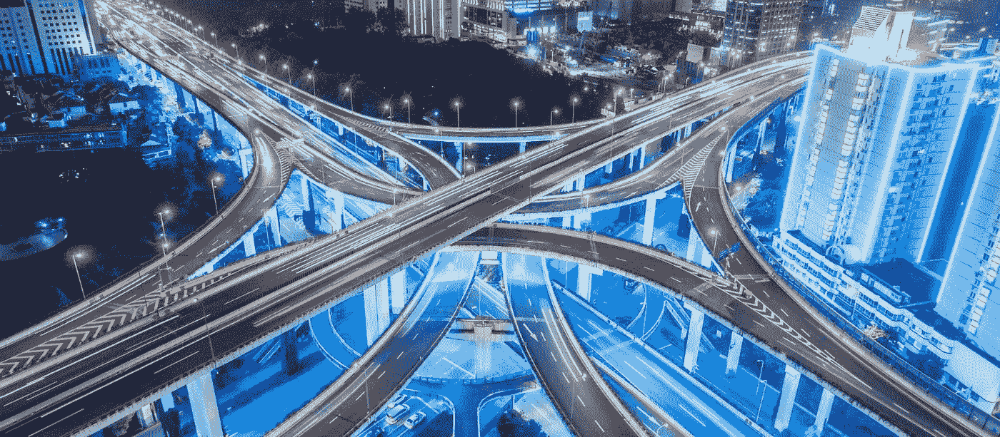
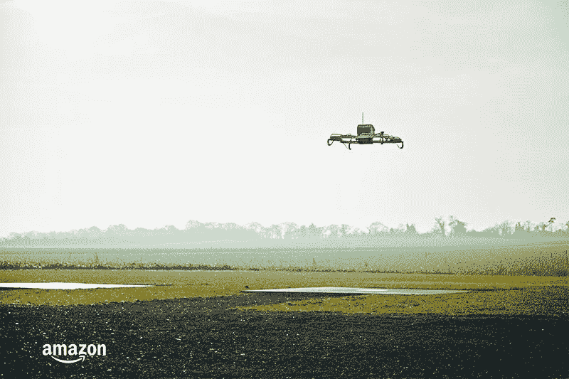
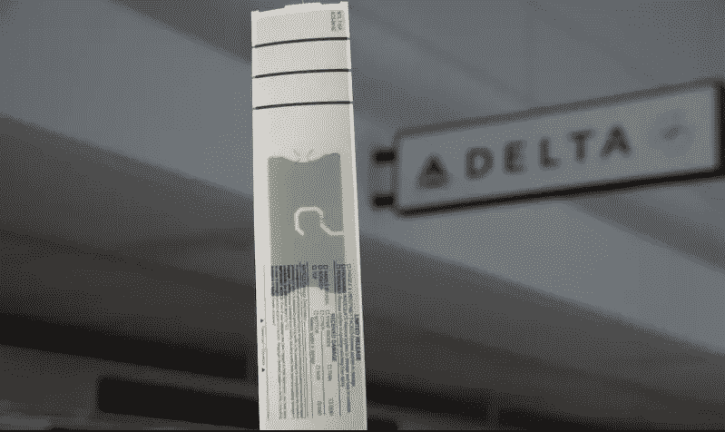

# 数字化转型故事:UPS、亚马逊、JD.com、达美和马士基如何改变运输和物流行业

> 原文：<https://medium.com/swlh/digital-transformation-stories-how-ups-amazon-jd-com-4f70dda05462>

企业必须始终分析他们运营的方式以及与客户互动的方式，以保持运营。虽然升级的方法不同，但目标是相同的:更高效，同时消耗更少的资源。

运输公司可以通过物流管理来实现这一目标。这种做法通常需要为货物运输选择合适的供应商，并选择最佳的交付方式。商业参与者还评估最有效的运输路线，并部署最新的 IT 解决方案来处理内部运营。

路线优化是物流管理的组成部分之一。基于对 GPS 和在线地图数据的分析，它可以帮助运输企业确保燃油效率并提高运输速度。

本文描述了企业如何通过重组货物交付、开发物联网(IoT)解决方案以及为客户和供应商实现服务预订和合作工作流的现代化来提高绩效。

# 联合包裹服务公司(UPS)的道路综合优化和导航(ORION)研究项目

美国包裹递送公司和供应链解决方案提供商 UPS 站在技术发展的前沿，这解释了它一个多世纪以来令人印象深刻的市场地位。

该公司的全球地面递送量为每天 2000 万个包裹和文件。UPS 的官方数据显示，他们的全国地面递送量约占全球总量的 50%。UPS 员工每个工作日都会进行大约 100 次递送停留。可以理解的是，该公司正在寻找方法，为司机提供距离、时间和油耗方面最高效的送货路线。2003 年，它开始开发[猎户座](https://www.pressroom.ups.com/pressroom/ContentDetailsViewer.page?ConceptType=Factsheets&id=1426321616277-282)，一个路线优化系统。

五年后，该公司在送货卡车上安装了 GPS 跟踪设备和车辆传感器，以收集和分析与车辆路线、车辆利用率和驾驶员行为相关的数据。来自司机移动设备的数据也被研究。UPS 领导层的目标是确定“可以提高效率的地方”

猎户座的第一次重大部署是在 2013 年，截至 2016 年底，该系统已经完成。

基于一个大约 1000 页长的复杂算法，该系统分析大量的历史和实时数据，以评估司机的最佳路线。这些数据包括当天的包裹交付、以前的路线表现、接送需求、接送时间、交通和其他指标。从 UPS 员工的角度来看，ORION 是 GPS 的更好版本，因为它使用的数据是根据他们的需求定制的。

ORION 使该公司每年的油耗降低到 1000 万加仑，这大约节省了 5000 万美元。另一个积极的影响是节省燃料也减少了二氧化碳的排放，这是他们的汽车臭名昭著的原因。

# 中国电子商务巨头 JD.com 和亚马逊的无人机送货计划

2016 年，一家中国电子商务公司[JD.com](http://www.jd.com/)推出了一款无人机送货系统，该系统于 2015 年 10 月开始开发。

JD.com 在光棍节开始测试运送包裹的无人机。这是世界上最大的在线购物节，2017 年销售额达到 254 亿美元，将美国黑色星期五和网络星期一的销售额远远甩在后面。

北京、江苏、陕西和四川以外的农村地区开设了四个无人机基地，让当地居民有机会加入全球购物活动。该公司还雇佣了近 30 万名“乡村促销员”来简化和加快运输。他们从地区配送站接受订单，并直接配送给客户。

JD [拥有](http://www.scmp.com/tech/china-tech/article/2045583/drones-take-flight-singles-day)30 多架无人机，可以在长达 31 英里(50 公里)的距离内运输重量从 5 磅到 33 磅(15 公斤)的包裹。

*One of JD drones in action*

这家电子商务巨头在政府，特别是国家航空局的推动下，继续开发其无人机送货计划。

今年早些时候，中国民航局根据国家试点计划，允许大规模试验送货无人机。该项目将在中国北部的陕西省实施，包括建设云计算中心和无人机中心等设施。JD [还将开发](http://www.scmp.com/business/china-business/article/2095259/e-commerce-giant-jdcom-let-drones-do-heavy-lifting-chinas)一个 300 公里的低空无人机物流网络，拥有数百条航线，并制造能够携带超过 1 公吨或 2204.62 磅的重型无人机。

京东副总裁肖军表示，这家在线零售商计划在两年内制定这种配送标准。

在二月份达沃斯世界经济论坛上，首席执行官刘强东[透露](https://www.chinamoneynetwork.com/2018/02/05/jd-com-gains-approval-chinas-civil-aviation-administration-test-delivery-drones-shanxi-province)该公司计划在全国建立一个拥有超过 10，000 个无人机机场的无人机网络。这些措施将使[的成本降低 70%](http://www.businessinsider.com/chinese-online-retailer-is-building-200-drone-airports-rural-china-2017-12)，并帮助在 24 小时内将包裹送到中国的任何地方。

刘强东还指出，该公司的目标是通过在四川省建设 185 个机场，将服务扩展到农村地区。

美国比中国落后一步，在中国，无人机送货计划没有遇到监管障碍。然而，像亚马逊这样的公司希望获得美国联邦航空管理局(FAA)的批准，这样亚马逊就可以在 2019 年前提供新的空中交付[。](https://dronedj.com/2018/03/14/amazons-prime-air-drone-delivery/)

亚马逊在 2016 年 12 月报道了一项[包裹递送试验](https://www.theguardian.com/technology/2016/dec/14/amazon-claims-first-successful-prime-air-drone-delivery)，三年前它首次宣布计划开发亚马逊 Prime Air 递送系统。一架自动化无人机花了 13 分钟将“电视流媒体棒和一袋爆米花”送到住在英国剑桥零售商 depot 附近的顾客手中。

*The company tests a package-carrying drone in the countryside.*

一架无人机可以运送重达 5 磅(2.26 千克)的包裹，这是公司客户交付量的 86%的平均重量。

该零售商声称无人机送货为客户服务增强和成本降低带来了巨大的机会。目标运输成本为 1 美元，交付时间为 30 分钟或更短，这一声明听起来很合理。[感应和规避技术](http://technology.aerialmob.com/index.php/suas-integration/sense-and-avoid/)和冗余(备用)组件确保包裹和无人机的安全。

# 达美航空的射频识别(RFID)行李追踪技术

对于每年拥有数千万客户群的公司来说，让他们的每一个客户感觉到他或她是个人关注的接受者尤为重要。2016 年 [Sabre 和福布斯](http://www.ascendforairlines.com/2017-issue-no-2/competitive-airline)调查的 100 家航空公司的高管优先考虑客户体验。例如，61%的人认为这是主要的品牌承诺。反过来，52%的受访者指出过时的 IT 基础架构是改善客户体验的一个障碍。

美国第二大航空公司达美航空公司[在今年由*快公司*杂志评选的最具创新力旅游公司](https://news.delta.com/delta-named-among-fast-company-s-most-innovative-companies-2018)中排名第六。该航空公司旨在利用机场经验的技术解决方案解释了高评级的原因。

这家每年处理 1.2 亿件行李的航空公司是美国首家在 2016 年引入改变游戏规则的射频识别(RFID)行李跟踪技术的航空公司。该程序已经取代了条形码手动扫描，并允许乘客实时跟踪他们行李的位置，而不必输入跟踪号码。

2017 年，该技术在全球部署。该航空公司在全球 344 个地点安装了 4600 多台扫描仪，并在行李标签中嵌入了 3800 多个 RFID 芯片。

*Delta bag tag with embedded RFID chip*

5000 万美元的投资对每个人都有好处。首先，技术简化了行李搬运工的工作:带式装载机装有传感器，如果行李被装上正确的飞机，传感器就会显示绿灯。其次，RFID 节省了航空公司以前因行李丢失或处理不当而花费在赔偿上的钱。最后，顾客对他们的行李感到安全。达美航空的应用程序[向智能手机发送关于行李当前位置的推送通知](https://news.delta.com/fly-delta-app-push-notifications-take-stress-out-checking-bag)。

有了 RFID，航空公司追踪行李的成功率高达 99.9%。

国际航空运输协会(IATA)和航空运输业 IT 提供商 SITA [在 2016 年进行的一项研究显示](http://www.iata.org/pressroom/pr/Pages/2016-10-19-01.aspx)到 2022 年，RFID 技术的部署可以将误处理行李的数量减少 25%。高效的行李跟踪还可以帮助航空运输业在未来七年节省超过 30 亿美元。

# 集装箱航运公司马士基的创新之路

与上述电子商务或航空运输等行业不同，长期以来，全球货运一直是创新的局外人。即使在今天，一些公司仍以老派的方式运作，做大量的文书工作，管理没有安装传感器的船只。

当然，也有例外。丹麦公司 Maersk 是自 1904 年以来运营的世界上最大的集装箱运输公司，它专注于使用数字技术来保持其在行业内的领先地位。马士基每年用 630 艘船运输 1200 万个集装箱，占全球集装箱船队的 18.7%。

据公司领导称，虽然如此庞大的车队提供了有益的可扩展性，但它需要数据驱动的维护。

为了确保盈利，马士基和其他集装箱航运公司还必须应对其他挑战。该行业增长缓慢:2016 年，12 家全球公司中有 11 家宣布大幅亏损。跨国公司倾向于在当地建立工厂，以节省长途运输费用，这使得企业赚取收入的机会更少。货运公司也在与产能过剩作斗争，因为实际供应比需求多 20%。例如，马士基专家[发现](http://www.dcvelocity.com/articles/20161024-big-data-analytics-could-be-a-welcome-tonic-for-the-beleaguered-liner-shipping-trade/)移动空集装箱每年花费公司 10 亿美元，这还不包括跟踪费用。

这家丹麦公司创建了他们的高级分析团队来解决这些问题。该团队的大数据项目旨在为船只提供预测性维护，确保集装箱的有效使用，并优化船只航线和速度。该团队还必须解决高燃料消耗的问题，因为总燃料费用占所有运营成本的一半。数据驱动战略让马士基[在 2012 年至 2014 年间将销售额](https://www.reuters.com/article/us-shipping-containers-fueloil-kemp/big-data-helps-shipping-lines-cut-fuel-bills-and-emissions-kemp-idUSKBN0NK1TQ20150429)提高了 11 %,并将燃料消耗降低了 13%以上。

该公司继续其大数据之旅。2015 年，他们为集装箱配备了传感器，用于跟踪它们的位置和内容。随着港口装卸集装箱变得更加容易，他们可以更快地到达目的地。例如，起重机操作员使用传感器信息更有效地将集装箱堆放在船上。

2016 年，马士基与阿里巴巴合作，作为对亚马逊海洋货运倡议的回应。这家电子商务巨头开始向零售商提供物流公司船只上的货舱预订服务。这家运输公司还推出了一款[马士基航运移动应用](https://www.maerskline.com/en/shipping/online/the-maerskline-app)，允许其客户管理和跟踪他们的货物，以及检查时间表。

除了促进送货计划和货物跟踪，航运公司的应用程序还可以简化服务预订程序。AltexSoft 最近为一家澳大利亚航运公司开发了一款[产品，旨在实现服务预订和管理工作流程](https://www.altexsoft.com/case-studies/transportation/altexsoft-helps-digitalize-freight-booking-and-customer-management-for-international-shipment-provider/)的自动化。开发团队构建了一个交付构造器，允许客户配置他们的服务订单，计算价格并预订。简化的预订程序简化了后台流程并增强了客户体验。

马士基努力发展其数字化计划。最近，该公司宣布了与 IBM 建立合资企业的计划。该解决方案将是一个利用区块链技术的全球贸易数字化平台，旨在提供“更透明、更简单的跨境和贸易区商品流动”

# 结论

成功的企业已经意识到，在寻找改善现有运营和提供更好服务的方法时，分析实时和历史数据非常重要。

数据利用是路线优化软件、无人机送货系统和设备维护系统工作的基础。

同时，与客户分享信息也至关重要。航空公司让旅客了解他们旅行的每个阶段，这有助于赢得新客户的信任，同时保持现有客户的忠诚度。航运公司以新的方式与客户合作，提供货物跟踪和预订服务的应用程序。

尽管解决方案各不相同，但它们的目标是相似的:将文书工作数字化，利用从分析数据中获得的洞察力来减少资源消耗，以及提高运营透明度。

如果您计划提高公司的绩效，请考虑以下解决方案:

*   物流管理
*   油耗优化
*   资产追踪。

对资源消耗和设备技术状态的控制，以及对最有效路线的评估，可以通过软件工具和硬件工具来实现，如物联网——收集和共享数据的连接物理设备。最后，数据分析是任何数字化转型的必要组成部分。

喜欢这个故事吗？鼓掌让我们知道，这样更多的人可以找到它！👏
原载于 AltexSoft 的博客:*[*数字化转型的故事:UPS、亚马逊、JD.com、达美、马士基如何改变交通物流行业*](https://www.altexsoft.com/blog/business/digital-transformation-stories-how-ups-amazon-jdcom-delta-and-maersk-change-transportation-and-logistics-industry/?utm_source=MediumCom&utm_medium=referral)*

****

## **这个故事发表在 [The Startup](https://medium.com/swlh) 上，这是 Medium 最大的创业刊物，拥有 333，253+人关注。**

## **在此订阅接收[我们的头条新闻](http://growthsupply.com/the-startup-newsletter/)。**

****