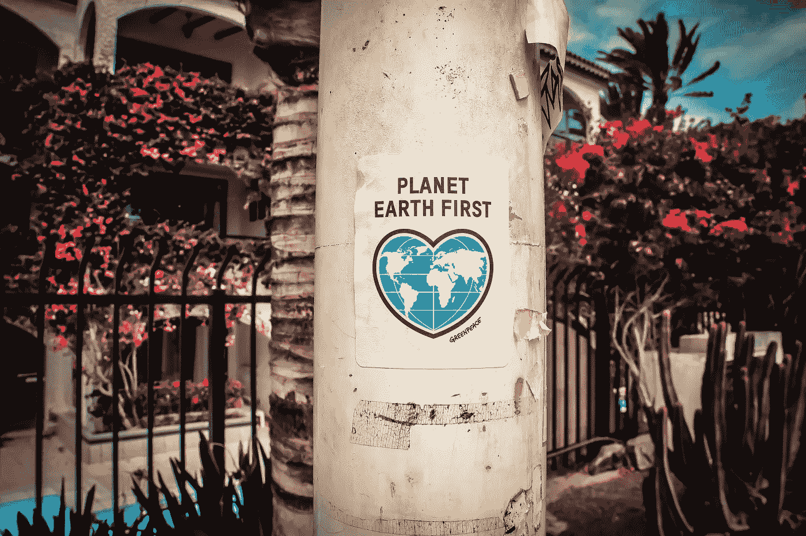

# 数字乌托邦主义:分享食物，乘坐电动公交车，相信区块链

> 原文：<https://medium.com/swlh/digital-utopianism-share-food-ride-electric-buses-and-believe-in-blockchain-2a76e51b6ec8>

Planet Earth First. Photo by [Gem & Lauris RK](https://unsplash.com/photos/D0xQQsZovws?utm_source=unsplash&utm_medium=referral&utm_content=creditCopyText) on [Unsplash](https://unsplash.com/search/photos/eco?utm_source=unsplash&utm_medium=referral&utm_content=creditCopyText)

## 伦敦的三家绿色科技创业公司将目光投向了这个星球，而不是利润。

尽管有社会、经济和环境危机，数字乐观主义者会说:

> 由于科技的无限潜力，我们是第一代能够解决地球问题的人。

悲观主义者——或者现实主义者——会提醒我们，由于气候变化的真实威胁，我们*是* **能够解决这个问题的最后一代人**。

无论你的观点如何，毫无疑问，科技扮演着重要的角色。

让我们花五分钟时间关注积极的一面:就像最近在伦敦[数字星球](https://www.meetup.com/Soda-Social-London/events/255358471/)活动上展示的三家绿色创业公司。

# **食物分享革命**

你知道 2018 年‘年度词汇’是上周正式公布的吗？

单词是“一次性使用”。

选择它是因为它完美地总结了我们海洋的现状。

食物分享革命应用 [OLIO](https://www.linkedin.com/company/28661689/) 的安妮·夏洛特·莫宁顿认为明年的关键词将是“食物浪费”。

> “食物浪费是对我们环境的最大威胁”，她说，敏锐地意识到在一个坏消息的时代，更多的坏消息不是我们现在需要的。

然而，这是一个非常积极的介绍。事实上，OLIO 是一个非常乐观的服务。

他们只要求你[下载](https://olioex.com/)他们的免费应用程序，当你的冰箱或橱柜里有你可能扔掉或不消费的食物时，把它发布到应用程序上。

当你知道 40%的报价在一小时内成交，75%的报价在 24 小时内成交时，你会很激动。

很明显对这个有很大的需求。

OLIO 依赖于一个非常活跃的社区:70 万用户和 2.2 万名志愿者。

现在，OLIO 正从邻居间简单的食物分享这一卑微的起点成长为一家更大的公司。他们与食品行业的大公司建立了合作关系，比如 Pret 和 Sainsbury，现在免费或低价提供这些高街品牌的食品。

> “每个人都有东西吃的想法并不遥远，”莫宁顿说。

奥利奥不仅改变了普通人的饮食习惯，也改变了大企业的行为。

世界上没有理由不下载(和使用！)这个 app。[走](https://itunes.apple.com/gb/app/olio-food-sharing-revolution/id1008237086?mt=8)！

# **可持续区块链**

> 首席执行官[曼朱拉·李](https://www.linkedin.com/in/manjula-lee-06989327/)沉思道:“自我意识是一件有趣的事情”。

作为一种保护机制，我们的大脑会记住负面经历，而不是正面经历。做出理性的决定比做出非理性的决定需要更多的精力。

那么，想象一下，如果我们能提供数据来改变我们普遍的消极心态？

这就是李的“啊哈时刻”。

> “我们需要的是一个类似 airbnb 的社交投资平台。”
> 
> “我们需要利用区块链的分散式账本技术创建一个市场，我们需要让英国成为世界上利用绿色科技帮助实现联合国可持续发展目标的领导者。”

于是她创办了[环球一代](https://www.worldwidegeneration.co/)。

2018 年 6 月，李向特里萨·梅和政府展示了原型。

他们使用区块链的目的是解决透明度问题，这使得援助，慈善和非政府组织部门如此混乱和有争议的领域。

这将是巨大的吗？应该是。

# **电力推进**

联合创始人兼首席技术官[托比·舒尔茨](https://www.linkedin.com/in/tobyschulz/)是一名记录保持者。

10 年前，他和来自伦敦帝国理工学院的伙伴驾驶电动卡丁车从阿拉斯加到阿根廷，打破了一项世界纪录。

现在他正把他开创性的机械师转移到公共交通领域。

> 据舒尔茨说，燃料价格持续上涨，而我们的空气质量却在下降。事实上，一个伦敦人死于空气污染的可能性是瑞典人的 64 倍。在全球其他地方，330 万人因有毒空气质量过早死亡。

因此，运输部门的替代能源应在政治议程上占据重要位置，并处于公众意识的最前沿。

> [华帝动力](http://www.vantage-power.com/)，“为重型车辆设计和制造动力总成电气化和连接技术”。

简而言之，他们用电能改装公交车。

祝你好运托比。

# 数字乌托邦主义

这些伦敦的绿色科技创业公司把目光投向了这个星球，而不是利润。

OLIO 可以改变你的日常饮食习惯，Vantage Power 将很快为街道上的公共汽车提供动力，而像 World Wide Generation 这样的平台将所有的慈善活动聚集在一起，使它们更加透明，更有市场，对投资者更友好。

今天是科技的好日子。

*Craig 为*[*Calcey Technologies*](http://calcey.com/)*撰稿，这是一家植根于硅谷的精品软件产品工程代理公司，为世界各地的初创企业和扩大规模的企业提供软件开发服务。Calcey 的客户组合包括全球名称，如*[*PayPal*](https://www.paypal.com/)*和* [*斯坦福大学*](https://www.stanford.edu/) *，以及众多令人兴奋的初创公司，包括*[*Nutrifix*](http://www.nutrifix.co/)*(英国)*[*Nelly.com*](https://nelly.com/uk/womens-fashion/)*(瑞典)和* [*MyBudget【我的预算】位于斯里兰卡开发中心的 100 多名工程师团队正在寻求与更多创业公司合作。*](https://www.mybudget.com.au/)

## 这篇文章发表在 [The Startup](https://medium.com/swlh) 上，这是 Medium 最大的创业刊物，拥有+391，714 名读者。

## 在这里订阅接收[我们的头条新闻](http://growthsupply.com/the-startup-newsletter/)。

