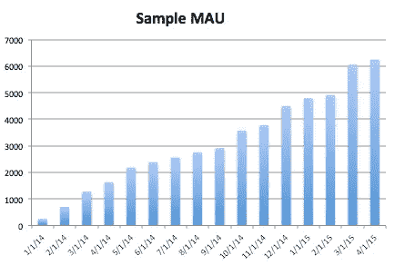
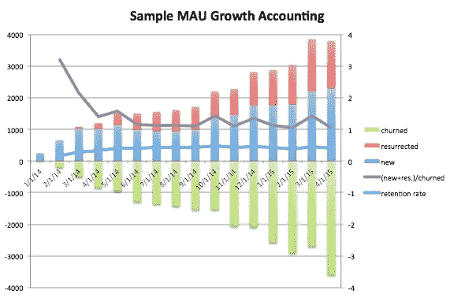

# 社会资本的勤奋第 1 部分:用户增长的会计

> 原文：<https://medium.com/swlh/diligence-at-social-capital-part-1-accounting-for-user-growth-4a8a449fddfc>

*【作者备注:请参阅我最近撰写的关于* [*产品市场适合度的定量方法*](https://tribecap.co/a-quantitative-approach-to-product-market-fit/) *和后续* [*单位经济学和规模不变性的追求*](https://tribecap.co/unit-economics-and-the-pursuit-of-scale-invariance/) *的文章中对这些文章中提出的思想的更新。我已经不在社会资本工作了，如果你想联系我，你可以发电子邮件给我:*[*【jonathan@tribecap.co*](mailto:jonathan@tribecap.co)

*在社会资本，我们花大量时间对潜在投资进行尽职调查。在接下来的几周里，我们将讨论如何定量评估产品与市场的契合度。我们在这里讨论的方法，除了对投资的尽职调查之外，还有其他用处。我们的许多投资组合公司将这些概念作为其运营流程的一部分，以跟踪其增长和不断发展的产品市场适应性。希望你觉得有用！*

*勤奋旨在帮助我们了解当前存在的和未来可能会发生的事情，并尝试帮助企业家走上他们的道路。虽然我们肯定会在产品前期阶段与许多企业家交谈，但我们的大部分时间最终都花在了那些已经拥有用户/客户产品的企业家身上。在这种情况下，尽职调查的一部分包括对已证明的产品与市场的契合度形成客观的理解。虽然每家公司都不尽相同，但我们有一些查看核心牵引力指标的标准方法，我们希望与您分享这些方法，希望有助于您深入了解自己的业务。不言而喻，勤奋还有许多其他方面，包括但不限于团队、市场、愿景、竞争、核心技术等。在这些文章中，我们将只讨论勤奋的一个特定子集。*

*我们将如何介绍我们的方法的暂定大纲如下:*

1.  *[考虑用户增长](/swlh/diligence-at-social-capital-part-1-accounting-for-user-growth-4a8a449fddfc#.ygng2nayv)*
2.  *[收入增长核算](/@jonathanhsu/diligence-at-social-capital-part-2-accounting-for-revenue-growth-551fa07dd972)*
3.  *[经验观察到的群组终生价值(收入)](/@jonathanhsu/diligence-at-social-capital-part-3-cohorts-and-revenue-ltv-ab65a07464e1)*
4.  *[凭经验观察到的群组终生价值(参与度)](/@jonathanhsu/diligence-at-social-capital-part-4-cohorts-and-engagement-ltv-80b4fa7f8e41)*
5.  *[参与深度和收入质量](/@jonathanhsu/diligence-at-social-capital-part-5-depth-of-usage-and-quality-of-revenue-b4dd96b47ca6)*
6.  *[尾声:创业公司的 8 球和 GAAP】](/swlh/diligence-at-social-capital-epilogue-introducing-the-8-ball-and-gaap-for-startups-7ab215c378bc#.wxc2lc8dp)*

*这些主题以稍微不同的方式应用于消费者业务和企业 SaaS 业务，所以我们通常将它们分开处理，但是该框架适用于两种类型的业务。*

*今天我将集中讨论第一个话题。*

## ***考虑用户增长***

*首先，假设我们有一家消费公司，打算通过一些新颖的社交/移动/内容产品策略获得大量用户。对于这些类型的公司，我们在推销中看到的最常见的图表是用户向上和向右的图表。有时，公司会试图向我们展示“累计注册用户”的图表，这显然是一种虚荣的衡量标准。一个已经注册但在你的产品中并不活跃的用户可能并没有获得太多的价值，也可能不是产品市场适合度的一个很好的指标。*

*鉴于累积用户很少以严肃的语气显示，在当前时代，我们通常会看到每月活跃用户(MAU)的图表向右上方上升。*

**

*Sample MAU for a fictional company growing over 16 mos. at ~12%/month*

*这显示了 16 个月大约 12%的 m/m 增长，这是相当令人印象深刻的。然而，我们总是更深入一层去理解增长的本质。为了便于说明，让我们假设我们有某种移动应用程序。对于“活动”的定义，您应该使用最适合您的应用程序的定义。这可以宽泛到“打开了应用程序”，也可以具体到“执行了特定的操作”。考虑以下两个会计恒等式。*

**MAU(t) =新增(t) +留存(t) +复活(t)**

**MAU(t - 1 个月)=留存(t) +倒掉(t)**

*第一个表示今天的活跃用户(在接下来的 30 天内)要么是上个月保留的新用户，要么是之前某个时间段复活的用户。请注意，这是对当前用户的互斥且完全详尽的分类。第二个身份表示，上个月的 MAU 要么回来并被保留，要么没有回来并因此被搅动。*

*处理上述内容会产生以下结果:*

**MAU(t) - MAU(t - 1 个月)=新(t) +复活(t) -搅动(t)**

*也就是说，MAU 增长从新用户和复活用户获得正贡献，从流失用户到流失用户获得负贡献。*

*以下是我们更喜欢看的上述虚构公司的 MAU 增长会计数量。如果你要向我们展示你的 MAU 增长，你最好以这种方式向我们展示。*

**

*Sample MAU Growth Accounting for the above MAU chart*

*条形图显示了上述等式右侧对 MAU 增长有贡献的三项。我还覆盖了两个有用的比率。留存率是逐月的，所以这表明我们虚构的公司的留存率约为 40%。注意，由于上面的会计恒等式，这意味着流失率是(100% - 40%) = 60%。另一个比率是(新的+复活的)/搅动的，也就是说线上面积与线下面积的比率。如果应用程序要增长，这个比率需要大于 1，否则流失就是压倒性的增长。我们称之为“速动比率”。*

**速动比率=(新+复活)/搅动**

*这个术语是今年早些时候由马蒙·哈米德在一副[牌](http://www.slideshare.net/03133938319/saastr)中创造的。当我们讨论收入时，我们将在后面的帖子中更多地讨论这个概念。此外，这不应该与衡量现金和近现金资产偿还债务能力的正常财务速动比率相混淆。这家公司的 MAU 速动比率在 1 到 1.5 之间波动。也就是说，该公司每增加 3 名新用户，就会流失 2-3 名用户。*

*请注意，这比上面的 MAU 图提供了更多的信息。这告诉我们，有一些大的逐月流失正在被新用户和复活用户的大量贡献所克服。保留率一直很稳定，没有显示出任何特别的趋势。从积极的一面来看，它并没有随着应用的增长而下降，但如果你只看顶线数字或过去 12 个月中可能的特性/功能变化，你可能会认为它也没有变得更好。*

*就上述情况而言，我们将这归类为消费者应用程序的一般情况。大多数消费者应用程序没有一个非常强大的机制来让用户逐月返回，因此速动比率往往略高于 1。消费者应用程序中每个月的动态通常是增加一群用户，同时失去一群用户，再加上从复活中获得的一小部分额外用户，从而产生整体的小幅正增长。*

*为了向你展示这种观点的力量，还有其他方法可以让这些组成部分共同产生同样的顶线增长。例如..*

**

*Sample MAU Growth Accounting that shows a different scenario. Note, these numbers produce the same MAU growth!!*

*注意，这些数字会产生与上面所示的完全相同的**MAU 图。我保持坐标轴不变，以强调不同之处。在这种情况下，新的组成部分没有增长得那么快，但也保持得更好。这家公司的速动比率更接近 1.5-2.0，这对消费公司来说非常好(每增加 3 个客户，就会失去 1.5-2 个客户，比第一家公司好得多)。请注意，复活中的峰值可能是由于一些复活活动没有伴随相应的流失峰值。***

*在其他条件相同的情况下，第二个例子对我们来说更有吸引力，因为它的起点更好。有了如此高的留存率，就值得努力推动漏斗顶端的新用户，以推动增长(更积极的分享/推荐机制、付费收购等)。).对于第一个例子，很难证明推新用户的合理性，因为你最终会失去很多新用户。填补漏斗顶部比解决一些潜在的流失问题更容易。*

*还应该清楚的是，这种核算可以在不同于日历月的时间框架内进行。事实上，为了使这一点具有可操作性，我们的几个投资组合公司在滚动 28 天的基础上实施它(以消除星期效应)。此外，这种方法对周活跃用户和月活跃用户同样有效。通常，早期阶段的消费产品已经很难产生 m/m 保留，更不用说 w/w 保留，因此 w/w 视图将显示非常高的流失率，可能没有用。但是如果你的产品非常有粘性，并且每月都保持在一个非常高的水平，那么可能是时候探索在每周水平上产生下一个水平的参与了。对于像 FB 这样有粘性的东西，甚至可以把它降低到每日甚至次每日级别。*

*在[的下一篇文章](/@jonathanhsu/diligence-at-social-capital-part-2-accounting-for-revenue-growth-551fa07dd972)中，我们将把这个框架应用于订阅收入，这对 SaaS 企业和消费者订阅业务都很有用。*

**【作者注:在这里* *可以看到这些文章中提出的思维的更新* [*。我已经不在社会资本工作了，如果你想联系我，你可以发电子邮件给我:*](https://tribecap.co/a-quantitative-approach-to-product-market-fit/)[*jonathan@tribecap.co*](mailto:jonathan@tribecap.co)*

****

***发表于* **创业、旅游癖和生活黑客****

************

**-**