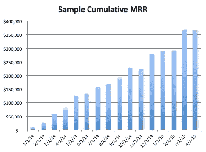
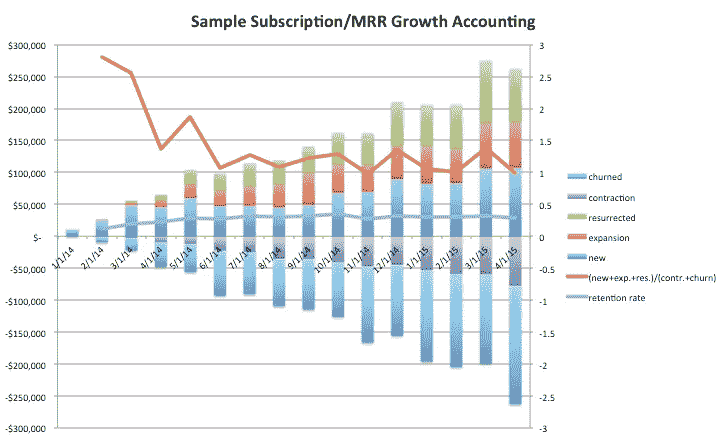
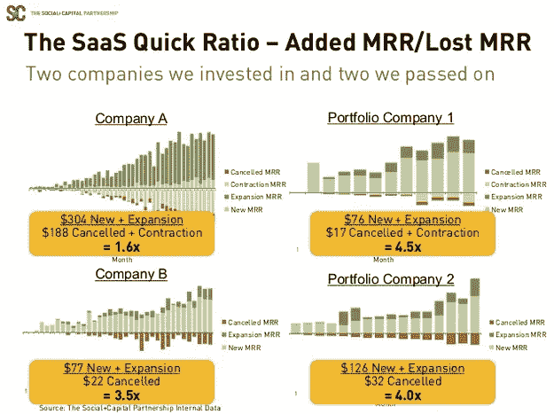

# 社会资本的勤奋第 2 部分:收入增长的会计

> 原文：<https://medium.com/swlh/diligence-at-social-capital-part-2-accounting-for-revenue-growth-551fa07dd972>

*【作者备注:请参阅我最近撰写的关于* [*产品市场适合度的定量方法*](https://tribecap.co/a-quantitative-approach-to-product-market-fit/) *和后续* [*单位经济学和规模不变性的追求*](https://tribecap.co/unit-economics-and-the-pursuit-of-scale-invariance/) *的文章中对这些文章中提出的思想的更新。我已经不在社会资本工作了，如果你想联系我，你可以发电子邮件给我:*[*【jonathan@tribecap.co*](mailto:jonathan@tribecap.co)

*在本系列的[上一篇文章](/swlh/diligence-at-social-capital-part-1-accounting-for-user-growth-4a8a449fddfc)中，我们通过展示每月活跃用户(MAU)增长会计来研究用户增长会计，以及它如何揭示不断增长的用户群的不同潜在动态。今天，我们将采用这一框架，并将其应用于收入增长。这对于思考在企业软件即服务(SaaS)业务或消费者订阅业务中会出现的*经常性*收入特别有用。*

*考虑一家通过每月订阅获得收入的公司。为了具体起见，让我们考虑一个 B2B SaaS 公司。对于这样的公司，除了了解 MAU 增长，我们还想了解每月经常性收入的增长(MRR)。注意，我们仍然可能对 MAU 会计感兴趣。如果一个客户离开 MAU，他们也可能离开 MRR。现在，让我们关注 MRR 的增长。在这种情况下，我们看到的最常见的图形是向右上方的累积 MRR 图。*

**

*Sample cumulative MRR growing at ~16% m/m*

*与毛案例类似，我们现在将分解 MRR 增长的组成部分。在这种情况下，有一些额外的细微差别。在 MAU 会计中，用户要么回来，要么不回来(即被保留或被搅动)。在计算金额时，单个客户可能会被保留或流失，但他们也可能会因为在第二个周期相对于第一个周期花费更多或更少而被保留为客户。因此，我们将扩张和收缩分离到增长核算中。显式身份是:*

**MRR(t) =新生(t) +留存(t) +复活(t) +扩张(t)**

**MRR(t - 1 个月)=滞留(t) +翻腾(t) +收缩(t)**

*请注意，如果客户第一个月花费 10 美元，第二个月花费 12 美元，我们将 10 美元计为保留支出，2 美元计为扩张支出，收缩支出也是如此。只有当客户达到零花费时，我们才会将美元计为搅动，只有当用户从搅动状态返回时，我们才会将美元计为复活。上述内容可以重新排列如下:*

**MRR(t) - MRR(t - 1 个月)=新生(t) +复活(t) +膨胀(t) -翻腾(t) -收缩(t)**

*这里展示的五个组件是:*

**

*Sample growth accounting for MRR*

*我们再次计算基于美元的“速动比率”，根据月份和基于美元的留存率(这里约为 40%)，速动比率在 1 到 1.5 之间。*

*回想一下在消费者 MAU 案例中，1.5 的速动比率大约是消费者企业的平均值。然而，对于经常性收入来说，这并不太好。*

**经常性订阅收入是默认保留的，而经常性访问是默认不保留的。因为这样的订阅收入往往具有更低的流失率和更高的速动比率。**

*举更多的例子，如果你考虑消费者订阅业务(如 Spotify 或网飞)，它们通常不应该变动太多，这应该反映在高速动比率中。相比之下，纯粹的消费者交易型零售企业(比如说，Nordstrom online)倾向于每月大量流失，因为客户在连续几个月内没有强大的购买动力。如果你考虑依赖登陆和扩展的订阅业务(如 Slack ),你会希望随着每个客户扩大付费席位的数量，看到大量的扩展收入。*

**对于 SaaS 企业，我们更喜欢投资速动比率大于 4 的公司。**

*如果你从 2015 年初就有<2 then your churn is probably too high and you have something to fix. For more information about how this fits into our overall approach to enterprise saas investing, see Mamoon Hamid’s [套牌](http://www.slideshare.net/03133938319/saastr)的速配题目。这张幻灯片展示了一些真实的 SaaS 公司。*

**

*Saas quick ratio examples from Mamoon Hamid’s presentation*

*右边的两家公司在我们的投资组合中，我们忽略了左边的两家。请注意，左上角的公司 A 有一个很好的故事。公司 A 会说，他们有大量的扩张收入，这无疑表明了产品市场契合度的一些非常好的方面。然而，它在很大程度上被收缩的收入所吞噬，导致他们不得不产生扩张的 MRR，以超过收缩的 MRR，从而产生净增长。*

*我还推荐 Bobby Pinero 关于这个主题的文章[讨论了他们在 Intercom 的筹款过程中使用的 SaaS 指标。](https://blog.intercom.io/saas-metrics-for-fundraising/)*

## *考虑到其他一切*

*既然我们已经展示了 MAU 和 MRR 的增长情况，那么很明显我们可以对对业务很重要的任何数量进行统计。例如，假设你有一个社交网络消费者应用程序，也许你认为 MAU 不够严格，你真的希望用户每天都在你的应用程序中。在这种情况下，仅仅衡量一个用户是否活跃是不够的，你想知道一个用户在一个月中是真正活跃还是稍微活跃。这可以通过测量在脸书被称为 L28 的月份中活跃的天数来实现。例如，L28=10 的用户在过去 28 天中有 10 天处于活动状态。如果你对一个月内所有用户的 L28 进行求和(在该月的最后一天进行测量)，你将得到整个月内 DAU 的总和。你可以比较一个月内 L28 的总和，并与下个月进行比较，然后对其进行增长核算。如果用户本月相对于上个月具有更高/更低的 L28，则用户扩展/收缩，依此类推。这将提供一份“DAU 月度增长报告”。*

*如果你想要一个与活跃用户或收入无关的例子，可以考虑 Twitter 上的链接分享。如果你在 Twitter 上做链接分享，你的目标可能是增加链接分享事件，你可以用上面的方法来解释用户的链接分享事件的增长，这些用户分享的次数比之前多/少。*

*回顾一下，增长会计是一个框架，几乎可以用在任何情况下，一组用户/客户以某种形式为您的企业积累价值(收入、他们通过 DAU 的关注、为系统贡献内容等)。增长会计的一个明显缺点是，流失数字没有说明流失的客户是企业的新成员，还是已经获得价值一段时间的老客户。也就是说，这种方法并没有提供一个非常清晰的用户生命周期图。为了阐明这一点，我们应该看看队列和如何实现终身价值。我们将在[的下一篇文章](/@jonathanhsu/diligence-at-social-capital-part-3-cohorts-and-revenue-ltv-ab65a07464e1)中讨论这个问题。*

*编辑:作为参考，这里有完整的目录。*

1.  *[考虑用户增长](/swlh/diligence-at-social-capital-part-1-accounting-for-user-growth-4a8a449fddfc#.ygng2nayv)*
2.  *[收入增长核算](/@jonathanhsu/diligence-at-social-capital-part-2-accounting-for-revenue-growth-551fa07dd972)*
3.  *[经验观察到的群组终生价值(收入)](/@jonathanhsu/diligence-at-social-capital-part-3-cohorts-and-revenue-ltv-ab65a07464e1)*
4.  *[凭经验观察到的群组终生价值(参与度)](/@jonathanhsu/diligence-at-social-capital-part-4-cohorts-and-engagement-ltv-80b4fa7f8e41)*
5.  *[参与深度和收入质量](/@jonathanhsu/diligence-at-social-capital-part-5-depth-of-usage-and-quality-of-revenue-b4dd96b47ca6)*
6.  *[尾声:创业公司的 8 球和 GAAP】](/swlh/diligence-at-social-capital-epilogue-introducing-the-8-ball-and-gaap-for-startups-7ab215c378bc#.wxc2lc8dp)*

**【作者注:在这里* *可以看到这些文章* [*中提出的思维的更新。我已经不在社会资本工作了，如果你想联系我，你可以发电子邮件给我:*](https://tribecap.co/a-quantitative-approach-to-product-market-fit/)[*【jonathan@tribecap.co*](mailto:jonathan@tribecap.co)*

****

***发表于* **创业、旅游癖和生活黑客****

************

**-**