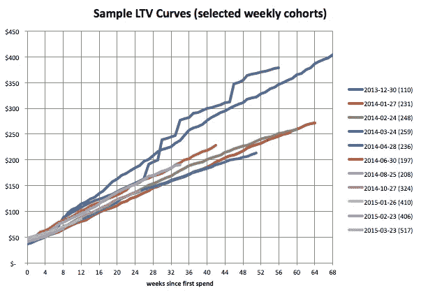
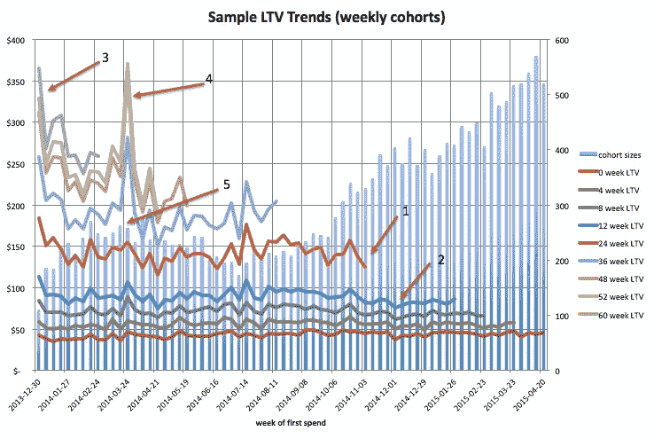
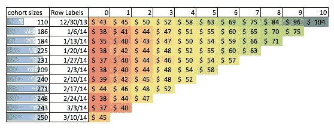
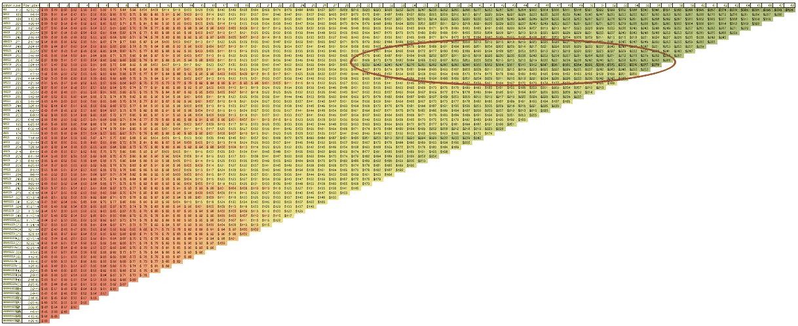

# 社会资本的勤奋第 3 部分:群组和(收入)LTV

> 原文：<https://medium.com/swlh/diligence-at-social-capital-part-3-cohorts-and-revenue-ltv-ab65a07464e1>

*【作者注:参见我最近撰写的关于* [*产品市场适合度的定量方法*](https://tribecap.co/a-quantitative-approach-to-product-market-fit/) *和后续* [*单位经济学和规模不变性的追求*](https://tribecap.co/unit-economics-and-the-pursuit-of-scale-invariance/) *的文章中对这些文章中提出的思想的更新。我已经不在社会资本工作了，如果你想联系我，你可以发电子邮件给我:*[*【jonathan@tribecap.co*](mailto:jonathan@tribecap.co)

*我们在这些帖子上得到了大量的反馈，我们真的很兴奋，它提供了一套有用和有价值的工具来了解您的业务。如果您有任何问题，请随时给我发电子邮件，地址是[jonathan@socialcapital.com](mailto:jonathan@s23p.com)。我不能保证我会回应，但我一定会努力！*

*在本系列的前两部分中，我们描述了如何应用增长会计来理解[用户增长](/swlh/diligence-at-social-capital-part-1-accounting-for-user-growth-4a8a449fddfc)和[经常性收入增长](/@jonathanhsu/diligence-at-social-capital-part-2-accounting-for-revenue-growth-551fa07dd972)的子组件。我们提到过增长会计有一个缺点，那就是它不能让我们了解客户的生命周期。特别是，它无助于回答这样的问题:“消费者在生命早期和晚期花费更多吗？”或者也许是“客户流失是在某个时候突然发生的，还是在客户的一生中持续发生的？”*

*首先，让我们假设我们有一个向客户销售产品的企业。关于收入是基于订阅还是基于交易，以下描述是无关紧要的。我们感兴趣的是我们业务中客户的终身价值，即每位客户实现的累计收入。*

*大多数对生命周期价值(LTV)的描述使用一个模型，该模型以一个公式结束，该公式基于边际贡献( *m* )、留存率( *r* )和贴现率( *d* )的组合，它包含了无限时间范围的 LTV(例如[维基百科](https://en.wikipedia.org/wiki/Customer_lifetime_value)的文章)。*

**LTV = m * r / (1 + d - r)**

*这个模型对于理解早期公司的作用有限，因为它的推导过程中包含了以下假设:*

*   ***在不同群组之间，甚至更重要的是，在客户的整个生命周期中，保留率都是恒定的**(也就是说，它假设如果你有可能从第 1 个月到第 2 个月被保留下来 *r* ，那么你也有可能从第 20 个月到第 21 个月被保留下来 *r**
*   ***持续的单位经济性**在整个队列和客户生命周期中，持续的边际贡献。*
*   *它假设这些量在足够长的时间跨度**内足够恒定，因此包含贴现率是合理的。***

*当我们看一家公司时，通常情况是这些假设都不成立。早期阶段的公司只有几个月或几周规模的团队，随着基础产品在团队之间的变化，这些团队的留存率通常会有很大差异。早期公司通常也没有确定单位经济学。这些不确定性太大了，以至于预测未来贴现的重要性是不明智的。*

**我们强烈倾向于观察经验实现的队列 LTV，而不是基于公式估算的 LTV。**

*回到我们虚构的创收公司，让我们看看一些样本 LTV 曲线。*

**

*Sample LTV curves*

*括号中的数字是第 0 周群体的大小。请注意，年轻群体显示为较短的线条，因为我们对他们的 LTV 还不太了解。还要注意，像“9 个月(36 周)LTV”这样的量本身就有歧义。在这个数据集中，它在 160 美元到 280 美元之间，这是一个相当大的范围。较老的一组似乎较高，较新的一组较低。另请注意，2014 年 3 月 24 日这一群体异常强劲，这可能是因为该群体中有一些异常大的客户在大量消费。总的来说，这些 LTV 曲线是线性的，也就是说，随着年龄的增长，消费者的支出是一致的。如果消费者没有从产品中获得价值，他们可能会放缓支出，导致 LTV 曲线变平。当然，任何一条 LTV 曲线都是递增的。还要注意，我们决定只显示少数几个群组，因为显示所有群组会使图表不可读。我们还根据首次消费周而不是注册周进行索引，因为不同的产品鼓励/要求在不同的时间进行注册，而不是说服客户实际花钱。*

*需要注意的是，给定群组在年龄 *T* 时的 LTV 计算方法是，该群组截至 *T* 时实现的总收入除以该群组*中的客户总数，包括可能已经产生*的客户。有时，我们会看到公司排除了大量的客户，只根据在时间 *T* 仍在付款的客户来计算在 *T* 的 LTV。这不是一条可行之路，因为你必须预先付费(通过营销等方式)获得所有这些客户。)而且，当客户流失时，这些支出不会消失。*

*另请注意，我们通常只关注每个群组的顶线收入 LTV，而将边际贡献/单位经济学的讨论留到单独的对话中。还有一个问题是客户对你提议的产品如何反应，这与你以合理的单位盈利能力提供该产品的能力无关。为了讨论的目的，我们只是试图理解这个问题的第一部分。*

*任何群体都可能表现出四种类型的行为:*

*   ***持平的 LTV** :这一批人预先花了一次钱，再也没花过。这一群体没有产生更多的增量收入。如果 LTV 公寓的价值足够高，可以非常有利可图，这不一定是坏事。例如，易贝汽车公司可能表现出这种行为。*
*   ***亚线性 LTV** :随着时间的推移，该群体继续消费，尽管消费随着时间的推移而减少。一段时间后，这样的群体接近平坦的 LTV。大多数企业都属于这一类。顾客最初消费，然后随着时间的推移消费越来越少。*
*   ***线性 LTV** :群组中的每个用户持续花费相同的金额。这大概就是 Spotify 的样子。假设 Spotify 的核心用户不打算取消订阅，第一个月可能会有所下降，但之后他们的群体可能会发展成线性或略低于线性。真正的线性 LTV 就像你与 PG & E 等公用事业公司的关系，这种关系具有极高的保留率。还要注意，有不同类别的线性 LTV 增长。企业可以是正斜率较大的线性企业，也可以是正斜率较小的线性企业。如果一个企业在每个群体中都有一个持续无限消费的核心回头客，那么 LTV 将是线性的。斜率的大小将取决于每个群组中有多少非核心客户稀释了这些核心客户的 LTV。*
*   *超线性 LTV:随着年龄的增长，消费者会花更多的钱。例如，这几乎肯定是亚马逊所看到的。在亚马逊的第一个月，你会花一些钱，在接下来的几个月里，你会花更多的钱。再举一个例子，考虑 Slack。每个付费客户都是为一定数量的座位付费的公司。在接下来的几个月里，随着越来越多的人采用公司的服务，客户可能会购买更多的座位。这些案例是最激动人心的。他们暗示了每个顾客几乎无限的 LTV 的可能性。*

*不用说，我们真正希望看到的是那些至少在部分客户群体中展现出线性到超线性 LTV 的有力证据的企业。*

*上面 LTV 曲线的可视化效果很好，也很容易理解，但是它并不能很好地说明 ltv 是变好了还是变坏了。如果所有的 LTV 曲线看起来都一样，一切都很稳定，那么我们就用上面的公式来计算完整的 ltv。然而，我们通常关注早期波动较大的公司，因此我们对 LTV 的*趋势*非常感兴趣。下面是我们如何看待 ltv 来了解这些趋势。*

**

*Sample LTV Trends*

*这个图像一开始有点棘手，所以我们将详细描述它。在此图中，x 轴是群组的日历周。背景中的横条是群体的大小。它们仅供参考。随着年龄的增长，线条显示了连续的 LTV 点。例如，2014 年至 2011 年至 2003 年的客户群(上图中的箭头 1)有大约 350 名客户，在最初一周平均每位客户消费 44 美元。一个月后，该群组的 4 周 LTV 稍高，为 55 美元(在绿线上)。该群组刚过 6 个月(24 周)，因此该群组的 24 周 LTV 被确定为 125 美元。我们还不知道该队列的 36 周 LTV，因为该队列还不到 36 周，并且上面的图像没有试图为我们推断它(回想一下，这基本上是基于公式的方法的问题，它混合了推断和实际观察)。请注意，该图中的线永远不会交叉，因为对于每个群组来说， *N+1* 周的 LTV 大于或等于 *N* 周的 LTV。还要注意，任何给定的线都是由连续数据点上的不同客户组成的。第 *N* 周 LTV 线衡量由不同客户组成的每个连续群组的数量。*

*这种可视化效果很好，因为它向我们展示了 LTV 的趋势。例如，你可以看到 12 周 LTV 开始下降，因为从 2014 年末开始，这一组变得更大了(箭头 2)。2014 年初最早的队列具有非常高的 ltv(箭头 3)。这很常见，因为早期采用者通常更倾向于使用一个产品。在最初的 LTV 图表中奇怪地出现的 2014-03-24 群组在这里出现为一个明显的尖峰(箭头 4)。请注意，该峰值直到该群组生命周期中的 24 至 36 周之间的某个时间才出现(箭头 5)。这在最初的 LTV 数据中也很明显，在 28 周左右，这个群体开始强劲增长。*

*当我们观察一家公司的 LTV 趋势时，我们希望看到的是:*

****我们希望看到更大的群体和客户生命周期中的 LTV 不断增加。****

*随着业务吸引了更多的客户群，通常情况下 LTV 会下降，因为更多的客户群是由后来采用的客户组成的，他们不太倾向于使用该产品。如果产品真的有很好的产品市场契合度，那么随后更大的群体将会以更高的速度赚钱，无论是随着群体变大还是随着群体变老。*

*另一个有时有用的视图是热图视图。*

**

*Truncated heatmap view of LTV*

*对于该图，第一次花费的群组周在 y 轴上。顶部的 x 轴是自第一次消费以来的周数，颜色是该群组的累积 LTV。因此，最上面一行是 2013-12-30 群组，有 110 个客户，其 LTV 随着向右移动而上升。左边的横条是每个连续组群的大小。最近的队列还没有显示他们的 LTV。久而久之对角线被添加到该图中。为了便于阅读，这里只显示了前几组，就好像时间在 2014 年 3 月停止了一样。所有群组的完整热图如下所示:*

**

*Heatmap view of LTV corresponding to LTV trends above*

*请注意，您可以将 2014 年 3 月 24 日的异常群组视为绿色水平条纹。固定的日历现象(如假期或销售)在此图像中表现为对角线特征。影响固定群体的现象(如通过付费购买支出获得的客户)表现为横向特征。比如说，如果在 N 周的记忆中有明显的下降，它会以颜色的变化表现出来，比如说，同组的人会花更长的时间到达黄色。*

*以上每一种想象都有优点和缺点。 **LTV 曲线**让你对曲线的形状有一个很好的感觉，但在少数几组之后，它开始变得不可读，并且它不能很好地显示趋势。 **LTV 趋势**给出了趋势的良好感觉，并显示了所有群组，但仅通过每个群组的线之间的间距给出了 LTV 曲线形状的暗示(本质上是一个等高线图)。此外，LTV 趋势并没有显示年龄组中所有点的 LTV，而是显示了选定的年龄里程碑。**热图**可以让你看到生命周期中所有时间点的所有群组，但不能很好地理解这些值是如何随着颜色变化而增加的。热图也很好地展示了季节效应。当我们做尽职调查时，我们通常更喜欢看曲线本身和 LTV 趋势，只是偶尔使用热图视图。如果你要向我们推销你的公司，你最好提前做好这些图表。*

*这就是收入终身价值的故事。下一次，我们将采用这一框架，并利用它来了解群体水平的[参与度和保持度](/@jonathanhsu/diligence-at-social-capital-part-4-cohorts-and-engagement-ltv-80b4fa7f8e41)。*

*编辑:作为参考，这里有完整的目录。*

1.  *[考虑用户增长](/swlh/diligence-at-social-capital-part-1-accounting-for-user-growth-4a8a449fddfc#.ygng2nayv)*
2.  *[收入增长核算](/@jonathanhsu/diligence-at-social-capital-part-2-accounting-for-revenue-growth-551fa07dd972)*
3.  *[根据经验观察的群组终生价值(收入)](/@jonathanhsu/diligence-at-social-capital-part-3-cohorts-and-revenue-ltv-ab65a07464e1)*
4.  *[根据经验观察的群组终生价值(参与度)](/@jonathanhsu/diligence-at-social-capital-part-4-cohorts-and-engagement-ltv-80b4fa7f8e41)*
5.  *[参与深度和收入质量](/@jonathanhsu/diligence-at-social-capital-part-5-depth-of-usage-and-quality-of-revenue-b4dd96b47ca6)*
6.  *[结语:创业的 8 球和 GAAP](/swlh/diligence-at-social-capital-epilogue-introducing-the-8-ball-and-gaap-for-startups-7ab215c378bc#.wxc2lc8dp)*

**【作者注:在这里***看这些文章呈现的思维更新。我已经不在社会资本工作了，如果你想联系我，你可以发电子邮件给我:*[*【jonathan@tribecap.co*](mailto:jonathan@tribecap.co)**

************

***发表于*[**【SWLH】**](https://medium.com/swlh)**(***创业、流浪、生活黑客)*****

************