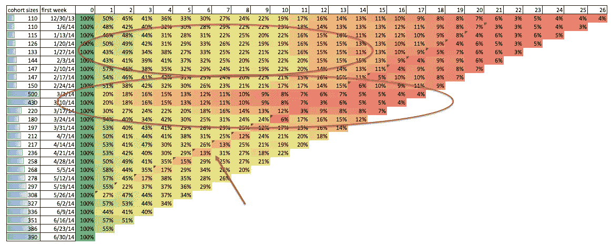
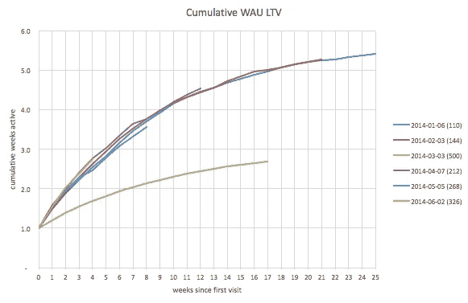

# 社会资本的勤奋第 4 部分:同伴和(参与)LTV

> 原文：<https://medium.com/swlh/diligence-at-social-capital-part-4-cohorts-and-engagement-ltv-80b4fa7f8e41>

*【作者备注:请参阅我最近撰写的关于* [*产品市场适合度的定量方法*](https://tribecap.co/a-quantitative-approach-to-product-market-fit/) *和后续* [*单位经济学和规模不变性的追求*](https://tribecap.co/unit-economics-and-the-pursuit-of-scale-invariance/) *的文章中对这些文章中提出的思想的更新。我已经不在社会资本工作了，如果你想联系我，你可以发电子邮件给我:*[*【jonathan@tribecap.co*](mailto:jonathan@tribecap.co)

*在本系列的前两部分中，我们讨论了增长会计，并将其应用于[使用](/swlh/diligence-at-social-capital-part-1-accounting-for-user-growth-4a8a449fddfc)和[收入](/swlh/diligence-at-social-capital-part-2-accounting-for-revenue-growth-551fa07dd972)。在第三部分，我们讨论了创收业务中的生命周期价值(LTV)。在这篇文章中，我们将采用上一篇文章中的 LTV 方法，并将其应用于企业的**参与和保留**方面。*

*在 LTV 税务局的案例中，主要的教训是观察现有用户在整个生命周期中的实际货币化情况，并观察这些 ltv 的趋势。对于打算在未来增加用户并将其货币化的企业来说，重点从货币化转移到长期留存。想象一下，我们有一些提供社交/内容风格体验的消费者应用程序。这通常从可能如下所示的保留图开始:*

**

*Sample weekly retention curves*

*括号中的数字是队列的大小。该应用程序显示，四周后，每周留存率在 15–40%之间。其中一个群组(2014–03–03 以绿色显示)表现出特别差的保留率，并且随着时间的推移，保留率持续下降，其中一些群组的保留率出现了一些奇怪的下降。这是一个有用的数据视图，因为它向我们展示了保留衰减的形状。和许多这种类型的视图一样，太多的行很难阅读，所以我每个月只包括大约一个周组。在此视图中，也很难看到衰减的趋势，因此用保留热图来查看它通常是有用的。*

**

*Sample retention heatmap*

*例如，这份报告称，2014 年 2 月 3 日开始的客户群有 144 名新用户，在首次访问四周后，每周有 41%的用户被保留。图顶部的椭圆形显示了几个组群都以大致相同的速率衰减。第二个椭圆形显示了三个比其他人做得更差的群体。观察左轴上的群组规模，您可以看到这与用户获取量的大幅增加相吻合。在上述保留曲线的绿线中可以看到其中一组。当一家公司大幅增加有偿收购时，往往会出现这种情况。他们最终得到的用户参与倾向较低，因此比其他群体保留的差得多。这家公司在几周之后停止了他们的付费获取实验，随后的一批人回到了用户获取高峰之前的相同保留模式。久而久之，数据在对角线边缘累积，因此在固定日历日期发生的事件显示为对角线特征(见箭头)。这可能是由于 2014 年 6 月 2 日发生的应用程序中断，影响了所有群组(每个群组的年龄不同)。这种固定的日历日期效应是原始保留曲线奇怪下降的原因。幸运的是，停机后，保留率继续快速增长，没有任何明显的长期负面影响。在多年的时间跨度上，季节性影响(如圣诞节、暑假、复活节等)表现为重复的对角线特征。*

*上面的保留曲线图类似于[最后一篇文章](/@jonathanhsu/diligence-at-social-capital-part-3-cohorts-and-revenue-ltv-ab65a07464e1)中描述的 LTV 曲线图。主要区别在于，LTV 视图计算的是一个*累积*数字，而上述保留曲线计算的是一个*增量*数字。在收入的情况下，增量收入积累到一个 LTV 数字。在使用案例中，增量保留累积到累积活动 LTV 数字。在本例中，我们将每周留存额累计至每周活跃用户(WAU) LTV 数字。例如，假设一个群体在第一周开始并全部活跃，在第二周他们中的 50%活跃。这可以在 LTV 意义上表述为，自第一次访问后的前两周内，该群组平均累积了 1.5 个活跃周，即“2 周 WAU LTV 为 1.5”。*

*这是上面的样本保留数据的累积活动天数 LTV 视图。*

**

*Sample Cumulative WAU LTV*

*这表明，2014 年第一周开始使用该应用的 110 名用户在大约六个月后平均累计活跃了 5.5 周。异常弱保留队列在这里显示为具有比其他队列低得多的 WAU LTV。与收入情况相似，这里有三种不同性质的活动 LTV 曲线。*

*   ***Flat** :超过某个日期后没有增量访问。*
*   ***次线性**:非零但递减的访问量。这就是我们在例子中看到的。所有用户似乎都在逐渐失去兴趣。*
*   ***线性**:在群体的一生中保持一致。一个核心用户一直在无限期地使用这个产品。斜率由核心用户与非核心用户的比例决定。*
*   ***超线性**:随着年龄的增长，保持率增加。随着用户年龄的增长，使用这种产品的倾向会增加。*

*由于这个数量是不减少的，我们可以查看它的趋势，就像我们对基于收入的 LTV 所做的那样。*

**

*Sample WAU LTV trends*

*如前所述，条形显示了每周的群组规模。看看 2014 年 4 月至 2007 年的群组，其中包括约 205 名用户。在第一周，他们的 WAU LTV 为 1(即所有用户在第一周的访问中都是活跃的)。在第一次就诊后的第一个月，该组平均总活动周数为 2.7 周。该群组的 12 周 WAU LTV 仅被观察到约为 4.5。我们还不知道 12 周以后的 WAU·LTV，因为他们还不够老。从这个角度来看，付费获取实验的效果是显而易见的。2014-03-03 和 2014-03-10 队列异常庞大，WAU ltv 随后因这些队列而受损。*

**不用说，对于基于参与度的消费者业务，我们感兴趣的是高留存率的情况，这种情况要么保持稳定，要么随着群体年龄的增长和新用户群体的增加而变得更好。这相当于说，我们想要线性或超线性的累积活动 ltv(无论是 DAU、WAU 还是 MAU)。**

*和以前一样，我们可以在热图中看到 WAU LTV 的趋势。与上面的热图不同，这张热图显示的是累积活跃周数，而不是每周保留时间。*

**

*Sample WAU LTV heatmap*

*这表明，例如，在 4 周后，除了异常大且累积活动周数较低的队列之外，其他队列的平均总活动周数为 2.3 周。颜色显示了特定年龄后每个群体获得的累积 WAU。这两个热图视图是互补的。前面显示的保留热图很有用，因为它让您了解到一旦用户变老，持续的保留是什么样子的。缺点是，保留观点很难检测出队列之间的微小差异。例如，几个月后，一个群组的每周保持率可能在 9-10%范围内，而另一个群组可能在 8.5%-10.5%范围内。由于每周留存数据中的噪音，很难判断一家是否比另一家留存得更好。通过比较各组之间的累积活性，我们可以更好地了解不同周之间的细微差异是否会导致产品在长时间内的总活性发生重大变化。累积视图(无论是热图还是趋势)的缺点是更难看到小的影响，如导致短期保留率下降的停机。换句话说，在这种情况下，一周的中断不会造成任何持久的影响，因此对应用程序生命周期中的累积活动没有太大意义。这是一般说法的一个特例，即整合任何类型的时间序列都会使时间序列变得平滑。*

## *其他一切的终身价值*

*因此，群组和 LTV 的框架有助于理解增量和累积创收，也很容易推广到增量和累积留存(按活跃周/天/月衡量)。在这一点上应该很清楚，这个框架可以用来理解客户在你的业务中表现出的任何行为。 举一个保留和货币化之外的例子，可以考虑应用这个框架来理解**推荐**的动态。假设你有一个应用程序，试图让用户推荐一个朋友。每次用户发送推荐信息时，与用户决定花钱时并没有什么不同——在这两种情况下，他们都在发出产品市场适合度增加的信号。人们可以分析随着群组年龄增长的累积和增量推荐发送行为，并得出“*N*-周推荐 LTV”。这里有一些显示推荐 LTV 的样本数据(实际上与上面的数据相同，只是标题不同，意思是解释不同)。*

**

*Sample Referral LTV Trends*

*在这种情况下，群组由他们发送第一次转诊的周决定(尽管您当然可以通过第一次就诊、注册等的周来创建群组。).在这种情况下，2014-04-07 队列中有 200 人发送了他们的第一次推荐，他们在发送第一次推荐后的 12 周内平均每个用户发送了 4.5 次推荐。有几个星期，很多用户发送了他们的第一个推荐(可能通过一些非常积极的推荐向上销售)，这导致那些群组的推荐 LTV 遭受损失。诸如此类。*

*这种方法是对批量转介发送进行比较的补充(无论是在变更之前/之后，还是在受控 A/B 测试中纯粹作为每日差异来衡量)，因为它允许差异在更长的时间内累积，如果变更很小，这可能是必要的。例如，在每天或每周的基础上，转介发送可能仅改变很小的量，但是当比较例如两组之间一个月的转介 LTV 时，这种差异会更加明显。整体推荐 LTV 曲线形状将有助于理解推荐发送是否发生在客户生命的早期，随后是急剧下降，还是贯穿客户生命的持续推荐发送。*

*与增长会计框架一起，这里描述的 LTV 框架构成了我们量化调查过程的一个重要部分。我们关注的最后一个领域是价值(收入或参与度)在客户中的*分布。从访问的角度来看，在更长的时间跨度内，我们不知道这是一个高参与度用户的小核心与一大群无参与度用户的混合，还是一大群中等强度用户的混合。我们将在[的下一篇文章](/@jonathanhsu/diligence-at-social-capital-part-5-depth-of-usage-and-quality-of-revenue-b4dd96b47ca6)中探讨这个问题。**

*编辑:作为参考，这里有完整的目录。*

1.  *[考虑用户增长](/swlh/diligence-at-social-capital-part-1-accounting-for-user-growth-4a8a449fddfc#.ygng2nayv)*
2.  *[收入增长核算](/@jonathanhsu/diligence-at-social-capital-part-2-accounting-for-revenue-growth-551fa07dd972)*
3.  *[经验观察到的群组终生价值(收入)](/@jonathanhsu/diligence-at-social-capital-part-3-cohorts-and-revenue-ltv-ab65a07464e1)*
4.  *[根据经验观察到的群组终生价值(参与度)](/@jonathanhsu/diligence-at-social-capital-part-4-cohorts-and-engagement-ltv-80b4fa7f8e41)*
5.  *[参与深度和收入质量](/@jonathanhsu/diligence-at-social-capital-part-5-depth-of-usage-and-quality-of-revenue-b4dd96b47ca6)*
6.  *[结语:创业的 8 球和 GAAP】](/swlh/diligence-at-social-capital-epilogue-introducing-the-8-ball-and-gaap-for-startups-7ab215c378bc#.wxc2lc8dp)*

**【作者注:在这里***看这些文章呈现的思维更新。我已经不在社会资本工作了，如果你想联系我，你可以发邮件给我，地址是*[*【jonathan@tribecap.co*](mailto:jonathan@tribecap.co)**

************

***发表于*****(***创业、流浪、生活黑客)*******

************************