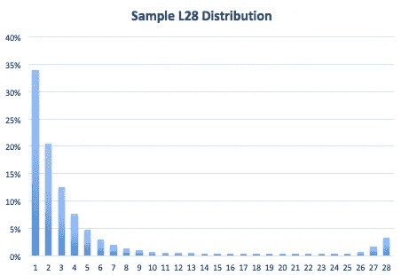
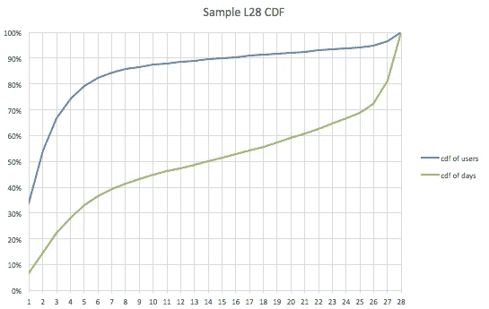
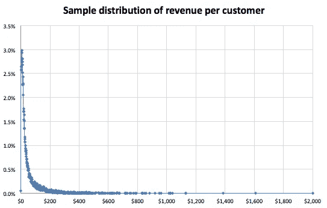

# 社会资本的勤奋第 5 部分:参与深度和收入质量

> 原文：<https://medium.com/swlh/diligence-at-social-capital-part-5-depth-of-usage-and-quality-of-revenue-b4dd96b47ca6>

*【作者注:请参阅我最近撰写的关于* [*产品市场适合度的定量方法*](https://tribecap.co/a-quantitative-approach-to-product-market-fit/) *和后续* [*单位经济学和规模不变性的追求*](https://tribecap.co/unit-economics-and-the-pursuit-of-scale-invariance/) *的文章中对这些文章中提出的思想的更新。我已经不在社会资本工作了，如果你想联系我，你可以发电子邮件给我:*[*【jonathan@tribecap.co*](mailto:jonathan@tribecap.co)

*在本系列的前两部分中，我们讨论了增长会计，并将其应用于[雇佣](/swlh/diligence-at-social-capital-part-1-accounting-for-user-growth-4a8a449fddfc)和[收入](/swlh/diligence-at-social-capital-part-2-accounting-for-revenue-growth-551fa07dd972)。在第三和第四部分中，我们讨论了创收业务中的[终身价值](/@jonathanhsu/diligence-at-social-capital-part-3-cohorts-and-revenue-ltv-ab65a07464e1) (LTV ),然后将 LTV 框架应用于[留任](/@jonathanhsu/diligence-at-social-capital-part-4-cohorts-and-engagement-ltv-80b4fa7f8e41)和其他与敬业度相关的价值。到目前为止，涵盖的框架很好地说明了收入增长的基本机制。今天，我们将讨论一个有些正交的问题，这是我们在《勤奋》中经常问的，即“用户群中的参与度分布是怎样的？”以及相关的收入问题“收入流有多稳定？”*

## *订婚的案子*

*以消费者应用程序为例。以前的方法没有涉及到的一个领域是参与的深度。从每月活跃用户(MAU)增长账户开始(如本系列第一部分中所述),该账户显示了一些稳定的月环比保持率和合理的流失率。就我们目前所涉及的框架而言，我们目前还没有一个好的方法来将这些 MAU 分为高参与度用户和低参与度用户。*

*为了量化消费者应用程序的参与深度，最通用的每用户指标是“每月活跃天数”。回想一下在本系列的第二部分中我们介绍 L28 概念的讨论。L28=10 的用户在过去 28 天中有 10 天处于活动状态。如果你对一个月内所有用户的 L28 进行求和(在该月的最后一天进行测量)，你将得到整个月内 DAU 的总和。每个用户的 L28 是一个创造价值的例子，因此你可以逐月计算总 L28 的增长。关于非收入 LTV 的[前一篇文章](/@jonathanhsu/diligence-at-social-capital-part-4-cohorts-and-engagement-ltv-80b4fa7f8e41)本质上是 L28 的累积寿命测量。让我们以一个 28 天的 MAU 周期(以避免星期效应)为例，看看 L28 分布:*

**

*Sample L28 Distribution*

*具体来说，我们假设这个 app 有 100k 的 MAU。L28 分布现在告诉我们，其中整整 34k 个在一个月中只有一天是活动的。它还表示，一小部分人，3k，在 28 天的一个月中的每一天都在使用该应用程序，L28=28。这种分布将用户自然分为“未参与”与“中等参与”和“高度参与”，可用于其他分析。这种观点是好的，但它更容易理解为累积分布函数(CDF)。这是上面的 CDF。*

**

*蓝线显示用户的 CDF。这告诉我们一些事情。例如，它说 50%的 MAU 是 L28 <=2\. It also says that the top quintile of users (the top 20%) are L28> =5。参与度最高的前 10%用户是 L28>=15。如果这个应用程序真的是一个应该每周使用一次的应用程序，那么可以合理地说，如果给定用户的 L28>3，他们已经达到了产品市场适合度。在这种情况下，33%的 MAU 真正达到了产品与市场的契合度，而另外 67%的 MAU 参与度不足以让我们真正相信该应用正在交付预期的价值水平。*

*绿线是一个略有不同的衡量标准。这是“活跃日”的 CDF。要理解这一点，首先要注意，如果你把所有 MAU 的 L28 变量加起来，那么你得到的数字就像你把整个 28 天的 DAU 加起来一样(这可能不明显，你可以随意算出来)。这基本上等同于对整个时期的 DAU 求平均值。*

**∑DAU(t)= 28 *平均值 _DAU = ∑ L28(u，t_end)**

*其中，第一个总和超过在 *t_end* 结束的 28 天，第二个总和超过在 *t_end* 精确测量的 MAU 集合中的所有用户 *u* 。*

*具体来说，考虑到我们的 10 万 MAU 示例，该数据将显示整个月总计 50 万的 DAU，这将是整个月 50 万/28 = 18 万 DAU 的平均值。这些天的 CDF 会告诉你这个 DAU 总数中有多少是由每个 L28 桶组成的。例如，它说 7%的活跃日由 L28=1 个用户组成。虽然这些 L28=1 的用户占用户的 34%,但他们只占平均 DAU 的 7%,因为他们对 DAU 的贡献不如更高的 L28 用户多。回想一下，我们决定将 L28>=4 宣布为符合产品市场的用户。在本例中，这类用户占用户的 25%，但贡献了约 72%的总 DAU(以及平均 DAU)。人们经常谈论帕累托原则，该原则大致表述为 80%的价值来自 20%的参与者。我们的示例产品的访问方面的 80/20 是 72/25，这并不太离谱。有更好的方式来概括这一概念，而不是将 80%线划分为特殊线(即[基尼指数](https://en.wikipedia.org/wiki/Gini_coefficient))。然而，我发现这种方法很难解释，我倾向于“80/20”测量的组合。*

*一个常用的敬业度衡量指标是 DAU/MAU 比率。这实际上与 L28 成帧有关。如果你将“DAU/毛”解释为 average _ DAU/毛(t_end)，那么这实际上是“上个月活动的平均天数”的 28 倍。因为 DAU 的总和与 L28 的总和相同，所以这只是上述 L28 分布的平均值。这里的建议是用对 DAU 贡献的整体分布图 来代替 ***对分布图(平均值)的单一测量。一般来说，当分布接近正态时，平均值可以很好地描述分布。在这种情况下，L28 分布甚至不接近正态分布，因此平均值不像中值或其他百分位数度量那样能够指示典型的体验。****

*L28 方法也很有用，因为它让您了解不同用户的相对价值。如果我们认为 L28=5 的用户比 L28=1 的用户“有价值”多 5 倍，那么 L28 分布实际上是“价值”在用户群中的分布。L28=5 的用户是否真的比 L28=1 的用户价值高 5 倍取决于你的业务。例如，如果你的产品是广告驱动的，那么用户会多花大约 5 倍的时间，因此价值也会多 5 倍。如果你对“活跃”的定义是指“交易中花费的钱”，那么这个价值细分显然与货币价值直接相关，L28=5 的用户显然比 L28=1 的用户价值高 5 倍。*

*就我们如何判断上述社会资本公司而言，这取决于实际产品的性质。如果它真的是一个每周用例类型的应用程序(比如说，一个在周末卖票的应用程序)，这将是非常好的。整整 25%的用户每周都在使用它。然而，如果它是一个持续的内容消费应用程序，这只是马马虎虎，因为 75%的用户不会每周使用一次。如果没有产品上下文，这些数据是没有用的。相反，如果没有像这里描述的那样的客观指标，只有产品背景是没有多大用处的。*

## *从参与深度到收入质量*

*正如在围绕增长会计和 LTV 的讨论中，我们可以采用这种 L28 方法，并将其抽象为客户产生的其他价值形式。客户可以通过为你的企业贡献 DAU 来创造价值。顾客也可以通过花钱来创造价值。*

*让我们假设我们有一个 B2B SaaS 产品，销售给公司，并收取他们每个席位每月 1 美元，也可能提供一些基于每个客户的优质服务。每个顾客都是一家公司，所以每个顾客支付多少钱是有分布的。下面显示的是每个客户的收入分布(每月经常性收入，又名 MRR)。这类似于上面的 L28 分布。*

**

*这个分布有点难读。有很多用户花费不到 100 美元，显然也有一些客户花费很多(通过追加销售或更多座位)。与 L28 的情况一样，该数据在 CDF 中更容易查看:*

**

*这种观点更容易理解正在发生的事情。红线是客户的 CDF，例如，50%的客户花费少于 20 美元。它还说，前 20%的顾客花费超过 63 美元。蓝线是总收入的 CDF，类似于项目示例中的总 L28 的 CDF。据说 30%的收入来自消费低于 50 美元的顾客。消费超过 63 美元的前 20%的顾客贡献了 66%的总收入。因此，该公司的 80/20 等于 66/20，也就是说，低端客户在业务中所占的比重超过了典型的帕累托法则。*

*你可以想象这些分布的两个极端版本。例如，考虑一下 Spotify 的月收入。在这种情况下，绝大多数来自单一价格点的用户，在这种情况下，红线在该价格点之前为零，然后在该价格点突然上升到近 100%。收入的 CDF 将非常类似于用户的 CDF，这将是“20/20”的情况。在另一个极端，考虑像 FarmVille 或任何其他旧的社会/脸书游戏。在这种情况下，会有一群用户花很少的钱，而极少数用户会花很多钱(“鲸鱼”)。因此，蓝线将远远低于红线，因为收入最高的几个百分点将构成收入的很大一部分。这将是“99/20”的情况。你应该能说服自己，这里的蓝线永远在红线以下。*

*对于 B2B 的例子，考虑谷歌云服务。有传言称，Snapchat 每年在谷歌云服务上花费大约 2500 万到 3000 万美元，他们是这项服务最大的消费者。如果你用谷歌云客户的 CDF 并按收入计算客户的 CDF，大多数客户每个月会花费合理的金额，但蓝线将远远低于红线，因为 Snapchat 离群值将具有非常高的价值，独自构成总收入的很大一部分。*

*你可能想知道为什么我把这个部分叫做“收入质量”。这个想法是，在企业 SaaS 的背景下，以高度重复的方式花费大量金钱的客户通常是更高质量的客户，因为他们更有可能在经济低迷时期幸存下来。收入分布右端的客户是旗舰客户，他们从产品中获得了大量价值，并可能在较弱的宏观环境中继续成为客户。对于企业初创公司，通常情况下，低合同价值的小客户是其他小型风投支持的初创公司。如果/当资金枯竭时，这些小客户将面临更高的倒闭或缩减支出的风险，因此部分收入流将面临风险。人们在谈论企业 SaaS 公司时经常谈论“平均合同价值”(ACV)。对于 MRR 驱动的业务，上述方法显示了合同价值的整体分布，这为我们提供了比平均值更细微的信息。我们通常通过陈述 X%的收入流受到创业驱动的支出的下滑，而 Y%将幸存下来，因为它来自高质量的客户，来概括这样的分析。*

## *结论*

*让我们回顾一下我们在本系列中讨论过的三个方面:*

*   ***增长会计**提供了一个框架，通过从复活和流失中挖掘新客户来了解推动净增长的潜在因素。该框架不仅适用于[不断增长的用户](/swlh/diligence-at-social-capital-part-1-accounting-for-user-growth-4a8a449fddfc)，也适用于[不断增长的任何有价值的东西](/swlh/diligence-at-social-capital-part-2-accounting-for-revenue-growth-551fa07dd972)，包括订阅收入、访问量、发帖行为等。*
*   *教科书上对 [**生命价值**](/swlh/diligence-at-social-capital-part-3-cohorts-and-revenue-ltv-ab65a07464e1) (LTV)的解释并不是理解早期公司(或早期特征)最有用的解释。经验 N 周或 N 月 LTV 是首选。LTV 的理念可以从创收推广到其他有价值的活动，如累积访问、推荐等。*
*   *DAU/MAU 等参与度综合指标为理解参与度提供了一个有限的视角。更好的做法是观察啮合深度的全部**分布。当考虑收入产生的分布时也是如此，与理解合同价值的全部分布相比，ACV 也是一个有限的视角。***

*通过这些方法，我们给出了一个非常完整的观点，即在对初创公司进行尽职调查时，我们如何定量地考虑产品与市场的契合度。*

*在 Social Capital，我们也有一个内部增长团队，他们将大部分时间投入到投资组合公司中，帮助他们执行增长、数据和用户获取战略。这些帖子中描述的工具不仅对一次性确定产品市场适合度有用，而且当集成到正在进行的产品开发过程中时会更加强大。希望你会发现它们对理解和推动你自己的生意很有用。在未来，我们希望写更多关于我们帮助企业家在特定环境下使用这些框架发展他们的公司的经验。*

*一如既往，如果您有任何问题，请随时在 jonathan@socialcapital.com 给我留言或发邮件。*

*编辑:作为参考，这里有完整的目录。*

1.  *[考虑用户增长](/swlh/diligence-at-social-capital-part-1-accounting-for-user-growth-4a8a449fddfc#.ygng2nayv)*
2.  *[收入增长核算](/@jonathanhsu/diligence-at-social-capital-part-2-accounting-for-revenue-growth-551fa07dd972)*
3.  *[经验观察到的群组终生价值(收入)](/@jonathanhsu/diligence-at-social-capital-part-3-cohorts-and-revenue-ltv-ab65a07464e1)*
4.  *[经验观察队列终生价值(参与度)](/@jonathanhsu/diligence-at-social-capital-part-4-cohorts-and-engagement-ltv-80b4fa7f8e41)*
5.  *[参与深度和收入质量](/@jonathanhsu/diligence-at-social-capital-part-5-depth-of-usage-and-quality-of-revenue-b4dd96b47ca6)*
6.  *[结语:创业的 8 球和 GAAP】](/swlh/diligence-at-social-capital-epilogue-introducing-the-8-ball-and-gaap-for-startups-7ab215c378bc#.wxc2lc8dp)*

**【作者注:在这里* *可以看到这些文章* [*中提出的思想的更新。我已经不在社会资本工作了，如果你想联系我，你可以发电子邮件给我:*](https://tribecap.co/a-quantitative-approach-to-product-market-fit/)[*【jonathan@tribecap.co*](mailto:jonathan@tribecap.co)*

****