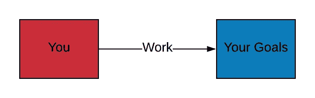

# 纪律>动机

> 原文：<https://medium.com/swlh/discipline-motivation-fd2f41534f24>

## 当奇迹果汁、神奇咖啡和大师都不起作用时，真正的解决办法。

每个人都想走捷径。

我是说，我也会。如果有某种神奇的果汁、神奇的咖啡或药丸能让我更快地从 A 点到达 B 点，我会服用。有几十个大师和专家在那里兜售他们自己的产品，让你更努力地工作，跑得更快，做得更好。

但是如果你不这样做，没有一个方法是有效的。

你看，在生活中，你和你的目标之间只有一件事。

到达那里需要做的工作。

I made a handy diagram for those still confused.

有太多的人一直等到有动力的时候才去完成工作。然后，他们在短时间内工作，直到他们能够“再次进入最佳状态”。

他们播放他们最喜欢的歌曲，分享一些脸书的名言，并谈论更多关于当他们“成功”时事情会怎样。

**但他们永远不会。**

如果他们像大多数人一样追逐动力，他们永远也走不远。

相反，他们需要培养纪律性——这很容易，但大多数人从未尝试过。

你需要找到挡在你和你的目标之间的任何东西，并找出你如何能使工作变得可重复/可追踪。如果你的目标是塑身，那么你的可重复任务就是健身。如果你想成为一名作家，你最好每天写一章。

不管是什么，写下为了到达那里你必须做的事情。如果你正在挣扎，[这里有一个定义这些任务的指南。](/swlh/the-3x4-goal-setting-system-2e1f8f0d16a4)

然后，每天都做。不管怎样。

给自己买一个日历，显示一整年的情况，每天你完成任务的时候，就在那一天打上一个大大的 X。保持连胜。每天都做。

然后，大约三个星期后，自律的欲望会增长。这会成为一种习惯。当你看着日历，看到自己取得的进步时，你不会想放弃。

你再也不需要那些脸书语录和 Spotify 上的激励性播放列表来激励自己了。

## 这篇文章发表在 [The Startup](https://medium.com/swlh) 上，这是 Medium 最大的创业刊物，有 292，582+人关注。

## 订阅接收[我们的头条新闻](http://growthsupply.com/the-startup-newsletter/)。

