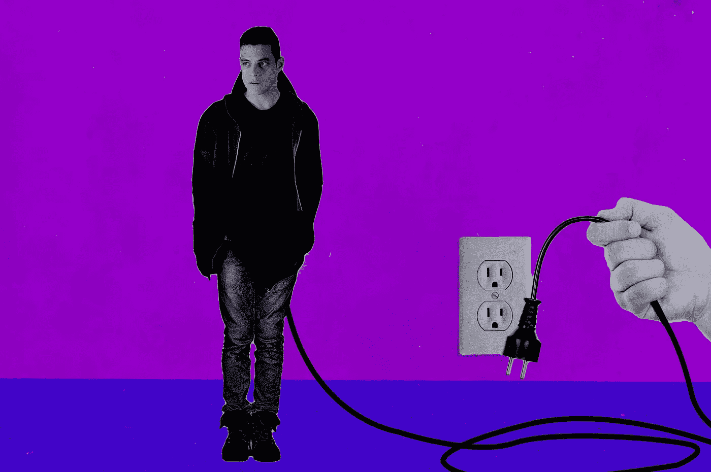
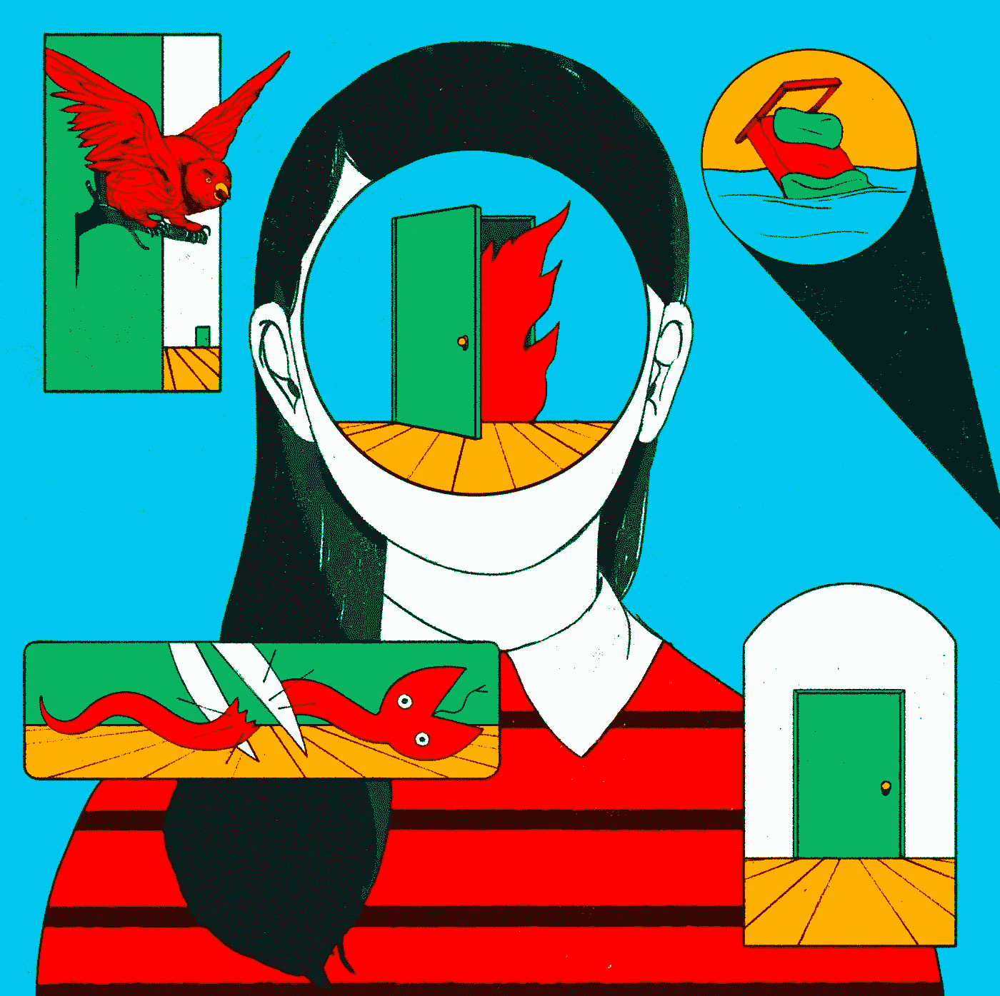
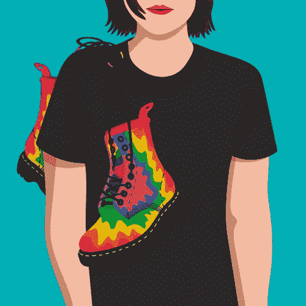

# 脱离结果——只有一种方法可以预测结果

> 原文：<https://medium.com/swlh/disconnect-from-the-outcome-theres-only-one-way-to-predict-the-result-c90331243828>

Image Credit: USA/[Ringer Illustration](https://www.theringer.com/)

外面有很多建议。我们被淹没在其中。似乎每个人都可以告诉你如何成为热门人物，如何成为博客写手，如何拥有完美的身材，如何摆脱所有的健康问题。

**我们非常重视结果**以及尽快实现这些结果的步骤。我学到的，也是我想和你分享的是，脱离结果就是你得到结果的方式。

我想亲自激励数百万人，如果我每天坐在那里看仪表盘和分析，我永远也不会达到这个目标——别担心，我试过这个策略:)

我试图预测什么样的建议或想法会引起人们的共鸣。我试图预测是什么改变了我的健康。
我试图预测我是如何战胜精神疾病的。

我实现这些结果的第一个方法是**脱离结果。**

# 沉迷于这个过程。

我甚至没有意识到，我发现你获得结果的方式是迷失在过程中。

我不确定我写了多少文章，也不确定每篇文章有多少份额。我对这两个结果如此不清楚的原因是，我已经疯狂地爱上了这个过程。

## 流程是这样的:

1.  周六早上醒来，在上午 9 点到下午 5 点之间写四篇文章
2.  周日晚上，编辑每篇文章
3.  周一晚上，为每篇文章找些照片，安排好所有照片的发布时间
4.  每天早上分享两个 LinkedIn 状态，晚上分享两个

这就是我写博客的整个过程。我每周都做同样的事情——除了在度假和休息的时候。

自从开发了这个过程，我就对它着迷了，因为它对我有用。这是一个我无论如何都能管理、理解和执行的过程。这是我独特的过程，这也是我喜欢它的原因。

在这个过程中有外界的影响，我从很多人那里借鉴，但这是我现在使用的独特方法。

> “没有人能 100%告诉你你的过程会是怎样的。你必须爱上你自己的过程，否则你永远不会执行它”

Cristina Daura, Illustration for the project #BorraelSida

继续尝试发现其他人的漏洞，并专注于为什么你没有得到结果，这就是你失败的原因。

# 你永远无法预测结果。

我们许多人认为我们可以预测结果。我们不能。

生活是随机的。时间是你无法控制的。我职业生涯中所有的成功都是在我最意想不到的时候获得的。

我唯一能相信的是，如果我遵循我的过程，努力工作，我最终会发现什么行得通，什么行不通。重点应该是做好工作——而不是如何玩弄系统，学习更多的策略或沉迷于数字。

> “这是一个简单的转变，从关注结果到关注过程，做对你有长期帮助的工作”

正是这种认识和乔恩·韦斯顿伯格的评论🌈关于不看帮助我专注于重要事物的统计数据。大多数时候，当我认为我会得到我想要的结果时，我没有。

当我破产、失业、单身或沮丧时，不知何故我得到了结果。

> 结果是随机的，但是做工作和遵循你的过程是随机的。

# 一种(也是唯一一种)预测结果的方法。

对于那些错过的人来说，预测结果的方法是通过工作。

你们很多人都有借口解释为什么没有得到自己想要的东西。你们中的许多人说你们想要 X 目标，但是回家后看了一晚上《网飞》,却从来没有朝它采取行动。

你们中的许多人在上班的路上都有很棒的想法，但是不要沉迷于把它们写下来，这样你就不会忘记它们。

我们说我们想要某些结果，因为它感觉很好，然后我们什么都不做。

> “谈论你的希望和梦想，并对它们进行研究，感觉像是一种进步——事实并非如此”

事实是投入时间是非常困难的。你经历了精神枯竭，持续的怀疑，你的家人希望你花时间和他们在一起，放松的时间更少，以及许多其他困难的因素，这些都需要我用 2000 多字来完成。

结果来自于工作。

# 你会想出策略的。

通过对你着迷的一件事做日常工作，你以后会发现细节。没人告诉你这些。

即使你不那么聪明(像我一样)**通过工作的痛苦，你会明白什么可行，什么不可行。**

就我而言，我已经明白了什么能激励人们，什么不能。这来自于数百篇博客文章和分享我的每一个想法。

你不能计划战略，因为它总是在变化。三年前对我有效的方法不再有效。曾经让我感兴趣和激励我的东西已经完全改变了。

我学到的是，我读的关于我对自我提升的热爱的书越多，我就越意识到有太多的废话建议和策略不起作用。

你需要一个策略，但你会在行动中找到自己的策略。

Image Credit: [Carra Sykes](http://www.carrasykes.com)

# 别再想结果了。

结果就是这样。
你是人，这意味着你有大脑，你不傻。你最终会发现什么对你有用，所以不要再考虑结果了。

开始吧。做工作。痴迷于你的手艺。

做实践者而不是梦想家。

# 行动呼吁

如果你想提高你的工作效率，学习一些有价值的生活窍门，那就订阅我的私人邮件列表吧。你还将获得我的免费电子书，它将帮助你成为改变游戏规则的在线影响者。

[**点击这里马上订阅！**](http://timdenning.net/free-ebook)

## 这篇文章发表在[《创业](https://medium.com/swlh)》上，这是 Medium 最大的创业刊物，有+ 374，357 人关注。

## 在这里订阅接收[我们的头条新闻](http://growthsupply.com/the-startup-newsletter/)。

