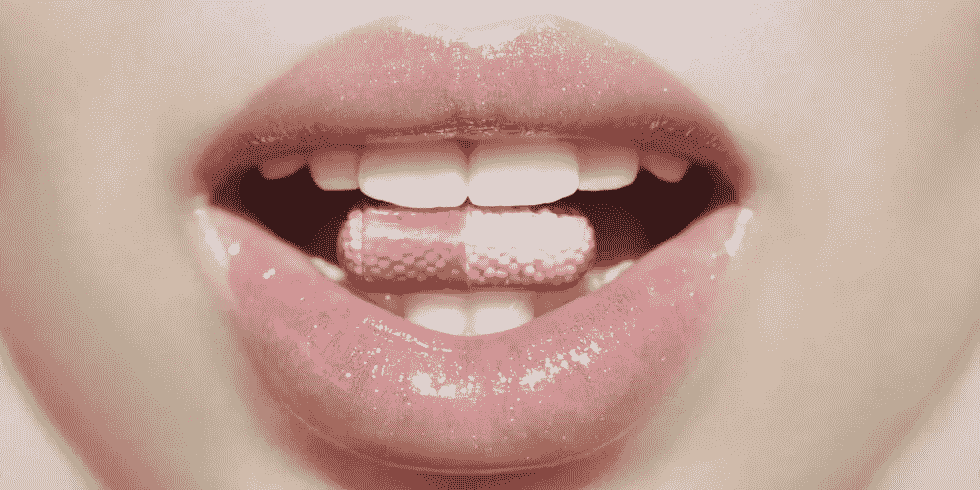
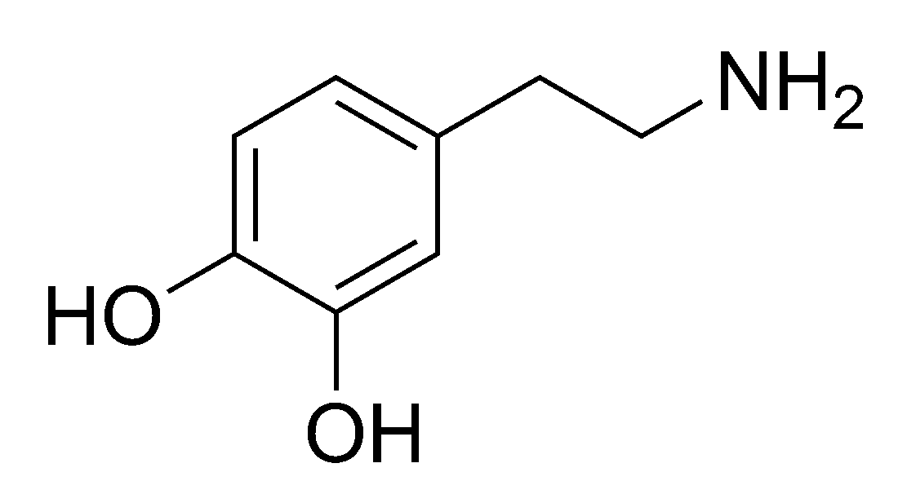

# 折扣、发现和快乐

> 原文：<https://medium.com/swlh/discounts-discovery-delight-3516dc2917c8>

## 驱动欲望的 3Ds

# 在时尚界和零售业，多巴胺是首选药物。

从技术上来说，*多巴胺*是“欲望”的神经递质。多巴胺跨越我们大脑中的突触来控制我们的奖赏和愉悦中枢。它会让人产生渴望。它会导致重复行为。它让我们想要更多。

因此，创造能诱导消费者释放多巴胺的产品和体验符合我们的最佳利益。我们自己也可以用一些多巴胺。

在我们的时尚和零售世界，有三种主要的刺激，*、【3Ds】、*我们可以控制释放多巴胺:*折扣、发现和喜悦。*

# 折扣

“折扣”是广为流传的首选“入门药”。当我们以 40 美元的价格提供 60 美元的产品时，多巴胺的产生不是来自 40 美元的巨大价值，而是来自 20 美元的折扣。顾客渴望折扣，因为折扣让他们感觉良好。

# 折扣导致多巴胺奖励。

打折不仅会让消费者上瘾，也会让经销商上瘾。

去年，NRF 的一份报告发现三分之一的购物者说他们购买的礼物 100%都是打折的。预测分析公司[First Insight](http://www.firstinsight.com/)Inc .进行的另一项研究发现，在许多女装产品类别中，消费者平均愿意支付 76%的要价。该公司还报告说

> 45%的女性必须看到至少 41%的折扣才会考虑进入商店。

正如许多上瘾一样，这种痛苦需要随着时间的推移增加剂量:20 美元的折扣，导致 50%的折扣，更大的常规折扣激增。

贴现也是一个[零和游戏](http://www.investopedia.com/terms/z/zero-sumgame.asp)。我们以多巴胺折扣的形式提供给消费者的每一美元，都是我们从自己口袋里掏出的一美元。这不是我们想经常玩的游戏。

# 发现

“发现”是一个完全不同的公式，产生类似的，但最终更健康的多巴胺释放。发现是“寻宝”，提供产品和环境，鼓励消费者探索我们的产品组合，发现意想不到的奇迹，从而找到令人愉快的解决方案。

探索曾经是百货公司的专利。马文·特劳布(Marvin Traub)是布鲁明戴尔百货公司(Bloomingdale's)的前首席执行官，也是传奇人物，他是通过发现提供多巴胺的大师；他创造了一些活动，向热衷购物的人展示未知的世界奇迹。

逛商场曾经给购物者带来回报；但是，不再是了。随着百货商店的规模和债务的增加，discovery 让位于更安全的库存周转、销售十拿九稳和“要么玩大的，要么回家”策略。百货商店放弃了寻宝发现，转而选择了其他零售商，包括快时尚玩家 [H & M](http://www.hm.com/us) 和 [Zara](http://www.zara.com/) ，低价零售商[罗斯商店](http://www.marketwatch.com/story/ross-stores-treasure-hunt-experience-is-its-best-weapon-against-amazon-2016-11-18)和[马歇尔商店](http://www.tjx.com/index.html)，以及仓储俱乐部，尤其是[好市多](http://www.costco.com/)。

# 高兴

“愉悦”中的多巴胺来源于为消费者提供他们想要的东西，他们想要的时间和地点，他们想要的库存，他们选择的尺寸和颜色，他们想要的服务和治疗水平——每一次。无摩擦的购物和购买是制造快乐的基本要素。快乐的精确公式因渠道、消费者和分类而异。[苹果店](http://www.apple.com/news/)、[老海军](http://oldnavy.gap.com/)、 [Net-a-Porter、](http://www.net-a-porter.com/?&cm_mmc=GoogleUS--c-_-NAP_EN_NY-_-Brand--NetAPorter_Phrase-_-net-a-porter_p_kwd-753058608_AM&gclid=CjwKEAjwwcjGBRDj-P7TwcinyBkSJADymblTmdqXRRKPFHRkI8b6WmMJQDEXhWmP3Y04YmQA9rA2NxoC4Mbw_wcB) Warby Parker、Dollar Shave Club 各自以自己的方式提供乐趣。

当多巴胺通过“发现”和“愉悦”传递时，其结果是提高平均单位零售量、增加购买频率、增加每个购物篮的单位数量……*以及提高消费者的满意度和忠诚度。*

# 做差异化多巴胺输送的医生。

创造你自己的触发混合，以你的方式刺激多巴胺反应和零售欲望。对于大多数公司来说，我不建议完全消除“折扣”这一因素:还记得 JC Penney 试图这样做的失败尝试吗？

这将是你独特的配方，所有三维的微妙平衡，折扣，发现和喜悦，这将为消费者提供极大的满足感，快感，并希望回来更多。

*大卫·j·卡茨，纽约州，2018 年*

 [## 大卫·j·卡茨| LinkedIn

### 查看世界上最大的职业社区 LinkedIn 上大卫·j·卡茨的个人资料。大卫 j .有 5 份工作列在…

www.linkedin.com](https://www.linkedin.com/in/davidjkatz/) 

David J. Katz 是行业领先的跨国消费品公司 Randa Accessories 的首席营销官，也是世界上最大的男士配饰公司。

他的专长是与零售商、品牌和供应商合作，在不断发展的市场中创新并取得成功。

大卫被领英选为 2017 年“[最佳声音。](https://www.linkedin.com/pulse/linkedin-top-voices-2017-must-know-people-inspiring-todays-roth)“他被*女装日报*评为[引领时尚产业](https://www.google.com/url?sa=i&rct=j&q=&esrc=s&source=images&cd=&ved=0ahUKEwjO-M2y7ITYAhUHKiYKHcheAlkQjRwIBw&url=http%3A%2F%2Fwwd.com%2Fwwd-publications%2Fdigital-daily%2Fmondays-digital-daily-april-3-2017%2F&psig=AOvVaw1UUxt9X_VP2djw_y76zFzB&ust=1513180933315355)，被*先生杂志*评为[男装推动者](http://www.mr-mag.com/menswear-movers-of-2016/)。

他是一名公共演说家，也是畅销书《设计应对:有效的创意直接营销》的合著者。他的言行被刊登在《纽约时报》、《华尔街日报》、《纽约杂志》、《赫芬顿邮报》、《先生杂志》、《WWD》。

大卫毕业于塔夫茨大学和哈佛商学院，他是神经科学、消费者行为和“刺激与反应”的学生。巴甫洛夫这个名字听起来很耳熟。

## 这篇文章发表在 [The Startup](https://medium.com/swlh) 上，这是媒体最大的创业刊物，拥有 297，332+人关注。

## 在这里订阅接收[我们的头条新闻](http://growthsupply.com/the-startup-newsletter/)。

