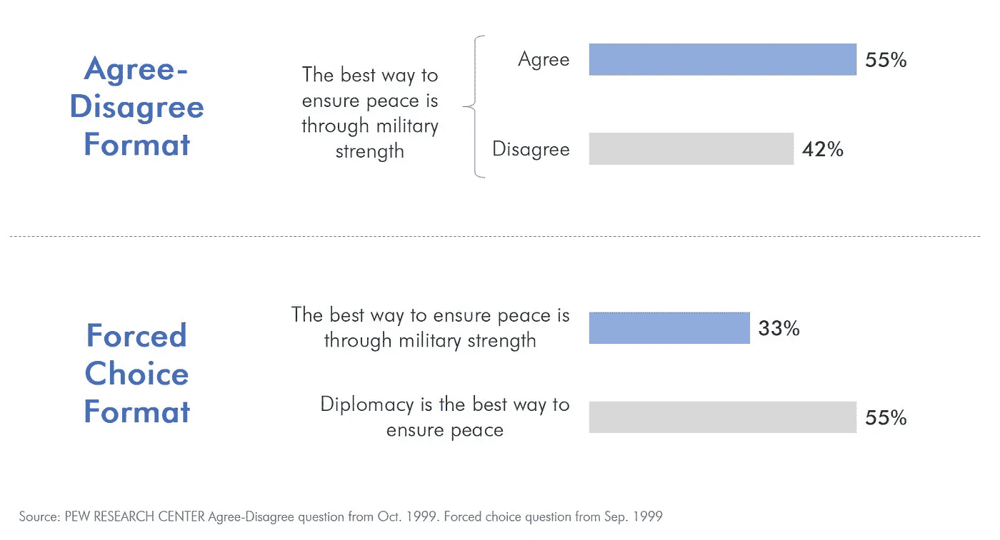
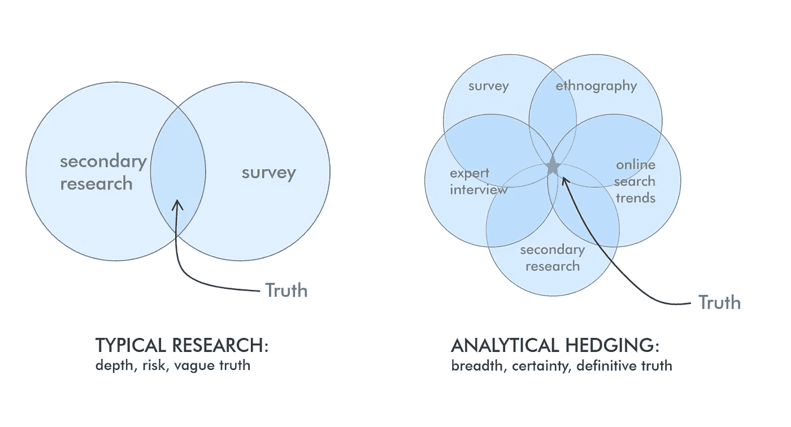

# 发现你的策略:如何进行重要的研究

> 原文：<https://medium.com/swlh/discover-your-strategy-how-to-craft-research-that-matters-f69c9964d450>

当谈到市场研究时，有一个普遍的误解:这些数据将风险排除在决策之外。我们相信，通过用硬数据支持见解和战略决策，我们能够证明我们在做正确的事情。但是报告底部的小星号并不仅仅表示采购。它意味着得出结论的某种方法和所有的假设。不，大样本量救不了你。

每一种方法都在它要求你做出的假设中带有风险，没有一种方法是没有假设的。此外，每个研究人员、经理和首席执行官都带有确认偏见，没有人是没有心理偏见的。其结果是我们目前浪费时间和资源的现状，误导性的发现，以及在决策中对研究的普遍忽视。

但是如果有一种方法来承认和补偿研究中的风险呢？理论上，我们使用我称之为**的分析对冲**，即通过组合一系列方法来补偿研究假设的做法。通过对冲研究中的风险，并将我们的预算分成一系列轻松的方法，我们实现了更快、更准确、更低成本的产出。其结果是一个集中的、有用的事实，为即将到来的战略决策提供信息，而不是出售更多的研究。

# **研究隐藏的风险**

不存在单一的铁证研究方法。每一种方法都有一系列的假设，除非得到承认，否则会给我们试图通过这项研究做出的决定增加风险。

假设并不总是坏事。事实上，它们在复杂的世界中提供了必要的清晰性，让我们能够评估我们的假设和观察。没有噪音的信号。但是在学术社会科学中，我们从一个有许多假设的简单模型开始，然后补偿我们的分析顺序以控制额外的复杂性。通过一个简化的模型来审视我们的世界是非常有用的，但我们必须记住，无论何时我们加入假设，我们都是在为一个简单的世界而不是真实的世界设计研究。

> **我们需要停止拿我们研究的可靠性开玩笑。数据的收集、解释和呈现在本质上存在假设和偏见的缺陷。**

每当我们接受一项研究任务时，都会有风险:样本偏差、确认偏差、取悦客户偏差。我们的大脑天生就能发现不存在的模式。人种学存在风险，少数人的世界可能不代表整个世界。实验是有风险的，在实验中，你的控制设置可能不能反映真实世界的环境。焦点小组是有风险的，群体思维、大嗓门和乐队主义会左右谈话。二次研究也有风险，要承担原始研究人员的所有缺陷，加上你自己议程的偏见。

调查中的风险尤其高，因为数字的存在会安抚利益相关者，让他们接受统计上无关紧要的均值比较。撇开选择偏见不谈，即使是最细微的措辞和格式的细微差别也会造成调查结果的差异。[最近的一项研究表明，共有 48 种常见偏差](https://www.ncbi.nlm.nih.gov/pmc/articles/PMC1323316/)，包括看似微不足道的选择，如调查选择按钮是在问题的左侧还是右侧。以下是皮尤的一个例子，说明问题措辞如何显著改变调查问题的结果:

不仅方法假设存在风险，研究人员自身的能力和彻底性也存在风险。这一风险正在增加:随着调查的商品化和二手数据的廉价获取，研究和明智决策之间的差距只会越来越大。

# **使用分析对冲**

研究是一种内在的有价值但有风险的资产，克服这种风险的最好方法是用一系列方法来补偿它。就连学术界(可以说是研究的最高层次)也要接受同行评审和更新，作为承认风险的一种方式。有人称这种方法为溯因推理或元分析；我称之为**分析对冲**。通过明智地结合四、五或六种研究方法的发现，我们可以围绕假设进行设计，并找到确定的真理。最重要的是，分析对冲允许研究人员轻松接触每种方法，因为研究结果将通过大量的努力产生。

把它想象成一个金融投资组合:你不会想把所有的积蓄都投资在一只股票上。当然，该公司现在可能很成功，但如果只下一次注，仍然存在内在的波动风险——最好将你的资产分散到不同类型资产的明智组合中(股票、债券、国债)。这个原则也适用于研究:不要依赖一种方法，即使样本量很大。

添加更多的方法会产生缩小效应，将研究发现和数据转化为集中的、可用的事实。

相比之下，例如，一个综合调查的结果会导致许多数据的删减和不集中的发现。但是作者和分析师都对他们自己的偏见视而不见，而且从本质上来说，他们无法判断什么时候他们在歪曲信息。当我们添加更多的方法时，我们就有能力利用和加强研究之间的共性，并且忽略误导性的信息。

在实践中，分析套期保值特定于可用资源，我们将根据手头决策的性质从以下方法中选择。我们通常从审查公共资源开始，包括财务报表、新闻稿、搜索趋势和体验审计。这与观察工作相结合，包括现场实地工作、平台数据和分析以及专家访谈。最后，我们还希望包括调查、市场内 A/B 测试和概念测试研讨会等实验。结合前面提到的一些或全部，共同的线索开始围绕市场真相连接起来。最终的产品应该是一个以这些事实或决策点为中心的文档，并有来自多个来源的事实作为证明。

# 切实的成功

我的团队最近接手了一个设计博物馆的营销项目，规划会员项目和一个旨在筹集资金的新品牌定位。通过利益相关者访谈和人种学，我们发现有明显的机会通过增强福利和现场信息来加强博物馆的会员计划。

但是我们的分析并没有就此结束:使用财务报表分析，我们发现该组织的会员计划的投资回报率很低，并且逐年下降。这个发现完全改变了我们推荐的轨迹。通过对冲我们的研究工作，我们能够将我们的战略从瞄准会员转向瞄准潜在的董事会成员和志愿者。我们不仅制定了高回报战略，还成功避免了在实施过程中走上歧途。

我们的目标是明智的决策。有时感觉客户和涉众试图质疑方法，因为他们不同意这些发现。不过，他们没有错。是时候剔除我们对调查和分析的过度依赖了，它们提供了一种虚假的安全感。仅仅使用一种方法不足以宣布一个没有假设风险的解决方案。**分析对冲**，结合了轻触式研究方法，成本低，价值高，因为它提供了无风险的真相。

研究利益相关者最终想要做出一个可靠的决定，因此研究应该根据它的有用性来评估，而不是它的样本大小。难怪如此多的研究成果被搁置在公司的书架上积满灰尘。

Andy Rooks 是 Theory Marketing Partners 的创始人兼战略总监，这是一家专注于研究和战略服务的选择性咨询公司。在 www.theorymarketingpartners.com 了解更多信息

## 这个故事发表在[的创业](https://medium.com/swlh)上，这是 Medium 最大的创业刊物，有 355，974+人关注。

## 订阅接收[我们的头条新闻](http://growthsupply.com/the-startup-newsletter/)。

