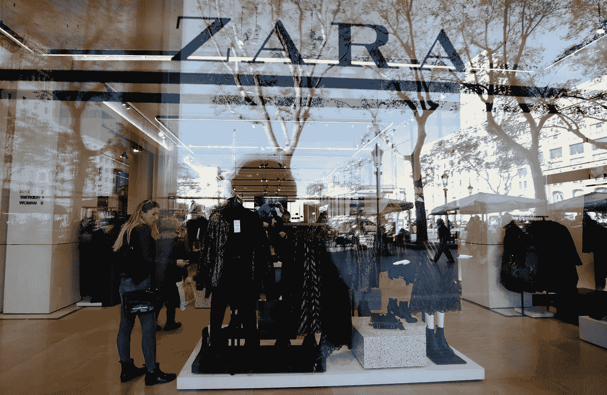
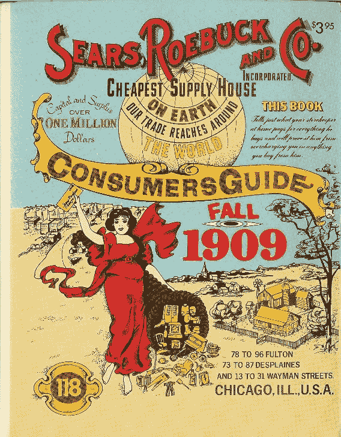
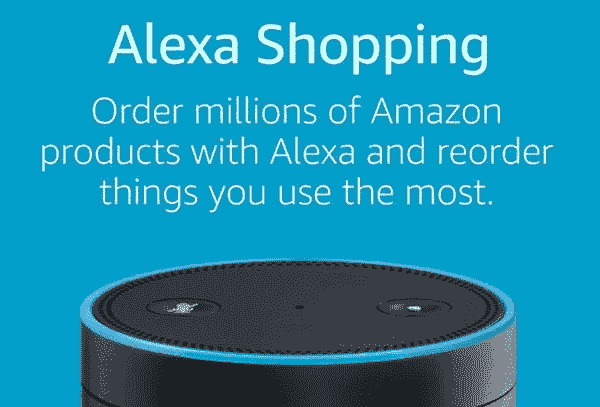

# 中断是不可避免、必不可少且痛苦的

> 原文：<https://medium.com/swlh/disruption-is-inevitable-essential-painful-2cb18ab29aa5>

## 美国有太多的商店，太多的库存，太少的购物者。

梅西百货、 [JC Penney](http://www.jcpenney.com/) 、[西尔斯](http://www.sears.com/)、 [J. Crew](http://www.jcrew.com/) 和其他主要零售商已经宣布他们将关闭商店，因为在新的零售环境中，他们无法证明这些昂贵的固定资产的回报是合理的——因为顾客不再选择在旧模式的零售店消费。

根据人口普查数据，自 1999 年以来，美国百货公司的市值下降了近 800 亿美元。

中断的代价不仅仅是商店关门和市值缩水，还有人和工作。仅西尔斯、梅西百货和 JC Penney 就将关闭 300 多家商店，裁员 12000 人。

你不能缩小通往成功的道路。但是，你可以给自己买更多的跑道。

# 向下的赛跑

正如《财富》杂志所报道的，“美国百货商店能生存下去吗？”First Insight 和其他公司的研究表明，消费者愿意支付“许多产品类别中要价的 76%”，并且“45%的女性必须看到至少 41%的折扣才会考虑进入商店。”

*2017 年是零售业有记录以来促销力度最大的一年。包括促销折扣在内的购买数量在 11 月跃升了 79%,在 12 月的前两周，是去年的两倍多。尽管对包括塔吉特、美国柯尔百货公司和梅西百货在内的几家零售连锁店来说，这一年的结束还是相当不错的。这些促销活动不足以拯救这一年、数百家商店或数千个工作岗位。*

# 时尚和零售行业又经历了极具挑战性的一年。

这不是新一届美国政府、天气或者美元的强势。也不是产品分类或品牌相关性或对恐怖主义的恐惧，尽管这些都是造成挑战的原因。

这种挑战在一定程度上是为了应对电子商务的增长、商场客流量的下降以及在一个充满数字设备的世界里人们对时尚和服装的普遍冷漠。

互联网对消费者支出的影响超出了所有人的预期，而且这种影响的速度正在加快。无处不在的价格透明度已经升级，并允许甚至鼓励消费者比以往任何时候都更加以折扣和价值为导向。只需点击一下按钮，就可以获得公正的产品评论。今天的消费者在产品和定价方面受过高等教育。

一个品牌、一个供应商或一个零售商再也不能利用他们顾客的无知；现在反过来了。

# 这种颠覆不全是数字化的。

大多数商务发生在，并将继续发生在物理销售点。50%的顾客在过道购物时手里拿着智能手机。手机现在是店内购物体验的延伸。而且，今天的产品有实体的、数字的、虚拟的，甚至是借来的。

不仅购买途径、产品和供应链发生了变化，这些购买的计划和时机也在演变。“立即购买，立即穿戴”不仅适用于季节性商品，也适用于反季节商品。一年 365 天，你都可以在网上找到各种当季品牌和尺码，无需提前计划。

# 而且，它变得越来越快——快得多。

[华尔街日报](http://www.wsj.com/articles/fast-fashion-how-a-zara-coat-went-from-design-to-fifth-avenue-in-25-days-1481020203)最近描述了 Zara 将新外套推向市场的过程。Zara 的经理、设计师、采购员和营销团队紧密合作，开发出一个外套概念。样板师很快就做出了符合既定趋势的服装原型。他们只花了五天时间就想出了一个设计。然后，当地制造商在 13 天内制作了 8000 件大衣。Zara 将这些送到西班牙的物流中心，用卡车运到巴塞罗纳机场，24 小时内它们就到达了 JFK，被送到第五大道的一家商店。

*不到一个月就按比例画出草图。*

此外，消费者将更多的可自由支配收入花在“体验”上，而不是“物品”上。餐厅、音乐会、电影和度假已经成为超越毛衣、手表和手袋的“首选”礼物。

今天的零售商不仅与其他实体和数字零售商竞争，还与 iTunes、网飞、Shake Shack、坎昆之旅和碧昂斯演唱会竞争。

历史上，很少有传统零售商能够成功度过这种混乱。然而，在不断变化的商业模式、新产品分类和满足消费者不断变化的需求的新方法的推动下，一些零售商将会繁荣，另一些将会出现。

# 零售业的混乱并不新鲜。

事实上，自零售业诞生以来，颠覆就一直是零售增长和成功的催化剂。

1900 年，我的曾祖母来到美国，在她当地的普通“干货”商店购物，她和店主交谈，店主了解她，也了解她家人的需求。

西尔斯用 1909 年的西尔斯圣诞目录打破了这一标准，这是一个 1200 页的庞然大物，*把购物带进了我们的家，* *向我们展示了数千种我们从来不知道的商品。*

随着工业化的继续，美国人口开始从农村地区向城市迁移，每个大都市中心都有自己独特的“百货商店”

第一次世界大战、繁荣的二十年代、大萧条、禁酒令、第二次世界大战改变了零售业的格局，因为巨大的经济、政治和消费者干扰重新定义了产品、服务和体验。

世纪中期带来了州际高速公路法案和数百万辆汽车，加上二战后的繁荣和持续的城市发展，郊区出现了。大型购物中心和地区性连锁百货商店很快紧随其后，购物成了社交活动的一个环节。

到了 20 世纪 70 年代和 80 年代，情况发生了很大变化，百货商店不得不*走向全国，走不同的路，或者离开*:如梅西的合并，代顿·哈德森转变为目标商店，蒙哥马利·沃德未能发展所示。

80 年代和 90 年代继续将百货商店从地区性扩展到全国性……个人电脑的出现以及随之而来的“万维网”的创建。1997 年，Amazon.com 的舞台已经搭好，把蹦蹦跳跳的 s *带回了我们的家，为我们提供了数以百万计的我们从来不知道可以买到的产品。*十年后的 2007 年，iPhone 将购物带到了我们的手中——随时随地。

今天，我们的家为我们的家庭做了大量的购物。Dash 和其他“物联网”设备“感知”我们的使用情况，并代表我们“及时”下单。而亚马逊的 Alexa 听我们在家里说的每一句话，回答我们的问题，播放音乐，给我们的购物车添加物品。我们再一次与业主交谈，他了解我们，也了解我们家人的需求。

# 颠覆不仅不可避免，而且必不可少。

> 正如迪伊·霍克所说，“问题从来不是如何让新的、创新的想法进入你的头脑，而是如何让旧的想法出来。”

颠覆是零售达尔文主义的火花。*干扰，就像森林火灾一样，移除杂草丛生的障碍物，为新的生长腾出空间。*

# 零售中断的人力成本

这种对颠覆作为创新和未来增长的刺激因素的描述，最大限度地降低了旧模式被新模式迅速取代所带来的实实在在的人力成本。成千上万的家庭直接受到零售市场这一转变的影响。

每关闭一家商店，都会产生连锁反应，导致经济和个人后果成倍增加。购物中心的每一家商店关门都会影响购物中心和邻近商店的总客流量。更少的商店意味着更少的产品需求，这意味着更少的批发商，工厂和供应商的工作。每个失业或就业不足的工人贡献给零售支出的收入更少。

尽管会很痛苦，但对公司和员工来说，隧道尽头唯一的曙光是彻底改造。快速有效地开发新技能、新收入模式以及适应经济生态系统持续变化的能力至关重要。

*颠覆是发明之母。预计分娩会很艰难。也期待健康的后代。*

# 在这一新的格局中，新的增长已经显而易见，零售创新蓬勃发展。

从成功的数字优先公司，包括 [Warby Parker](http://www.warbyparker.com/) 和 Dollar Shave Club，到[耐克&阿迪达斯在曼哈顿的新实体“超级”商店](http://fortune.com/2016/12/14/nike-adidas-retail-future/)，这些商店以其他商店无法比拟的方式倡导沉浸式零售体验——包括店内个性化、运动咨询和篮球场——零售业以新的方式蓬勃发展，并创造新的就业机会。

现在西雅图的杂货店通过面部识别来识别顾客。相机、传感器和软件监控顾客触摸、放入篮子或返回货架的一切，将它们放入“虚拟”亚马逊购物篮。购物结束后，顾客只要走出去，他们的账户就被充值了，一切都结束了。去年秋天，亚马逊通过无人机完成了首次商业送货。无人机还会飞过沃尔玛的仓库，盘点库存并优化“挑选和包装”的履行，而全球各地的机器人则在制造、物流甚至时装秀上提供帮助。

# 前面有“我们正在招聘”的标志

随着零售业向多种实体、数字和虚拟渠道迁移，店铺关闭不一定是困境的迹象，而是变化的迹象。

在一个层面上，新技术消除了零售工人的工作。然而，另一方面，新的就业机会正在为提升剩余商店的店内体验的员工、制造商、安装和维修相机、传感器、机器人和硬件系统、程序员、无人机操作员创造。新的商业模式需要对我们的劳动力进行再培训，工人们需要积极主动，站在队伍的最前面。

而且，尽管你可能会把亚马逊描绘成一个颠覆性的公司……从现在起到 2019 年年中，该公司*将再雇佣* [*10 万名全职员工。*](http://fortune.com/2017/01/12/amazon-full-time-employees/)

值得注意的是，普华永道的研究数据照亮了零售工作的积极前景:

> 商店角色的变化、顾客期望的高涨以及支持当地企业的愿望，可能会对零售员工的才能产生真正的溢价。
> 
> 特别是，更复杂的客户服务(个性化的建议、特殊的售后服务和展示的深厚产品知识)可能是零售商的一个差异化点，尤其是对于拥有大量实体店的零售商。

# 新的格局压倒性地包括智能设备和消除摩擦的策略，以新的方式通知购买决定。

一些有趣的新服务模式正在发展。 [Deliv](http://www.deliv.co/) 为零售商和商户提供当天送达服务，而[Curbside.com](http://curbside.com/)为商场内任何一家商店提供免下车取货和送还服务。移动设备越来越成为我们获取产品、品牌和零售商体验的“首选”来源。并且， [MCG: Market Connect Group](http://www.mcgconnect.com/) 向供应商和零售商提供第三方店内服务专家“供聘”，以在销售点吸引消费者。

随着零售商减少自己商店的员工数量，包括那些仍在营业的商店，零售服务的第三方提供商，包括上面列出的那些，正在招聘。例如，MCG 拥有超过 3000 个 W-2 职位。*(披露:MCG 是 Randa Accessories 的附属公司。)*

精明的零售商将把在线世界编织成实时增强的购物体验，提供关于特征、穿着场合、尺寸和颜色分类以及送货选项的信息。“物联网”日益增长的连接性只会加速和放大技术对购物和上市速度的影响。

*如今，联网设备比人类还多。*

新景观零售商将提供店内体验，利用技术和人力资源来无形地满足顾客的欲望，立即且没有摩擦。

预计大数据、3d 打印和人工智能将在更大规模上实现个性化和大规模定制，并提高客户参与度。再加上社交媒体、智能手机、信标和其他本地化技术，个性化将变得无所不在、有先见之明，甚至可能侵犯隐私。技术还将提供更好的合身测量，增强和虚拟现实来模拟服装，以及人工智能来设计和选择服装。

创造、传播和优化这项新技术将继续需要人类的智慧、创造力和汗水。有趣的是，这项技术的核心目标是把我们带回到零售是个人的、亲密的和人与人之间的时代。

*未来的实体零售赢家将利用实体店和店内体验作为他们最强大的资产；*与消费者面对面交流的方式。当商店与消费者相关时，它们以一种非常真实、人性化和亲密的方式将购物者、产品、品牌和员工联系起来，这在一个人们拥有更多数字联系而较少“现实生活”互动的世界中变得越来越重要。

*在真实的商店里与真实的人互动甚至可能是美国孤独流行病的解药。*

# 旧的都是新的。

与过去一样，未来的零售商和零售员工必须提供优质的产品、非凡的价值、卓越的个性化体验、顺畅的 24 小时购物、即时供货和卓越的客户服务。生存需要这些属性中的一个或多个；行业领袖将实现所有这些目标，行业工人也必须重塑自我。

*大卫·j·卡茨，2018 年——纽约市*

 [## 大卫·j·卡茨| LinkedIn

### 查看世界上最大的职业社区 LinkedIn 上大卫·j·卡茨的个人资料。大卫 j .有 5 份工作列在…

www.linkedin.com](https://www.linkedin.com/in/davidjkatz/) 

**关于“中断”的说明*

1995 年，哈佛商学院的 Clay Christensen 教授创造了术语“颠覆”。在过去的 20 年里，颠覆理论已经成为自身成功的牺牲品。该理论的核心概念被广泛误解，其基本原则经常被误用。这个术语经常被用来描述*任何*一个行业被撼动、先前成功的在位者被绊倒的情况或创新。但这种用法太宽泛了。”

正如克里斯滕森教授所定义的，“颠覆性战略”断言新技术本质上不是颠覆性的；这取决于相对于现有产品或服务的商业模式，它如何被部署到市场中。

## 这个故事发表在 [The Startup](https://medium.com/swlh) 上，这是 Medium 最大的创业刊物，有 295，232+人关注。

## 订阅接收[我们的头条](http://growthsupply.com/the-startup-newsletter/)。

