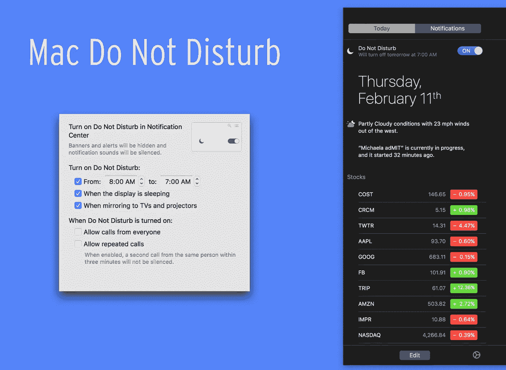
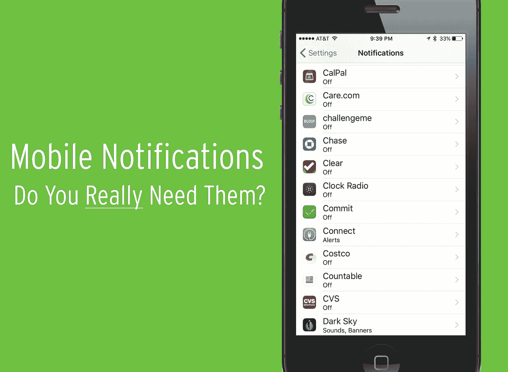
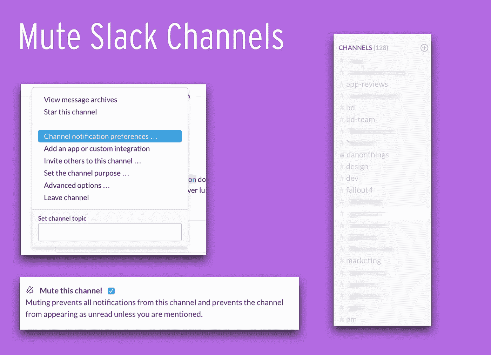
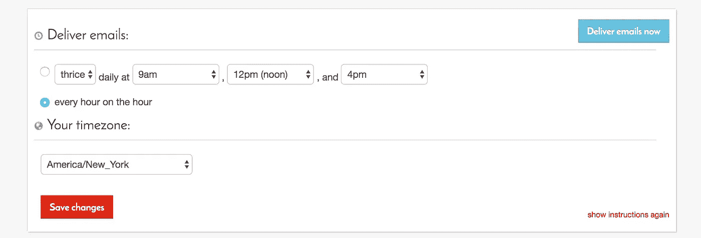
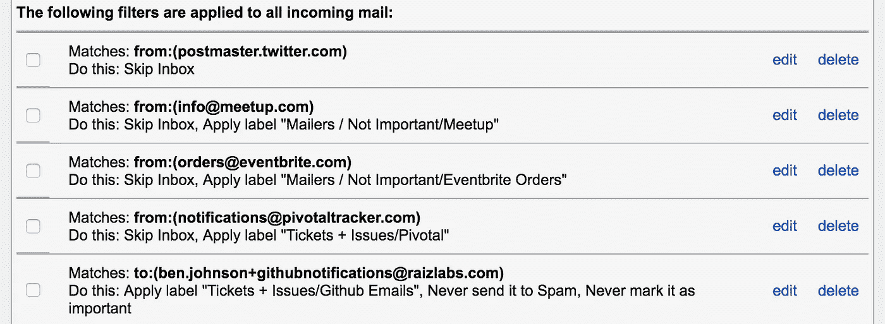
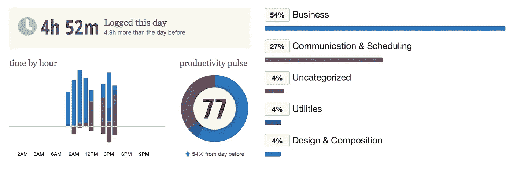

# 分散注意力的黑客

> 原文：<https://medium.com/swlh/distraction-hacks-c5f51da294a>

## 进入状态、达到禅境、获得终身幸福的实用方法…

Mr. Miyagi, The Karate Kid, Part II

进入状态会很困难。典型的例子:*你可能在分心阅读这篇文章*。但是，嘿，你来了！所以你还是留下来吧！

## 我们都很忙，所以我长话短说。

这是一份简短的清单，列出了我在当今超级互联的世界中保持清醒的一些技巧和诀窍。这些都不是革命性的，也不会花你超过 5 分钟来实现。

你准备好实现禅了吗？

## #1:打开“请勿打扰”

你的手机已经响了，你的 mac/pc 不需要。这是一个有趣的小把戏，把你的勿扰模式设定在早上 8:00 到 7:00(<< see what I did there?) so that you have 23 hours of a notification free mac. You can change these settings in System Preferences >通知)

## #2:关闭移动通知，大多数应用程序都不需要

每个人都告诉你要这样做，所以就去做吧。您可以在设置>通知>向下滚动中更新您的 iOS 设置。关闭一切，然后只重新启用最重要的应用程序。

## #3:将空闲频道静音

不管你喜不喜欢，Slack(或者你选择的即时消息)有时会让人讨厌。你猜怎么着？你可以也应该让每个频道静音。即使让频道显示为**粗体**，也会吸引你的注意力，总是分散你的注意力。你最终只会检查你关心的频道，如果你错过了什么，你就差一个 DM 了！

## #4:批量处理你的邮件

我使用一个叫做 [BatchedInbox](http://www.batchedinbox.com) 的工具来帮助解决这个问题。它是这样工作的——我把它连接到我的 gmail 上，然后我决定什么时候接收我的邮件。然后，电子邮件被 gmail 过滤器捕获，然后被转储到 BatchedInbox，以便在适当的时间返回到我的收件箱。简单，但非常有效。

一个小小的建议，在任何情况下都不要检查你的批处理盒。否则你的习惯会被侵蚀，你会开始查看收件箱里的邮件，而不是等待！

## #5:过滤你的邮件

过滤让我从大量邮件中解脱出来，如果你不熟悉 Gmail 的过滤工具[，你应该看看这篇文章](http://mashable.com/2012/06/22/gmail-filters/)。我过滤的一些东西:日历事件确认、来自 Github、Pivotal 等服务的自动电子邮件、给我发太多电子邮件但我不想报告为垃圾邮件的人、给很多人的批量电子邮件，这些邮件通常不是非常重要，可以稍后处理。

附注:为了获得额外的好处并帮助确定电子邮件的优先顺序，可以考虑使用过滤器来应用标签，例如“您已抄送”

## #6:退订！

你是否收到了很多你关心的公司发来的电子邮件简讯(但是不记得你为什么注册了)。如果是这样的话，你应该看看 [Unroll.me](https://unroll.me/a) ，这是一项免费服务，它可以将你所有的订阅邮件捆绑在一起，以每日文摘的形式发送出去。这是如此容易设置，将节省您的时间在未来。不客气

## #7:聪明点，注意你的时间和习惯

监控你的时间是非常重要的。有些人写日记，但是我已经开始使用(并且喜欢)一个叫做[的工具。它位于我电脑的后台，监控我在哪里度过时间，使用什么应用程序和网站。](https://www.rescuetime.com/ref/718661)

它们还有提醒等漂亮的功能，这样当我在一个特定的领域或应用上花了太多(*或太少*)时间时，我可以收到短信。在[改期](https://www.rescuetime.com/ref/718661)时检查它们。

所以，为达到禅境和进入状态干杯！如果你有其他建议，请在下面的评论中回复，并与他人分享——你永远不知道你可以在这个过程中节省无数的时间！

*附:我知道这是一个相当 Mac，iPhone，Gmail 和 Slack 的重点审查，抱歉，如果你使用不同的平台或工具，但同样的原则应该适用！*