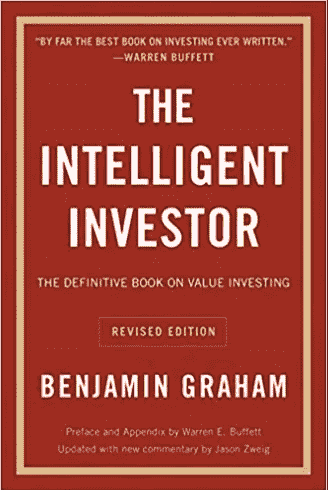
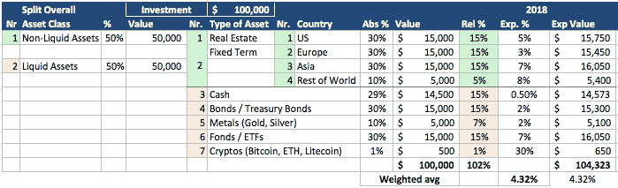

# 多元化是关键:投资的另一种方式

> 原文：<https://medium.com/swlh/diversification-is-key-or-an-alternative-way-to-investing-f08bd4e4cfe6>

一个人一生中有两个时候不应该投机:一个是他负担不起的时候，另一个是他负担得起的时候马克·吐温

**柏林，2011 年 11 月**:我正在柏林/德国等待德意志银行财富管理部的任命。我们的公司最近被谷歌收购了，我一天比一天获得更多的资金，超过了我日常生活所需。我的一个朋友帮我联系了一位来自德意志的财富经理。我不知道我应该如何管理我的资金，所以我想获得更多关于如何投资我的新财富的见解。长话短说:会议结束时，我的问题多于答案，根据他们的建议，我有一种不好的直觉(回想起来，我很感激我听从了自己的直觉——我将在本文的后面谈到这一点)。

Book cover of [The Intelligent Investor](https://www.amazon.com/gp/product/0060555661/ref=as_li_tl?ie=UTF8&camp=1789&creative=9325&creativeASIN=0060555661&linkCode=as2&tag=maxwerba-20&linkId=6b597659488d600acf071a5e1a1f35b5), Copyright by [amazon.com](https://www.amazon.com/Intelligent-Investor-Definitive-Investing-Essentials/dp/0060555661)

多亏了这次会面，我开始踏上旅程，学习投资我的(私人)基金的[最佳方式](https://entrepreneurship7.com/)。我采访了我的互联网“教父”,比如迈克尔·布瑞姆(Michael Brehm)&斯特凡·葛伦泽(Stefan Glaenzer)。我得到了一些非常好的书籍推荐(例如本杰明·格拉哈姆的[聪明的投资者](https://www.amazon.com/gp/product/0060555661/ref=as_li_tl?ie=UTF8&camp=1789&creative=9325&creativeASIN=0060555661&linkCode=as2&tag=maxwerba-20&linkId=6b597659488d600acf071a5e1a1f35b5)或者伯克郡大学的[哈撒韦](https://www.amazon.com/gp/product/0998406260/ref=as_li_tl?ie=UTF8&camp=1789&creative=9325&creativeASIN=0998406260&linkCode=as2&tag=maxwerba-20&linkId=a68ddb7000254c3d95dd6c7734723876))，并根据这些推荐开始积极投资。

*免责声明:这不被视为任何投资建议，我也不建议你以同样的方式投资。在你开始自己的投资之旅之前，请做好自己的功课，阅读* [*《聪明的投资者》*](https://www.amazon.com/gp/product/0060555661/ref=as_li_tl?ie=UTF8&camp=1789&creative=9325&creativeASIN=0060555661&linkCode=as2&tag=maxwerba-20&linkId=6b597659488d600acf071a5e1a1f35b5) *等资料:*

下面你可以找到我的痛苦，有时代价高昂的教训总结。希望能对你和你的(未来)投资有用。

1.  **定期投资。哪怕是很小的量。**

很多人问我，他们需要投资的“最低”金额是多少。最低金额为 1 美元。真的。你需要 min 的口头禅。投资 100 万美元完全是吹牛。这只需要财富管理公司，这样你就足够“大”，他们就能和你一起赚钱。除此之外，你可以从每月 10 美元开始。很明显，这涉及到交易费用，所以通常建议投资 min。50 美元，使您的每月交易费用尽可能低。我写的是如何不花 100 万就像一个百万富翁一样生活，请看第一条规则:花的比赚的少。你花得越少，你就应该投资。

**2。把你的投资作为预算中的固定成本。不是月底的“剩余”。**

在我创业的最初几年，有一件事我从来没有做到过，那就是省钱。为什么？因为我努力攒下了“月底所剩无几”。令人惊讶的是，这在大多数情况下是 0(甚至是负数，因为我提到了我的存款)。我开始储蓄和积累财富的唯一方法是开始把它作为固定成本，并在月初从我的月收入中扣除。甚至在付我房租之前。为什么？因为它被认为是“碰不得的”。更重要的是:你要相应地调整你的生活方式。如果你知道自己每月有 3000 美元或 2000 美元，你的消费行为就会不同。我可以肯定地说一件事:你不会错过任何东西。事实上，当你知道你可以用更少的钱生存，并且最重要的是，为你的(私人)投资省下钱，你会感觉更好(&更快乐)。

**3。多样化:资产类别和地理位置**

我在德国的一个好朋友(Damian Doberstein)给我推荐了一篇非常好的关于投资的博客文章(可惜是德语:[*Vermoegenserhalt hat prioritait*](https://think-beyondtheobvious.com/was-tun-mit-dem-geld-7-vermoegenserhalt-hat-prioritaet/)):投资不是为了创造财富，而是为了财富保值。意思是，很多人(包括我早期投资时的自己)认为投资就是赚(很多)钱。不，这是关于战胜通货膨胀，并有一小部分作为你的“安全边际”或收益。它不是关于赚取 20-30%(或你的密码的 3 倍利润/损失)。这是关于你积累的财富的适度回报。

那么你如何做到这一点:我开始创建一个矩阵文件，本质上看起来像这样

*   **投资金额**:这可以从 1 亿美元到 1 亿美元开始。你投资的资金越多，你的分配可能会改变。但是为了简单起见，让我们把它保持为 100，000 美元。
*   **资产类别**:然后分为非流动性资产(房地产、私募股权投资、定期存款)和流动性资产(债券、交易所交易基金、公共股票/基金、现金、金属和加密)。我(试图)在流动资产和非流动资产之间保持 50:50 的平衡。
*   **地理**:非常重要，但大多被低估了。跨地域、跨币种投资。这将帮助您平衡一个市场(如欧洲市场)与一个更不稳定的市场(如东盟市场)的表现。除了不同的地理位置，您可能会投资当地货币(因此您不会受到两个因素的影响:投资价值和货币价值(升值/贬值))。因此，你将拥有一篮子欧元、美元、澳元、新元的投资。
*   **创建你的个性化投资矩阵**:它可能看起来像这样:

Example of an personalised investment matrix

*   **计算加权** **预期收益**(基于上面的分配):我的目标是平均每年产生+4%的收益。是的，你没看错 4%不是 40%也绝对不是 400%。是的，一个资产类别(如加密)可能增长 30%(或有希望增长 400%)，但由于我在加密上的相对资产配置很低(约 1%)，我对波动的影响不大。而且俗话说:风险越高，回报越高。还有这句话的另一面，通常不经常被提及:风险越高，潜在损失就越大。我更喜欢正常的睡眠，也不用担心(除了做生意)我的私人资金。作为企业家，我面临的挑战已经够多了:)
*   **每年检查/调整一次**:是的，你也没看错。我每年(通常在六月左右)检查一次我的整体投资组合，然后决定是否投资/撤资。如果一项资产的价值增长太多(通常超过 40%)，我通常会撤资。为什么？我更喜欢 40%的回报，而不是 0 或损失。所以你要学会更加自律。损失也是一样。如果价值下跌超过 20%,我开始问自己是想在那里止损，还是(如果我真的相信这个资产类别)等到明年。这通常是更难的问题。但是，我每年只在固定的日期做一次。所以我不会受到短期思维波动的太大影响。我的律师不相信我一年只检查一次我的加密投资。我很害怕，Leber 博士——事实就是如此，这就是为什么我在过去的几年里获得了正回报。

在你开始创建你的个性化矩阵和投资财富保值之前，我想提醒你以下几点(我低估/高估了)；

*   **价值投资**:伯克希尔·哈撒韦长期成功是有原因的。我是价值投资的坚定信徒，事实上，通过遵循他们的方法，我做了最好的投资。但随着我不再有足够的时间来分析股票，我转向了 ETF，这是目前市场上参与某个市场或股票组合的最佳(也是成本上最实惠的)选择。
*   **非流动资产**:我认为某些资产为非流动资产是有原因的。是的，随着时间的推移，你可以赚钱。但这需要时间。以我为例，我在菲律宾买了一套非常超值的公寓。问题:6 个月前，我想卖掉它，但由于特定的政治形势，很难找到买家。我肯定会在公寓上赚钱，但我将不得不在上面呆上比预期更长的时间。不要低估一个资产类别是流动性的(=你可以今天就卖掉它)还是非流动性的(=清算它需要时间，而且它基本上不在你的控制之内)
*   成本平均法:这是沃伦·巴菲特多次强调的一种方法。长话短说:你不会战胜市场，会找到投资的“最佳时机”。最好的投资方式是以固定的时间间隔和固定的金额进行定期投资，这样你就可以从涨跌中获益。重要的一点是定期投资固定金额。例如，看过我的日历的人知道，我每个季度在固定条目“购买黄金/白银”中添加 1 倍，注释为 3:1。我每季度以 3:1 的比例投资固定金额的美元。通过这样做，我将确保我的投资成本平均化。意思是，我在价格低的时候买更多的资产，在价格高的时候买更少的资产。
*   现金为王:我得到了惨痛的教训。在我 25 岁左右的时候，我处于“全风险”模式。我真的不在乎赚钱还是赔钱:我想全力以赴。只要所有的外部因素都对你有利，这就会起作用。对我来说，这给了我很大的打击，因为从技术上讲，我有很多资产(几套公寓、公司股票、绘画等)，但我只分配了 1%的现金。是的，我财富的 1%被配置为现金，因为我不认为它是一个重要的资产类别。然后:我们不得不对我们投资组合中的两家公司进行再投资。严重地。糟糕——我的公司需要钱，但在接下来的几个月里，我自己只有一些现金。这是我的“啊哈”时刻，现在我将我的财富的 5%分配给现金等价物。正如我的一位商业伙伴曾经告诉我的那样:“现金对于企业来说，就像个人的氧气:从来没有想过它何时存在，当它不存在时，脑子里唯一想的就是它。”

这些是我在以财富保值为目标的不同情况下进行私人投资时学到的经验。看着我从德意志银行推荐的投资(大多数是德意志银行的产品，基于资产的费用高达 5%)，我很高兴当时我听从了自己的直觉。至少现在我对投资有了理性的态度。感谢德意志；)

*很想知道你的想法(因为我认为自己仍在永无止境的学习过程中)*

## 这篇文章发表在《T4》杂志《创业》(The Startup)上，这是 Medium 最大的创业刊物，有 358，974 人关注。

## 在这里订阅接收[我们的头条新闻](http://growthsupply.com/the-startup-newsletter/)。

