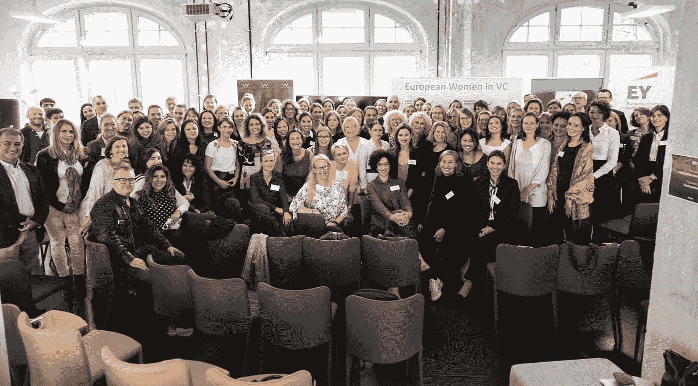

# 技术生态系统中的多样性

> 原文：<https://medium.com/swlh/diversity-in-the-tech-ecosystem-74ed7195a5c5>

扩展技术生态系统，使其包含更多跨实体的多样性(如有限合伙人、全球定位系统、董事会、初创公司等)。)而在各个层面都是值得为之奋斗的使命。幸运的是，这已经不是新闻了，从人才和机会的广度和深度来看，变革是不可避免的。那么问题就变成了:我们现在可以开始或继续做些什么来加速它？我有幸参加了上周在柏林举行的欧洲风投界女性峰会，以下是我的一些感想:

# 支持不同的团队

多样化的团队推动更好的绩效。这并不是说一个侧面或性别比其他人更好，而是关于思想、方法、观点和知识的多样性，最终导致更好、更有创造性的结果。这不是每次谁想出最好的解决方案，而是首先要有更多的解决方案可供选择。天赋以各种形式出现，如果我们想认识到它，我们需要注意我们自己的无意识偏见。

> 多样性——无论是背景、性别、种族还是性格类型——都会催化分裂。

# 管理你自己的思想

要达到你所在类别的顶端需要付出很多；一夜成名是一个神话。正如辛迪·盖洛普所强调的，要成功打破一个类别，你需要毅力、韧性和管理自己头脑的能力。我特别喜欢提到后者。在一个信息泛滥的时代，真理经常被扭曲，有许多途径可以遵循，控制我们自己的思想是我们可以努力培养的最大优势之一。

# 敢于分享你的抱负和愿景

请记住，你不一定要塑造你的雄心来适应我们现在所知道的世界；你可以定义，开拓和捍卫你自己的类别。

# 坚持让你势不可挡

不要因为“不”而气馁，也不要把它看得太重，你通常只需要几个“是”就能让你离目标更近一步。同样，不要等着被问；要求你所需要的。最坏的情况会是什么？

# 真实性胜于模仿

拿出你自己的方法，而不是试图模仿现有领导者的行为。必须鼓励一种以上的领导风格——让所有决策者都以同样的方式看待和思考，会有错失机会和盲点的副作用。挑战现状，为什么不呢？—如果系统不符合目的，主动重新设计系统。

# 帮助他人成功

许多资深女性都认同让人们相信她们或者尽早指导她们的重要性。当然，我们都应该致力于拥有不依赖于外部因素的内在自信。事实上，尤其是在开始的时候，得到你尊敬的人的信任确实有助于极大地增强你的自信。在你的圈子之外寻找你想支持的人，不要只把它留在家里。

# 放下伪装

关于挑战和最佳实践的坦诚、开放的对话令人耳目一新。更多的活动应该旨在消除形式障碍，培养这种合作精神，也许可以从确定活动的共同使命开始，提供更亲密的环境，举办互动研讨会或开放式讨论。我对这次活动的另一个欣赏之处是，有 19 名“国家大使”联合起来，确保来自欧洲各种生态系统的代表出席。

# 走出你的舒适区

不断探索，走出你的舒适区。这是最好的学习方法。在这个过程中，不要忘记休息和训练是表现的至关重要的先决条件(想想体育的类比)。

# 一个开始的地方

在你朝着目标前进的过程中，定期问自己以下三个问题:

1.  我最在乎的是什么？
2.  我如何定义成功？
3.  为实现我的梦想，下一步最好的行动是什么？

感谢组织者和我遇到的所有鼓舞人心的人。我期待着为明年的峰会出一份力。

[#EuropeanWomenInVc](https://www.linkedin.com/feed/topic/?keywords=%23EuropeanWomenInVc)

## 这篇文章发表在[《创业](https://medium.com/swlh)》上，这是 Medium 最大的创业刊物，有+ 379，528 人关注。

## 订阅接收[我们的头条新闻](http://growthsupply.com/the-startup-newsletter/)。

