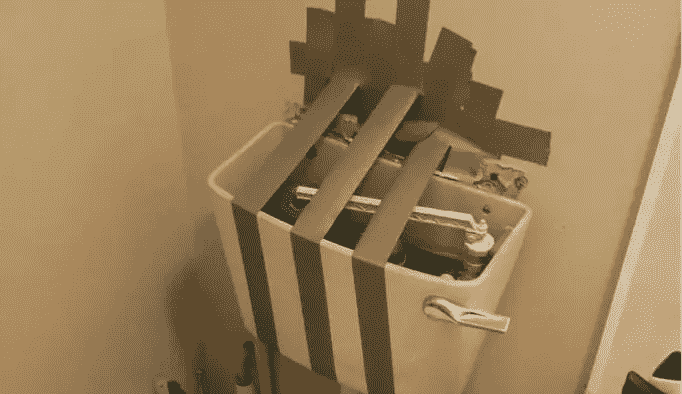

# 在开始下一个项目之前，问自己三个问题

> 原文：<https://medium.com/swlh/diy-is-killing-your-budget-3-questions-to-ask-yourself-before-you-do-it-yourself-2a9fcf8d1e61>

# DIY 可能会扼杀你的预算

*Deadpoodle / Via* [*imgur.com*](http://imgur.com/QRCgkY1)

我犯了一个错误，读了一篇关于学习自己做事的评论。其中一条评论让我在地板上打滚。一名妇女热情地声称，她编织毛衣作为圣诞礼物的“自由爱好”为她节省了大量的…