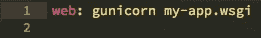
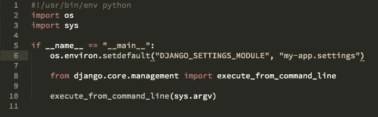
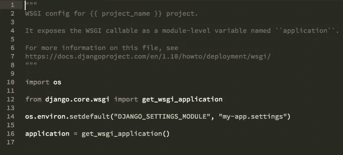
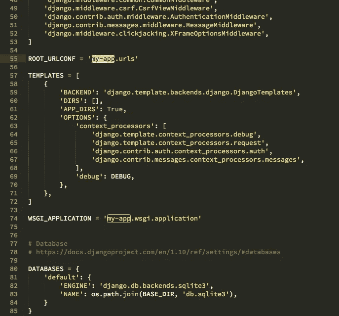
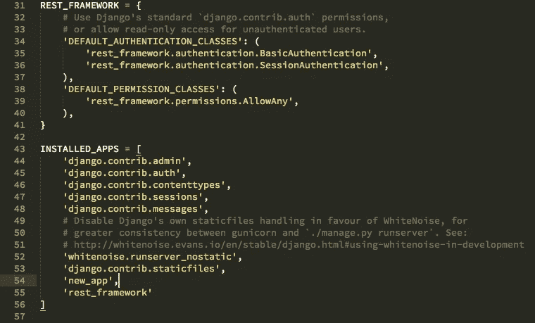
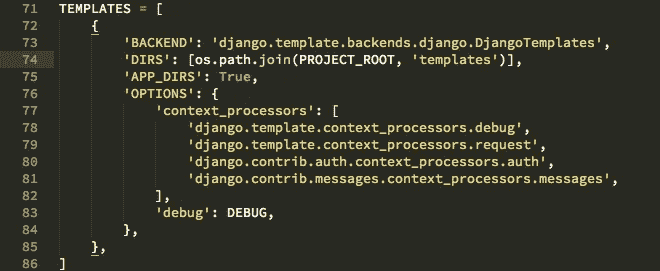
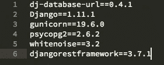

# Django + Angular =强大的 web 应用程序

> 原文：<https://medium.com/swlh/django-angular-4-a-powerful-web-application-60b6fb39ef34>


> 您知道如何使用 Django 制作 web 应用程序，也知道如何使用 Angular 构建漂亮的前端，但您可能想知道如何将它们相互集成，以构建一个兼具两者优点的 web 应用程序？

这是我学习《姜戈》和《T2》时脑子里想的事情。我希望在同一个应用程序中包含这两者，这样我就可以同时拥有 python 的强大功能和 Angular 的优良特性，而无需单独学习 node.js 来开发一个成熟的 Web 应用程序。而且，我想，你读这个故事也有同样的动机。

# 我们开始吧

先说一点背景。

Django 是一个具有各种特性和功能的一体化包。它是:

1.  快速—它是为开发人员设计的，例如尽可能快，有助于提高成本效益和效率。
2.  许多功能——许多额外功能，如用户认证、内容管理、RSS 提要等。
3.  安全—许多安全功能可防止 SQL 注入和跨站点脚本等攻击。
4.  可扩展——它可以承受巨大的流量需求，非常适合繁忙的网站。

除此之外，它还有 python，我的意思是我必须告诉它有多好吗？😉

但是为什么我们要用角形来表示呢？

因为，它是跨平台的，快速的，帮助我们做出漂亮的用户界面，这样的例子不胜枚举。更多信息请点击阅读[。](https://angular.io/features)

另外，Django 模板系统也很烂！Angular 可以帮助构建一个可伸缩的、简洁的单页面 web 应用程序。

说够了。我们自己造一个吧。

# 设置目录

1.  为我们的应用程序创建一个目录。

```
 mkdir my-app && cd my-app
```

2.为后端(Django)和前端(Angular 4)创建两个独立的文件夹

```
 mkdir backend && mkdir frontend
```

# 建立姜戈

1.  首先，下载[这个](https://github.com/heroku/heroku-django-template) repo 作为 zip 文件，并将其复制到后端目录。这个 zip 文件包含了准备用于 **Heroku** 部署的模板。所以，现在在 Heroku 上部署是没有麻烦的。
2.  解压缩文件夹，并将其重命名为您选择的应用程序名称。
3.  在文件夹中有另一个文件夹，也改变其名称为您的选择，让我们假设它为“我的应用程序”
4.  在以下文件中，使用您的应用程序名称重命名“我的应用程序”(不带引号)的所有实例:

a.Procfile



Procfile

b.manage.py



manage.py

c.my-app/wsgi.py



wsgi.py

d.my-app/settings.py



settings.py

4.现在在 Django 中创建一个新的应用程序

```
 python3 manage.py startapp new_app
```

5.将在当前目录中创建一个名为“new_app”的项目。

6.我们将使用 **DRF (Django REST 框架)**在 Django 应用程序中设置 API 来连接 Angular。点击阅读更多关于 DRF 的信息。

在“new_app”文件夹中新建一个文件“serializers.py”(不带引号)。要正确使用[处的](https://www.django-rest-framework.org/tutorial/quickstart/)DRF 头。

您可以根据您在“models.py”文件中定义的模型来更改 serializers.py。我们会做一个假人模型。

models.py 文件应该如下所示:

models.py

“serializers.py”文件应该类似于:

serializers.py

另外，不要忘记更新**设置. py** 文件，添加**“新应用”**和**“休息框架”**以及一些必要的修改(见下面第 31-41 行)。

按如下方式更新文件:



settings.py

需要更新 **settings.py** 文件才能使用模板。



settings.py

现在，创建一个新文件夹“templates”和一个文件**“home . html”**。将以下内容复制到其中。

home.html

所以，这是你需要记住的一件重要的事情。 **"home.html"** 将使用 Angular 每次更改 Angular 应用程序时生成的 CSS 和 Javascript 文件，名为:

a.样式. css

b.runtime.js

c.polyfills.js

d.主页. js

这里要记住的一点是，为了使用 Angular，在 Django 部分，我们将创建一个 home URL，如下面第 9 行所定义的，其他 URL 将是 REST API，Angular 部分将使用它来连接到 Django。

记住，Angular 部分(前端)将使用“urls.py”文件中定义的这些 REST APIs 与 Django(后端)对话。

现在，更改 **"urls.py"** 文件。

urls.py

如下更改 **"views.py"** 。DRF 用于处理 GET 请求。这里，我们只是将存储在数据库中的所有数据作为 JSON 响应返回。

views.py

您还需要通过添加 DRF 来更新“requirements.py”文件，只有在部署到 Heroku 时才需要。



requirements.py

现在，这是你需要的最基本的 Django 设置。

这很简单，对吧？只需建立 Django 项目并添加 DRF。

# 设置角度 4

现在，让我们做角的部分。

1.  转到前端目录，启动一个新的 Angular 4 应用程序。

```
 ng new my-app
```

2.现在，这是一个基本的 Angular 应用程序，但是，我们需要使用 Django 作为后端。

因此，想法是 **DRF** 将帮助我们制作 API(我们已经在前面的“urls.py”文件中定义了这些 URL ), Angular 应用程序将使用 **HTTP** 请求来利用这些 API。我们在这里用 Django 替换 Node.js。

MEAN(Mongo，Express.js，Angular，Node.js)栈现在是 MAD(Mongo，Angular，Django)栈。但是，在这个应用程序中，为了简单起见，我们只使用 SQLite 数据库。

3.去**这个**库看看 Angular app 需要的所有改动。我在这里指出必要的。

首先，我们将看到 **"app.router.js"** 文件。您可以看到在第 13 行，一个**“PageNotfoundComponent”**被用来处理 404 页面未找到错误。在 Django 中，这是一个内置特性，但是现在我们需要自己实现它。

4.在**“app . module . ts”**中导入 HttpModule 和 AppRoutingModule。

5.除此之外，都是些有棱角的东西。

所有的源代码都在我的 Github 库中。在底部找到它。

# **运行项目**

要运行 Django 服务器，只需运行

```
 python manage.py runserver
```

运行 Angular 应用程序，

```
ng build --prod --output-path /path-to your-project-directory/backend/my-app-name/my-app/static/ang --watch --output-hashing none
```

**prod** 用于生成应用程序的生产就绪版本

**输出路径**是我们放置 Angular 应用程序的目录。我们将文件放在 Django 的**静态**文件夹中，因为这些文件将作为静态文件。

**观察**告诉不断寻找 Angular 应用程序中的变化，然后立即编译并将其放置在输出路径目录中

**哈希无**删除 **styles.css、runtime.js** 、 **polyfills.js** 和 **main.js** 文件名中生成的哈希。

这就是你需要做的。记住步骤:

1.  创建一个 Django 项目。
2.  使用 **DRF** 或 **tastypie** 或你选择的任何其他 API 框架。
3.  记得在 **urls.py** 文件中定义你的 API。
4.  创建一个有角度的 app。
5.  像 404 一样处理错误页面。
6.  创建 **HTTP** 请求到您为获取和发送数据而创建的 API。
7.  搞定了。

恭喜你！！！您现在知道如何使用 Django + Angular 的力量来构建强大的应用程序。

以上代码: [Github 回购链接](https://github.com/adesgautam/dj-angular)。

请点击👏按钮，如果你喜欢这个帖子，拿着它给更多的爱。

如果您希望连接:

[**推特**](https://twitter.com/gautamades)**[**insta gram**](https://www.instagram.com/adeshgautam/)**[**LinkedIn**](https://www.linkedin.com/in/adesh-gautam-518810127/)**[**Github**](https://github.com/adesgautam)******

****[](https://medium.com/swlh)****

## ****这篇文章发表在 [The Startup](https://medium.com/swlh) 上，这是 Medium 最大的创业刊物，有+ 379，306 人关注。****

## ****订阅接收[我们的头条](http://growthsupply.com/the-startup-newsletter/)。****

****[](https://medium.com/swlh)****