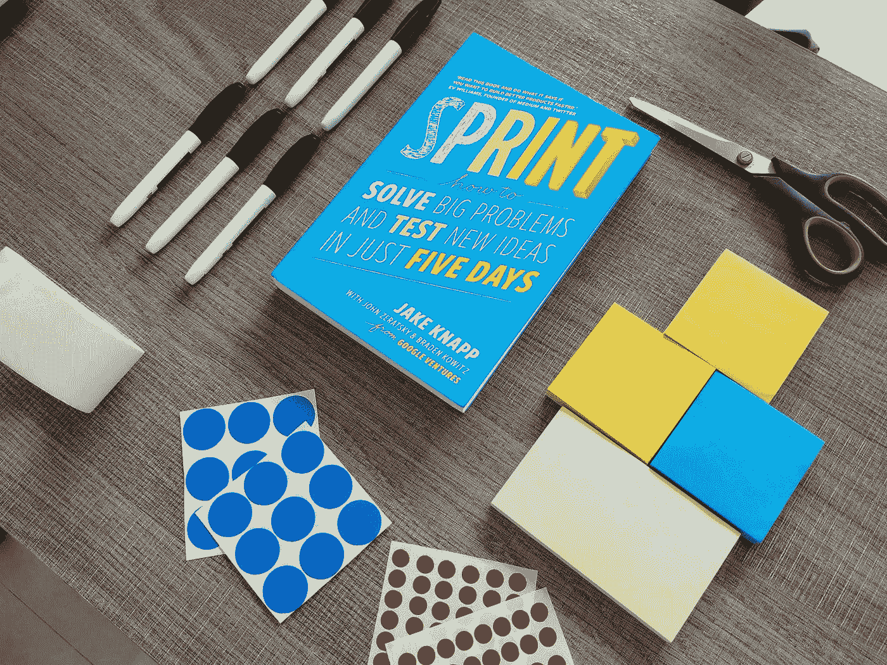
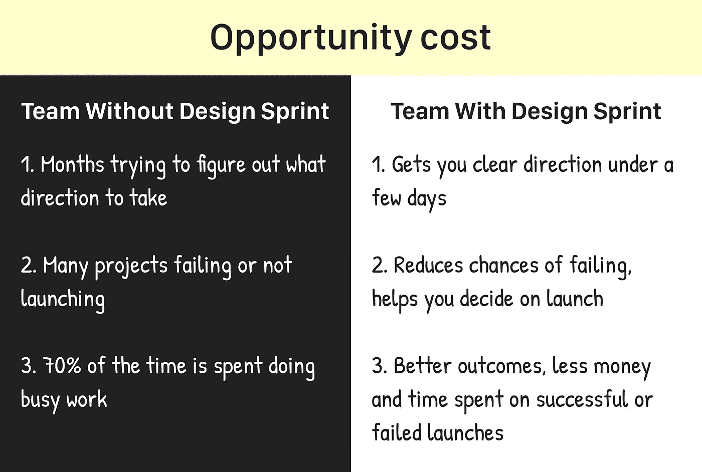

# 设计冲刺有助于提高投资回报率。怎么会？

> 原文：<https://medium.com/swlh/do-design-sprints-help-increase-roi-hell-yes-9b77d4e01330>

本文用一个简单的例子 [**John Doe**](https://en.wikipedia.org/wiki/John_Doe) 来说明为什么你应该采用设计冲刺来增加投资回报率。这篇文章没有什么花哨的东西。

这本书[冲刺](https://www.thesprintbook.com/)推出已经快两年了。它已经成为纽约时报的畅销书。在推出这本书之前，设计冲刺过程的创造者们[杰克·纳普](https://twitter.com/jakek)、[约翰·泽拉特斯基](https://about.me/jazer)和[布雷登·科维茨](http://kowitz.co/)在 150 多家初创公司中对其进行了测试。

许多人阅读了这本书，并试图为他们的组织、产品、挑战等实施设计冲刺过程。去了解它如何帮助他们。对于少数来说，因为执行不当而不顺利，然后就此打住。有很多人成功了。他们中的一些人将它作为他们组织的一部分，一些人决定在此基础上建立他们的业务。因此，它似乎已经开始在世界某个地方的组织和团队中流行起来。

但是，设计冲刺在世界大部分地区仍然闻所未闻。我的经验告诉我，当人们听说这件事时，他们会觉得很有趣。他们会问一些问题，比如是关于设计网站还是移动应用，是敏捷的一部分，等等。他们试图理解其中的原因、方式和内容。**他们最后会问这样的问题，花 4-7 个关键人物一周的时间会有什么结果？设计冲刺的投资回报率是多少？这是一个明显而重要的问题。**

让我解释一下设计冲刺的投资回报率。为此，让我们从传统流程开始。

# 传统工艺

*开始之前，我先打破一个神话。人们认为设计冲刺只能用于产品。不，不是这样的。Design Sprint 是多功能的，可以用来解决任何关键的挑战。*

但是，为了简单起见，我们举一个构建数字产品的简单例子。

无名氏，我们大多数人都认识他，对吗？他有一个很棒的产品创意。他决定开发一个数字产品(移动应用)来实现这个想法。现在，让我们看看他构建数字产品的传统流程是什么样的。

约翰会做一些市场调查、竞争对手分析、用户研究等。

在此基础上，他将为首次发布创建一个功能列表。一般我们称之为 [**一个 MVP**](https://en.wikipedia.org/wiki/Minimum_viable_product) 。

然后呢？他要么**雇佣一个开发团队，要么建立自己的团队**开始构建 MVP。

在**4-6 个月**(取决于特性或模块的规模)的开发之后，他完成了他的 MVP。

并且，他会**发射它**。

然后，他会一直等到在 MVP 上得到**真实用户的反馈**；以便他可以改进产品并推出更好的版本。通常，收集反馈需要**1-2 个月**。

这是一个没有“如果”和“但是”的一般过程。但是，事实是，在你打造 MVP 的过程中，任何事情都可能发生。可能会以混乱的方式进行无限制的讨论和会议，改变最初为 MVP 确定的特性，等等。有时，这种无组织和混乱的事情会让团队失去动力和方向，甚至更多。因此，所有这些可能会将 MVP 发布时间延长 1-2 个月。

在 MVP 上获得反馈后，相同的传统过程继续(通常)用于产品的所有后续版本。

现在，你可以想象一下 John Doe 将在 MVP 和所有后续发布上花费的时间、金钱和精力。

# 想想钱

比方说，John Doe 从一家机构雇佣了一个开发团队来构建他的数字产品。这个团队将花 4 个月的时间来建立和推出它。然后，他们将等待大约 2 个月，以获得真正的用户反馈。

在得到 MVP 的反馈后，约翰决定对现有功能进行修改并引入新功能，以给用户 [**一种“啊哈”的感觉**](https://www.appcues.com/blog/aha-moment-guide) 。同样，开发团队将开始构建产品，他们将需要大约 2 个月的时间来开发和推出这一次。John 将再次等待 1 个月，以获得真实的反馈，从而改进产品。

通过这种方式，传统流程得以延续，John 继续在产品开发上投入资金。

等等，我们刚刚忘记了维护、基础设施、营销等成本。对吗？

如果 John 建立了自己的开发团队，他需要向产品经理、设计师、开发人员、系统工程师、测试人员、业务分析师、营销人员等支付工资。

# 想想时间

现在，你已经知道当你构建和发布一个产品时，一个传统的过程是什么样子的；你应该已经了解了构建一个用户可以使用并充分利用的产品需要多少时间。

如果你总结一下 John 例子中的所有内容，他将投资**大约 10-12 个月**的时间来开发和推出一款产品，这款产品可以为 John 和 app 的用户带来一些价值。

# 约翰在他的产品上浪费时间、金钱和精力的地方在哪里？

嗯，我要说，在各种情况下，约翰在传统流程的几乎每个阶段都在浪费时间、金钱和精力。让我们看看怎么做。

首先，一般来说，产品开发团队有不同的栈持有人。而且，他们**很少为了共同的目标或目的与**相遇。如果他们见面，他们**就会陷入无休止的混乱的讨论中。**

第二，当他们陷入讨论时，他们开始得到改变，在设计和开发中开始来回发生，并且可能发生更多的事情。最重要的是，团队开始受到挫折，在这个过程中，他们失去了热情和注意力。

第三，有时他们开始从早期采用者那里得到负面反馈。这些可能是主要的反馈，并改变产品的方向。

所以，你可以看到传统工艺会给约翰带来很多损失。

还有，让我们想想**最坏的情况**。约翰的预算非常有限。现在，他浪费了所有的预算。因此，要么他不得不关闭产品，要么他不得不寻找投资者。

# 量化损失

比方说，John 雇佣了一个 5 人团队来开发产品。所以这是一个总共 6 名成员的团队(包括他)。考虑到产品将持续两到三次迭代，并需要 12 个月的开发时间。

约翰会浪费 6 个人 12 个月的时间，也就是 72 个月。

如果约翰为每个成员支付 2500 美元，他将浪费 150000 美元。另外，所有的基础设施、维护、支持、数字营销等。费用。

还有，6 个人 12 个月的所有努力。

# 设计冲刺的投资回报率

约翰会节省他所有浪费的时间，金钱和努力；如果他选择让设计冲刺成为他过程的一部分，他就不会失去热情、专注、方向和动力。

# 怎么会？

1.  设计冲刺将团队成员聚集在一起，思考并致力于他们认为重要的特定目标(北极星)。
2.  你消除了大部分不必要的口头讨论和战略、思考、设计、建造等努力。在构建和发布阶段之间。讨论以内容的形式出现，而不是音频。因此，团队中没有杂乱无章的讨论。
3.  这是一个时间限制。这是一个 4 天或 5 天的过程。所以(在周末)你会立刻得到结果。
4.  有助于整个团队专注于目标的切实行动和成果。
5.  它让你不用写一行代码就能测试你想法的潜力。你建立一个高保真原型，并与你的目标用户一起测试。
6.  它让你对你的想法或解决方案有了深入的了解(来自用户测试人员的反馈)。这有助于你在开始开发之前决定这个想法是否需要迭代。这意味着你在降低风险。你得到了一个无风险的阶段来改变你的想法。
7.  你开始投入你的时间、金钱和努力，满怀信心地打造和推出产品。
8.  给你的关键投资者、投资者和目标用户留下深刻印象。
9.  最大化您的投资回报。如果我们看看传统的过程，它从一些想法开始，你建立并启动它以获得反馈，以便你可以建立更多的想法来使它变得更好。你刚刚看到这需要整个团队几个月的时间、金钱和努力。有了设计冲刺，你就省下了所有这些。

在我们的例子中，如果约翰选择了设计冲刺，他会用 150，000 美元和 12 个月的时间实现更多。

我们举的例子是一个数字产品，但是你可以把它与你的任何与数字或非数字产品、流程、服务、体验等相关的大挑战联系起来。这里有一个[如何在你的组织过程](/swlh/how-design-sprints-work-to-improve-organizational-processes-4c9da0a9c01e)中使用设计冲刺的例子。你可以在[冲刺故事](https://sprintstories.com/)找到更多案例研究。

# 结论

我不是说设计冲刺是解决一切的方法。但是它比组织和人们建造的传统筒仓好 1000 倍。

在以下情况下，您应该进行设计冲刺

1.  你有一个大项目或大挑战要解决，而你刚刚开始着手去做
2.  这将需要大量的时间和金钱
3.  你没有足够的时间来测试大的东西
4.  当你陷入僵局时
5.  当你在某件事上遇到重大失败时，重新开始
6.  动力不足
7.  当组织结构成为障碍时

快乐冲刺

有什么问题吗？通过 [**Instagram**](https://www.instagram.com/gautamlakum/) 联系我。

喜欢吗？给这篇文章几个掌声。也许 50 次鼓掌！👏👏👏👏👏x 10。

如果你喜欢，就在你的社交档案上分享吧。呵呵！🤓

👉免费获取 [**Design Sprint 快速入门指南**](https://www.sprintcube.com/dspdfguide) 开始自己跑 Sprint。

👉获得我们的 [**Design Sprint Master 幻灯片组**](https://gum.co/designsprint2/mdum30) ，以 30 美元的优惠价格像专业人士一样进行冲刺。

谢谢大家！

## 这篇文章发表在 [The Startup](https://medium.com/swlh) 上，这是 Medium 最大的创业刊物，有+ 382，862 人关注。

## 在这里订阅接收[我们的头条新闻](http://growthsupply.com/the-startup-newsletter/)。

