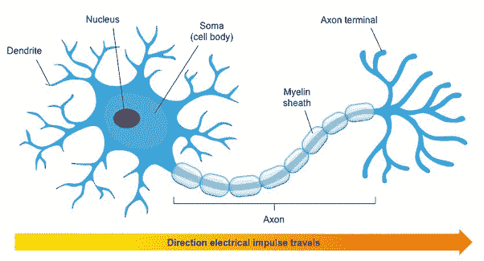
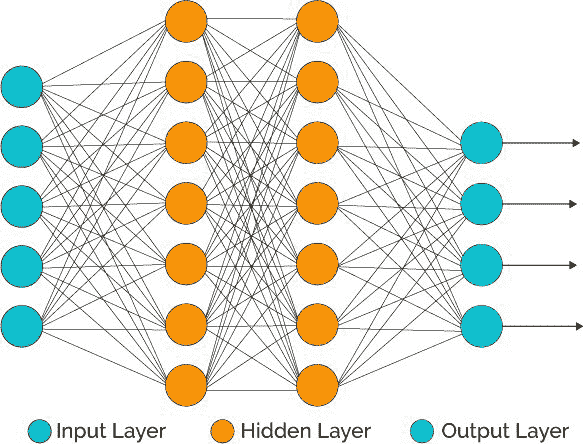
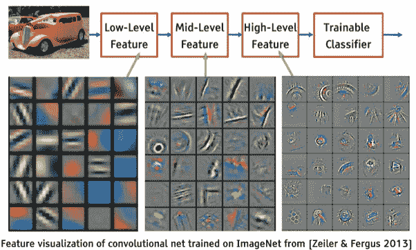
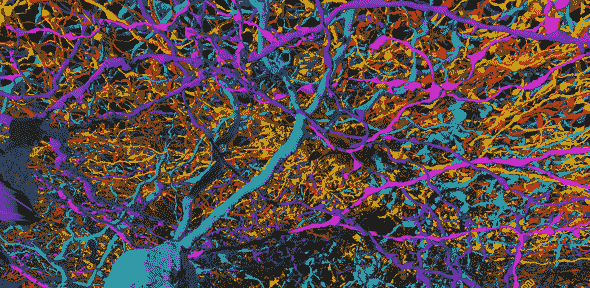

# 神经网络真的像神经元一样工作吗？

> 原文：<https://medium.com/swlh/do-neural-networks-really-work-like-neurons-667859dbfb4f>

人工神经网络和机器学习已经成为大众媒体的热门话题。智能机器的想法吸引了许多人的想象力，尤其是它们如何与人类相比较。具体来说，一个似乎经常出现的基本问题是关于智能的潜在机制——这些人工神经网络真的像我们大脑中的神经元一样工作吗？

**Tl；博士:**

**没有**。虽然 ann(人工神经网络)的高级和概念性思维是由大脑中的神经元和神经网络启发的，但这些概念的 ML 实现已经明显偏离了大脑的工作方式。此外，随着 ML 领域多年来的进步，新的复杂思想和技术得到了发展(RNNs、GANs 等)，这种联系进一步削弱了。

**主要相似之处**

**前馈全连接网络的高级架构和一般原则** —在高级别上，大脑神经元有三个组成部分:

1.  **树突**(输入机制)——通过突触连接接收输入的树状结构。该输入可以是来自感觉神经呼叫的感觉输入，或者来自其他神经细胞的“计算”输入。一个单元可以有多达 100K 个输入(每个输入来自不同的单元)
2.  **细胞体**(计算机制)——这是来自所有树突的输入汇集在一起的细胞体，基于所有这些信号，决定是否发出输出(“尖峰”)。这有点一般化，因为一些计算已经在体细胞之前发生，并编码在细胞的树突结构中。
3.  **轴突**(输出机制)——一旦决定发出输出信号(从而使细胞活跃)，轴突就是携带信号的机制，通过树状结构作为其终端，它通过突触连接将这个信号传递给下一层神经元的树突。

类似地，在 ann 中有一个等价的结构:

1.  **传入连接** —每个神经元接收一组输入，或者来自输入层(相当于感觉输入)，或者来自网络中先前层的其他神经元。
2.  **线性计算和激活函数**——这些“相加”输入，并做出是否激活神经元和触发的非线性决定。
3.  **输出连接** —这些连接将神经元的激活信号传递给网络中的下一层。

类似地，**卷积神经网络**受到了视觉路径的启发。很酷的一点是，最初的灵感是关于架构的(响应特定形状或模式的小内核/过滤器，一次应用于一个小区域)。然而，几年后，当 ML 的研究人员开发了新的技术来可视化 CNN 的隐藏层时，人们发现 CNN 中图像的表现与视觉皮层中发生的事情非常相似。也就是分层表现——从第一层的简单图案开始，然后在更深的层中组合成复杂的形状和物体。

**可塑性**——大脑的独特特征之一，也是使学习和记忆成为可能的关键特征是它的可塑性——变形和改变的能力。根据经验，新的突触连接产生了，旧的突触连接消失了，现有的突触连接变得更强或更弱。可塑性甚至在单个神经元中发挥作用——影响其电磁行为，以及对某些输入做出反应时触发尖峰的趋势。

这种可塑性的想法是训练人工神经网络的关键原则——根据成批的输入反复修改网络参数的权重。最近，元学习领域将神经网络中可塑性的使用扩展到参数之外，并将其应用于修改超参数，甚至是在解决给定问题时优化的整个模型。

**键** **差异**

**大脑神经元的复杂性和鲁棒性**比人工神经元先进和强大得多。这不仅仅是关于神经元的数量，以及每个神经元的树突连接的数量——这是我们在当前人工神经网络中所拥有的数量级。但这也是关于单个神经元的内部复杂性:正如下面所详述的，神经元的化学和电学机制比人工神经元更微妙，更强大。例如，神经元不是等电的——这意味着细胞中的不同区域可能具有不同的电压电势，不同的电流流过它。这允许单个神经元进行非线性计算，识别随时间的变化(例如移动物体)，或将并行的不同任务映射到不同的树突区域——这样细胞作为一个整体可以完成复杂的复合任务。与非常简单的人工神经元相比，这些都是更先进的结构和功能。

**实现** —大脑中的神经元使用非常复杂和微妙的机制来实现，允许非常复杂的非线性计算:

*   突触间隙中神经元之间信号的化学传递，通过使用神经递质和受体，由各种兴奋性和抑制性成分放大。
*   兴奋性/抑制性突触后电位
*   **离子通道和微小的电压差控制着胞体和轴突上的锋电位触发**
*   **很多我们还不了解的东西…**

**与这些相比，人工神经网络中使用的参数、权重、线性函数和激活函数是非常基本和粗糙的。**

**最重要的是，大脑中神经元的**整体网络架构**比大多数人工神经网络复杂得多。特别是，您的普通隔壁前馈网络，其中每一层仅连接到前一层和下一层。但即使与多层 RNNs 或残余网络相比，大脑中的神经元网络也复杂得可笑，成千上万的树突在许多方向上跨越“层”和区域。**

****

**另一方面，大脑不太可能使用像**反向传播**这样的方法——利用误差函数偏导数的链式法则**。****

****功耗**——大脑是一台极其高效的计算机器，功耗约为 10 瓦。这大约是单个 CPU 功耗的三分之一…**

****新发展—甘、RL、…** —在理论和应用 ML 领域，新的想法和创新层出不穷。这些不再植根于大脑。他们可能会受到它或人类行为的启发，但在许多方面，曼梯·里的研究和工作现在有了自己的生命——追求自己的挑战和机遇。**

****大脑作为连续的灵感****

**尽管上面列出了所有的差异，但 ML 研究仍然继续将大脑作为灵感的来源，因为它比我们拥有的任何东西都更加强大和有效。因此，确定这些差距，并研究它们在大脑中是如何工作的，引发并启发了最近一些最令人兴奋和最具挑战性的 ML 研究。例如:**

*   ****功率效率**——正如所提到的，大脑比我们已经建立的任何人工神经网络具有更多数量级的神经元和连接，然而它消耗的功率却更少。一些活跃的研究领域正试图实现这一目标。从使用 DNA 和其他分子的生物网络，到试图模仿神经元和突触工作方式的“神经形态”电子开关。**
*   ****从非常小的一组训练样本中学习**——最有可能的是通过一些内置的模型，这些模型允许对物理定律、心理学、因果关系以及地球上管理决策和行动的其他规则的“直观”理解。与当前通用的白板 NN 架构相比，这些加速了学习并指导预测/行动。**
*   ****释放无监督和强化学习的力量****——**无监督和强化学习是 AI 的“暗能量”。就像在物理学中，黑色能量构成了我们宇宙的绝大部分，然而我们对它知之甚少，很明显我们的大脑主要通过无监督和强化学习来学习。然而，大多数当前的 ML 应用使用监督学习。解开这个谜题对于建造能够像人类一样学习的机器至关重要。**
*   **新的方法和架构。例如，参见 Quanta 杂志上关于嗅觉背后的神经系统如何可能启发一种新的 ML 方法来解决我们使用当前方法不能很好处理的一系列问题的文章:[新的人工智能策略模仿大脑如何学习嗅觉](https://www.quantamagazine.org/new-ai-strategy-mimics-how-brains-learn-to-smell-20180918/)。**

**最后，这绝不是一个全面的答案，当然，显然还有许多相似和不同之处，我没有涵盖。例如，[这是来自多伦多的 Blake Richards 的一个简短而精彩的演讲](https://youtu.be/vGFq6vQ_gR4)，他对大脑和深度学习之间的主要相似之处给出了一个新鲜而独特的观点。但是，嘿，这是我们这个时代两个最迷人、最复杂、发展最快的研究领域的交集——所以期待更多！**

****

**汤姆·库格勒紧随其后**

**任务贡献者。25.发表在思想目录上。优图吧。旅游博主。通过电子邮件获取我的免费 5 天中级课程→[http://bit.ly/2olDN4V](http://bit.ly/2olDN4V)**

**10 月 1 日**

# **在尝试任何新事物之前，你需要理解这一点**

****

**By [Christopher Burns](https://unsplash.com/@christopher__burns?utm_source=medium&utm_medium=referral) on [Unsplash](https://unsplash.com?utm_source=medium&utm_medium=referral)**

**我记得我第一次带着我的佳能 70D 去“视频博客”**

> **感觉超级诡异。**

**人们肯定在拍我对着摄像机说话的样子，但这并不是奇怪的原因。**

**很奇怪，因为我不知道自己在做什么。**

> **我有一套[严格的流程](https://findingtom.com/how-i-made-money-with-the-medium-partner-program/)来打开媒体和写一段内容，但是对于视频，我没有。**

**这就像被推进一个不知道如何游泳的池子里。**

**我尽了最大努力去理解这种新的艺术形式，但在很大程度上，我迷失了。**

> **我爱它的每一秒钟。**

**让我解释一下。**

# **当你开始的时候，绝对不要期望什么**

> **写博客对我来说非常难“掌握”**

**这需要大量的研究。**

**说到这个，我通常是这样研究东西的…**

1.  **开始学习更多的东西。**
2.  **意识到 10 分钟后，在你能正确地研究你刚刚研究的东西之前，你还有 5 件事情要研究。**
3.  **花两个小时研究其中一个东西。**
4.  **把你的头发拉出来，因为你觉得自己一事无成。**

**然后你必须在第二天回来深入研究其他四件事。**

> **只有当我们打开大约 1000 个俄罗斯娃娃(一个里面有一个，一个里面有一个的那种)后，专业知识才会出现。**

****

**Photo by [Nathan Dumlao](https://unsplash.com/@nate_dumlao?utm_source=medium&utm_medium=referral) on [Unsplash](https://unsplash.com?utm_source=medium&utm_medium=referral)**

**当然，你可能想成为一名博客写手、博客写手或某种艺术家。**

> **但是要成为一名博客作者，你必须精通很多不同的东西，这些东西你一开始并不知道。**

**几个月前，在我的小博客之旅进行了 10 分钟后，我意识到我第一个月的视频可能会很糟糕。**

> **我需要重新熟悉 Premiere Pro，灯光，编辑，拍摄和故事板。更不用说我需要学习是什么让一个全新的平台运转起来——YouTube。**

**我真的期望自己在第一个月结束时就能进入状态并拥有 1000 名订户吗？**

**绝对不行。这就引出了我的下一个观点..**

# **这不是数字的问题，而是学习的问题**

> **我用 Premiere Pro 的第一天，我学会了如何制作慢动作视频。第二天，我学习了我相机的光圈、快门速度和 ISO 值。**

**是的，我觉得自己是有史以来最大的菜鸟，但我必须相信自己作为一名电影制作人的能力(我在高中时就拥有的能力)来带领我度过难关。**

> **我每天都在学习新的东西。**

**这就是进步。**

**这是朝着我最终想要实现的目标前进的一步——有朝一日 YouTube 上每个视频的平均浏览量达到 1000。**

> **庆祝学习，而不是数字。**

**这些数字一开始不会出现，但如果你专注于学习和提高，它们就会出现。**

**那是该死的必然。**

**还有一件事..**

# **随着时间的推移，我们的熟练程度成倍增长**

**比方说，我花了前三个月的时间在 YouTube 上吸粉(我确实吸过——但现在，6 个月后，我有了 1600 个订户)。**

**那很好。**

> **即使我在 YouTube 上吸了一口(我确实吸了)，我可能还是会有 100-200 人的小粉丝，对吗？如果我在 3 个月内每月发布 20 个视频(60 个视频)，我认为获得 100-200 个订阅者是非常现实的(我确实做到了)。**

**一个人可能经常错过目标，但他们绝对不会错过 60 次。**

**大约在第 3-4 个月，当你真正开始达到目标时，一些非常有趣的事情开始发生..**

> **你开始不再思念。**

**然后你的内容开始产生更多的共鸣。**

**然后你建立一个小部落，他们会看着你做的每一件事。**

**然后你开始让 YouTube 算法对你有利。**

**那么制作视频就变得简单了大约 50 倍(因为你已经开发了一个流程)。**

> **接下来的几周/几个月/几年，你基本上只需要坐下来，创造并保持你的受众的指数增长。**

****

**By [Jakob Owens](https://unsplash.com/@jakobowens1?utm_source=medium&utm_medium=referral) on [Unsplash](https://unsplash.com?utm_source=medium&utm_medium=referral)**

**像这样发生是最奇怪的事情。**

**这非常令人沮丧，尤其是当你第一次开始工作，而你所做的一切都很糟糕的时候。**

# **与吮吸和平共处**

**我的建议是接受吮吸。**

**你要明白吮吸是完全正常的。**

**是的，不擅长某件事并全身心投入到创造中是令人疲惫不堪的，但是在你说你没有取得任何进步之前，想想你学到了什么。**

**想想你所学到的一切。**

**并意识到自己在进步。你是。**

**我希望这有所帮助。**

> **想在媒体上赚点外快吗？周三，我将主持一个名为“**如何在 Medium** 上每月额外挣 900 美元”的免费培训。[在这里获得您的免费座位](https://thomaskuegler.lpages.co/webinar-page/)！**

****

## **这篇文章发表在[《创业](https://medium.com/swlh)》上，这是 Medium 最大的创业刊物，有+ 373，968 人关注。**

## **在这里订阅接收[我们的头条新闻](http://growthsupply.com/the-startup-newsletter/)。**

****