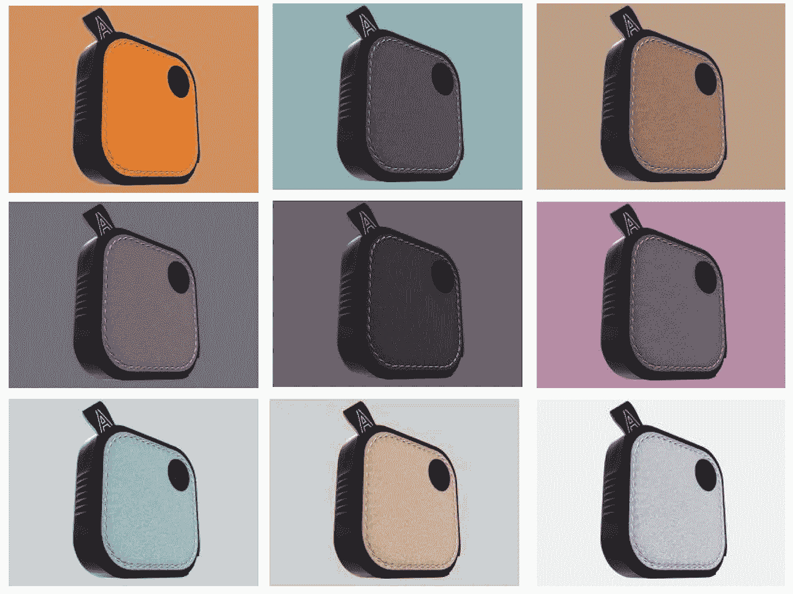
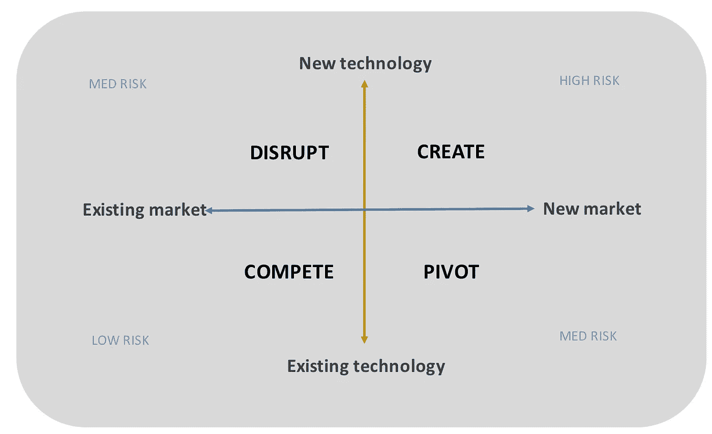
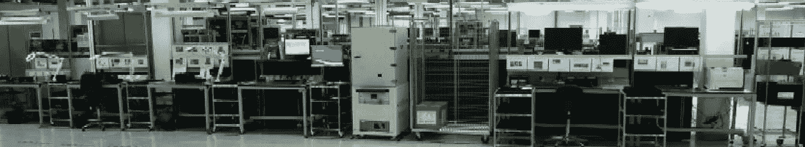
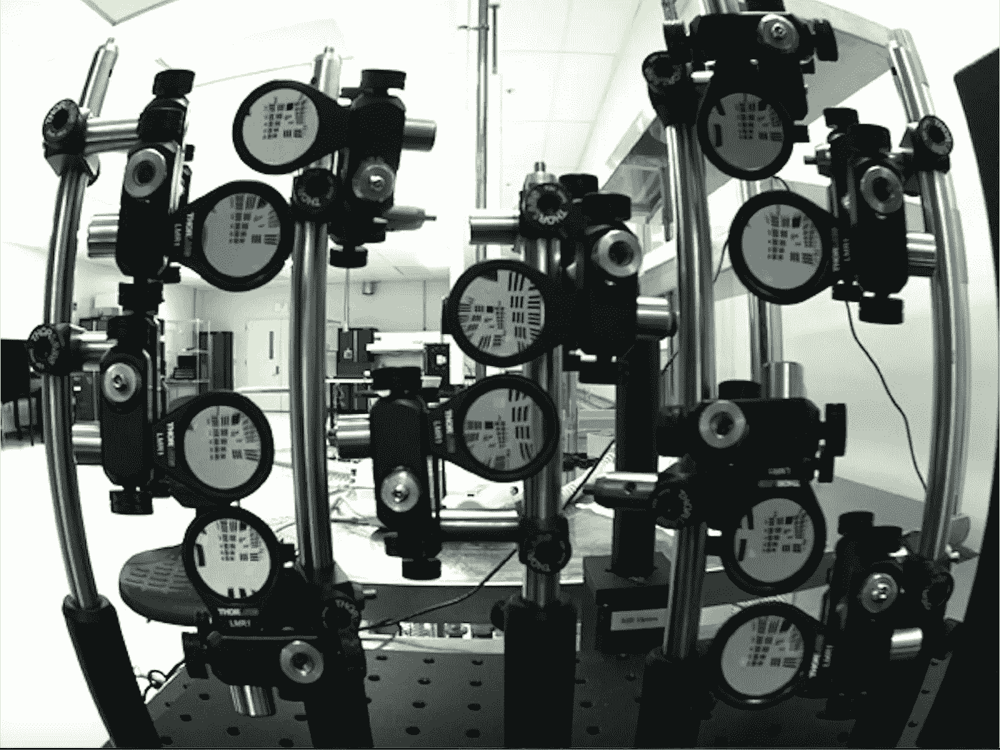

# 入侵消费电子硬件初创企业

> 原文：<https://medium.com/swlh/do-not-apply-if-you-want-an-easy-life-403e77a4a38f>

如果你想过轻松的生活，就不要申请

我记得我的一位讲师(在小企业模块上)对我的建议感到震惊，他说**“如果你想赚很多钱，过上轻松的生活，就在一家成功的大公司找份工作，然后躲起来”**。

他接着说，有些人有病理问题，迫使他们比其他人更努力地工作，并承担更多的风险。他在学期的大部分时间里都在解释，为什么创办一家小公司，然后将其发展成一家中大型企业是你能做的最难的事情，如果你想过上轻松的生活，就应该不惜一切代价避免这种事情(他认为这正是你应该想要的)。

当时我对此知之甚少，但对创造力和努力工作的天生偏好后来让我离开了一家领先的全球科技公司的限制(顺便说一句，这肯定不是一种“轻松的生活”)，直接投身于经营一家消费硬件初创公司，专注于创造和向新市场推出创新的新产品。

撇开病理学的讨论不谈，这是我做过的最好的决定——现在已经过去了足够长的时间，我可以客观地分享一些从那次旅程中获得的独特见解，希望对走上类似道路的其他人有用。

经营任何企业都可能挑战你的极限，但当你是一家专注于通过创新硬件产品进入消费者领域以创造新市场的科技初创企业时，还有一些独特的额外因素需要考虑。

# **了解你的起始位置**

所有初创企业都面临类似的挑战，但对于消费电子硬件领域的企业来说，这些挑战可能更加严峻，不利于取得成功。

硬件业务的启动、运行和运营成本**明显高于软件业务。成功需要利用**雄厚的财力和时间**来创造新产品和新品类；融资的途径比纯软件游戏更加有限，风险也更高(另一方面，如果你做对了，机会也很大)。**

初创企业没有现成的全球品牌、分销渠道和制造资源可以利用。对于产品业务来说，这些成本非常高，因为与软件不同，很难提供免费试用或免费增值定价模式来扩大初始用户，扩大生产需要时间和专业知识，管理全球消费产品品牌的成本非常高(大规模运营一个全球品牌每年大约需要 1 亿英镑)，如果扩大生产量出错，甚至可能在你开始之前就扼杀你的业务。

在早期阶段，硬件初创企业可能会被**排除在来自部件制造商的**最佳技术解决方案之外，这些制造商提供最好(且成本最低)的部件。因此，原型和初始批量的物料清单(BOM)成本远高于规模生产时的成本。不得不通过分销渠道购买零件增加了**额外的利润和必须消化的交付周期**。商业案例的前提是达到盈利的规模；所有的规模经济都依赖于销量。如果产品业务没有达到你的收入目标，就很难改变它。

硬件**产品开发周期比软件**长得多；随着对电子、机械、制造和上市日期的承诺，产品灵活性会随着时间的推移而迅速降低——每个主要的**里程碑都会增加重要的依赖性**，使其更难做出改变和适应持续的用户反馈。不断地平衡灵活性需求和锁定设计的需求，意味着在做出实质性承诺之前，您必须对提案的早期版本进行“冒烟测试”。

经营消费技术硬件业务实际上意味着你同时**经营专业软件和硬件团队**这些团队必须一起创造最终解决方案。你需要创造一个产品，它是软件、应用程序，可能还有一个配套的在线服务——**这就像并行运行几个初创企业****它们都有硬编码的依赖关系和完全不同的工作风格和文化。**

**你可以从你的卧室或棚屋开始，但是成功需要专家和对早期用户的关注。敏捷方法可以使软件受益，但是会与硬件开发周期相冲突。企业越希望在技术和市场应用上创新，原型和生产之间的空白就越深越宽，也就是说，你离现有的技术解决方案和现有的消费者行为越远。**

**在这些动态的极端，是同时创造新技术和市场的初创企业。**

****并非所有的消费类硬件初创公司都是一样的****

**面临高水平市场**和**技术风险(“创造”部分)的初创企业要管理的不确定性要多得多——有更多的未知。**

****

**“创造”企业正在开发新的技术解决方案，以满足仍在发展(或尚不存在)的市场需求。只是有更多的未知。**

**已知的未知——你知道的事情是你还没有解决方案的挑战，但它们至少在计划中。**

****未知的未知** —你甚至还没有意识到存在的关键障碍。一个项目越是推进新的技术和市场领域，这些就越有可能发生，也越有可能造成严重后果。**

**“Pivot”业务具有将现有技术应用于新市场的优势(大部分不确定性在走向市场方面)。**

**“颠覆”企业正在开发新技术以满足现有的市场需求(需求是已知的，不确定性在技术方面)。**

**“竞争型”企业将现有技术应用于现有市场，并在价格/功能上展开竞争(通常不是初创企业的关注点)，不确定性风险较低，但不是一个有吸引力的进入领域。**

**将“创造”产品推向市场需要韧性、适应性和对重要事物的不断重新评估——这也是你所能感受到的最大程度的兴奋和沮丧，同时发生。**

**接下来的部分深入探讨了我在“创造型”企业中破解产品开发流程的辛苦获得的技巧。**

# ****破解产品开发流程****

****访问被拒绝****

**领先的芯片组制造商正忙于照顾大批量消费电子巨头(苹果、三星、谷歌、亚马逊)，你有时可以通过分销购买他们的芯片组，但你不会得到任何直接支持来修复错误或添加功能。在早期开发阶段，您可能对技术的选择有限。**

****

**“创造”企业通常会推动芯片组提供新的或未经证实的功能，这可能会发现数据表中的一系列低级错误和差异，这些错误和差异要么需要时间来解决，要么不可避免地导致功能实施方式的变化。在世界各地追逐全球技术团队，以寻求对低级错误的支持，这是没有人关心的，并不是一个好地方(相信我)。**

**一些芯片组提供商通过 ODM 提供支持，但这需要移交技术知识产权细节，并伴随着大量的开发费用。在“创建”项目中，这可能会增加更高的风险，因为当你付钱给其他人来解决“未知的未知”时，解决这些问题的成本将非常高——需要正确的团队、文化和态度来解决开发挑战并保持最初的产品愿景。**

**创建您自己的定制硬件操作系统可能会让您对新功能有更多的控制和灵活性，但这是以时间/精力/成本为主要代价的；你的团队最终将花费时间为基本功能重新编写驱动程序，而不是将所有精力集中在开发新产品功能(和 IP)上。**

# ****变通办法****

**尽早确定谁是您的战略技术合作伙伴，这样您就可以努力向他们推销愿景，并确保他们在需要时随时提供支持，您需要与合作伙伴制定一致的战略。**

**如果你不能让你的首选合作伙伴产生足够的兴趣，那么你需要看得更远——随着时间的推移，与领先供应商建立良好的关系和信任将会带来回报，因为你在旅途中会遇到不可避免的挫折。一旦您建立了对硬件组件和合作伙伴的依赖，它们将成为您成功的关键(无论您喜欢与否)。你不能让他们让你失望，但有些人会，你需要迅速找到新的替代品。**

**了解你的夹点在哪里将有助于你保持对战略供应链风险的掌控——你可能无法减轻所有风险，但至少你会意识到当一个或多个风险变坏时的影响(我有一个主要的制造合作伙伴因为火灾而失去了他们的主要设施，我们的一些关键组件在关键的加速期进入了全球配置)。**

**如果您可以从经过尝试和测试的技术参考设计开始，那就更好了——您越偏离正常配置，就越有可能有一系列令人讨厌的惊喜等着您。在你开始设计新的设计之前，试着使用开发工具包来证明尽可能多的功能，这也将允许在你开始创建新的依赖之前，对提议进行早期用户测试。**

**尝试找到现有技术与您的需求的最佳匹配，并尽可能少地偏离；为了创新，有些领域你别无选择，只能明知故犯地做出决定；把时间和金钱花在能让你的产品(和知识产权)脱颖而出的事情上。**

**不要被刚刚进入市场的新芯片组所左右，选择一个经过验证的架构，充分利用活跃的代码库。理想情况下，你要选择一个平台，你可以在这个平台上开发下一个 1-3 个产品，因为这可能会让你在“创造”领域取得成功。随着时间的推移，更多的选择会向你敞开，但那时开始一个全新的硬件设计将是一个艰难的决定。**

# ****跳舞 VS 行军****

**在生产的早期阶段，你需要一个能够适应你的迭代开发文化的制造合作伙伴，与你一起帮助改进制造过程，同时你仍然在改进产品和提议。大多数合作伙伴表示，他们专门从事原型制作，并让你投入生产，但现实很少如此。**

**电子制造服务提供商(EMS 提供商)不是用来跳舞的，他们是用来前进的，不管你给他们什么样的节奏，他们都会前进，直到你让他们停下来。**

**在最初阶段，你希望有一个能够满足你需求的合作伙伴；你想要这个:**

****

**但是最终你会得到这个:**

****

**原型和生产线上的错误开始和持续打嗝会很快强调合作伙伴对您项目的善意或战略支持。可信度的任何损失很快就会渗透到生产团队，你会开始看到你的生产时段被挤占，对灵活性的意愿降低。**

**开始时作为合作伙伴将你推向市场，最终可能成为生产时间、成本和支持的斗争。**

**为制造业设计产品和支持运营需要专家——如果处理得当，这可能既费钱又费时。如果你开始得太早，你可能会投入太多的时间/金钱在一个没有人想买的非常容易制造的产品设计上。产品需要改变),但是如果你开始得太晚，你可能会以一种每个人都想要的产品而告终，而这种产品的生产成本是不划算的。**

# ****变通办法****

**不要在流程中过早地让制造合作伙伴参与进来。首先尽可能多地证明产品主张、机械设计(3D 模型)和电子产品。让小伙伴帮你度过难关，直到你准备好承诺——然后全力以赴。**

**一旦你明确了产品要求，就请专业的工业和机械设计师，并聘请一位有消费电子产品规模化经验的供应链专家。在整个过程中与 EMS 提供商合作，但在你有一个更成熟、更可制造的产品设计供他们微调之前，不要正式任命他们。你的供应链专家应该有一个良好的供应商网络，可以在你的设计成熟时被叫去检查，并获得机械和电子元件的暂定价格——非常密切地关注为制造/测试/组装而设计(你想要一个可以非常快速和容易地组装的产品)。从长远来看，花时间在好的设计上会节省你大量的时间和金钱。**

**当你准备好了，试着找一个制造合作伙伴，他有可以在早期生产阶段使用的本地设施，以及可以在合适的时候启用的大规模/低成本设施。这将在最需要的时候加快问题的解决和支持，并意味着你(或你的供应链主管)可以快速到达工厂，解决头几个月不可避免的生产问题。这也避免了为异地设施雇佣当地语言经理，或者在开发的关键时刻不得不花费大量时间在国外。**

**它还提供了一些额外的保护，防止在你发布产品之前出现与离岸相关的早期知识产权问题。**

# ****管理交付周期风险****

**一旦你证实了最初的设计，最重要的事情就是你的营运资金和交付周期风险。你对前言产量预测的把握越大，各方就越高兴。**

****

**通常不可避免的是，您的最具战略意义的组件也是最昂贵的，交付周期最长，最小订单量最高，对于您的机械零件来说，加工的前期成本最高。您需要了解所有组件的交付周期时间和成本动态，以便有效地管理您的批量生产。从订购战略组件到工厂(或办公室)准备好批量生产，可能会有长达 6 个月的时间间隔。**

**这就是为什么 Kickstarter 和其他众筹平台在新硬件产品创意方面如此受欢迎——他们创造了一种环境，在这种环境下，在发货前几个月接受预购款在文化上是可以接受的。接受预订单可以让这个领域的初创企业更准确地预测初始数量和相应的增长——预测发货日期仍然很棘手，因为公司往往会在产品设计就绪(或在某些情况下甚至开始)之前接受订单，但任何增加订单确定性的事情对营运资本管理都非常有价值；一些众筹客户可能乐于等待产品，但零部件供应商总是希望按时付款。**

**主要机械零件的工装承诺创造了有形的项目里程碑，因为它们与相对较高的成本相关联，并立即为设计的后期阶段创造了固定的依赖性。如果您需要在 6 月份为初始用户测试准备好机械零件，那么您可能需要在 2 月/3 月开始加工(通常在远东完成，工具用船运回)，这意味着您需要在 1 月份完成机械设计，以便加工公司有时间设计工具。在你开始用真正的零件制造第一个真正的产品之前，你可能需要 6 个月致力于最终的产品设计。3D 打印和其他原型之外)。你还可能会在模具上预先投入大量现金，所以你想在这样做之前确保所有的机械依赖关系都已设置好——否则你就有可能不得不报废零件，注销工具成本，并招致重大的时间挫折(犯错误或改变设计可能会在以后付出很高的代价)。**

**同样，你的设计越定制，涉及的成本、时间和风险就越多。如果你正在创建自己的相机系统，就像我们一样，接近 9 个月的时间来获得最终的镜头和相机模块设计，只有到那时，你才能开始调整你的图像管道(运行相机的软件)并组装你的真正产品。我们别无选择，因为我们的应用需要一个小尺寸、高质量的广角镜头相机模块，但没有现成的可供购买——我们必须找到合适的供应商，并与他们合作设计我们自己的产品(当你想从相对较小的体积开始时，这不是一项简单的任务)。**

****

**早期的相机模块对焦装置。**

# ****变通办法****

**建立一个简单的关键路径图，列出并连接所有的主要依赖关系，这样您就可以做出关于何时开始加工零件以及何时开始订购组件的明智决策。**

**无论有人告诉你多少次，只需三周就可以旋转一个新的电路板(PCB ),它总是需要两倍的时间——在复杂的 PCB 设计、PCB 制造商、创建模板、SMT 生产线、元件本身(可用性、装配、热分布)和测试过程之间涉及太多的工艺步骤，以使其第一次顺利运行。我在不同的时候都被这些打击过，有时是全部。当你把第一块电子板带回办公室时，你还需要留出时间让工程师启动它们——如果它们第一次没有通电，硬件和软件团队之间会有很多挠头，直到有人找出原因。如果你运气好，只需要用烙铁快速更换一些电阻或更新软件，如果你运气不好，可能又要从头开始(PCB 布局错误会耗费大量时间和金钱)。**

**如果模具制造商说他会在 6 月 1 日将零件送回英国给你，他们很可能意味着你会收到他们的 T0 样品，这些样品需要修改；在最好的情况下，从工具上去除溢料和抛光痕迹，在最坏的情况下，它们可能超出公差范围，需要调整工具，或者需要改变模流以获得更均匀的表面(注射到模具中的材料的压力和热量的优化)。从你收到最初的部分开始，可以肯定地认为你还需要 3-4 个版本才会满意(即 T3 的)。一旦你满意了，你就需要下订单，然后等待第一批批量零件到达——从你收到第一批样品开始，整个过程仍然会增加几个月。**

**作为我们产品设计的一部分，产品外壳下面有一个隐藏的 LED 小屏幕，这需要使用半透明的黑色材料(一种非常新的材料)。从用户的角度来看，它给出了一个无缝的产品完成，没有任何技术的迹象，直到屏幕菜单被要求。从力学的角度来看，它增加了额外两个月的模流调整，以消除我们在办公室灯光下看到的材料内部的奇怪反射(以及订购了一大批非常专业的聚合物材料)，以及许多不眠之夜，看着改变设计的影响。**

**只要确保你留出足够的应急时间来创建和调整零件——当你的供应商说零件将在 x 日期准备好时，确保你检查他们说的“准备好”是什么意思。如果你是第一次做某件事，那么很实际的假设是，它将需要某种形式的返工以符合规范，之后可能还需要 2-3 次更新才能让你满意。**

**尽可能坚持使用标准部件，并在计时时运用你的常识。**

**如果你必须在了解需求之前下风险订单，那么就要有计划地进行；分阶段管理任何计划的扩大生产，以错开营运资本承诺，并确保您在每个阶段都验证了生产流程(从 10 个单位开始，然后 100 个，然后 200 个，然后进入 1k 个)。**

# ****管理专家团队****

**消费类硬件和软件工程师可以分开培养；他们的文化和对风险的态度非常不同(Prince 2 vs Agile)。消费者硬件方面的专家往往等同于更有经验的老工程师，他们习惯于与程序和项目经理一起工作，而具有几年经验的软件工程师可能已经处于其领域的前沿，并习惯于迭代开发周期和边做边设计。**

**尽管这两个群体在一天的不同时间进入办公室，而且可能相隔几代人，但他们实际上有很多共同点。**

**为了创造一个产品，这些团队需要一起工作，以提供一个美好的用户体验为首要目标。这需要对双方的相似之处和不同之处有一个深刻的理解，并需要一些简单的程序管理，以确保关键的依赖关系是已知的，并跨两个学科进行管理。在这个过程中出现的大多数技术障碍都需要硬件和软件工程师共同努力来找到解决方案(并且首先确定问题)。**

**一旦作为一个团队一起工作，伟大的事情就能实现——这是初创企业相对于全球参与者具有主要优势的一个领域；没有现存的封地会妨碍真正的合作工作。管理专业领域之间的积极紧张关系意味着你正在推进正确的界限——如果没有分歧或决策需要升级，那么就有可能没有真正的创新。**

**在与诺基亚的一位老同事讨论这个问题时，他笑着说，啊，是的……这就是我所说的“‘曼科塔:由软件工程师和老男人组成的混合体，它可能不应该工作，但它确实工作了”:信用。#克里斯蒂安·林德霍尔姆**

****

# ****变通办法****

**在开发的所有阶段，让软件和硬件工程师(以及工业设计师、机械设计师、供应链主管)坐在同一间办公室，围着同一张桌子，一起解决和讨论问题，会让你受益匪浅。大多数挑战将需要一个综合的解决方案，并受益于非正式讨论和审查(以及更正式的会议)。**

**如果这是不可能的，你应该确保你能在关键的回顾点召集所有人，并准备好合适的工具来允许团队之间的公开讨论。**

**房间里有许多“专家”,一切都需要决定；测试哪些约束是真实的，或者它们是否能被及时克服，是保持发展朝着正确方向的唯一方法。你需要一个你可以信任的团队，他们学会互相信任和尊重，因为没有人能成为所有学科的专家。你需要成为产品的冠军；您需要决定什么时候坚持或偏离最初的规范，以及什么时候停止解决被证明是棘手的特定技术挑战。**

**只有清晰的产品愿景和相互信任/尊重才能让所有专业朝着同一个方向发展。**

**精酿啤酒也有帮助。**

# ****我为什么写这个****

**我写这篇文章是为了分享我在创建 Autographer 时获得的一些产品开发见解和解决方法:世界上第一款智能可穿戴相机及其后续智能成像平台。**

**2012 年从诺基亚转向 Autographer，为通过小型企业与全球企业的视角来看待产品开发挑战提供了一个比较背景，也提供了一个宝贵的机会来创新新的消费技术，并在智能成像处于非常萌芽的阶段将其推向市场。**

**Autographer 在谷歌眼镜和其他可穿戴设备之前推出，迅速将市场注意力转向隐私、产品形式和用户体验问题。在创造新市场的同时设计产品，从法律角度将注意力集中在早期用户身上，并要求对最终解决方案的所有相互关联的相互依赖关系有深刻的理解。**

**我们在这个“创造”空间的发展导致了有价值的知识产权的创造，这使得未来可以向其他邻近领域授权，并激发了一个新的人工智能业务的创建，该业务专注于分类和理解世界各地捕获的越来越多的图像和视频。**

**谁想要一个简单的生活；-)**

**[https://www.youtube.com/watch?v=ppsr0B-YhPI](https://www.youtube.com/watch?v=ppsr0B-YhPI)**

**[https://www . pocket-lint . com/camera s/reviews/122616-OMG-life-autographer-review](https://www.pocket-lint.com/cameras/reviews/122616-omg-life-autographer-review)**

**[https://www . the guardian . com/travel/2014/feb/27/autographer-wearable-camera-review-Berlin-city-break](https://www.theguardian.com/travel/2014/feb/27/autographer-wearable-camera-review-berlin-city-break)**

** [## Autographer 是一款智能可穿戴相机，它提出了许多重要问题

### Autographer 是一款智能相机，你戴上它就可以忘记了。它将决定何时拍照和记录…

www.forbes.com](https://www.forbes.com/sites/ewanspence/2013/12/19/the-autographer-is-an-intelligent-wearable-camera-that-raises-many-important-questions/#77cbf6bd419a) 

## 这篇文章发表在 [The Startup](https://medium.com/swlh) 上，这是 Medium 最大的创业刊物，有+368，675 人关注。

## 订阅接收[我们的头条新闻](http://growthsupply.com/the-startup-newsletter/)。

**