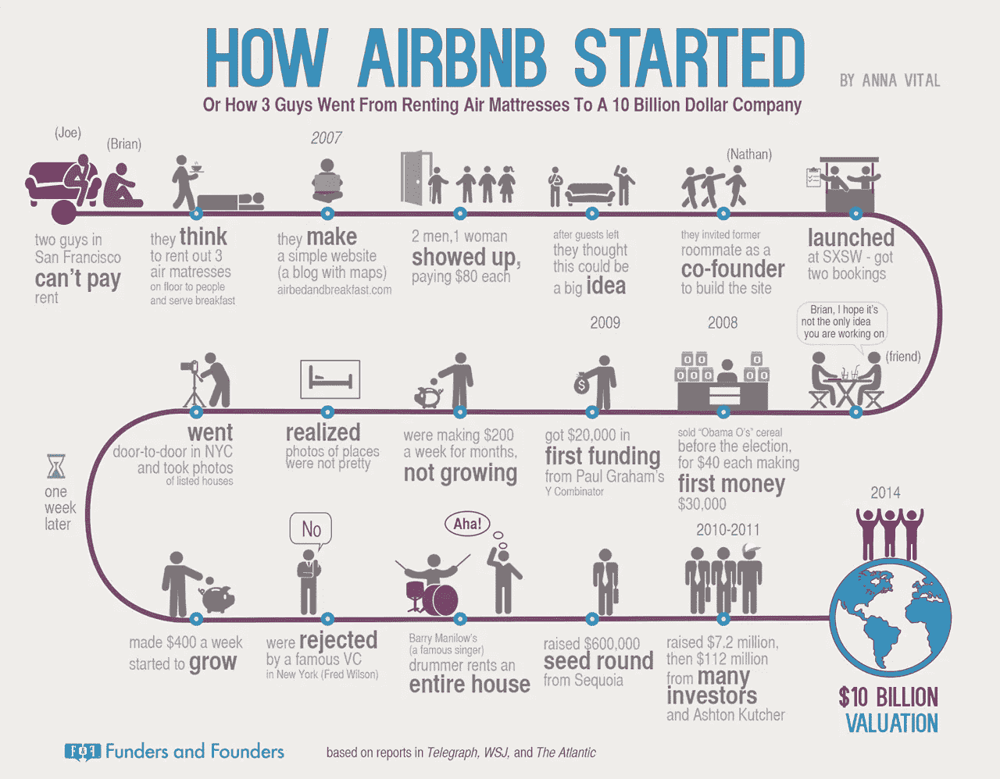
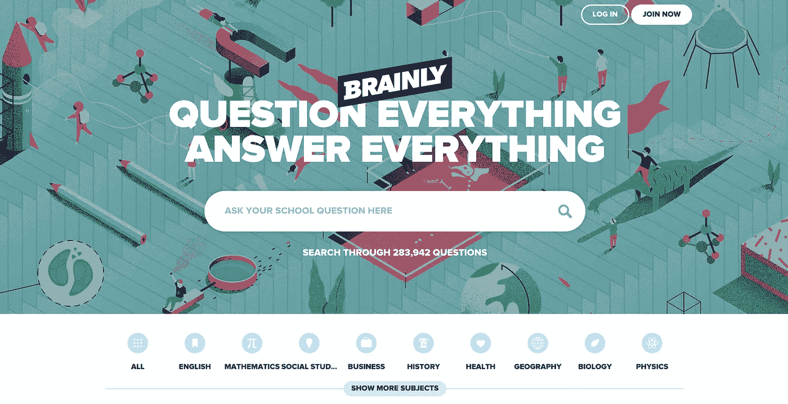

# 不要追随你的激情。

> 原文：<https://medium.com/swlh/do-not-follow-your-passion-and-other-tips-2f358f1822c0>

# 和其他有用的提示。

本·霍洛维茨是美国最成功的风投公司之一 [a16z](http://a16z.com/) 的联合创始人。2015 年 5 月，他在哥伦比亚大学发表了一场鼓舞人心的毕业典礼演讲。

Speech by Ben Horowitz at Columbia University.

演讲有三个强有力的结论:

**1。自己思考**

**2。不要追随你的激情**

**3。你生活在一个充满机遇的时代**

# **自己思考**

为了创造出不可思议的东西:
**自己思考。
思考不同。**

很多人更喜欢被人喜欢，而不是独一无二。但是被人喜欢就没那么重要了。

因为如果你想被人喜欢，你就会说别人想听的话。他们喜欢听这样的故事:

*   知道。
*   明白。
*   感到舒服。

所以你一直重复同样的事情。对政府的抱怨，电视新闻。

这样做你很容易忽略一些开创性的想法。
**从你独特的一系列经历中浮现出来的概念以及它们之间的联系。**

开创性的想法往往听起来很可笑。
难以相信。但是这并没有使它们变得虚假。所以，别人得不到他们的事实不应该使你气馁。

这个世界有它的秘密，在这些秘密的基础上，你可以创造出令人敬畏的东西。比如，人们在周末从一个陌生人那里租下整栋公寓感觉很舒服。

Airbnb was built on an unique experience of Joe and Brian, who rented 3 air matresses to people. ‘Surprisingly’, people didn’t consider them to be serial murderers. Hotel chain is a relatively new invention. In the past people used to sleep in inns or at other people’s. Source: [http://venturebeat.com/2014/06/28/follow-airbnbs-journey-from-scrappy-startup-to-10b-company-video/](http://venturebeat.com/2014/06/28/follow-airbnbs-journey-from-scrappy-startup-to-10b-company-video/)

2)全世界的学生都在网上大量搜索学习帮助。

Problems with homework and study are common around the entire world. On general Q&As students often do not find satisfying answers to their problems. On the other hands sources like books or Wikipedia do not offer personalised solutions and students find them less useful. Also they lack a community feel that is very tempting for teenagers. Source: http://brainly.com.

3)二手购物体验就像在最著名的服装品牌之一购物一样。

There is a strong need for exclusive second-hand websites like Videdressing. General platforms like eBay lack community touch, but also great experience and trust of clothing brands and fashion magazines. Source: http://videdressing.com.

你的工作就是试图找出其中的一个秘密。并在此基础上构建。

要实现这一点，你需要换一种方式思考。
自己想。

> 但这些都是事实。这些是唯一的事情——你相信的事情，你周围的每个人都不相信的事情——当你是对的时候，这些事情在世界上创造真正的价值。别人已经知道的一切。没有创造价值。一切照旧。所以为自己着想是如此重要。
> **本·霍洛维茨**

# 不要追随你的激情

你可能知道做你喜欢的事会让你成功。有时是真的，有时不是。

有很多成功的故事。但是也有很多人做了他们喜欢的事情却没有成功的例子。

但是让我们试着玩一会儿，扭转一下局面。如果我告诉你，在某件事上取得成功会让你热爱你所做的事情，会怎么样？

也许这就是配方？
从你擅长的事情开始，让它们符合你的热情。
不要过于关注自己的激情。

这听起来可能违背直觉，但却非常合理。

思考一下追随你的激情会带来的问题:

**1。激情很难区分轻重缓急** 你可以有很多激情。那要跟着哪个走？

**2。它们会随着时间而改变，你今天所热衷的并不是你 2 年、5 年或 10 年后所热衷的。**

**3。你可能不擅长这些事情**
如果你喜欢做某事，并不意味着你擅长做这件事。

**4。他们非常以自我为中心，不如四处看看，看看你能为这个世界做些什么。**

你应该寻找贡献而不是激情。
自己擅长的事情。更多——可以改善人们生活的东西。
它会让你成功和快乐。

> 找到你擅长的事情，把它应用到这个世界上，为他人做贡献，帮助这个世界变得更好，这就是要做的事情。
> **本·霍洛维茨**

# 你生活在一个充满机遇的时代

我们生活在一个相当安全的世界。多亏了互联网，我们可以立即获取信息…
与世界各地的人们联系…
创造和贡献。

然而仍然存在许多问题。选择其中之一，并尝试解决它。

你能想象出更好的环境吗？

> 如果你有所贡献，如果你把你的贡献投入到这个世界中，如果你为自己着想，那么我相信你会是最伟大的一代。因为当我们回顾 50 年后、100 年后、500 年后，你们将是释放人类潜能的一代。
> **本·霍洛维茨**

===

Ben 不是唯一一个说追随激情不是最重要的事情的人:

> 你必须把一些东西放回历史的长河中，这将有助于你的社区，帮助其他人(……)，这样 20 年、30 年、40 年后(……)人们会说，这个人不只是有热情，他还关心做一些其他人可以从中受益的东西。
> **乔布斯**

===

这篇文章最初发表在我的博客上。

喜欢你读过的书吗？访问 wojtekskalski.com**获取更多关于创业、创新和教育的帖子。伸出手去打招呼！**

**

**发表于* **创业、旅游癖和生活黑客***

******

*-*