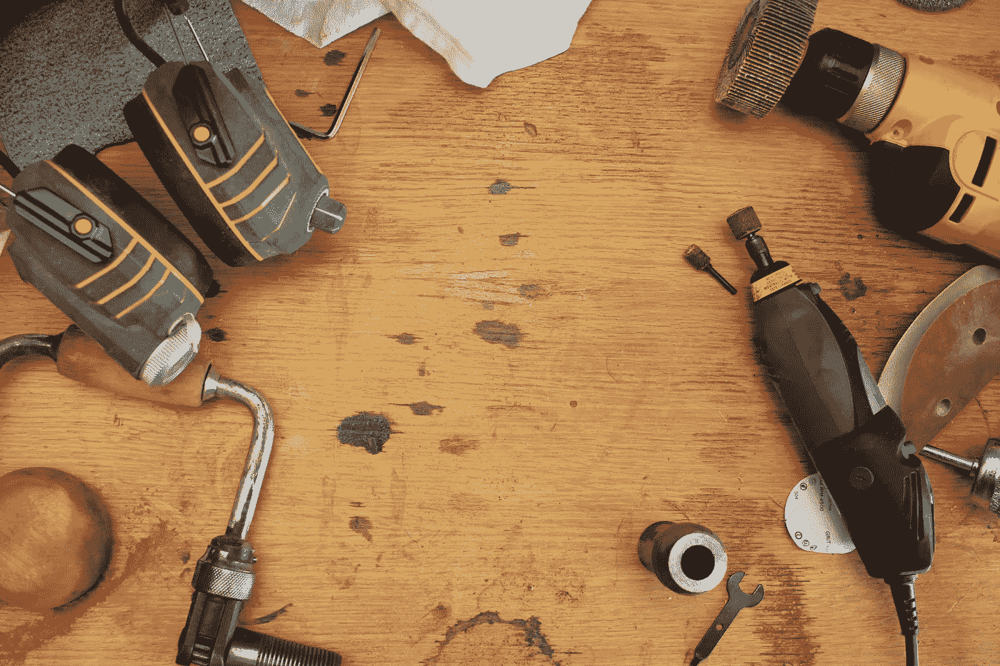

# 做困难的事情

> 原文：<https://medium.com/swlh/do-the-hard-things-45ed6e0e6b63>

Photo by [Hal Gatewood](https://unsplash.com/photos/v7WyjiyXNr4?utm_source=unsplash&utm_medium=referral&utm_content=creditCopyText) on [Unsplash](https://unsplash.com/search/photos/hard?utm_source=unsplash&utm_medium=referral&utm_content=creditCopyText)

你知道当你一天结束的时候，你已经筋疲力尽了吗？你甚至不想考虑准备晚餐，更不用说换衣服了。

关键是，这些时刻造就了我们。

如果你做不到难的事情，那么你就会保持原样。但是，也许你喜欢一切事物本来的样子。也许你不知道。这由你来决定。