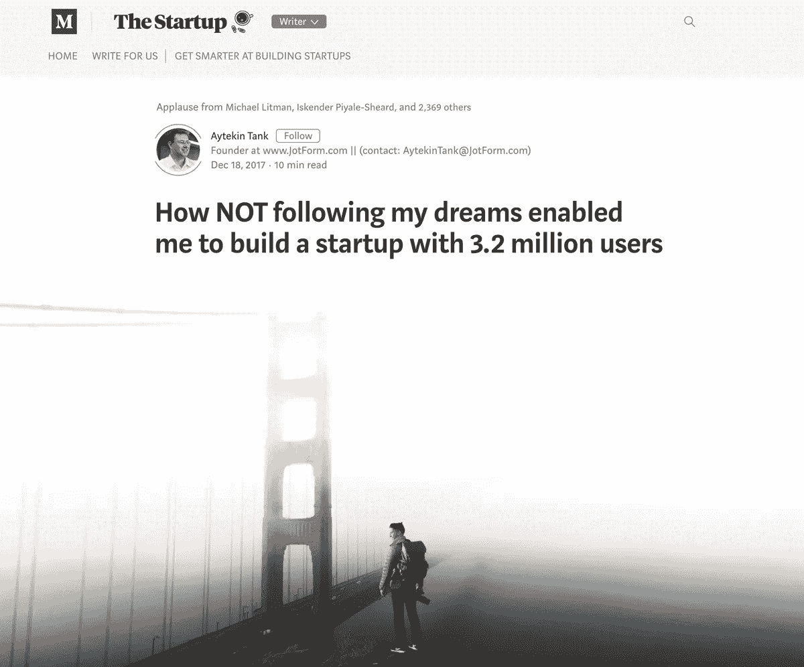
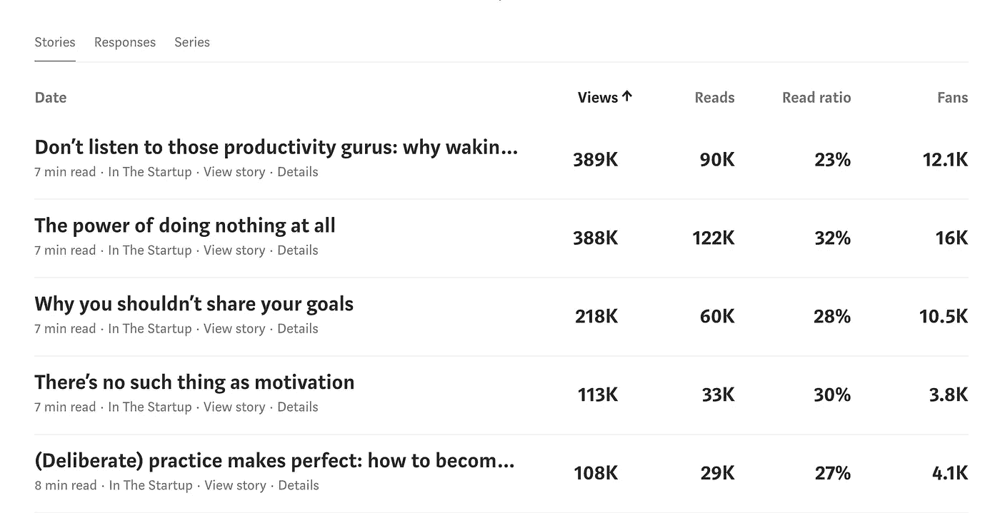
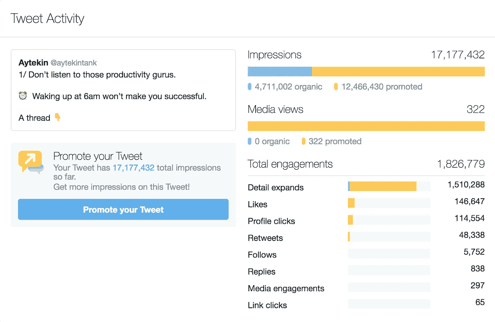
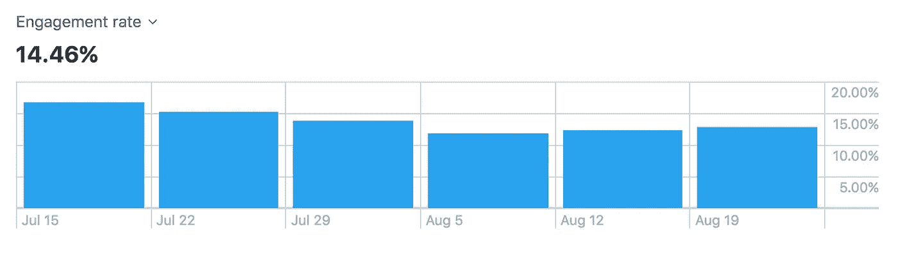
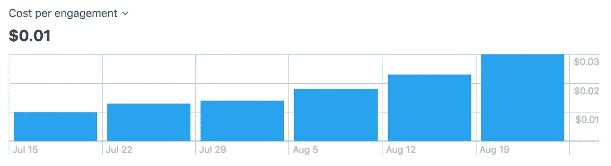
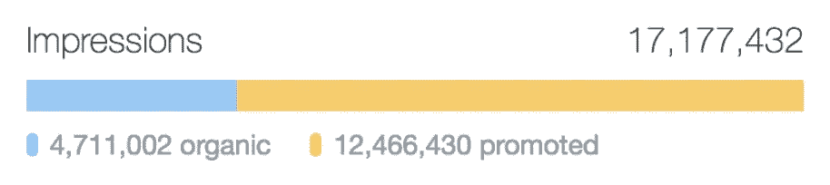
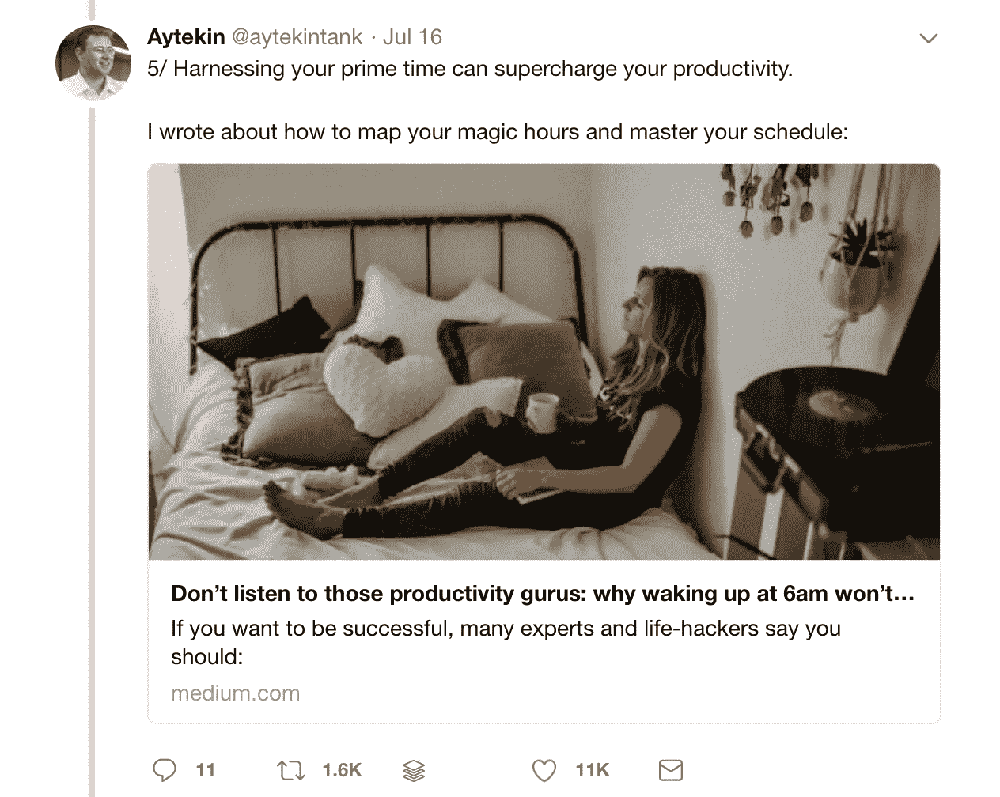
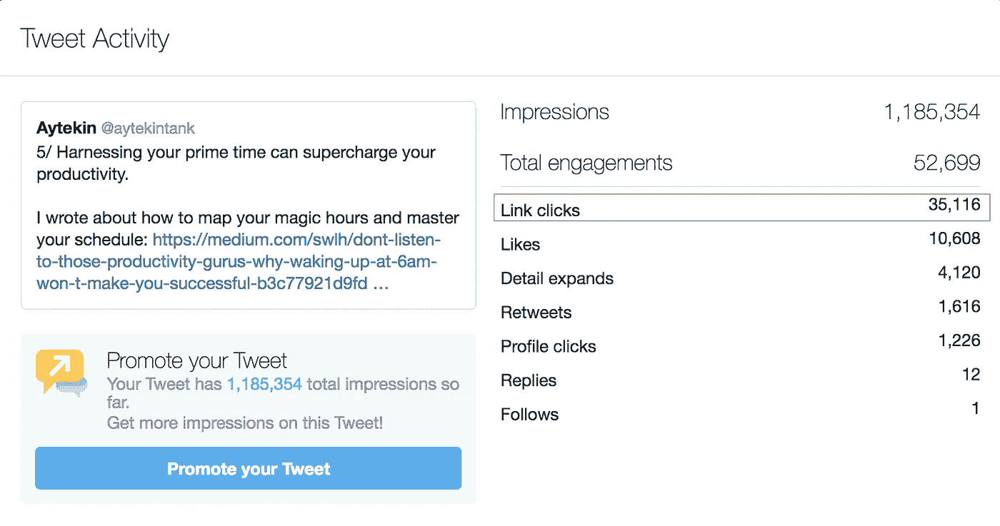
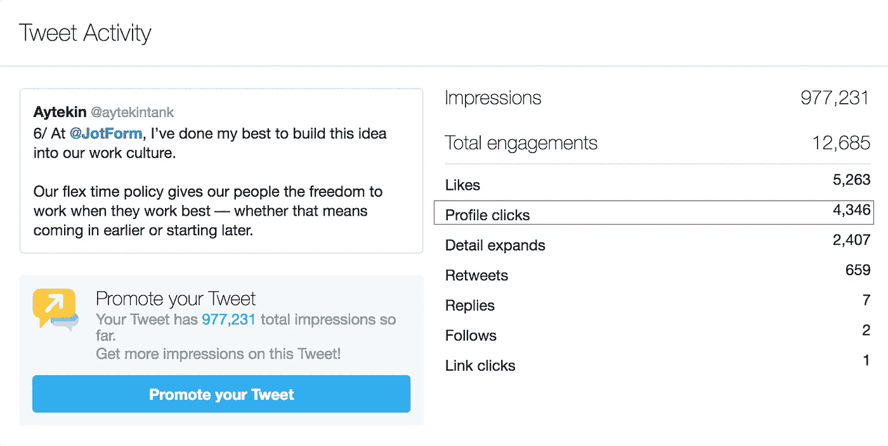
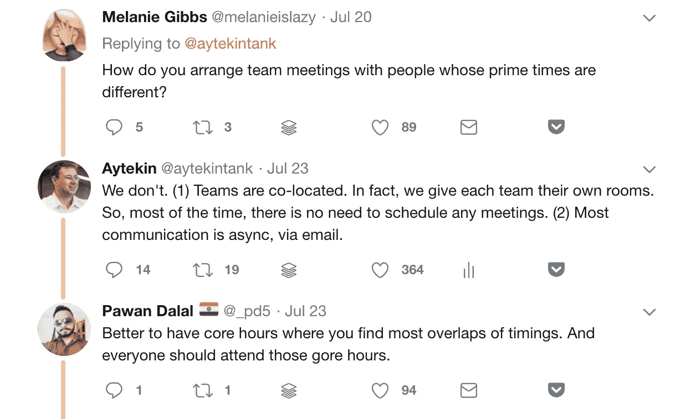

# Twitter 广告真的有用吗？一条推特就有 1720 万次点击

> 原文：<https://medium.com/swlh/do-twitter-ads-really-work-17-2-million-views-from-a-single-tweet-e511d202d819>

随着新年的临近，我们中的许多人发现自己处于一种反思的情绪中。这正是 JotForm 创始人艾特金·‏tank 在 2017 年即将结束时的感受。

当他走在恩巴卡德罗(Embarcadero)时，回顾过去的一年，他对周围发生的一切有点心不在焉。沉思。自省。沉思的。

他有很多值得庆祝的事情:JotForm 已经成长为一个在全球拥有 130 多人的团队，拥有超过 320 万用户，收入每月都在攀升。同样值得注意的是，所有这些都是在没有获得外部资金的情况下发生的——这在硅谷并不常见。

> 但是，尽管有这些好消息，他还是觉得有些事情不太对劲。

“我们的竞争对手在互联网上声音超级大，他们的用户数量甚至比不上我们，”他向我解释道。“他们宣布了一轮又一轮的投资，最终都落在了 TechCrunch 的头上，而我们只是静静地做着自己的事。”

在这些反思的时刻，艾特金意识到，像他的竞争对手一样，他也有一个故事要讲。

所以他决定这么做——分享他的故事。但以他独特的方式。

# 通过故事打造品牌

艾特金的首要任务很简单:

写故事分享 JotForm 之旅。

有了[自主团队](https://www.jotform.com/blog/developing-products-for-32m-users/)在身边，他能够将时间投入到他认为对业务影响最大的任何任务中，因此全力以赴做内容对他来说是一个轻松的决定。

他的第一篇帖子——不追随我的梦想如何让我建立了一个拥有 320 万用户的创业公司——发表在一个受欢迎的媒体出版物 startup 上，几乎一夜之间浏览量就超过了 5 万次。

他的第二个帖子——休假或 TechCrunch 的顶部？同样成功。

“我分别在 12 月 18 日和 26 日发表了这些故事”，他解释道。“考虑到它们的吸引力以及它们如何与大量观众产生共鸣，我下定了决心。我打算在 2018 年认真对待写作。”

艾特金找到了自己的位置。

他真实、诚实的故事引起了创业爱好者的共鸣，他决定在 2018 年每周至少写两篇文章，分享他作为 JotForm 创始人兼首席执行官的旅程。

# 拥抱 Twitter:价值 24098 美元的 Twitter 广告实验

在 Medium 上取得初步成功后，Aytekin 热衷于通过多个渠道分享 JotForm 的故事，以吸引新的受众。

2018 年 7 月，他决定尝试 Twitter。具体来说，他很好奇:

1.  **如果 Twitter 可以成为一个重新利用内容的伟大平台**
2.  Twitter 广告如何帮助他扩大自己的内容。

毕竟，Twitter 和博客并没有太大的不同:

“除了它的字符限制，Twitter 在分享你真实的声音方面没有任何不同，”他解释道。“它是 280 个字符的博客。”

作为一个平台，Twitter 这些年来可能没有太大变化——除了将字符限制从 140 个增加到 280 个。

但显著改变的是人们使用平台的方式。

Twitter 过去给人的感觉几乎就像一个 RSS 源，到处都是分享链接和标签的人，试图抓住每一分可能的注意力。但是现在，正如内森·巴肖指出的，情况正在发生变化:

如今一些表现最好的推文是那些讲述真实故事的推文。

例如，鲁道夫·杜特尔最近关于工作场所文化的推文确实引起了他的观众*(以及更远)*的共鸣，获得了 31，265 条转发和 134，655 个赞。

如果鲁道夫只是简单地分享了一篇文章的链接和标题，它会同样成功吗？大概不会。

# 开始实验

目睹了像鲁道夫一样成功的各种推文和线程，艾特金开始对自己的*【病毒】*推文进行逆向工程。

计划很简单:

**将一篇成功的媒体文章转化为 Twitter 帖子，并添加 Twitter 广告，以测试 Twitter 作为传播 Aytekin 和 JotForm 信息的平台的局限性。**

为了精心制作 Twitter 帖子，艾特金使用了他的媒体分析作为灵感:

有了这些数据，他能够看到哪些文章最能引起读者的共鸣，并讲述一个他确信会在 Twitter 上引起人们共鸣的故事。

他选择根据自己的帖子创建了一个 Twitter 帖子，题为:“不要听那些生产率大师的话:为什么早上 6 点起床不会让你成功”。

以下是该主题的链接:

# 结果:1700 万次展示

这个实验的目的是测试 Twitter 算法的极限，以及 Twitter 广告的力量，所以 Aytekin 决定尽可能多地在这个广告上花费:**总共 24098 美元。**

**这条推文在推特上产生了 17 177 432 次点击。**

**以下是全部结果:**

****

**艾特金并没有一夜之间花掉 24000 美元。事实上，当实验开始时，计划最多花费 5000 美元。**

**但随着推文开始起飞，预算也相应提高。**

**“我们开始这个实验时说过我们的花费不会超过 5000 美元，”他解释道。“但我们密切关注每次接触和展示的成本，并相应提高了预算。”**

**由于广告的参与度极高(有时超过 20%):**

****

**以及较低的每次参与成本:**

****

**艾特金继续增加支出，直到结果开始减少。最后，实验总共进行了一个多月(从 7 月 15 日到 8 月 24 日)。**

**由于高参与度，该主题在 Twitter 上也获得了大量的有机接触。**

**在 1700 万次展示中，470 万次是有机展示——换句话说，27.4%的 reach 是免费的，而 72.6%是付费的:**

****

**该实验的一些重要收获如下…**

# **从这次 Twitter 实验中吸取的教训**

## **1.Twitter 是一个重新利用内容的好地方**

**如果你正在创建任何形式的内容:视频、博客文章、播客、*等*，在多个渠道中重新利用它是一个获得最大收益的好方法。**

**但是再利用并不仅仅意味着复制并粘贴一个链接到 Twitter 上。**

> ****如果你想成功，你需要考虑如何在你发布的平台上原生地讲述每个故事。****

**对于这个实验，艾特金可以简单地分享一条链接到他的博客帖子的推文，并提升它，但我敢肯定，这不会像 Twitter 线程那样表现得那么好。**

**通过使用 Twitter 固有的格式，Aytekin 能够以 Twitter 用户会响应并乐于参与的方式分享他的故事。**

## **2.Twitter 帖子可以帮助你同时实现多个目标**

**印象和参与是很棒的——尤其是当你对内容营销游戏相当陌生的时候。**

**但是当你使用 Twitter 线程时，你可以在你的 tweets 中展示多种类型的内容，并实现各种目标。**

**例如，在帖子的第五条 tweet 中，Aytekin 包含了一个链接，指向 Medium 上的[原创文章](/swlh/dont-listen-to-those-productivity-gurus-why-waking-up-at-6am-won-t-make-you-successful-b3c77921d9fd):**

****

**这条推文获得了超过 110 万次展示和超过 35，000 次点击，有助于推动流量回到 Medium 上的原始帖子:**

****

**帖子中的第六条推文提到了@JotForm，有 4，346 人从这条推文点击到 JotForm 的个人资料，以了解更多关于该业务的信息:**

****

**艾特金还从这个帖子中获得了 5752 名关注者。**

**当你打算做这样的实验时，试着想想你想要达到的目标:**

*   **如果一切都是关于印象和参与，你可以在 Twitter 上讲述整个故事。**
*   **如果你想增加流量，添加一个链接回到你的网站。**
*   **若要增加您的关注，@请提及您的个人资料。**

**记住:用本地格式讲述一个精彩的故事是很重要的，所以在加入任何链接之前，要确保你的头几条推文能让人们被你的叙述吸引住。**

## **3.Twitter 是一个开始对话的好地方**

**对于任何高度共享的推文，你总是会在这里或那里弹出一些网页，但如果你看过去，你会意识到 Twitter 仍然是一个开始对话和建立关系的不可思议的地方。**

**沿着 Aytekin 的思路，他收到了大量关于 JotForm 和业务运作方式的问题。这使他能够与以前接触不到的人建立新的关系。**

****

# **那么，Twitter 广告真的有用吗？**

**这个实验旨在测试 Twitter 广告的局限性，结果不言自明:**

*   **超过 1700 万次展示**
*   **对原文的 35，000 次访问**
*   **艾特金有 5752 名追随者**
*   **@JotForm 的 4346 个个人资料视图**

**但这并不是说一切都很完美。**

**由于 Twitter 广告的工作方式，没有真正的方法来准确地说出有多少独特的人看到了广告，许多人联系 Aytekin 说他们已经多次看到该广告。**

**对于每一个由这条线索引发的伟大对话，都会有另一个轻微的负面反应。似乎一些 Twitter 用户不太接受他们订阅源中的广告，就像他们在脸书或 Instagram 上那样，在这些平台中广告更加根深蒂固。**

**不过总的来说，艾特金认为这个实验是值得的:**

**“尽管最初的成本很高，但我们从这项实验中获得的 5000 名追随者是永久性的，”他解释道。**

**“每次我发布一个新帖子，都会得到这些关注者的点击、喜欢、转发和评论。因此，结果是随着时间的推移复合。我不确定他们是否会成为长期的、高度参与的观众，但他们现在似乎会留下来。”**

**最棒的是，你可以用任何预算自己复制这个实验。**

**只需在另一个频道选择一个对你来说很成功的内容:**

*   **一个高收视率的脸书视频。**
*   **你最喜欢的播客之一。**
*   **你排名第一的博客文章。**
*   **一份你的电子邮件简讯。**

**并在推特上把这些内容变成一个简洁的故事。**

> **即使你不想投资任何预算，将内容转到 Twitter 上也是一种与你的观众联系并在另一个平台上分享你的故事的好方法。**

***原载于 2018 年 10 月 4 日*[*【blog.bufferapp.com*](https://blog.bufferapp.com/do-twitter-ads-really-jotform-case-study)*。***